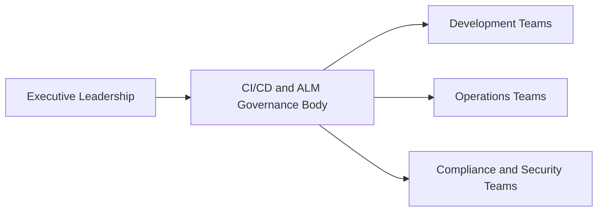

# Implementing CI/CD and ALM Practices for Large Enterprises

## 1. Define a Strategy and Governance:



### a. Leadership Buy-In:

- Start by gaining executive sponsorship and buy-in from top leadership within the organization. This is crucial for driving organizational change and ensuring resources are allocated effectively.

### b. Establish Governance:

- Develop clear governance policies and procedures for CI/CD and ALM practices. Define roles, responsibilities, and decision-making processes within the organization.

## 2. Source Control and Branching Strategies:

### a. Source Control:

- Choose a robust version control system like Git or Subversion to manage source code. Ensure that all code and configuration changes are tracked.

### b. Branching Strategies:

- Adopt a branching strategy such as Gitflow or feature branching that suits the organization's needs. This allows for the isolation of feature development, bug fixes, and release cycles.

## 3. CI/CD Implementation:

### a. CI/CD Pipeline:

- Set up a CI/CD pipeline using tools like Jenkins, Travis CI, or GitLab CI/CD. Automate the build, test, and deployment processes to achieve faster and consistent releases.

### b. Infrastructure as Code (IaC):

- Utilize Infrastructure as Code principles to manage and provision infrastructure. Tools like Terraform and AWS CloudFormation can help automate infrastructure deployment.

### c. Continuous Monitoring:

- Implement continuous monitoring and logging to identify issues proactively. Tools like Prometheus, Grafana, and ELK Stack can be used for this purpose.

## 4. Citizen Development and Low-Code/No-Code (LC/NC):

### a. Training and Support:

- Encourage citizen development by providing training and support for non-technical stakeholders to build simple applications using LC/NC platforms like Microsoft Power Apps or OutSystems.

### b. Review Process:

- Implement a review process to ensure that LC/NC applications meet security and compliance standards before deployment.

## 5. Security and Compliance:

### a. OWASP Type Testing:

- Conduct regular security assessments using OWASP Top Ten guidelines. Integrate security testing into the CI/CD pipeline using tools like OWASP ZAP or Nessus.

### b. Compliance Audits:

- Perform compliance audits to meet industry-specific regulations (e.g., PCI DSS, HIPAA). Document and automate compliance checks.

## 6. Code Reviews:

### a. Code Review Guidelines:

- Establish code review guidelines and standards to maintain code quality and consistency. Use tools like GitHub or Bitbucket for code reviews.

### b. Automated Code Analysis:

- Implement automated code analysis tools like SonarQube or ESLint to identify code quality issues during the CI/CD process.

## 7. End-to-End (E2E) Testing:

### a. E2E Testing Framework:

- Develop an E2E testing framework using tools like Selenium, Puppeteer, or Cypress to ensure that applications function as expected across all layers.

```markdown
graph LR
A[Executive Leadership] --> B[CI/CD and ALM Governance Body]
B --> C[Development Teams]
B --> D[Operations Teams]
B --> E[Compliance and Security Teams]
```

### b. Test Automation:

- Automate E2E tests within the CI/CD pipeline to catch regressions early in the development process.

## 8. Documentation and Training:

### a. Documentation:

- Maintain comprehensive documentation for all processes, policies, and procedures related to CI/CD and ALM. Ensure it is accessible to all team members.

### b. Training:

- Provide ongoing training to teams on CI/CD tools, ALM best practices, and security awareness.

## 9. Continuous Improvement:

### a. Retrospectives:

- Conduct regular retrospectives to identify areas for improvement in the CI/CD pipeline and ALM practices.

### b. Metrics and KPIs:

- Define key performance indicators (KPIs) to measure the effectiveness of CI/CD and ALM practices, and use the data to drive continuous improvement efforts.

Implementing CI/CD and ALM practices in a large enterprise like a government agency or bank is a complex undertaking that requires a combination of technology, processes, and cultural shifts. By following these steps and continuously adapting to the evolving needs of the organization, you can achieve a streamlined and secure software delivery process while maintaining compliance with regulatory requirements.
