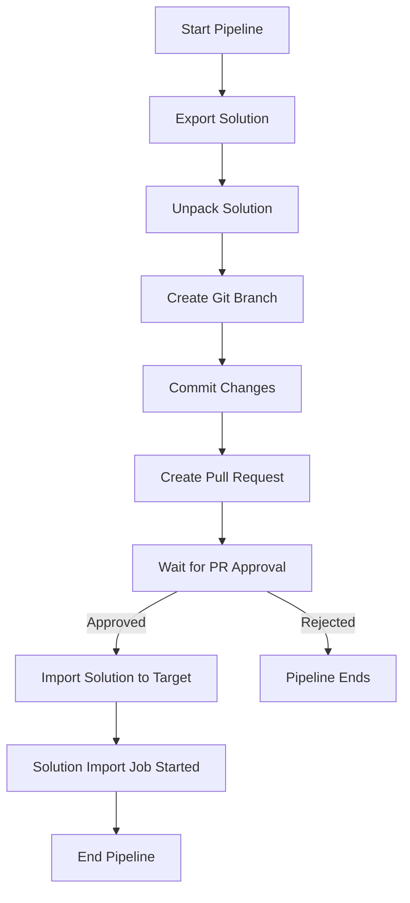

# Power Platform Solution Migration Pipeline

This pipeline automates the process of migrating Power Platform solutions between environments with proper source control integration and an approval process.

## Overview

This pipeline handles the following workflow:

1. Exports a Power Platform solution from a source environment (with patches if they exist)
2. Unpacks the solution to extract its components
3. Creates a Git branch and commits the solution files
4. Creates a Pull Request for code review
5. After PR approval, imports the solution into the target environment

## Prerequisites

1. **Variable Group**: A variable group named "PowerPlatformConnections" must exist with the following variables:

   - `SourceEnvironmentUrl` - URL of the source Dataverse environment
   - `TargetEnvironmentUrl` - URL of the target Dataverse environment
   - `ClientId` - Application ID registered in Azure AD
   - `ClientSecret` - Secret for the registered application
   - `TenantId` - Your Azure AD tenant ID
   - `GitRepoUrl` - The URL of your Git repository
   - `ApproverEmails` - Comma-separated list of email addresses for PR approvers
2. **Service Connection**: Ensure you have appropriate service connections configured for your Azure DevOps organization.
3. **.NET Projects**: The pipeline requires two .NET projects to be in your repository:

   - `PowerPlatformSolutionExporter` - For exporting and unpacking solutions
   - `PowerPlatformSolutionImporter` - For importing solutions

## Running the Pipeline

### Step 1: Initiate the Pipeline

1. Navigate to your Azure DevOps project
2. Go to Pipelines and select the solution migration pipeline
3. Click "Run pipeline"
4. You will be prompted to provide:

   - `solutionName`: The name of the solution to export
   - `gitPat`: Your personal access token for Git operations
5. Click "Run" to start the pipeline

### Step 2: Monitor the Export Phase

The first stage of the pipeline will:

- Connect to the source environment
- Retrieve the solution information
- Check for any patches
- Create a clone with patches (if needed)
- Export the solution as a managed solution
- Unpack the solution
- Create a Git branch and commit the changes
- Create a Pull Request

You can monitor this progress in the pipeline logs.

### Step 3: Review and Approve the Pull Request

Once the first stage completes, you will receive a notification about the newly created Pull Request.

1. Review the changes in the PR
2. Make any necessary adjustments
3. Approve and complete the PR by merging it into the main branch

### Step 4: Approve the Pipeline Continuation

After the PR is created, the pipeline will pause and wait for manual validation:

1. Go back to the running pipeline
2. You'll see a "Manual Validation" waiting to be approved
3. Click on the "Review" button
4. Click "Approve" to continue the pipeline

> **Note**: The pipeline checks that the PR has been completed (merged) before proceeding to the import stage. If the PR has not been merged, the pipeline will fail.

### Step 5: Monitor the Import Phase

Once approved, the pipeline will:

- Connect to the target environment
- Import the solution
- Start the import job

The actual import process in Power Platform will continue running even after the pipeline completes.

## Troubleshooting

### Export Issues

- Verify that the source environment URL is correct
- Ensure that the service principal has appropriate permissions
- Check that the solution name is correct and exists in the source environment

### Git/PR Issues

- Verify that your PAT has appropriate permissions for creating branches and PRs
- Ensure that the Git repository URL is correct

### Import Issues

- Verify that the target environment URL is correct
- Ensure that the service principal has appropriate permissions in the target environment
- Check the Power Platform admin center for detailed import logs

## Notes

- The solution is exported as a managed solution
- The pipeline will wait up to 3 days for PR approval before timing out
- After the import is started, it will continue on the server even if the pipeline is complete
- To check the status of the import, visit the Power Platform admin center
