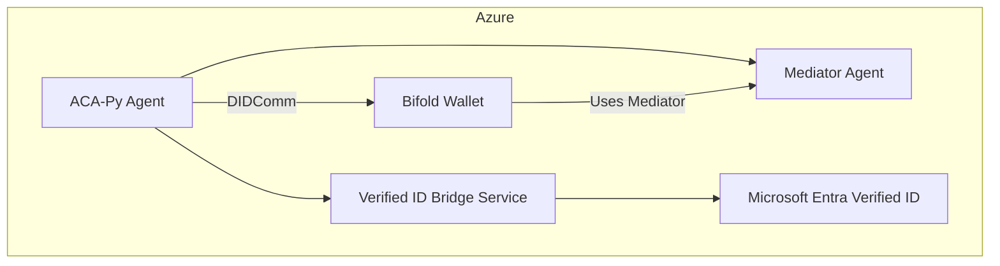

# 🛠️ Aries Canada Deployment and Integration Guide

This comprehensive guide provides detailed instructions for deploying the Aries ACA-Py agent, mediator, and Verified ID bridge, including DNS configuration, Azure Verified ID app setup, and local testing.

## 🌐 Mediator and Agent Configuration

* **DNS Records** :
* Create `A` or `CNAME` records:
  * `agent.yourdomain.ca` pointing to agent VM public IP.
  * `mediator.yourdomain.ca` pointing to mediator VM public IP.
* Ensure DNS TTL is low (e.g., 300s) during testing.
* **Mediator** :
* Run ACA-Py with `--mediation` and endpoint `https://mediator.yourdomain.ca`.
* Wallet: mediator-wallet; admin port: 3003.
* Expose ports 3002 (inbound) and 3003 (admin) through your NSG or firewall.
* **Agent** :
* Run ACA-Py agent with `--endpoint https://agent.yourdomain.ca`.
* Use `--mediation-invitation` to connect agent to the mediator.
* Expose ports 3000 (inbound) and 3001 (admin).

## 🛡️ Verified ID Enterprise App Setup

1. **Create App Registration** :

* In Azure AD, go to *App registrations* >  *New registration* .
* Name: Aries Verified ID Bridge.
* Supported account types: Single tenant or multitenant based on need.
* Redirect URI: `https://yourdomain.ca/callback`.

1. **Certificates & Secrets** :

* Generate a client secret.
* Store value securely for `ENTRA_ACCESS_TOKEN` generation.

1. **API Permissions** :

* Add `VerifiedID.ReadWrite.All` permission.
* Grant admin consent.

1. **Manifest** :

* Upload your `verified-id/manifest.json` through Verified ID blade in Azure.
* Set authority to match `did:web:yourdomain.ca`.

## 🗺️ Full Architecture



## 🚀 Next Steps

* Create DNS records for agent and mediator domains.
* Deploy ACA-Py agent and mediator with Docker Compose.
* Verify ACA-Py agent is connected to mediator.
* Configure Azure Verified ID app registration with correct redirect URIs and permissions.
* Test end-to-end by issuing credentials from agent to Bifold wallet using the bridge service.
* Harden deployment by adding TLS, Azure Key Vault integration, and restricting NSG rules.

This guide ensures your Aries + Verified ID stack is fully configured and production-ready.

## 🔎 Full Instructions for Next Steps

1️⃣ **Create DNS Records**

* In your DNS provider, create:
  * `agent.yourdomain.ca` → points to Agent VM public IP.
  * `mediator.yourdomain.ca` → points to Mediator VM public IP.

2️⃣ **Deploy ACA-Py Agent and Mediator**

* SSH into your VMs:
  ```bash
  sudo apt update && sudo apt install -y docker.io
  cd ~/aries-canada/docker
  docker-compose up -d
  ```

3️⃣ **Verify Agent Connected to Mediator**

* Get mediator invitation:
  ```bash
  curl http://mediator.yourdomain.ca:3003/mediation/request
  ```
* Use invitation in agent startup with `--mediation-invitation {invitation-url}`.
* Confirm connection:
  ```bash
  curl http://agent.yourdomain.ca:3001/status
  ```

4️⃣ **Configure Verified ID App Registration**

* Complete steps in the previous section.
* Add redirect URI `https://yourdomain.ca/callback`.
* Generate client secret; store securely.
* Assign Verified ID API permissions and grant admin consent.

5️⃣ **Test End-to-End Issuance**

* Run bridge service:
  ```bash
  cd bridge-service
  cp .env.example .env
  npm install && npm start
  ```
* Send credential payload to `/issue` endpoint:
  ```bash
  curl -X POST http://localhost:4000/issue -H "Content-Type: application/json" -d '{"subjectDid":"did:example:holder123","claims":{...}}'
  ```
* Accept credential in Bifold wallet.

6️⃣ **Harden Deployment**

* Configure TLS certificates for agent and mediator (use Let's Encrypt or corporate CA).
* Store ACA-Py wallet keys and bridge secrets in Azure Key Vault.
* Update NSG/firewall to allow only required ports and trusted IP ranges.

### Detailed Harden Deployment Instructions

✅ **Configure TLS Certificates**

* Install Certbot on each VM:
  ```bash
  sudo apt install certbot
  sudo certbot certonly --standalone -d agent.yourdomain.ca -d mediator.yourdomain.ca
  ```
* Configure NGINX or ACA-Py to use `/etc/letsencrypt/live/{domain}/fullchain.pem` and `privkey.pem`.

✅ **Store Secrets in Azure Key Vault**

* Create a Key Vault:
  ```bash
  az keyvault create --name ariesKeyVault --resource-group ariesCanadaRG --location canadacentral
  ```
* Store ACA-Py wallet keys and bridge secrets:
  ```bash
  az keyvault secret set --vault-name ariesKeyVault --name acapy-wallet-key --value "your-wallet-key"
  az keyvault secret set --vault-name ariesKeyVault --name bridge-client-secret --value "your-client-secret"
  ```

✅ **Update NSG/Firewall Rules**

* Only allow ports 22 (SSH), 80/443 (HTTP/HTTPS), and agent/mediator admin ports (3001/3003) from trusted IPs.
* Deny all other inbound traffic by default.

## 🔧 Harden Deployment Automation Scripts

### setup-tls.sh

```bash
#!/bin/bash
sudo apt update && sudo apt install -y certbot
sudo certbot certonly --standalone -d agent.yourdomain.ca -d mediator.yourdomain.ca
echo "TLS certificates installed in /etc/letsencrypt/live/."
```

### store-secrets-keyvault.sh

```bash
#!/bin/bash
VAULT_NAME="ariesKeyVault"
az keyvault create --name $VAULT_NAME --resource-group ariesCanadaRG --location canadacentral
az keyvault secret set --vault-name $VAULT_NAME --name acapy-wallet-key --value "replace-with-your-wallet-key"
az keyvault secret set --vault-name $VAULT_NAME --name bridge-client-secret --value "replace-with-your-client-secret"
echo "Secrets stored in Azure Key Vault: $VAULT_NAME"
```

### harden-nsg.sh

```bash
#!/bin/bash
NSG_NAME="ariesNSG"
RESOURCE_GROUP="ariesCanadaRG"
az network nsg rule create --resource-group $RESOURCE_GROUP --nsg-name $NSG_NAME \
  --name AllowSSH --priority 100 --access Allow --protocol Tcp --direction Inbound \
  --source-address-prefixes 1.2.3.4/32 --destination-port-ranges 22
az network nsg rule create --resource-group $RESOURCE_GROUP --nsg-name $NSG_NAME \
  --name AllowHTTPHTTPS --priority 110 --access Allow --protocol Tcp --direction Inbound \
  --source-address-prefixes 1.2.3.4/32 --destination-port-ranges 80 443 3001 3003
az network nsg rule create --resource-group $RESOURCE_GROUP --nsg-name $NSG_NAME \
  --name DenyAllInbound --priority 200 --access Deny --protocol "*" --direction Inbound \
  --source-address-prefixes "*" --destination-port-ranges "*"
echo "NSG hardened: only trusted IPs allowed."
```

## 🚀 Deployment on DigitalOcean Ubuntu Server

1️⃣ **Provision Ubuntu Droplet**

* Create Ubuntu 20.04/22.04 droplet in DigitalOcean.
* Note public IP address.

2️⃣ **DNS Records**

* Point `agent.yourdomain.ca` and `mediator.yourdomain.ca` A records to droplet IP.

3️⃣ **Install Docker & Certbot**

```bash
sudo apt update && sudo apt install -y docker.io certbot
```

4️⃣ **Run ACA-Py Agent and Mediator**

```bash
cd ~/aries-canada/docker
docker-compose up -d
```

5️⃣ **Configure TLS with Certbot**

```bash
sudo certbot certonly --standalone -d agent.yourdomain.ca -d mediator.yourdomain.ca
```

* Update Docker or NGINX configs to use certs at `/etc/letsencrypt/live/{domain}/`.

6️⃣ **Firewall Configuration**

* Enable UFW:

```bash
sudo ufw allow OpenSSH
sudo ufw allow 80,443,3000,3001,3002,3003/tcp
sudo ufw enable
```

* Restrict access to trusted IPs by adjusting UFW rules.

7️⃣ **Run Bridge Service**

```bash
cd ~/aries-canada/bridge-service
cp .env.example .env
npm install && npm start
```

This completes a full local or cloud deployment on DigitalOcean Ubuntu, fully aligned with your ACA-Py + Verified ID stack.
