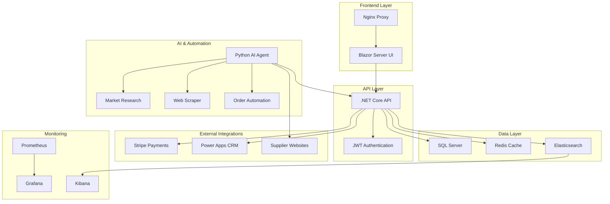

# 🤖 Enhanced AI-Powered E-commerce Platform

[](https://opensource.org/licenses/MIT)
[](https://dotnet.microsoft.com/)
[](https://python.org/)
[](https://docker.com/)
[](https://blazor.net/)

A complete AI-powered dropshipping e-commerce platform that automates product sourcing, market research, and order fulfillment from Asian commerce sites to Canadian consumers.

## 🌟 Key Features

### 🤖 **AI-Powered Automation**

* **Real Web Scraping** : Advanced scraping with anti-detection for Temu, SHEIN, AliExpress
* **Market Research** : Canadian market analysis using Google Trends, Amazon data, social sentiment
* **Intelligent Pricing** : Dynamic 20% markup with market-based adjustments
* **Order Automation** : Automatic supplier order placement and tracking

### 💳 **Payment & Commerce**

* **Stripe Integration** : Complete payment processing with CAD support
* **Multi-step Checkout** : Seamless customer experience with address management
* **Order Tracking** : Real-time status updates and shipping notifications
* **Customer Accounts** : Saved addresses, order history, and preferences

### 🏢 **Enterprise CRM Integration**

* **Microsoft Power Apps** : Complete CRM with custom entities and workflows
* **Customer Analytics** : Behavior tracking and segmentation
* **Inventory Management** : Stock level monitoring and alerts
* **Business Intelligence** : Dashboards and reporting

### 🛡️ **Security & Monitoring**

* **Enterprise Security** : JWT authentication, rate limiting, CORS protection
* **Comprehensive Monitoring** : Prometheus, Grafana, ELK stack
* **Automated Backups** : Database and configuration backup
* **Health Checks** : Service monitoring and alerting

## 🏗️ **System Architecture**



## 🚀 **Quick Start**

### Prerequisites

* Docker Desktop 4.0+
* 8GB+ RAM
* Valid Stripe account
* Microsoft Power Platform environment (optional)

### 1. Clone & Setup

```bash
git clone https://github.com/your-username/ai-ecommerce-platform.git
cd ai-ecommerce-platform

# Initial setup
make setup
```

### 2. Configure Environment

```bash
# Copy and edit environment variables
cp .env.example .env
# Fill in your API keys and configuration
```

### 3. Deploy

```bash
# Production deployment
make prod

# Development mode
make dev
```

### 4. Access Your Platform

* **🛍️ E-commerce Frontend** : http://localhost:5000
* **🔧 API Documentation** : http://localhost:7001/swagger
* **📊 Monitoring Dashboard** : http://localhost:3000 (admin/admin123)
* **🔍 Log Analysis** : http://localhost:5601

## 📋 **Detailed Features**

### 🕷️ **Advanced Web Scraping**

 **Anti-Detection Technology** :

* Rotating proxies and user agents
* Browser fingerprinting evasion
* CAPTCHA solving integration
* Rate limiting and retry logic

 **Supported Sites** :

* ✅ Temu - Electronics, gadgets, accessories
* ✅ SHEIN - Fashion, home decor, lifestyle
* ✅ AliExpress - All categories with API fallback
* 🔄 Extensible architecture for new sites

 **Data Extraction** :

```python
@dataclass
class ProductData:
    title: str
    description: str
    source_price: float
    images: List[str]
    specifications: Dict[str, Any]
    reviews_count: int
    rating: float
    shipping_info: Dict[str, Any]
```

### 📊 **Canadian Market Research**

 **Market Intelligence Sources** :

* **Google Trends** : Search volume analysis for Canadian market
* **Amazon Canada** : Bestseller tracking and competitive pricing
* **Social Media** : Reddit and Twitter sentiment analysis
* **Economic Data** : CAD exchange rates, consumer confidence

 **Analysis Output** :

```json
{
  "trending_categories": [
    {"category": "Electronics", "demand_score": 85, "growth": "+15%"}
  ],
  "seasonal_trends": {
    "current_season": "Summer",
    "trending_keywords": ["outdoor", "patio", "travel"]
  },
  "price_sensitivity": {
    "average_order_value": 45.0,
    "price_elasticity": 0.7
  }
}
```

### 💰 **Stripe Payment Integration**

 **Payment Features** :

* Complete checkout flow with multiple payment methods
* CAD currency support for Canadian market
* Automatic tax calculation (HST/GST)
* Secure payment processing with PCI compliance
* Webhook handling for payment status updates

 **Checkout Process** :

1. 📝 Customer information
2. 🏠 Shipping address with saved addresses
3. 💳 Payment with Stripe Elements
4. ✅ Order confirmation and tracking

### 🏢 **Power Apps CRM Integration**

 **Custom Entities** :

* **Products** : Source tracking, demand scoring, inventory management
* **Orders** : Complete order lifecycle management
* **Customers** : Behavior analysis and segmentation
* **Market Insights** : Automated research data integration

 **Automated Workflows** :

* Product demand score updates based on market research
* Customer segmentation and lifecycle management
* Inventory alerts and replenishment suggestions
* Performance analytics and reporting

### 🔄 **Order Automation System**

 **Supplier Integration** :

```python
async def place_supplier_orders(order: Order) -> bool:
    # Group items by supplier
    supplier_groups = group_by_supplier(order.items)
  
    for supplier, items in supplier_groups:
        # Place order with anti-detection
        supplier_order = await place_order_with_supplier(
            supplier, items, order.shipping_address
        )
      
        # Track order status
        await track_supplier_order(supplier_order)
  
    return True
```

## 🛠️ **Technical Stack**

### Backend (.NET Core 8)

* **Framework** : ASP.NET Core Web API
* **Database** : Entity Framework Core with SQL Server
* **Authentication** : JWT Bearer tokens
* **Payment** : Stripe.NET SDK
* **Caching** : Redis with distributed caching
* **Monitoring** : Prometheus metrics

### Frontend (Blazor Server)

* **Framework** : Blazor Server with SignalR
* **UI Library** : MudBlazor components
* **State Management** : Scoped services with local storage
* **Real-time** : SignalR for live updates
* **Payment UI** : Stripe Elements integration

### AI & Automation (Python 3.11)

* **Web Scraping** : Playwright, Selenium, BeautifulSoup
* **Market Research** : PyTrends, yfinance, social media APIs
* **Data Processing** : Pandas, NumPy, scikit-learn
* **Image Processing** : PIL, OpenCV
* **NLP** : NLTK, TextBlob, Transformers

### Infrastructure

* **Containerization** : Docker Compose
* **Reverse Proxy** : Nginx with SSL termination
* **Monitoring** : Prometheus + Grafana
* **Logging** : ELK Stack (Elasticsearch, Logstash, Kibana)
* **Database** : SQL Server 2022 with automated backups

## 📈 **Business Metrics & Analytics**

### Key Performance Indicators

* **Product Metrics** : Scraping success rate, demand scoring accuracy
* **Sales Metrics** : Conversion rate, average order value, customer lifetime value
* **Operational Metrics** : Order fulfillment time, supplier performance
* **Market Metrics** : Trend prediction accuracy, competitive positioning

### Real-time Dashboards

* Executive summary with key business metrics
* Product performance and inventory levels
* Customer behavior and segmentation analysis
* Market trends and opportunities

## 🔒 **Security & Compliance**

### Security Measures

* **API Security** : Rate limiting, JWT authentication, CORS protection
* **Data Protection** : SQL injection prevention, XSS protection, input validation
* **Payment Security** : PCI DSS compliance through Stripe
* **Access Control** : Role-based permissions and audit logging

### Privacy Compliance

* **PIPEDA Compliance** : Canadian privacy law adherence
* **Data Encryption** : At-rest and in-transit encryption
* **Right to Deletion** : Customer data removal capabilities
* **Audit Trails** : Complete action logging and monitoring

## 🚀 **Deployment Options**

### Local Development

```bash
# Quick start for development
make dev
```

### Production Deployment

```bash
# Full production setup with monitoring
make prod
```

### Cloud Deployment

* **Azure** : Complete ARM templates included
* **AWS** : ECS/EKS deployment configurations
* **Google Cloud** : GKE deployment manifests
* **Docker Swarm** : Multi-node cluster setup

## 📊 **Performance & Scaling**

### Performance Optimizations

* **Database** : Indexed queries, read replicas, connection pooling
* **Caching** : Redis for session data, API responses, and product catalogs
* **CDN** : Static asset delivery optimization
* **Load Balancing** : Nginx upstream configuration

### Scaling Strategies

* **Horizontal Scaling** : Multiple API and frontend replicas
* **Database Scaling** : Read replicas and partitioning
* **Caching** : Distributed Redis cluster
* **Auto-scaling** : Kubernetes HPA for cloud deployments

## 🔧 **Configuration Guide**

### Environment Variables

```bash
# Stripe Payment Processing
STRIPE_SECRET_KEY=sk_live_your_actual_key
STRIPE_PUBLISHABLE_KEY=pk_live_your_actual_key

# Microsoft Power Apps
POWER_APPS_URL=https://yourorg.crm3.dynamics.com
POWER_APPS_CLIENT_ID=your-client-id
POWER_APPS_CLIENT_SECRET=your-client-secret

# External Services (Optional)
AMAZON_API_KEY=your-amazon-api-key
PROXY_SERVICE_API_KEY=your-proxy-key
CAPTCHA_SOLVER_API_KEY=your-2captcha-key
```

### Power Apps Setup

1. Create new environment in Power Platform Admin Center
2. Register application in Azure AD
3. Grant Dynamics 365 permissions
4. Run setup script: `./scripts/setup-power-apps.ps1`

### Stripe Configuration

1. Create Stripe account and get API keys
2. Configure webhook endpoint: `/api/webhooks/stripe`
3. Add webhook events: `payment_intent.succeeded`, `payment_intent.payment_failed`
4. Test with Stripe CLI: `stripe listen --forward-to localhost:7001/api/webhooks/stripe`

## 🤝 **Contributing**

### Development Setup

```bash
# Clone repository
git clone https://github.com/your-username/ai-ecommerce-platform.git

# Install dependencies
cd python-agent && pip install -r requirements.txt
cd ../dotnet-api && dotnet restore
cd ../blazor-frontend && dotnet restore

# Start development environment
make dev
```

### Code Standards

* **C#** : Follow Microsoft coding conventions
* **Python** : PEP 8 style guide with Black formatter
* **TypeScript** : ESLint with Prettier
* **Testing** : Minimum 80% code coverage

### Pull Request Process

1. Fork the repository
2. Create feature branch: `git checkout -b feature/your-feature`
3. Commit changes: `git commit -m 'Add some feature'`
4. Push to branch: `git push origin feature/your-feature`
5. Submit pull request with detailed description

## 📄 **License**

This project is licensed under the MIT License - see the [LICENSE]() file for details.

## 🆘 **Support & Documentation**

### Documentation

* **API Documentation** : Available at `/swagger` endpoint
* **Architecture Guide** : See `docs/architecture.md`
* **Deployment Guide** : See `README-DEPLOYMENT.md`
* **User Manual** : See `docs/user-guide.md`

### Support Channels

* **Issues** : GitHub Issues for bug reports and feature requests
* **Discussions** : GitHub Discussions for questions and community support
* **Wiki** : Comprehensive documentation and tutorials

### Monitoring & Health

* **Health Checks** : `/health` endpoint for all services
* **Metrics** : Prometheus metrics at `/metrics`
* **Logs** : Centralized logging with ELK stack

## 🎯 **Roadmap**

### Phase 1: Core Platform ✅

* [X] Basic scraping and product import
* [X] Stripe payment integration
* [X] Order management system
* [X] Blazor frontend with cart functionality

### Phase 2: AI Enhancement ✅

* [X] Advanced anti-detection scraping
* [X] Canadian market research
* [X] Power Apps CRM integration
* [X] Automated order placement

### Phase 3: Enterprise Features 🚧

* [ ] Multi-vendor marketplace
* [ ] Advanced analytics and ML
* [ ] Mobile app development
* [ ] International expansion

### Phase 4: Advanced AI 📋

* [ ] Computer vision for product categorization
* [ ] Natural language product descriptions
* [ ] Predictive inventory management
* [ ] Dynamic pricing optimization

## 📞 **Contact**

* **Project Lead** : [Your Name](mailto:your.email@example.com)
* **Website** : [https://your-website.com](https://your-website.com)
* **Documentation** : [https://docs.your-website.com](https://docs.your-website.com)

---

**Built with ❤️ for Canadian entrepreneurs and e-commerce innovators**
