<div style="page-break-after: always; text-align: center; padding: 100px 0; background-color: #f9f9f9; border-bottom: 3px solid #d52b1e;">
    <div style="margin-bottom: 50px;">
        
    </div>
    <h1 style="color: #d52b1e; font-size: 36px; margin-bottom: 20px;">Elections Canada</h1>
    <h2 style="color: #d52b1e; font-size: 30px; margin-bottom: 20px;">Power Platform Development Standards</h2>
    <h3 style="color: #333; font-size: 24px; font-weight: normal; margin-bottom: 30px;">Application Lifecycle Management & Naming Conventions</h3>
    <div style="margin-top: 100px; color: #666;">
        <p style="font-size: 18px;">Version 1.1</p>
        <p style="font-size: 18px;">March 2025</p>
    </div>
</div>

# Elections Canada Power Platform Development Standards

## Table of Contents

- [Elections Canada Power Platform Development Standards](#elections-canada-power-platform-development-standards)
  - [Table of Contents](#table-of-contents)
  - [Introduction](#introduction)
  - [Naming Conventions](#naming-conventions)
    - [Importance of Consistent Naming Standards](#importance-of-consistent-naming-standards)
    - [Standard Naming Patterns](#standard-naming-patterns)
    - [Department Prefixes](#department-prefixes)
    - [Environment Types](#environment-types)
    - [Field Naming](#field-naming)
    - [Power Pages Site Naming](#power-pages-site-naming)
  - [Environment Strategy](#environment-strategy)
  - [ALM Pipeline Implementation](#alm-pipeline-implementation)
    - [Power Platform Pipelines Overview](#power-platform-pipelines-overview)
    - [Solution Development Workflow](#solution-development-workflow)
    - [Branch Policies and Triggers](#branch-policies-and-triggers)
    - [Power Platform Solution Checkers](#power-platform-solution-checkers)
    - [Form ALM Process](#form-alm-process)
    - [Development Workflow](#development-workflow)
    - [Azure DevOps Integration](#azure-devops-integration)
    - [Pipeline Stages](#pipeline-stages)
    - [Branching Strategy and Approval Gates](#branching-strategy-and-approval-gates)
  - [Integration Standards](#integration-standards)
    - [API Integration Strategy](#api-integration-strategy)
    - [Integration Implementation Guidelines](#integration-implementation-guidelines)
    - [On-Premises Data Gateway Management](#on-premises-data-gateway-management)
  - [Custom Development Standards](#custom-development-standards)
    - [Plugin Development Strategy](#plugin-development-strategy)
    - [Plugin Registration and Configuration](#plugin-registration-and-configuration)
  - [Security Standards](#security-standards)
    - [Portal Security Architecture](#portal-security-architecture)
    - [Table Permission Model](#table-permission-model)
    - [Additional Security Measures](#additional-security-measures)
  - [Environment Management](#environment-management)
    - [Environment Access Control Strategy](#environment-access-control-strategy)
    - [Environment Lifecycle Management](#environment-lifecycle-management)
  - [Power Pages Implementation](#power-pages-implementation)
    - [Standard Template](#standard-template)
    - [Authentication](#authentication)
    - [Portal Template Customization](#portal-template-customization)
    - [Portal Security Implementation](#portal-security-implementation)
    - [Liquid Template Development](#liquid-template-development)
  - [JavaScript Best Practices](#javascript-best-practices)
    - [JavaScript Standards for Power Pages](#javascript-standards-for-power-pages)
    - [JavaScript Standards for Model-Driven App Web Resources](#javascript-standards-for-model-driven-app-web-resources)
  - [Governance and Administration](#governance-and-administration)
    - [Center of Excellence (CoE)](#center-of-excellence-coe)
    - [Administration Practices](#administration-practices)
  - [Best Practices](#best-practices)
    - [Solution Management](#solution-management)
    - [Version Control](#version-control)
    - [Testing](#testing)
    - [Documentation](#documentation)
    - [Monitoring](#monitoring)
  - [Conclusion](#conclusion)

## Introduction

This document outlines the development standards and Application Lifecycle Management (ALM) practices for Elections Canada's Power Platform implementations, focusing on Model-Driven Apps and Power Pages portals. It combines Elections Canada's specific naming conventions with Microsoft's recommended healthy ALM practices to ensure consistent, maintainable, and secure applications.

Elections Canada has established a standardized approach for external-facing Power Pages portals, featuring accessibility tools, themed layouts, and Entra External ID SSO integration. This document serves as a comprehensive guide for developers working within the Elections Canada ecosystem to maintain consistency and follow best practices.

## Naming Conventions

### Importance of Consistent Naming Standards

Consistent naming standards are critical for the successful implementation and management of Power Platform resources at Elections Canada. These standards:

1. **Enhance Discoverability**: Makes it easier to locate resources across environments
2. **Improve Governance**: Supports effective resource management and access control
3. **Facilitate Collaboration**: Enables developers to understand and work with each other's components
4. **Streamline Support**: Simplifies troubleshooting and support processes
5. **Ensure Compliance**: Addresses regulatory and organizational requirements
6. **Reduce Development Time**: Eliminates confusion and rework due to inconsistent naming

Elections Canada has established the following naming standards for all Power Platform resources, as documented in the official [Cloudstrucc Public GitHub repository](https://github.com/Cloudstrucc/Public/blob/main/docs/conventions.md).

### Standard Naming Patterns

| Resource Type                   | Pattern                               | Example                              |
| ------------------------------- | ------------------------------------- | ------------------------------------ |
| **Solutions**             | `[Department]-[Project]-[Purpose]`  | `EC-VoterReg-Core`                 |
| **Applications**          | `[Department] [Purpose]`            | `EC Voter Registration App`        |
| **Entities/Tables**       | `[Prefix]_[Entity]`                 | `ec_voter`                         |
| **Fields/Columns**        | `[Prefix]_[Name]`                   | `ec_voterid`                       |
| **Forms**                 | `[Entity] - [Type]`                 | `Voter - Main`                     |
| **Views**                 | `[Entity]: [Purpose]`               | `Voters: Active`                   |
| **Business Rules**        | `BR: [Entity] - [Description]`      | `BR: Voter - Validate Address`     |
| **Workflows**             | `WF: [Entity] - [Description]`      | `WF: Voter - Send Confirmation`    |
| **Flows**                 | `FL: [Entity/Area] - [Description]` | `FL: Voter - Process Registration` |
| **Canvas Apps**           | `[Department]: [Purpose] [App]`     | `EC: Voter Field App`              |
| **Model-Driven Apps**     | `[Department]: [Purpose]`           | `EC: Voter Management`             |
| **Environments**          | `[Department]-[Project]-[Type]`     | `EC-VoterReg-DEV`                  |
| **Connection References** | `CR: [Service] - [Purpose]`         | `CR: SharePoint - Voter Documents` |
| **Cloud Flows**           | `[Trigger Type]: [Description]`     | `Auto: Process New Voter`          |

### Department Prefixes

- **EC**: Elections Canada
- **VO**: Voter Operations
- **FO**: Field Operations
- **PO**: Political Operations
- **EF**: Electoral Financing

### Environment Types

- **DEV**: Development
- **TST**: Test
- **UAT**: User Acceptance Testing
- **PRD**: Production
- **SBX**: Sandbox

### Field Naming

Field names should follow these additional rules:

- Use camelCase for field names
- Avoid spaces and special characters
- Use standard prefixes for specific field types:
  - `dt_` for Date fields
  - `num_` for Numeric fields
  - `opt_` for Option Set fields
  - `lkp_` for Lookup fields

### Power Pages Site Naming

Power Pages sites should follow this convention:

```
[Department]-[Purpose]-[Environment].[domain].gc.ca
```

Example: `ec-voterportal-prd.elections.gc.ca`

## Environment Strategy

Elections Canada implements a multi-environment strategy aligned with the Power Platform ALM best practices:

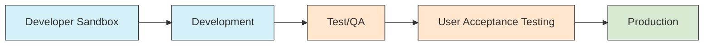

**Environment Purposes:**

1. **Developer Sandbox**: Individual environments for developer experimentation
2. **Development**: Collaborative environment for ongoing development
3. **Test/QA**: Environment for testing by QA team
4. **UAT**: Environment for business stakeholder validation
5. **Production**: Live environment for end-users

## ALM Pipeline Implementation

Elections Canada implements the Power Platform Pipelines feature with integration to Azure DevOps for automated build and deployment processes. This implementation follows Microsoft's healthy ALM practices while incorporating Elections Canada-specific requirements.

### Power Platform Pipelines Overview

Power Platform Pipelines is Microsoft's native ALM solution that provides integrated CI/CD capabilities directly within the Power Platform. It offers:

- Solution version control integration with Azure DevOps
- Automated build and deployment processes
- Quality checks and validation
- Gated approvals and deployment controls
- Environment management

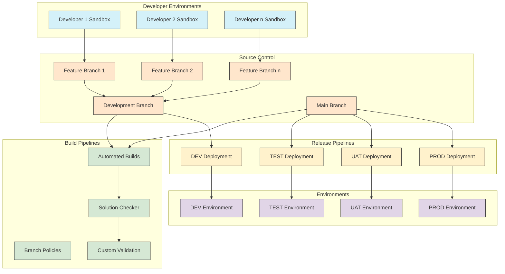

### Solution Development Workflow

Elections Canada developers follow a structured workflow for solution development:

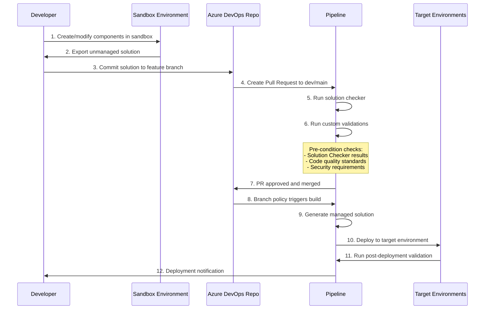

### Branch Policies and Triggers

Elections Canada implements branch policies in Azure DevOps to enforce quality gates and trigger automated deployments:

**Branch Structure:**

- **Feature branches**: Created for each new feature or bug fix
- **Development branch**: Integration branch for ongoing development
- **Release branches**: Created for each planned release
- **Main branch**: Represents what's in production

**Branch Policies:**

- Required code reviewers (minimum 1-2 depending on complexity)
- Linked work item requirements
- Build validation policies
- Comment resolution requirements
- Merge restrictions

**Branch Triggers:**

- **Feature → Development**: Triggers development environment deployment
- **Development → Release**: Triggers TEST environment deployment with manual approval
- **Release → Main**: Triggers UAT deployment with stakeholder approval
- **Main branch updates**: Triggers production deployment with change management approval

### Power Platform Solution Checkers

All solutions must pass both out-of-the-box solution checkers before deployment:

**1. Power Apps Solution Checker:**

- Analyzes customizations and identifies issues
- Validates against Microsoft best practices
- Detects potential performance issues
- Identifies accessibility concerns
- Checks for deprecated feature usage

**2. Power Platform Build Tools Checker:**

- Validates solution structure
- Checks component dependencies
- Verifies environment requirements
- Validates connection references
- Confirms environment variable configuration

**Enhanced Validation Requirements:**

Elections Canada projects may implement additional validation based on specific security and compliance requirements:

- Custom security scanning
- Compliance validation against Elections Canada standards
- Additional accessibility validation
- Performance testing for high-volume operations
- Data residency verification

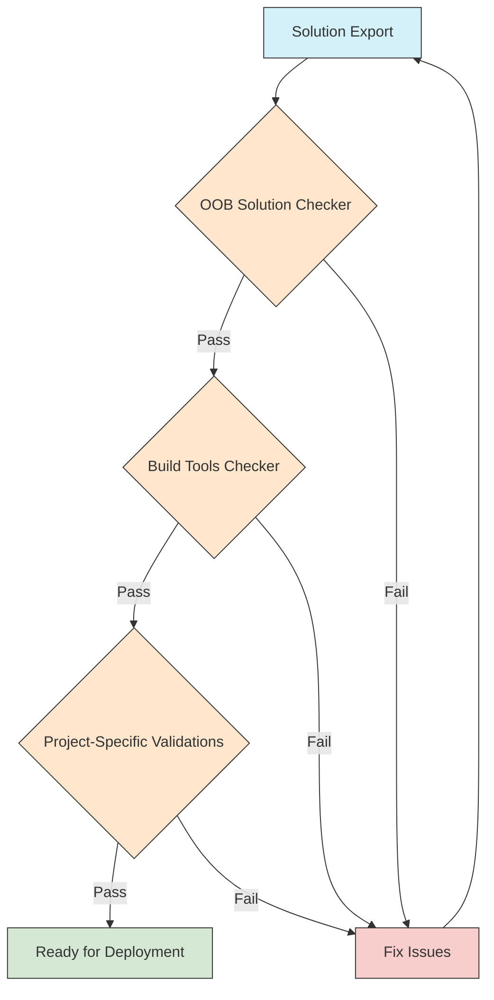

### Form ALM Process

Elections Canada follows Microsoft's recommended approach for Form ALM to ensure consistent and reliable form development across environments:

**1. Form Design Lifecycle:**

Forms in Dataverse have a specific ALM approach due to their unique structure and customization capabilities. The key components of Form ALM include:

- **Form Definition**: The form's XML definition including layout, tabs, sections
- **Form Logic**: JavaScript web resources, event handlers, business rules
- **Form Controls**: Standard and custom controls, their properties and configurations
- **Form Dependencies**: Related entities, optionsets, and other components

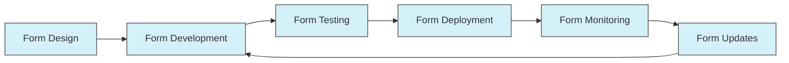

**2. Form Development Best Practices:**

- **Form Versioning**: Each major form revision should be tracked with version numbers
- **Form Layers**: Utilize solution layering for form customization
- **Component Segregation**: Separate form layout from form scripts
- **Control Management**: Document custom control dependencies
- **Performance Optimization**: Minimize script load times and DOM manipulations

**3. Form Migration Process:**

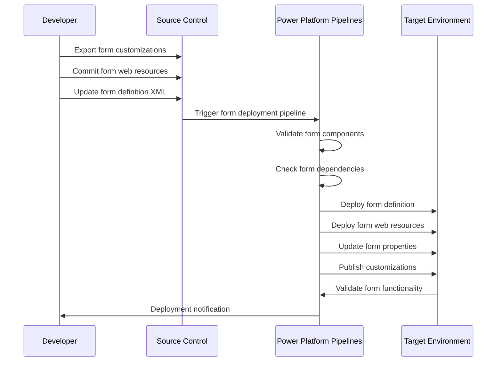

**4. Form Testing Requirements:**

Elections Canada requires comprehensive testing of forms before deployment:

- **Functional Testing**: Verify all form functionality works as expected
- **Field Validation**: Test all validation rules and business logic
- **Script Testing**: Validate all form scripts execute correctly
- **UI Testing**: Check form rendering across browsers and devices
- **Accessibility Testing**: Ensure forms meet WCAG 2.1 AA standards
- **Performance Testing**: Measure form load and save times

**5. Form Customization Governance:**

- **Standard Controls First**: Use standard controls where possible
- **Custom Control Approval**: Custom controls require security review
- **Script Standards**: JavaScript must follow EC coding standards
- **Business Rule Preference**: Use Business Rules over scripts when possible
- **Form Documentation**: Document complex form logic and customizations

**6. Form Deployment Considerations:**

- **Dependency Order**: Deploy form dependencies before the form
- **Web Resource Management**: Version web resources with the form
- **Configuration Migration**: Include form-related configuration data
- **Post-Deployment Validation**: Automated testing of form functionality
- **Rollback Plan**: Documented process for form deployment failures

For detailed implementation guidance on Form ALM, refer to [Microsoft&#39;s Form ALM documentation](https://learn.microsoft.com/en-us/power-platform/alm/form-alm).

### Development Workflow

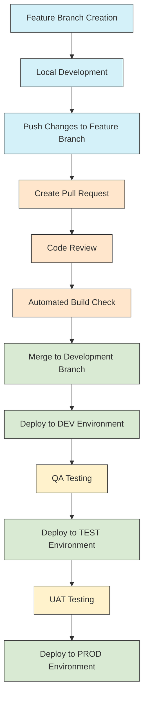

### Azure DevOps Integration

Elections Canada leverages Azure DevOps for source control, work item tracking, and pipeline automation:

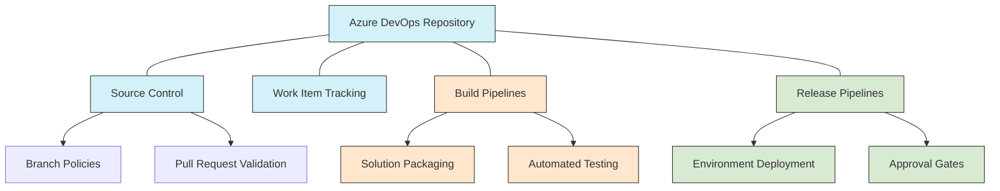

### Pipeline Stages

The ALM pipeline consists of several stages aligned with the environment strategy:

**1. Build Stage**

- Triggered by pull request or commit to main/development branch
- Packages solution files
- Validates solution against quality checks
- Generates build artifacts

**2. Development Deployment**

- Automatically deploys to development environment
- Runs automated tests
- Validates functionality

**3. Test Deployment**

- Requires manual approval from development lead
- Deploys to test environment
- Triggers notification to QA team

**4. UAT Deployment**

- Requires QA approval
- Deploys to UAT environment
- Triggers notification to business stakeholders

**5. Production Deployment**

- Requires business owner approval
- Scheduled during maintenance windows
- Includes backup procedures
- Post-deployment validation

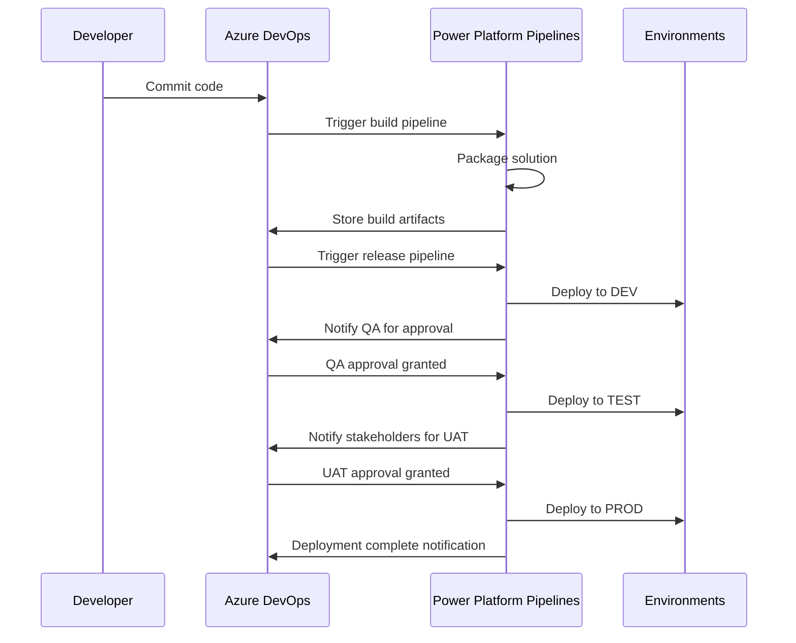

### Branching Strategy and Approval Gates

Elections Canada implements a comprehensive branching strategy with well-defined approval gates to ensure quality and security throughout the development lifecycle.

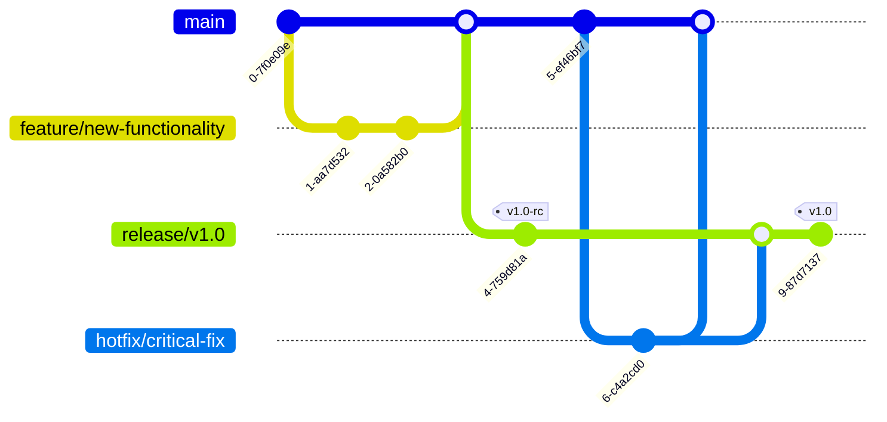

**Approval Gates and Stakeholder Involvement:**

Each deployment to non-development environments requires passing through formal approval gates with specific artifacts reviewed by stakeholders.

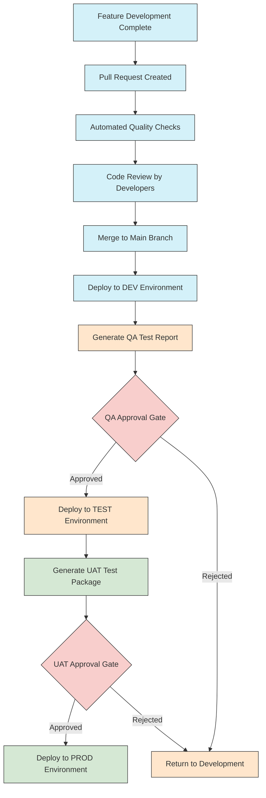

**QA Approval Gate Artifacts:**

- Solution Checker Report
- Test Execution Results
- Change Impact Analysis

**UAT Approval Gate Artifacts:**

- Functional Validation Package
- Non-Functional Validation Report
- Deployment Documentation

**Production Deployment Artifacts:**

- Change Advisory Board Package
- Final Deployment Report
- Post-Implementation Review Plan

## Integration Standards

### API Integration Strategy

Elections Canada implements a structured approach to API integrations that prioritizes security, monitoring, and standardization across the organization.

**Power Automate as the Primary Integration Framework:**

Power Automate flows should be the default choice for all API integrations for the following reasons:

- **Security Benefits:**

  - Centralized connection management using managed identities
  - Secured credential storage without exposure to developers
  - Integration with Azure Key Vault for sensitive configuration
  - Built-in throttling and retry mechanisms
  - Clear audit trail of all integration executions
- **Operational Benefits:**

  - Standardized monitoring through Power Platform analytics
  - Built-in exception handling and alerting
  - Simplified troubleshooting with run history and detailed logs
  - Visual representation of integration steps for easier maintenance
  - Ability to track performance metrics and identify bottlenecks
- **Governance Benefits:**

  - Consistent integration patterns across the organization
  - Reduced dependency on custom code
  - Easier to enforce compliance requirements
  - Simplified knowledge transfer between teams
  - Centralized administration and configuration

**On-Premises Data Gateway Integration:**

- Secure connectivity to on-premises data sources without firewall modifications
- Encrypted communications between cloud and on-premises systems
- Centrally managed gateway with monitoring capabilities
- Support for multiple data sources through a single gateway
- High availability configurations for mission-critical connections

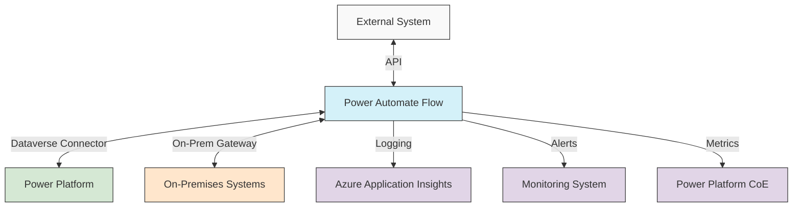

### Integration Implementation Guidelines

When implementing API integrations, developers should follow these guidelines:

1. **Authentication:**

   - Use OAuth 2.0 with managed identities where possible
   - Store credentials in Azure Key Vault, never in flow variables
   - Implement certificate-based authentication for sensitive integrations
   - Rotate credentials according to Elections Canada security policies
2. **Error Handling:**

   - Implement comprehensive try/catch patterns
   - Log detailed error information for troubleshooting
   - Configure appropriate retry policies based on API resilience
   - Establish clear failure paths and notifications
3. **Performance:**

   - Use batch operations when processing multiple records
   - Implement pagination for large data sets
   - Consider asynchronous patterns for long-running processes
   - Monitor and optimize flow run durations
4. **Security:**

   - Apply the principle of least privilege for connections
   - Encrypt sensitive data in transit and at rest
   - Implement IP restrictions where applicable
   - Follow EC data classification policies for handling information
5. **Monitoring:**

   - Configure alerts for failed runs
   - Set up performance monitoring for flow execution times
   - Use Application Insights for detailed telemetry
   - Establish SLAs and monitor compliance

### On-Premises Data Gateway Management

Elections Canada utilizes the on-premises data gateway to securely connect to internal systems:

1. **Gateway Architecture:**

   - Implement gateway clusters for high availability
   - Deploy in a dedicated network segment with appropriate security controls
   - Configure regular updates through a maintenance schedule
   - Monitor gateway performance metrics
2. **Gateway Security:**

   - Restrict gateway service account permissions to minimum required
   - Implement network-level controls to limit gateway communication
   - Encrypt all configuration settings
   - Conduct regular security reviews of gateway configurations
3. **Connection Management:**

   - Centralize connection creation and management
   - Document all gateway dependencies
   - Implement connection monitoring
   - Establish disaster recovery procedures for gateway failure

## Custom Development Standards

### Plugin Development Strategy

While Power Automate should be the primary method for integrations and automation, there are specific scenarios where plugin development is recommended:

**When to Use Plugins:**

- Performance-critical operations requiring millisecond response times
- Complex transaction management requiring ACID compliance
- Real-time data validation requiring synchronous execution
- Deep integration with the Dataverse platform at the database level
- Advanced security scenarios requiring server-side execution
- Operations requiring custom threading or parallel processing
- Functionality that needs to integrate at the platform event level

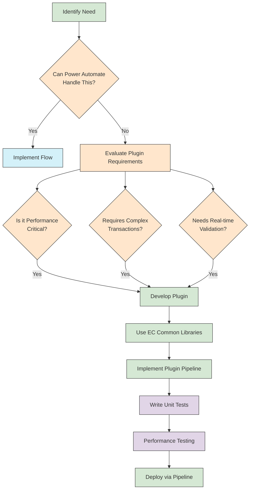

**Plugin Development Best Practices:**

1. **Namespacing and Organization:**
   All plugins should follow a consistent namespace structure:

   ```csharp
   namespace ElectionsCanada.[BusinessUnit].[Application].[Purpose]
   ```

   Example: `ElectionsCanada.VoterOperations.Registration.Validation`
2. **Common Library Framework:**
   Elections Canada maintains a shared library of common utilities and patterns:

   - **ElectionsCanada.Core**: Base functionality and utilities
   - **ElectionsCanada.Security**: Security-related functionality
   - **ElectionsCanada.Integration**: Integration utilities
   - **ElectionsCanada.Validation**: Common validation rules
   - **ElectionsCanada.Logging**: Standardized logging framework
3. **C# Coding Patterns:**

   - Implement dependency injection for testability
   - Use async/await patterns where appropriate
   - Follow SOLID principles in class design
   - Implement comprehensive exception handling
   - Use strong typing with Dataverse Early-Bound entities
   - Apply factory pattern for service locator functionality
   - Implement repository pattern for data access
   - Use strategy pattern for variable business logic
4. **Plugin Performance Optimization:**

   - Minimize external calls within plugins
   - Use appropriate caching strategies
   - Implement query optimization techniques
   - Consider batch operations for bulk processing
   - Profile plugin execution times regularly
   - Use non-blocking operations where possible
   - Implement proper disposal of resources
5. **Plugin Testing:**

   - Implement unit tests with high coverage
   - Use mocking frameworks for isolation testing
   - Include integration tests for end-to-end validation
   - Establish performance benchmarks and test against them
   - Create automated regression test suites

### Plugin Registration and Configuration

All plugin registration should be managed through solution components:

- Register plugins using plugin registration tool
- Include step configurations in solution files
- Document secure configuration in Azure DevOps wiki
- Manage plugin assembly versions through build pipelines
- Test plugin upgrades in non-production environments before deployment
- Implement proper error handling and logging in all plugins
- Maintain plugin dependency documentation

## Security Standards

### Portal Security Architecture

Power Pages portals require specific security considerations, especially when handling protected B and MM (Medium Sensitivity or Medium Integrity) data.

**Server-Side Rendering Preference:**

Always prefer server-side rendering over client-side processing for sensitive operations, especially for data modification operations.

**Rationale:**

- Reduces attack surface by keeping business logic server-side
- Prevents exposure of sensitive data processing logic to client
- Limits potential for JavaScript injection attacks
- Enforces server-side permission validation
- Creates complete audit trail of all operations
- Prevents tampering with business logic in browser
- Reduces risk of sensitive data exposure through browser tools

**Implementation Guidelines:**

- Use Liquid templates for server-side rendering
- Implement form processing with server-side validation
- Minimize JavaScript for business logic operations
- Use Web API for read operations only when necessary
- Implement proper CSRF protection for all forms
- Apply output encoding for all dynamic content
- Implement content security policies

**Web API Usage Guidelines:**

**When to Use Web API:**

- Read-only data retrieval of non-sensitive information
- User interface enhancements that require dynamic loading
- Filtering and sorting operations on already-retrieved data
- Auto-save functionality for improved user experience
- Client-side validation for immediate user feedback (with server-side validation backup)

**When to Avoid Web API:**

- Creating, updating, or deleting sensitive records
- Operations requiring complex permission checks
- Transactions involving multiple record changes
- Processing sensitive business rules or calculations
- Operations requiring elevated privileges
- Handling protected B or MM classified data
- Processing financial or personally identifiable information

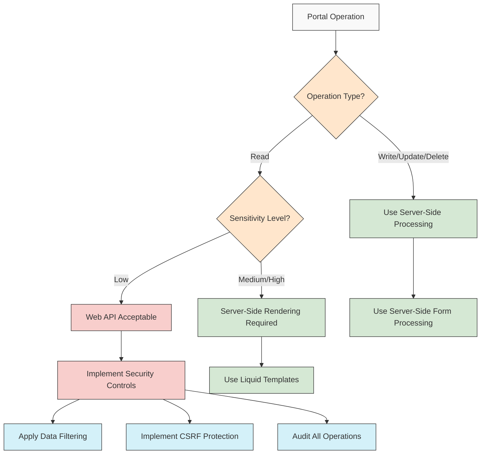

### Table Permission Model

Proper configuration of table permissions is critical for portal security, especially when dealing with related records.

**Parent-Child Table Permission Model:**

**Implementation Approach:**

- Configure parent record permissions with appropriate web roles
- Use Global Access for child records with relationship-based access
- Implement entity permissions with scope set to "Parent/Child"
- Ensure relationship definitions enforce cascading access
- Configure appropriate access type (Read, Write, Create, Delete) at each level

**Benefits:**

- Prevents unauthorized "sniffing" of related records
- Simplifies permission management for complex data models
- Ensures consistent access control across related entities
- Prevents security vulnerabilities from misconfigured permissions
- Maintains data isolation between portal users
- Enforces record-level security without custom code
- Provides defensible security boundaries between user data

**Example Configuration:**
For a Case with related Case Documents:

1. Configure Entity Permission for Case with appropriate web roles
2. Configure Entity Permission for Case Documents with Parent/Child scope
3. Configure the relationship between Case and Case Documents
4. Ensure Global Access is set up correctly for child entities
5. Validate security model with penetration testing

```mermaid
graph TD
    A[Portal User] -->|Has Access To| B[Parent Record]
    B -->|Grants Access To| C[Child Records]
    B -->|Denies Access To| D[Unrelated Records]
  
    A -->|Cannot Access| D
    A -->|Cannot "Sniff"| E[Other Users' Records]
  
    classDef user fill:#f9f9f9,stroke:#333,stroke-width:1px
    classDef parent fill:#d5e8d4,stroke:#333,stroke-width:1px
    classDef child fill:#d4f1f9,stroke:#333,stroke-width:1px
    classDef unauthorized fill:#f8cecc,stroke:#333,stroke-width:1px
  
    class A user
    class B parent
    class C child
    class D,E unauthorized
```

### Additional Security Measures

**Web Role Configuration:**

- Implement principle of least privilege for all web roles
- Use role hierarchies for progressive permissions
- Document role definitions and access levels
- Conduct regular access reviews
- Implement attribute-based security where appropriate

**Data Protection:**

- Configure field-level security for sensitive attributes
- Implement data masking for protected fields
- Use secure notes for highly sensitive information
- Configure proper audit logging for all access to sensitive data
- Implement proper data classification across all entities

## Environment Management

### Environment Access Control Strategy

Elections Canada implements a strict environment access control strategy to maintain security and governance while enabling developer productivity.

**Development Environment Approach:**

- Developers receive System Administrator role in dedicated development environments
- Each development environment is isolated from production data
- Personal development environments are provisioned through self-service
- Shared development environments follow strict access control
- Development environments are subject to regular cleanup and refresh cycles

**Test/QA/Production Environment Approach:**

- All deployments to downstream environments occur exclusively through pipelines
- Direct system administrator access is restricted in non-development environments
- Environment variables control environment-specific configuration
- Production-like data is used in test environments with proper data masking
- Regular security audits verify proper access controls

**Emergency Access with Azure PIM:**

Elections Canada implements Azure Privileged Identity Management (PIM) for emergency access to controlled environments:

- System Administrator privileges are assigned to security groups
- Security groups are managed through Azure PIM
- Just-in-time access requires formal approval
- All privileged access is time-limited and audited
- Elevation requests require business justification
- Approval workflows include security team review
- All privileged actions are logged and monitored

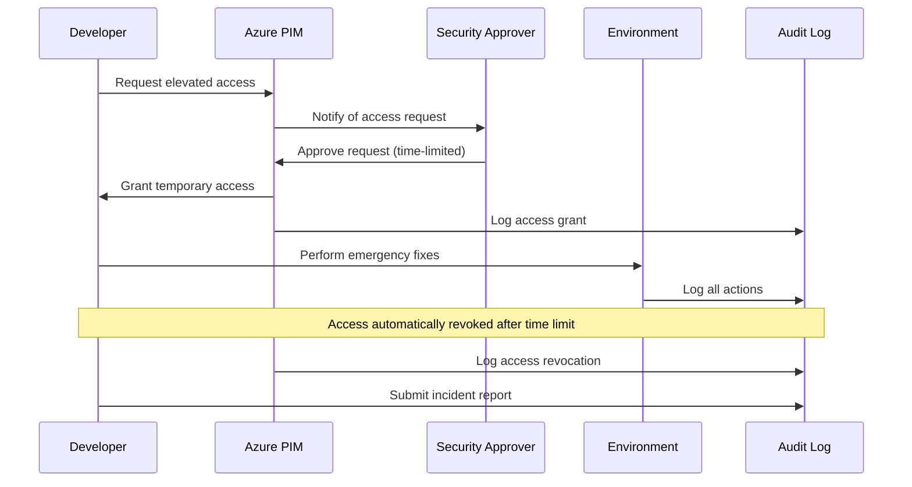

**Emergency Procedures:**

- Documented process for requesting emergency access
- Predefined approval workflows for different scenarios
- Post-incident review requirements
- Pipeline-based remediation for permanent fixes
- Regular testing of emergency access procedures
- Emergency access documentation in central knowledge base
- Post-emergency access audit reporting

### Environment Lifecycle Management

Elections Canada follows a structured approach to environment lifecycle management:

**Environment Provisioning:**

- Self-service developer environments through Admin portal
- Pipeline-managed environment creation for official environments
- Standard baseline configurations for all environments
- Comprehensive environment documentation requirements
- Security review for production environment provisioning

**Environment Maintenance:**

- Regular solution version synchronization
- Scheduled database maintenance operations
- Automated environment health checks
- Capacity monitoring and scaling
- Security patch application procedures

**Environment Decommissioning:**

- Data retention policy enforcement
- Formal decommissioning approval process
- Data backup and archiving procedures
- Resource recovery documentation
- Access removal verification

## Power Pages Implementation

Elections Canada has established a standardized Power Pages portal template that is ready to deploy for any client within EC that requires an external-facing portal.

### Standard Template

The standard Power Pages template includes:

- Accessibility tools integration
- EC-approved theme and branding
- Responsive design for all devices
- Content templates for common EC scenarios
- Standardized navigation structure

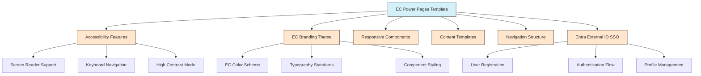

### Authentication

All external-facing Power Pages portals use Entra External ID for secure authentication:

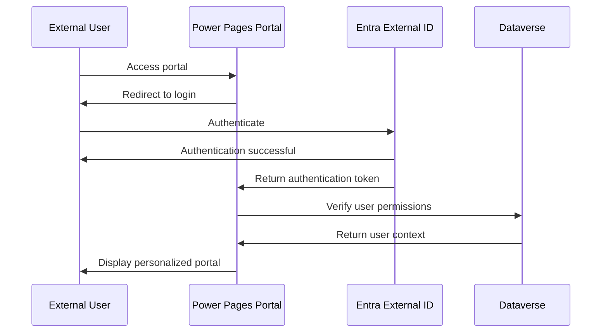

### Portal Template Customization

Elections Canada provides a standard Power Pages template with pre-configured components that should be utilized for all portal projects:

**Template Components:**

- Responsive layout framework
- Accessibility-compliant navigation structure
- Standardized header and footer components
- EC branding elements
- Entra External ID integration
- Compliance components (terms of service, privacy notice)

**Customization Guidelines:**

- Maintain the core structural elements
- Extend using the template-provided extension points
- Document all template modifications
- Follow the Elections Canada visual identity guidelines
- Use the provided accessibility-tested components

### Portal Security Implementation

Elections Canada Power Pages must implement comprehensive security measures:

**Authentication Requirements:**

- Entra External ID as the identity provider
- Multi-factor authentication for staff portals
- Appropriate session timeout configuration
- Proper cookie security settings
- Registration workflows with email verification

**Authorization Framework:**

- Granular web role definitions
- Entity-level permission configuration
- Record-level security implementation
- Field security for sensitive attributes
- Context-aware permission validation

**Security Headers Configuration:**

- Content-Security-Policy headers
- X-Frame-Options configuration
- X-XSS-Protection settings
- Strict-Transport-Security implementation
- Referrer-Policy configuration

### Liquid Template Development

Liquid templates should follow these standards:

**Pattern Implementation:**

- Use partial templates for reusable components
- Implement template inheritance for consistent layouts
- Document template dependencies
- Follow consistent naming conventions
- Create modular templates with clear responsibilities

**Performance Considerations:**

- Minimize complex Liquid operations
- Use pagination for large data sets
- Implement appropriate caching strategies
- Optimize template loading sequence
- Monitor and tune template rendering performance

**Security Practices:**

- Always apply proper output encoding
- Validate all inputs before processing
- Use proper authorization tags
- Implement error handling with secure error pages
- Follow the principle of least privilege in data access

## JavaScript Best Practices

### JavaScript Standards for Power Pages

When developing JavaScript for Power Pages, the following best practices should be followed:

**Security Considerations:**

1. **Content Security Policy (CSP):**

   - Implement strict CSP headers to prevent XSS attacks
   - Avoid inline JavaScript when possible
   - Use nonce-based CSP for required inline scripts
   - Restrict script sources to trusted domains only
2. **Input Validation:**

   - Validate all user inputs on both client and server
   - Implement proper encoding for dynamic content
   - Use parameterized queries for any data operations
   - Don't trust client-side validation alone
3. **Authentication and Authorization:**

   - Never expose authentication tokens in JavaScript
   - Implement proper CSRF protection
   - Don't store sensitive information in browser storage
   - Verify authorization server-side for all operations

**Performance Optimization:**

1. **Resource Loading:**

   - Minify and bundle JavaScript files
   - Implement proper caching strategies
   - Use defer or async attributes appropriately
   - Optimize critical rendering path
2. **Execution Efficiency:**

   - Minimize DOM manipulations
   - Use event delegation for multiple similar elements
   - Implement debouncing for frequent events
   - Avoid memory leaks through proper cleanup
3. **Progressive Enhancement:**

   - Ensure core functionality works without JavaScript
   - Add enhanced features progressively
   - Provide fallbacks for unsupported features
   - Test with JavaScript disabled

**Code Organization:**

1. **Module Pattern:**

   - Use namespaces to prevent global pollution
   - Implement revealing module pattern
   - Maintain separation of concerns
   - Document module interfaces clearly

   ```javascript
   // Example of module pattern
   const EC = EC || {};
   EC.VoterPortal = (function() {
     // Private variables and functions
     let userProfile = null;

     function loadUserProfile() {
       // Implementation
     }

     // Public API
     return {
       initialize: function() {
         // Initialization code
         loadUserProfile();
       },
       updateProfile: function(data) {
         // Public method
       }
     };
   })();
   ```
2. **Error Handling:**

   - Implement proper try/catch blocks
   - Log errors for troubleshooting
   - Provide user-friendly error messages
   - Gracefully degrade functionality on failure
3. **Testing:**

   - Write unit tests for JavaScript functions
   - Implement integration tests for UI components
   - Test across multiple browsers and devices
   - Use automated testing in CI/CD pipeline

### JavaScript Standards for Model-Driven App Web Resources

When developing JavaScript for web resources in model-driven apps, the following standards apply:

**Form Script Organization:**

1. **Event Model:**

   - Follow the recommended Xrm.Page event model
   - Implement handlers for appropriate form events
   - Use namespaced functions for all event handlers
   - Document event sequence dependencies

   ```javascript
   // Example of properly organized form script
   var EC = EC || {};
   EC.VoterRecord = EC.VoterRecord || {};

   EC.VoterRecord.FormEvents = {
     onLoad: function(executionContext) {
       const formContext = executionContext.getFormContext();
       // Form load logic
       EC.VoterRecord.FormEvents.initializeForm(formContext);
     },

     onChange: function(executionContext) {
       const formContext = executionContext.getFormContext();
       const attribute = executionContext.getEventSource();
       // Change logic
     },

     initializeForm: function(formContext) {
       // Initialization logic
     }
   };
   ```
2. **Performance Considerations:**

   - Minimize server calls in form scripts
   - Batch operations when possible
   - Implement caching for reference data
   - Use web resource dependencies correctly
3. **Error Handling:**

   - Implement comprehensive error handling
   - Log errors to Application Insights when possible
   - Provide meaningful user feedback
   - Prevent cascade failures

**Client API Best Practices:**

1. **API Usage:**

   - Use the latest Client API model
   - Avoid deprecated methods and properties
   - Follow Microsoft's recommended patterns
   - Document API versions and dependencies
2. **Form Manipulation:**

   - Use formContext for all form interactions
   - Implement proper tab and section navigation
   - Manage field visibility based on security context
   - Handle form state changes properly
3. **Data Operations:**

   - Use WebAPI for data operations
   - Implement proper promise handling
   - Use batch operations for multiple records
   - Validate data before submission

**Ribbon Command Implementation:**

1. **Command Structure:**

   - Implement proper enable rules
   - Create reusable command functions
   - Document command dependencies
   - Test commands in all applicable entity contexts
2. **User Experience:**

   - Provide appropriate feedback during execution
   - Implement progress indicators for long-running operations
   - Confirm destructive operations
   - Maintain UI responsiveness
3. **Error Handling:**

   - Gracefully handle command failures
   - Provide clear error messages
   - Log detailed error information
   - Implement retry mechanisms where appropriate

## Governance and Administration

### Center of Excellence (CoE)

Elections Canada maintains a Power Platform Center of Excellence responsible for:

**Standards and Governance:**

- Developing and maintaining development standards
- Reviewing and approving exceptions to standards
- Conducting architecture reviews for new applications
- Managing environment provisioning and access
- Enforcing naming conventions and documentation requirements

**Support and Enablement:**

- Providing developer training and resources
- Maintaining shared component libraries
- Supporting developers with technical guidance
- Facilitating knowledge sharing across teams
- Offering solution design consultation

**Monitoring and Compliance:**

- Tracking environment usage and performance
- Monitoring license consumption
- Enforcing data loss prevention policies
- Conducting regular security reviews
- Ensuring compliance with EC security policies

### Administration Practices

Elections Canada follows these administrative best practices:

**Environment Management:**

- Regular environment cleanup and optimization
- Scheduled maintenance windows
- Performance monitoring and tuning
- Capacity planning and scaling
- Backup and disaster recovery testing

**User Access Management:**

- Regular access reviews
- Just-in-time privilege assignment
- Comprehensive role documentation
- Segregation of duties enforcement
- Automated provisioning and de-provisioning

**License Management:**

- License allocation based on roles
- Usage monitoring and optimization
- Regular license reconciliation
- License forecasting for budgeting
- Cost allocation to business units

## Best Practices

### Solution Management

- Use solution segmentation to separate core components from customizations
- Implement solution layering for extensibility
- Use managed solutions for all deployments beyond development
- Document dependencies between solutions

### Version Control

- All customizations must be tracked in source control
- Feature branches for all new development
- Pull request reviews required before merging to main branches
- Tag all release versions in source control

### Testing

- Unit tests for complex business rules
- UI automated tests for critical paths
- Load testing for high-volume processes
- User acceptance testing with documented test cases

### Documentation

- Solution architecture documents
- Component-level documentation within source code
- User guides for end-users
- Administrative guides for support team

### Monitoring

- Implement application insights
- Set up automated alerts for critical failures
- Regular performance reviews
- Usage analytics to guide future development

## Conclusion

This comprehensive document outlines Elections Canada's standards for Power Platform development, focusing on Model-Driven Apps and Power Pages portals. By following these guidelines, developers can ensure consistent, secure, and maintainable solutions that meet Elections Canada's requirements.

The standards combine Elections Canada's specific naming conventions, security requirements, and operational policies with Microsoft's recommended healthy ALM practices. They provide a structured approach to development, deployment, and management that enables efficient delivery while maintaining governance and security.

Regular review and updates to these standards will ensure they remain current with evolving technology and organizational needs. Feedback from developers and stakeholders should be incorporated into future versions to continuously improve the development process.

---

**Document Version:** 1.1
**Last Updated:** March 2025
**Approved By:** Elections Canada Power Platform CoE
