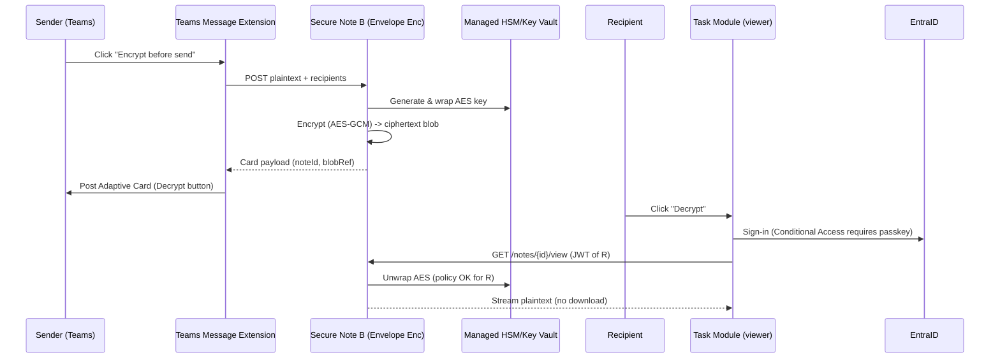

# 🇨🇦 DID + Cloud Signature SaaS — Architecture (v1.1)

**Update Focus:** Microsoft Teams “Encrypt before send” (Design A & B)

**Owner:** Cloudstrucc Inc.

**Regions:** Azure Canada Central/East only

**Tenancy Model:** Multi-tenant SaaS (central control plane) + per-agency config

**Date:** 2025-08-28

---

## 0) Changelog (since v1.0)

* Added **Teams Secure Note** capability with a compose-time **Encrypt before send** button.
* Two designs provided:
  * **Design A** : Microsoft Purview-protected file (recommended for gov/compliance).
  * **Design B** : Custom envelope encryption with passkey-gated viewing.
* Updated component/sequence diagrams, APIs, Graph permissions, data lifecycle, compliance notes.

---

## 1) Executive Summary

We keep Entra ID for workforce sign-in (passkeys/WHfB) and ZTNA via Entra Private Access. DID/VCs provide  **claims/authorization** ; **PDF signatures** remain  **PKI (CSC/AATL)** . For  **Teams** , we add a **message extension** that lets users “Encrypt before send”:

* **Design A (Recommended):** Turn text into a **Purview-protected file** stored in OneDrive/SharePoint; post a card with an “Open Secure Note” button. Access is **passkey-gated** by Conditional Access; compliance/eDiscovery stay first-class.
* **Design B:** Create a **ciphertext “secure note”** stored in our service (envelope-encrypted; keys in Managed HSM). Post a card with “Decrypt” that opens a task module; recipient authenticates with  **passkey** , we authorize and stream plaintext to the dialog (no local copy).

---

## 2) Services (SaaS Catalog)

1. **VC Issuer (OID4VCI)** – issues employment/role/“Authorized Signer” VCs (`did:web` trust).
2. **VC Verifier (OID4VP)** – converts presentations to OIDC claims; feeds  **Policy Engine** .
3. **Cloud Signature Service (CSC Client)** – applies **PAdES** with **AATL** trust; LTV timestamps.
4. **Email Protection Orchestrator** – Outlook OME/labels “one-click encrypt”; optional S/MIME onboarding.
5. **Teams Secure Note**  *(new)* :
   * **Design A** : Purview-protected file + passkey-gated open.
   * **Design B** : Envelope encryption + passkey-gated view in task module.
6. **ZTNA On-Ramp** – Entra Private Access patterns; optional Cisco federation to Entra.
7. **Key & Trust** – Azure Managed HSM/Key Vault; rotation; attestation.
8. **Compliance & Guardrails** – PBMM/CCCS mapping; Sentinel logging; TRA/PIA artifacts.

---

## 3) High-Level Architecture (Updated)

```mermaid
flowchart LR
  subgraph Client
    U[User] -->|Passkey/WHfB| EntraID
    Wallet[(Wallet/Authenticator)]
    Outlook
    Teams
    Acrobat
  end

  subgraph SaaS (Canada Central/East)
    APIM[API Gateway]
    Issuer[VC Issuer (OID4VCI)]
    Verifier[VC Verifier (OID4VP)]
    Policy[Policy Engine]
    SignSvc[CSC Signing Adapter]
    TeamsExt[Teams App: Message Extension + Task Module]
    NoteA[Secure Note A: Purview Wrapper]
    NoteB[Secure Note B: Envelope Enc Service]
    Store[(Config/Metadata DB)]
    Logs[(Audit/Sentinel)]
  end

  subgraph M365/Gov
    SPO[SharePoint/OneDrive]
    Purview[Purview Sensitivity Labels/OME]
    EXO[Exchange Online]
    TMS[Teams]
  end

  subgraph Trust & Keys
    KV[Key Vault / Managed HSM]
    DIDWEB[did:web @ agency.gov]
    AATL[AATL TSP/Time-stamp]
  end

  U-->EntraID
  Wallet<-->Issuer
  Wallet-->Verifier
  Verifier-->Policy
  Policy-->SignSvc
  Issuer-->KV
  SignSvc-->AATL
  Teams<-->TeamsExt
  TeamsExt-->NoteA
  TeamsExt-->NoteB
  NoteA-->Purview
  NoteA-->SPO
  NoteB-->KV
  SaaS-->Logs
  Outlook-->EXO
  TMS-->Purview
```

---

## 4) Teams “Encrypt before send” — Designs

### 4.1 Design A — **Purview-Protected File** (Recommended)

**Highlights**

* Uses **MIP/Purview** to apply encryption & usage rights to a generated file (e.g., HTML/PDF).
* File stored in  **OneDrive/SharePoint** ; Teams card links to it.
* **Passkey step-up** enforced by Conditional Access on the viewing app/file.
* **Compliance-friendly** (retention, DLP, eDiscovery remain in M365 lanes).

**Sequence**

```mermaid
sequenceDiagram
  participant S as Sender (Teams)
  participant Ext as Teams Message Extension
  participant A as Secure Note A (Purview Wrapper)
  participant SPO as SharePoint/OneDrive
  participant PV as Purview (Labels/Protection)
  participant R as Recipient
  participant TM as Task Module (viewer)
  S->>Ext: Click "Encrypt before send"
  Ext->>A: POST plaintext + audiences + labelId
  A->>A: Render to HTML/PDF
  A->>PV: Apply label+encryption (MIP SDK)
  A->>SPO: Upload protected file; get link
  A-->>Ext: Card payload (title, link)
  Ext->>S: Post Adaptive Card to chat
  R->>TM: Click "Open Secure Note"
  TM->>EntraID: Sign-in (Conditional Access requires passkey)
  TM->>SPO: Fetch file (token-enforced)
  TM-->>R: Display decrypted content (in viewer)
```

**Key Components**

* **Teams App** : Action message extension + Adaptive Card + task module viewer.
* **Secure Note A** service: Render → Label/Encrypt → Upload → Return link.
* **Policies** : Conditional Access “Authentication strength = phishing-resistant” for the viewer app.
* **Permissions** : Graph scopes for SharePoint/OneDrive file create/read; Teams message send (on behalf).

---

### 4.2 Design B — **Custom Envelope Encryption**

**Highlights**

* Server generates a **random AES-GCM** key per note; keys sealed in  **Managed HSM** .
* Ciphertext stored in **SaaS storage** (or SPO as opaque blob); posted via Adaptive Card.
* Recipient clicks  **Decrypt** ; task module opens; **passkey** auth gates key release.
* **Plaintext never persisted** in Teams or SPO; displayed only in the viewer.

**Sequence**



**Trade-offs**

* **Pros:** Maximum control; zero plaintext at rest in M365.
* **Cons:** Extra compliance work (eDiscovery/legal hold strategy); ensure auditing/retention meet gov requirements.

---

## 5) API Contracts (New/Updated)

### 5.1 Teams Message Extension (server side)

```
POST /teams/command/encrypt
Auth: Bearer <user_jwt>
Body: {
  "text": "string",
  "audiences": ["user@agency.gc.ca", "groupId:..."],
  "design": "A" | "B",
  "labelId": "Confidential-Agency"  // Design A only
}
→ 200 { "card": <AdaptiveCard JSON> }
```

### 5.2 Secure Note A (Purview Wrapper)

```
POST /secure-note-a
Body: { text, labelId, audiences }
→ 200 { fileUrl, fileId, title }

GET  /viewer-a?fileId=...   // Task module viewer bootstrap (OIDC)
```

### 5.3 Secure Note B (Envelope Encryption)

```
POST /secure-note-b
Body: { text, recipients }
→ 200 { noteId, blobRef, title }

GET  /secure-note-b/{noteId}/view
Auth: Bearer <user_jwt>
→ 200 { plaintext }   // streamed; no caching; optional SSE
```

*(All endpoints behind APIM; audit every request; PII minimized.)*

---

## 6) Identity, AuthN/Z, and Policies

* **Sign-in:** Entra ID; enforce **Authentication strength = phishing-resistant** (passkeys/WHfB) on viewer/task-module apps.
* **Authorization:** VC presentation → **Verifier** → **Policy Engine** → grant rights (e.g., “may view notes labeled X”, “may countersign”).
* **RBAC:** Tenant-scoped roles: Tenant Admin, Compliance Admin, Security Reader, Developer.
* **Keys:** Sign/enc keys in  **Managed HSM** ; per-note AES keys; automatic rotation; break-glass procedures.

---

## 7) Microsoft Graph / Permissions (min-privilege)

* **Teams** : `Chat.ReadWrite`, `TeamsAppInstallation.ReadWriteSelfForUser`, `TeamsMessages.Create`.
* **Files** (Design A): `Files.ReadWrite`, `Sites.ReadWrite.All` (scoped to tenant/drive).
* **User/Groups** : `User.Read`, `Group.Read.All` (for recipient resolution).
* **OpenID/OAuth** : user.impersonation for app services (on-behalf-of flow).
* **Conditional Access** : Policy requiring **phishing-resistant MFA** for the viewer web app.

---

## 8) Technology Chapters (New/Impacted)

### 8.1 Teams App Platform

* **Message Extension (Action)** : adds the **Encrypt** button in the compose bar; posts  **Adaptive Cards** .
* **Task Module** : webview used as the secure viewer (A & B).
* **Bot/SME** : optional for notifications (expiry, revocation).
* **Packaging** : manifest v1.16+; per-tenant install; app studio pipeline.

### 8.2 Secure Note A (Purview)

* **Role:** Convert plaintext → file; apply **Sensitivity label** with encryption (MIP SDK); upload to SPO.
* **Why:** Leverages existing M365 governance (DLP, eDiscovery, retention).
* **Failure modes:** Label misconfig, missing rights template, SPO link scope.

### 8.3 Secure Note B (Envelope)

* **Role:** Stateless encryption service; keys in Managed HSM; no plaintext at rest.
* **Why:** Maximize isolation; handle non-M365 recipients if needed.
* **Failure modes:** Viewer leakage if screenshots allowed; plan watermarking/user prompts.

### 8.4 Policy Engine (DID-aware)

* Evaluates **VC claims** + user identity + risk/device posture → allow/deny to **create** or **view** a secure note and to **sign** documents.
* Declarative rules (JSON) checked synchronously by services.

---

## 9) Data Lifecycle & Compliance

### Design A

* **Storage:** Encrypted file in SPO; access via AAD tokens; audit in M365.
* **Discovery/Retention:** Native support (use label policies/retention).
* **DLP:** Purview policies can inspect **labeled** items per org policy.

### Design B

* **Storage:** Ciphertext + metadata in SaaS DB/Blob; keys in HSM.
* **Discovery/Retention:** Provide **compliance export** and **legal hold** APIs; mirror minimal plaintext into a **vaulted** tenant with dual-control if mandated.
* **Audit:** Every view/unseal logged to Sentinel; include VC claims summary.

---

## 10) Security Controls

* **Auth:** Passkeys/WHfB; CA with device compliance; token binding where supported.
* **Crypto:** AES-GCM per object; FIPS-validated providers; PAdES/AATL for PDFs (unchanged).
* **Hardening:** Private Link to SPO/Key Vault; APIM IP restrictions; WAF at edge.
* **Secrets:** Managed identities only; no raw secrets in config.
* **Telemetry:** Structured logs with privacy budgets; KQL dashboards.

---

## 11) Dev Deliverables & Backlog (POC Scope)

**Sprint 1 (Teams + A)**

* Message extension + dialog UI.
* Secure Note A service (render → label → upload).
* Card + viewer task module (passkey-gated).
* Graph integration + app registration; CA policy.

**Sprint 2 (B + Policy)**

* Secure Note B service (encrypt/store/stream).
* HSM integration; per-note key management.
* Verifier → Policy hookup for view rights.

**Sprint 3 (Ops + Compliance)**

* APIM, logging, Sentinel workbooks.
* eDiscovery/retention tests (A); compliance export (B).
* Performance/DoS hardening; chaos tests.

---

## 12) Non-Functional Requirements

* **Residency:** Canada Central/East only.
* **Availability:** Multi-AZ; ZRS where possible.
* **Latency:** < 500 ms p50 for view/open within tenant.
* **Scalability:** Horizontal autoscale on APIM/app plans; queue offloads for heavy ops.
* **SLA targets (POC):** 99.5% service availability.

---

## 13) Risk & Mitigation

* **User screenshots (B):** Watermark UI; detect focus loss; educate users.
* **Label drift (A):** CI tests for label IDs/templates; health probes.
* **Graph throttling:** Exponential backoff; app-only fallbacks where possible.
* **Compliance gaps (B):** Provide legal hold/export; document limitations early.

---

## 14) OpenAPI (Secure Note B — Envelope Encryption)

```yaml
openapi: 3.0.3
info: { title: Secure Note B API, version: 1.0.0 }
servers: [{ url: https://notes.<your-saas>.ca/api }]
paths:
  /notes:
    post:
      summary: Create encrypted note
      security: [{ bearerAuth: [] }]
      requestBody:
        required: true
        content:
          application/json:
            schema:
              type: object
              required: [text, recipients]
              properties:
                text: { type: string }
                recipients: { type: array, items: { type: string } }
      responses:
        "200":
          description: Created
          content:
            application/json:
              schema:
                type: object
                properties:
                  noteId: { type: string }
                  title: { type: string }
                  blobRef: { type: string }
  /notes/{noteId}/view:
    get:
      summary: View plaintext (passkey-gated)
      security: [{ bearerAuth: [] }]
      parameters:
        - in: path
          name: noteId
          schema: { type: string }
          required: true
      responses:
        "200":
          description: OK
          content:
            application/json:
              schema:
                type: object
                properties:
                  plaintext: { type: string }
components:
  securitySchemes:
    bearerAuth:
      type: http
      scheme: bearer
      bearerFormat: JWT
```

---

## 15) Repo Layout (incremental)

```
/apps
  /teams-ext           # message extension + task modules
  /secure-note-a       # render + label + upload
  /secure-note-b       # envelope encryption service
  /issuer-api          # OID4VCI
  /verifier-api        # OID4VP + policy
  /signing-adapter     # CSC client (PAdES/AATL)
  /admin-portal        # onboarding, labels, policies, profiles
/packages
  /agent               # Veramo config (did:web)
  /policy-engine       # JSON rules (VC->rights)
  /mip-wrapper         # thin SDK wrapper for labeling (A)
  /kv-hsm              # crypto helpers
/docs
  /architecture        # this markdown, diagrams
```

---

## 16) Acceptance Criteria (POC)

* **Teams compose** shows “Encrypt before send”; posting renders a card.
* **Design A** : Recipient must satisfy **passkey** to open; content opens from SPO with applied label; audit visible in M365.
* **Design B** : Recipient must satisfy  **passkey** ; plaintext visible only inside task module; no plaintext at rest; full audit trail.
* Sentinel dashboards show **who created/viewed** secure notes; policy violations raise alerts.

---

If you want, I can now generate a **starter repo** (Teams extension skeleton + both Secure Note services + APIM definitions + sample policies) so your team can begin Sprint 1 immediately.
