# OIDC + Verifiable Credentials (VC) Architecture

## Overview

This repository implements a **modular Verifiable Credentials (VC) service** that integrates with OpenID Connect (OIDC) flows and is designed to be extended toward **Entra Verified ID** or other trust registries.

The system is structured as a **monorepo** with Yarn workspaces. It includes:

- **Issuer API** (Express/Veramo)  
  Issues verifiable credentials as JWT-VCs.  
  Runs on **port 3004**.

- **Verifier API** (Express/Veramo)  
  Defines presentation requests (challenge + domain), verifies VPs, and applies access policies.  
  Runs on **port 3005**.

- **Admin Portal** (Next.js + Bootstrap)  
  Provides a UI for:
  - Creating organizations  
  - Issuing credentials to employees  
  - Managing policies  
  Runs on **port 3000**.

- **Employee App (future extension)**  
  Lightweight portal for employees to scan RFID/barcodes or QR codes to receive credentials in a wallet (Entra Verified ID, Bifold, or others).

- **Secure Note A/B Services**  
  Demo relying parties that consume VCs for gated access.  
  Run on **ports 3002 / 3003**.

- **Shared Packages**  
  - `@saas/agent`: wraps Veramo DID agent configuration (KMS, DID providers, credential plugins).  
  - `@saas/mip-wrapper`, `@saas/kv-hsm`, `@saas/policy-engine`: reusable components for key management and policy evaluation.

---

## High-Level Architecture

```mermaid
flowchart LR
    subgraph Admin["Admin Portal (Next.js)"]
      UI["Org & Credential UI"]
      APIH["holder-did API route"]
    end

    subgraph Issuer["Issuer API (Express)"]
      DIDAgent["Veramo DID Agent"]
      Issue["/issue endpoint"]
    end

    subgraph Verifier["Verifier API (Express)"]
      VPDef["/presentation-definition"]
      Verify["/verify endpoint"]
    end

    subgraph Employee["Employee Wallet"]
      Wallet["Wallet (Entra Verified ID, Bifold, etc.)"]
    end

    subgraph Services["Protected Apps"]
      A["Secure Note A (3002)"]
      B["Secure Note B (3003)"]
    end

    Admin -->|Issue Credential| Issuer
    Issuer -->|VC JWT| Employee
    Employee -->|VP JWT + Challenge| Verifier
    Verifier -->|Policy Decision| Services
```



---

## Data Flow

1. **Issuer Initialization**

   * Issuer DID is created at API startup (`did:key` in dev; can be replaced with `did:web` in prod).
   * Issuer signs VC payloads with local KMS.

2. **Credential Issuance**

   * Admin Portal calls Issuer API `/issue` with subject DID + claims.
   * Issuer returns a **JWT-VC** with proof.

3. **Presentation Flow**

   * Verifier exposes `/presentation-definition` with a challenge + domain.
   * Employee wallet presents a **JWT-VP** embedding the issued credential.

4. **Verification & Authorization**

   * Verifier validates:

     * JWT signature
     * Challenge & domain binding
     * Credential expiration
   * Applies **policy engine** to map claims → resource entitlements.

---

## Project Layout

```
did/
├── apps/
│   ├── admin-portal/        # Next.js admin UI
│   ├── issuer-api/          # VC issuer service (3004)
│   ├── verifier-api/        # VC verifier service (3005)
│   ├── secure-note-a/       # Demo relying party (3002)
│   └── secure-note-b/       # Demo relying party (3003)
├── packages/
│   ├── agent/               # Veramo agent setup
│   ├── kv-hsm/              # Key vault / HSM abstraction
│   ├── mip-wrapper/         # Modular identity provider wrapper
│   └── policy-engine/       # Policy enforcement
└── tools/
    └── scripts/
        └── setup-all.sh     # Unified setup script
```

---

## Setup Instructions

### Prerequisites

* Node.js **20.x** (or 18.x for compatibility)
* Yarn (managed via `corepack`)
* Docker (for MongoDB/Redis demo backends)

### One-shot Setup

From repo root:

```bash
chmod +x tools/scripts/setup-all.sh
./tools/scripts/setup-all.sh
```

This script will:

* Configure Yarn Berry (`nodeLinker: node-modules`)
* Clean node\_modules and lockfiles
* Ensure `@saas/agent` is linked into admin portal
* Fix Next.js transpile config for workspace packages
* Install and build all packages
* Start MongoDB/Redis (via docker-compose)
* Launch all apps via `yarn dev`

### Run Without Starting Dev

```bash
NO_START=1 ./tools/scripts/setup-all.sh
```

### Free Ports 3000–3007

```bash
KILL_PORTS=1 ./tools/scripts/setup-all.sh
```

---

## Using the Admin Portal (UI)

1. **Navigate to the Admin Portal**
   Open [http://localhost:3000](http://localhost:3000).

2. **Create an Organization**

   * Go to the **Organizations** tab.
   * Click **Add Organization**.
   * Enter organization name, description, and any metadata.
   * Save — this registers your organization for credential issuance.

3. **Issue a Credential**

   * Navigate to the **Issuance** tab.
   * Select the organization.
   * Enter employee details (e.g., given name, employee ID, department).
   * Click **Issue Credential**.
   * The Issuer API (`:3004`) will generate a JWT-VC bound to the subject DID.

4. **Manage Policies**

   * Under the **Policies** tab you can define access control policies.
   * Example: Require `department=IT` for accessing Secure Note A.

---

## Entra Verified ID Integration

In production, instead of issuing `did:key` credentials directly, you can bridge to **Microsoft Entra Verified ID** using **OIDC4VCI**:

1. **Register Your Issuer**

   * In the Azure portal, configure a Verified ID issuer.
   * Upload a **Credential Manifest** describing the claims (e.g., EmployeeCredential).
   * Bind it to a trusted domain with DNS TXT record.

2. **Configure the Issuer API**

   * Replace `did:key` issuance with `did:web` (matching your domain).
   * Update the Issuer service to return an **OIDC4VCI issuance URL** instead of raw JWT.
   * Example response:

     ```json
     { "issuance_url": "https://issuer.example.com/oidc/credential-offer?..." }
     ```

3. **Wallet Interaction**

   * Employees scan a QR code or link.
   * Their wallet (Entra Verified ID, Authenticator, Bifold) performs the OIDC4VCI flow.
   * The VC is issued and stored in the wallet.

4. **Verification**

   * Verifier API remains the same — it accepts JWT-VPs from wallets.
   * Policies can enforce roles, departments, or other claims.

---

## Example API Workflow (CLI)

If you prefer direct API calls instead of UI:

### Issue a Credential

```bash
curl -s http://localhost:3004/issue \
  -H 'content-type: application/json' \
  -d '{
    "subject":"did:key:z6Mk...Alice",
    "claims": { "givenName": "Alice", "employeeId": "E-12345", "department": "IT" },
    "expiresInMinutes": 60
  }' | jq .
```

### Request Presentation

```bash
curl -s http://localhost:3005/presentation-definition | jq .
```

### Verify Presentation

```bash
curl -s http://localhost:3005/verify \
  -H 'content-type: application/json' \
  -d '{
    "presentation": { "jwt": "<vp_jwt>" },
    "challenge": "<uuid>",
    "domain": "did-cloud-signature.local"
  }' | jq .
```

---

## Next Steps (Production Hardening)

* Replace `did:key` with **`did:web`** anchored in DNS.
* Store keys in **Azure Key Vault / HSM** (`@saas/kv-hsm`).
* Integrate with **Microsoft Entra Verified ID** using OIDC4VCI.
* Extend **Admin Portal** with role-based access control & audit logging.
* Build **Employee App** with QR/RFID scanning and wallet deep links.

---