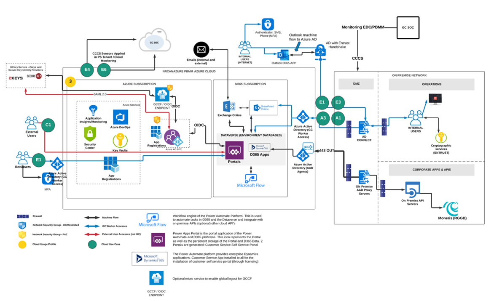

# PREFACE

The Department is undertaking an initiative to provide a secure single sign on service (SSO) by implementing Azure B2C to its subscription services and configure this technology up to a Protected B posture. Azure Active Directory B2C provides business-to-customer identity as a service and is targeted external users and the Department offers several external facing web applications and API’s that require a secure authorization layer for user and machine authentication. Azure B2C has been chosen as the right tool as it provides secure local account identities to get single sign-on access to the Departments web applications and APIs but also provides the necessary support to integrate as a relying party to SAML 2.0 and OpenID Connect (OIDC) identity providers such as the Enterprise Access Broker (EAB) and SignIn Canada (SIC) both of which are OIDC brokers to the GCCF SAML 2.0 Identity Providers (2keys & Verify.Me).  By using this technology, the Department benefits by centralizing its authentication services into a platform that specializes in this domain and benefits from the leveraging the robust Active Directory toolset including conditional access policies, MFA, groups, monitoring for risky users, automated release pipeline integration, App Registration records (SPN’s) to integrate applications. This document will detail the architecture of the Azure B2C implementation and provide the detailed steps to configure and maintain the service.  The illustration below depicts the high-level architecture of Azure B2C and its integration with PowerApps Portals, Web Applications and APIs.

