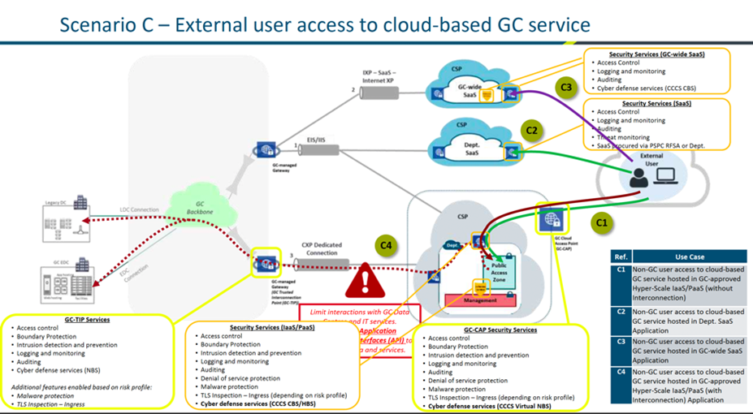

# Scenario C: External User Access to Cloud-Based GC Service

The diagram below depicts an external user accessing Azure B2C indirectly via the internet. The user will access Azure B2C indirectly by first accessing a Web Application that leverages Azure B2C for authentication. This application will redirect the user to Azure B2C for authentication. In the officially approved cloud flow below, this is depicted in use case “C2”: Non-GC user access to cloud-based GC service hosted in Dept. SaaS Application (in this case Azure B2C).

