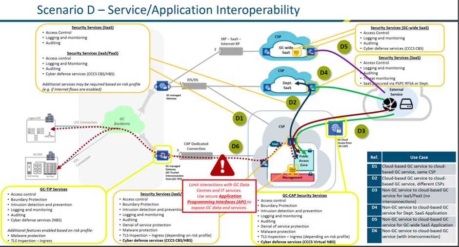

# Scenario D: SERVICE - APPLICATION INTEROPERABILITY

The diagram below depicts an external service (e.g. API) accessing Azure B2C indirectly via the internet. The service will access Azure B2C indirectly by first accessing a department’s service (e.g. API) that leverages Azure B2C for authentication. This application will request a token via OAUTH 2.0 using a Client ID and Secret (or certificate) to perform subsequent http requests over the internet or via trusted channel such as Express Route or Azure AD Application Proxy. In the officially approved cloud flow below, this is depicted in use case “D1”, “D2”, “D4”, “D6”.

