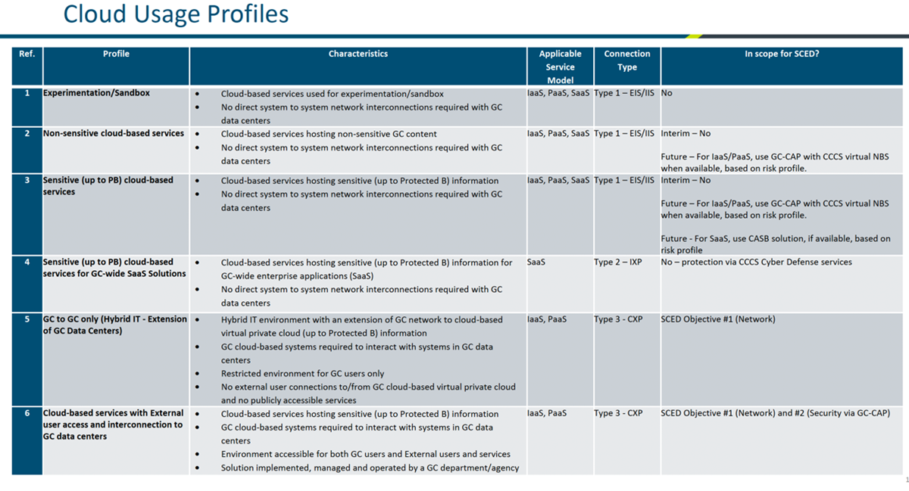

# Scenario E: CLOUD ADMINISTRATION AND MANAGEMENT TRAFFIC

The diagram below depicts how a GC Administrator would access the Azure B2C service’s administrative console. Since Azure B2C is a SAAS application, use case E2 applies to this implementation. 

The table below describes the official GoC cloud usage profiles. These are meant to characterize the different types of use cases for cloud and whether they apply to SCED. The profiles 1 and 2 apply to Azure B2C’s development environment whereas profile 4 is applicable to the production Azure B2C implementation.  Even though, Azure B2C serves as an authentication mechanism for both cloud and on-premises applications, since the connection to this services leverages OpenID Connect, the entire flow happens over HTTP/TLS from a client’s browser to the B2C and back. In terms of machine-to-machine flows (APIs), Azure B2C serves an OAUTH 2.0 endpoint to obtain tokens for API calls (bearer tokens). Tokens can only be generated by trusted applications who are awarded an App Registration with a secret or certificate. The API must perform HTTP requests once they’ve received a token from the OAUTH endpoint by passing a ClientID, Secret (or Certificate), TenantID, and Reply URI (unique identifier) in its payload. 

