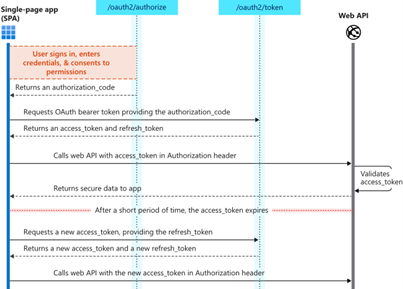

# SINGLE PAGE WEB APPS (SPA)

In the event the organization integrates an SPA with Azure B2C, a token needs to be generated and returned to the client to perform API calls using JavaScript. SPA’s (without a server side renderer like NextJS) will need to perform API calls to the web API that performs CRUD operations to the server application that governs requests to some persistent store like a database or no SQL database or example, because an SPA architecture means that the entire application is rendered to the client browser and therefore all application interactions happen in the browser using the DOM or Shadow DOM (e.g. React JS). Unlike client-server applications, an SPA wont perform server requests each time a user clicks on a link or navigates to another route, therefore, in the event that the SPA also implements authentication, the SPA must use JavaScript to call Azure B2C (via the Graph API). This means that in the JavaScript request, the SPA will need to pass a bearer token which it receives via the oauth2 endpoint and then uses that token to make authorized requests to the server without having to reload the page. These tokens are short lived to minimize the risk of someone hijacking the token to make malicious requests. This journey is demonstrated in the sequence diagram below:

