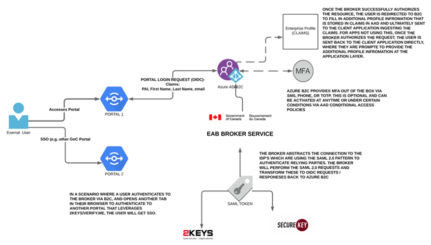

# IMPLEMENTATION ARCHITECTURE COMPONENTS

This section describes the Department’s specific implementation of Azure B2C. More specifically, the Department will be integrating with the official Government of Canada’s GCCF service which is SAML 2.0 based with a OAUTH Broker to support more modern applications and libraries.  Furthermore, the Department will be leveraging PowerApps Portals for its external facing portal services and is leveraging Azure B2C as its authentication mechanism. The Department wishes to use Azure B2C for not only PowerApps but potentially other web applications that require authentication in order to take advantage of creating a single profile for its external user base and facilitate monitoring, administration, reporting and enhance security by standardizing to one authorization platform rather than having multiple portals implement their own authentication systems or patterns which can be prone to security vulnerabilities and costly to maintain/upgrade. The Department is also hoping to continue its effort to minimize IAAS in favor for SAAS applications that can operate at Protected B and therefore minimize the complexities associated with hosting complex infrastructures and maintain servers and or containers to ensure that the latest security patches and other OS artefacts are up to date. By leveraging SAAS, the Department can focus on the application layer, encryption, and enforcing OIDC / OAUTH norms across the organization while providing a better user experience to its clients who will no longer need to maintain multiple sets of credentials to interact with Departmental services. 
The diagram below depicts, at a high level, how one or more web applications would interface with Azure B2C and in turn, how Azure B2C would then broker the authentication requests (login and logoff) to the Government of Canada’s Identity Provider services (2Keys-GCKey & Verify.Me -> partner credentials (banks)).

