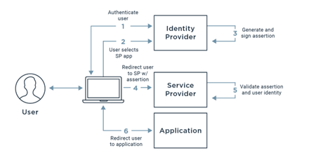
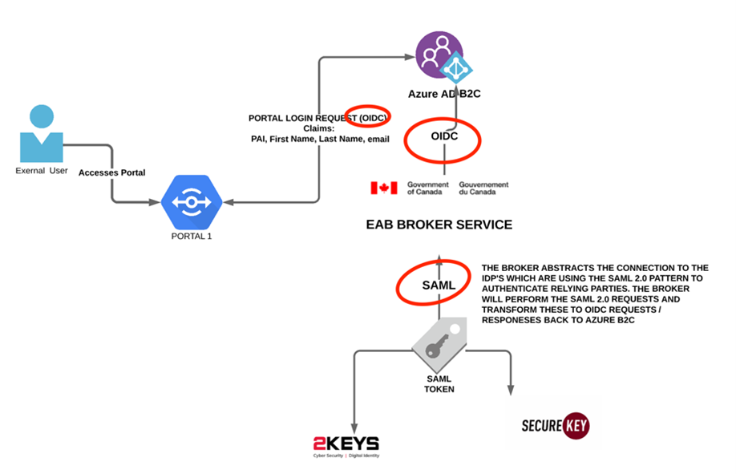

# OPENID CONNECT & SAML 2.0

The GOC Identity Providers GCKey and Verify.Me (formerly SecureKey) that are ran by the Canadian company “Interac” provide a SAML 2.0 authentication pattern. SAML 2.0. Security Assertion Markup Language (SAML) is a login standard that helps users access applications based on sessions in another context, in other words, allowing applications to offload their authentication to another service rather than implementing their own user name and password (or similar) pattern directly within their own application. This pattern allows for single sign on whereby users can reuse the same set of credentials across multiple applications in a secure way using XML and RSA certificates issued by a trusted CA on both sides (application and identity provider).  SAML authenticates users by redirecting the user’s browser to either the GCKey or Verify.Me (or chosen bank) login page, then after successful authentication on that login page, redirecting the user’s browser back to the integrated web app where they are granted access. The key to SAML is browser redirects. 

The diagram below depicts the typical user authorization flow that SAML 2.0 provides to applications:

 There are three key artefacts that make up the SAML architecture:

* **Identity Provider (IdP)** - The software tool or service (often visualized by a login page and/or dashboard) that performs the authentication, checking usernames and passwords, verifying account status, invoking two-factor, etc. This is GCKey and Verify.Me.
* **Service Provider (SP)** - The web application where user is trying to gain access. This is the Department’s web application (e.g. PowerApps Portals, or Broker service such as EAB or SIC.
* **SAML Assertion** - A message asserting a user’s identity and often other attributes, sent over HTTP via browser redirects. This is the primary artefact that generates / persists the session.

The issue with SAML is that it is less commonly used in modern applications today as its more complex to implement, and a newer and more streamlined and simplified pattern OAUTH 2.0 has become the norm and standard in the industry. 

However, both the IDPs still only support SAML 2.0. As a result, SSC and TBS have developed OIDC Broker services that abstract the need to implement a SAML Service Provider for web applications. Although Azure B2C does support SAML, it requires a non-trivial customization using custom policies. Furthermore, both IDPs only support the SOAP binding for logout in SAML which is no longer being used by not only B2C but many (most) other SAML supported platforms.  As a result, if the Department were to connect to the IDPs using AB2C directly, they would not be able to implement the back channel single logout pattern implemented by the IDPs as B2C will only support single logout via the redirect binding (so browser based only, not SOAP). Therefore, the Department would not be fully compliant with the GOC’s CATS 2.0 standards and would need to seek an exemption to leverage AB2C. There are ways to implement the SOAP binding and integrate this custom service with AB2C but this would add additional complexity to the architecture and require additional maintenance and niche knowledge. 

SSC and TBS is aware of the emerging industry standards and therefore have developed an OIDC broker service that handles the connection to the IDPs via SAML and provides an OIDC interface to the Department and therefore AB2C will interface indirectly with the IDPs using OIDC rather than SAML and therefore is only responsible to meet the CATS 3.0 requirements which map to the official OIDC specifications which AB2C is fully compliant with.
 
This broker service / SAML abstracted is illustrated below:

