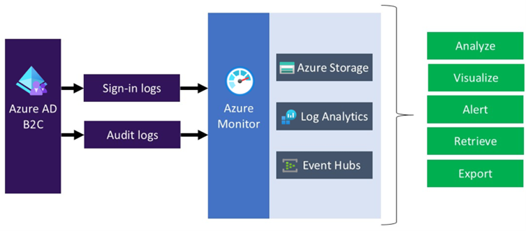
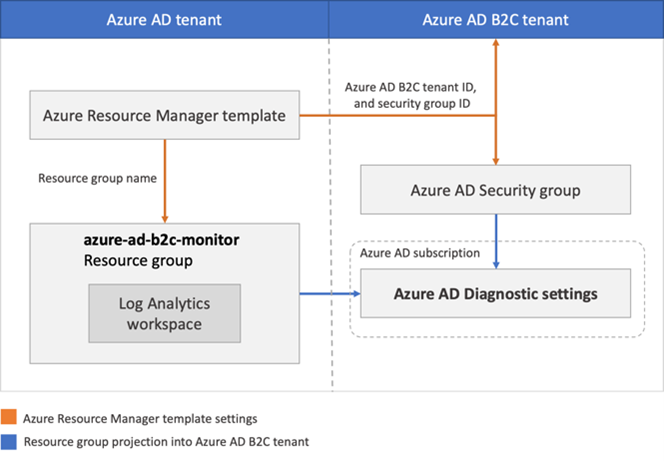
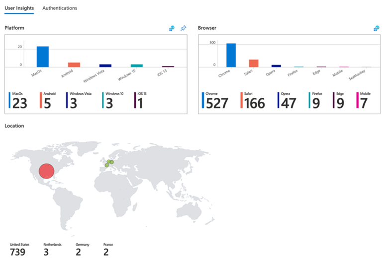
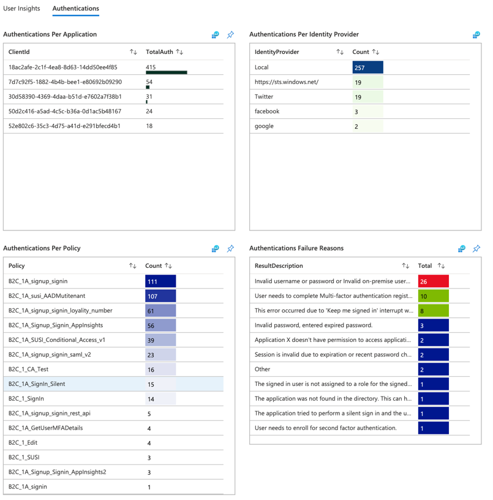
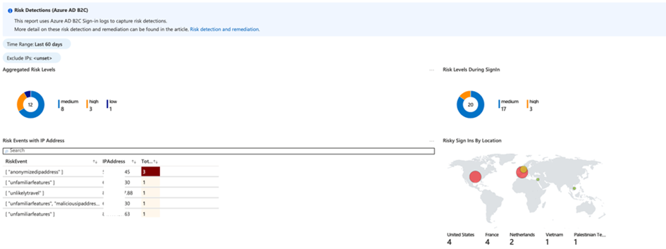
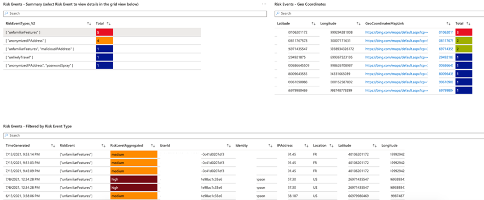

# MONITORING

AB2C provides extensions for both Azure Monitor to route sign in and auditing logs to the SIEM for longer retention or integrate with security information and event management (SIEM) tool (e.g. Sentinel) to gain more granular insights into the B2C implementation. To route log events, Azure Storage, a Log Analytics Workspace and Event Hub services are used. Most of these services get auto generated by the ARM template (provided in references). 

Once the monitoring is configured, the user insights and authentication visual will demonstrate which usage by country, browser, app (portals), by identity provider, by policy (e.g EAB, SIC, Local), and Failures with Reason codes. This provides the Department with a generalized overview of the overall behavior and key metrics for AB2C.

In addition to the common metrics for the overall health and access telemetry of AB2C, the Risk Detection is another report to be implemented that uses Azure AD B2C Sign-in logs to capture risk detections. 

The dashboards / reports will provide the following data and visualizations

* Aggregated Risk Levels
* Risks Levels during SignIn
* Risk Levels by Region
* Risk Events by IP Address (Filterable)
* Risk Events by Type (Filterable)
* Risk Events Details (based on selected Risk Type)
* Risk Events by Geo Coordinates (Filterable)
* Risks Events Over Time

By default, the risk detection criteria’s include the following:

* Anonymous IP address use
* Atypical travel
* Malware linked IP address
* Unfamiliar sign-in properties
* Leaked credentials
* Password spray

