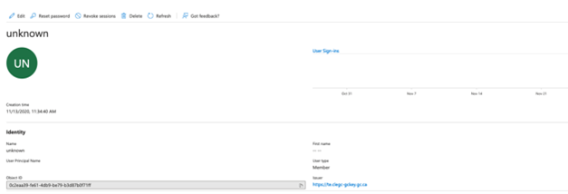
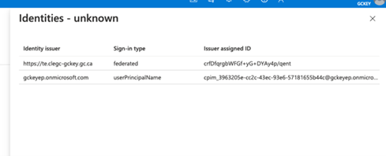
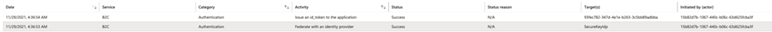
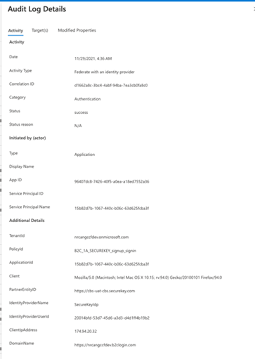
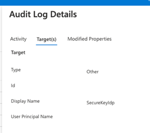

# AUDITING

The information in B2C is limited to the user’s object ID (Azure generated ID) and details about the GCCF Identity Provider coupled with any additional claim information configured for the Enterprise Profile (first name, last name, and email).  Audit logs are retained for 7 days, however this can be extended by leveraging Azure Monitor and Application Insights to extend beyond this period.

**FIGURE 9: B2C USER TRACKING - USER OBJECT**

As illustrated in the capture below, GCCF only provides the SAML 2.0 issued Token that uniquely identifies the user which is stored in B2C’s Issuer ID field (Claim). B2C will also capture the source of the identity provider being either 2keys (te.clegc-gckey.gc.ca [TEST], clegc-gckey.gc.ca [PROD]) or Verified.Me (cbs-uat-cbs.securekey.com [TEST], cbs.securekey.com [PROD])

**FIGURE 10: USER OBJECT LOGIN IDENTITY ISSUER (GCCF IDENTITY PROVIDER CHOSEN)**

Subsequent logins from the SAML 2.0 federated user is tracked in the B2C audit logs. 

**FIGURE 11: B2C USER LOGIN AUDIT LOG**

There are two key events stored, one for successful SAML 2.0 Federation with the Identity provider which provides useful metrics such as the user’s location, browser, his/her SPN, which IDP they authenticated to as well as the date and time for the authentication. See below capture of this log in DEPARTMENT’s B2C TE environment.

**FIGURE 12: B2C USER LOGIN - AUDIT DETAILED VIEW**

*Modified Properties always blank as GCCF does not map to any property.

**FIGURE 13: TARGET IDP DETAIL**

The second log is the information around the issuance of a Token to the client Application, in this case PowerApps Portals. The log provides the same metrics as the previous log captured above however outlines the target application (AAD App Registration Record):

**FIGURE 14: B2C AUDIT LOG DETAIL - POWERAPPS REGISTRATION RECORD**