# PROVISIONING AZURE B2C

* Sign into the Azure portal as GA.
* Switch to the directory that contains the primary subscription (or a Dev subscription preferably). The directory should be on the domain that is connected to the on premise active directory so that B2C configurators leverage their federated accounts instead of cloud only domain accounts (optional-this can be done using your .onmicrosoft.com identity).

Once in signed into the Azure subscription as Global Administrator or Subscription Owner, select “Create Resource” 

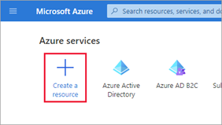

Search for Azure Active Directory B2C, press Enter and select “Create”

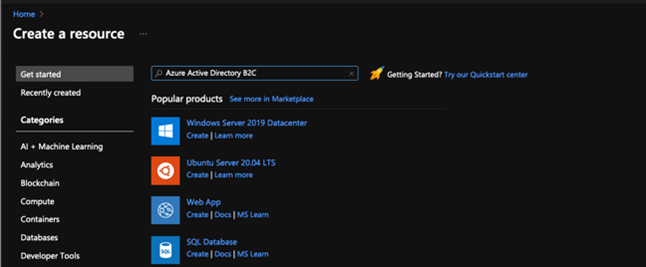

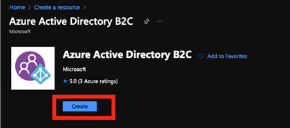

In the Create blade, click on “Create a new Azure AD B2C Tenant” 

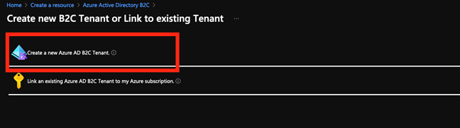

In the following step, enter {ENVIRONMENT}b2cdev for both the organization name and initial domain name (which will be the subdomain) and fill in the country, subscription, resource group and resource group region

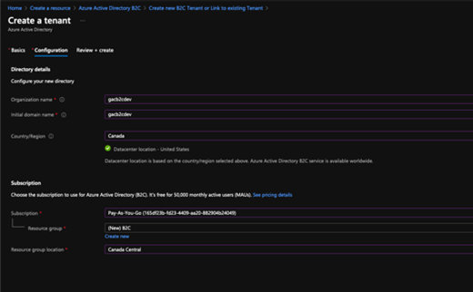

Click on Review and Create and if Validation has passed click on Create. 

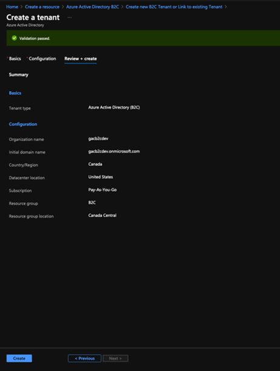

Once created, add additional B2C administrators as Global Administrators to this new B2C environment.

To do so, click on your profile in the top right, and select switch directory, and switch to the new Azure B2C directory just created

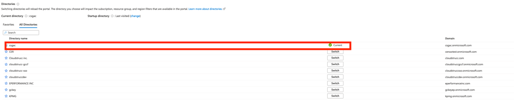

Once you are in the new directory search for Azure AD B2C

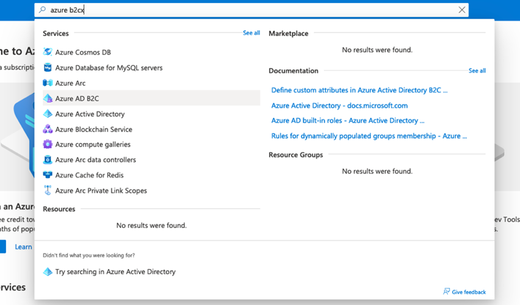

Select Users from the Menu Blade

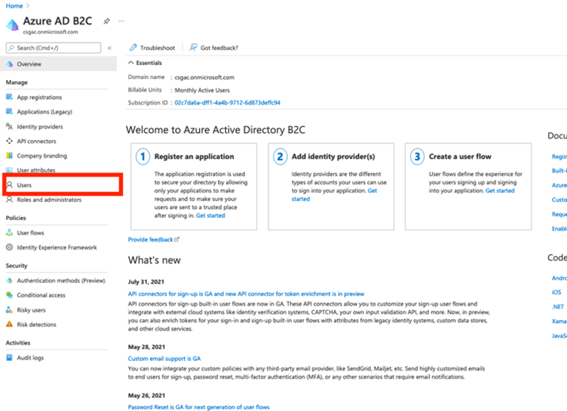

Select New User

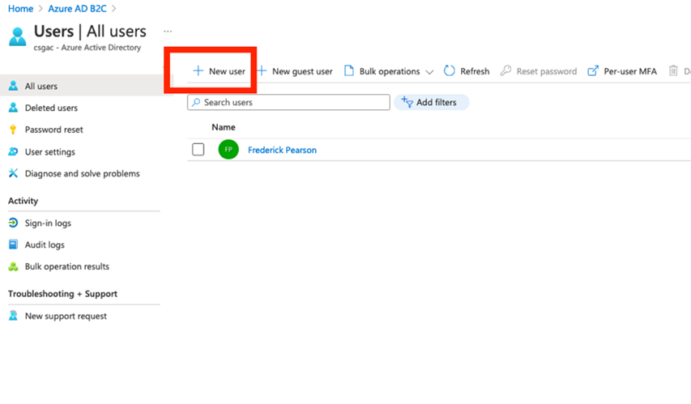

Select “Invite User”, enter the name and email, click on Role “user” and select “Global Administrator” **(note this only applies Global Admin rights to the newly created Dev B2C tenant) and press select. Once completed, press “Invite”.**

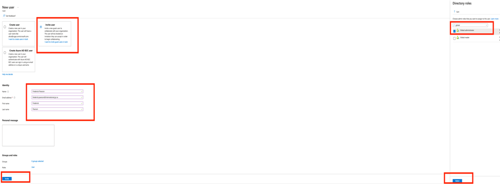

