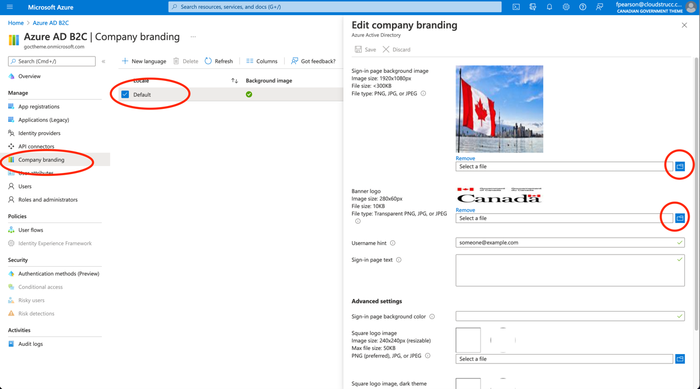

# CONFIGURING THE AZURE B2C THEME (TENANT WIDE)

Select “Company Branding” and choose the Default brand. In the modal, upload the Government of Canada JPEG to the Sign-in page background image and the Canada logo under the Banner logo file upload.

