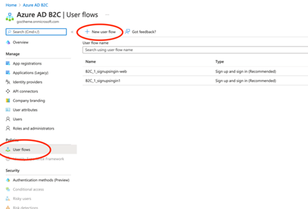
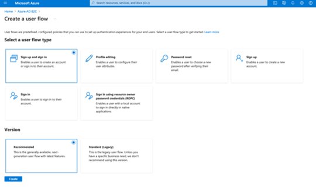
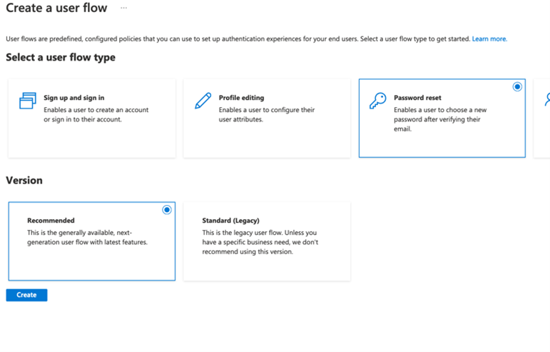

# CONFIGURING A STANDALONE USER FLOW FOR LOCAL AUTHENTICATION (WITHOUT LEVERAGING A THIRD PARTY IDP LIKE EAB OR SIC)

Select User Flows, and click on New user flow

Next, select Sing up and sign in and the recommended tile under “Version”

Select Email Signup, TOTP, and Conditional for MFA enforcement (policies to be defined in a later section). For user attributes, select Email Address, Given Name and Surname, press Ok and Create

Once created, navigate to the newly created user flow and click on properties. Ensure to check “Require ID Token in Logout Requests”. 

Next, create a profile and password reset policy.

***Apply the same settings from the Sign up and sign in user flow for both policies. For the Password reset policy ensure that the Reset password using email address option is checked.**

