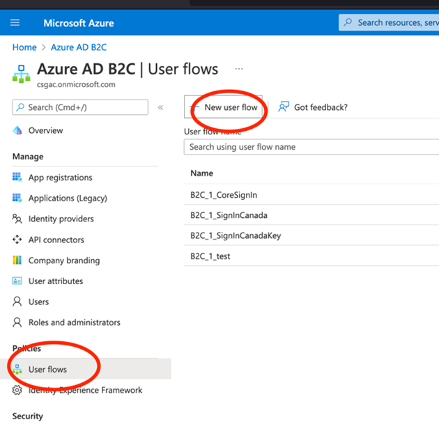
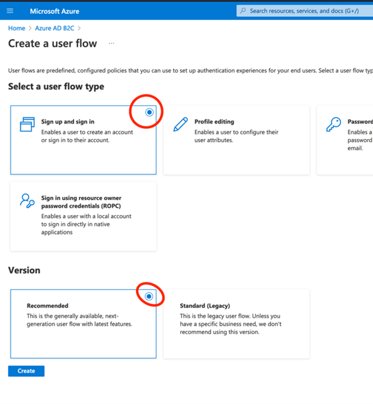
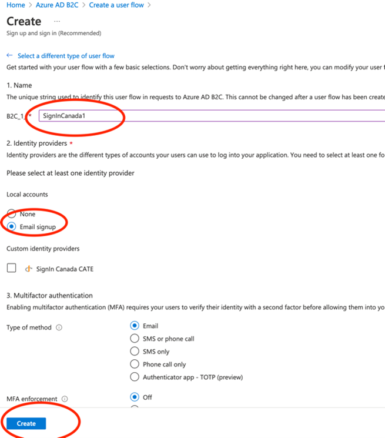
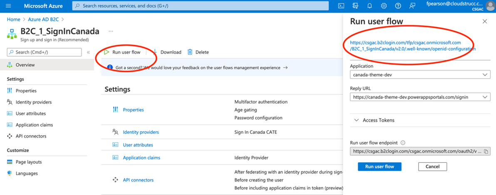
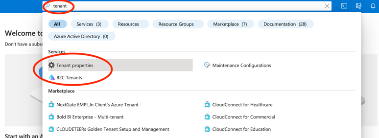
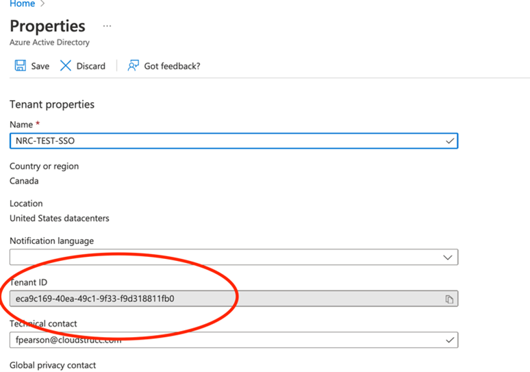

# CREATING A USER FLOW - 1

Select User Flows, and Create a new user flow with the following configurations

In the Name field enter SignInCanada-CATE (or something that clearly identifies the service), select “None” for the Local Accounts, and Check “SignIn Canada CATE” (the identity provider created in the previous step) and leave everything else as default and press “Create”

Once created click on “Run User Flow” and copy the Metadata URL as you will need to send this to the SignIn Canada mailbox in your request to onboard to their test service. 

Next, locate your Azure B2C TenantID and copy this value in preparation for your request.

Once the user flow created and metadata ready you can send the request to SignIn Canada by sending an encrypted email to Signin-AuthentiCanada@tbs-sct.gc.ca. 

**Example email (must be sent by an official Government email that can accept encrypted email – Entrust CA)**

We would like to onboard to the SignIn Canada’s CATE environment, the information you require is provided below:

Our tenant ID is **{GUID of Azure B2C’s tenant ID}**

Our Metadata URL:  
**Error! Hyperlink reference not valid.**  

Our Redirect URL: **Error! Hyperlink reference not valid.**

Please provide the information required for configuration of your service in Azure B2C.

SIC will respond by providing you with the information you need to configure the service which will include their metadata information, configuration options and a client ID and Secret. At which point you can proceed to the next steps.

Once you’ve received the response, navigate to the Identity Provider menu blade, and select the SignIn Canada identity provider and update the ClientID and Secret values you’ve received from SIC:

