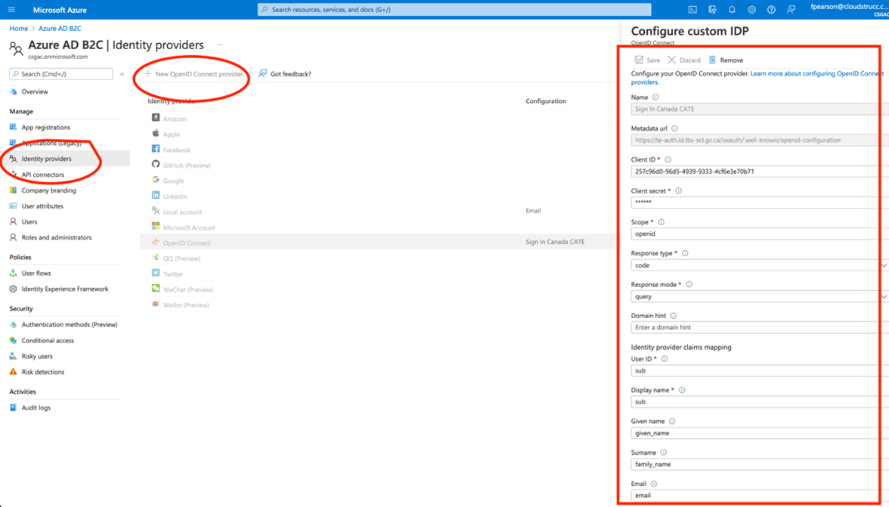

# CREATE A NEW IDENTITY PROVIDER - 2

Navigate to the Identity Provider menu blade, and select “New Open ID Connect Provider” and enter the following metadata:

**Name**: Sign In Canada CATE

**Metadata URL**: https://te-auth.id.tbs-sct.gc.ca/oxauth/.well-known/openid-configuration

**ClientID**: {CLIENTID} - ENTER ANY STRING FOR NOW. THIS VALUE WILL BE UPDATED LATER ONCE YOU RECEIVE FROM SIC

**Client secret**: {CLIENTSECRET} - - ENTER ANY STRING FOR NOW. THIS VALUE WILL BE UPDATED LATER ONCE YOU RECEIVE FROM SIC

**Scope**: openid

**Response Type**: code

**Response Mode**: query 

**User ID**: sub

**Display Name**: sub
