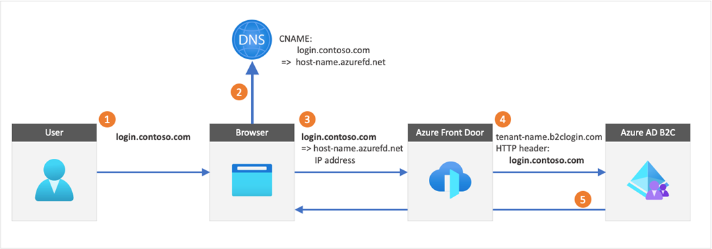
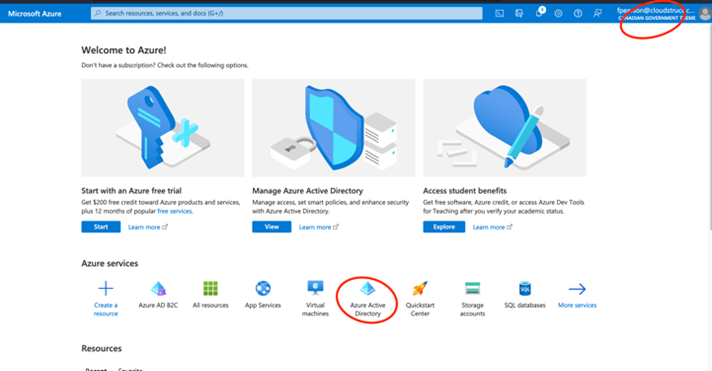
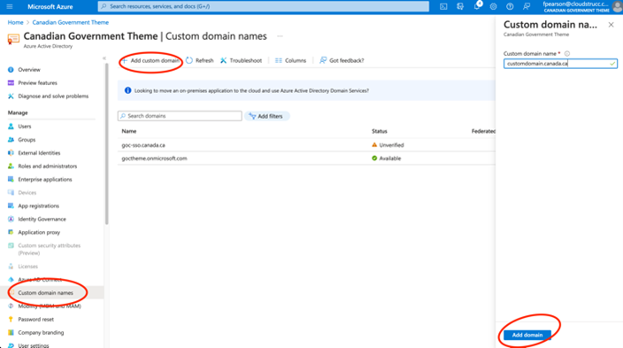
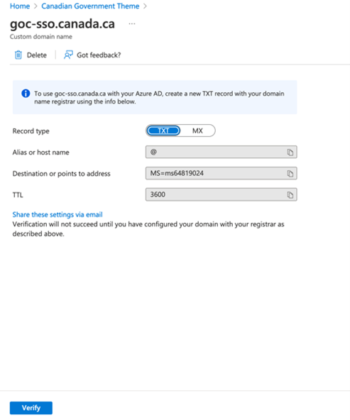

# Configure custom domain and force tls 1.2 – azure front door

The following section describes how to configure a custom domain in Azure B2C using AFD. AFD is also required to force TLS 1.2 flows to Azure B2C to meet the GOC guardrail. The illustration below depicts the integration between B2C and AFD

Step 1: Add custom domain to Azure Active Directory (within the B2C tenant)

Once added, send the TXT record to the Canada.ca DNS. The request should read:

Type: TXT, Host: mydomain.canada.ca, TXT: MS-ms658…, TTL 3600. 

Once actioned, you can press verify and proceed to next steps. ***NOTE, once verified, SSC needs to delete the TXT entry as this domain will be configured as CNAME in a subsequent request.**
