# Onboarding a PowerApps portal

**Step 1 (Client):** The PowerApps developer will need to provide you with a “Redirect URL”. To do so they must go to the https://make.powerapps.com, select the environment for which they would like to leverage SignIn Canada, select the portal authentication settings and press “Add Provider”, select Other, and choose “OIDC Provider”. Once the modal is displayed, PowerApps generates a “Redirect URL” and before they can configure your service, they will need to email you this URL. In addition to this URL, the client should also provide you with the logout URL fo their portal. By default this should always be (for portals without a custom domain): Error! Hyperlink reference not valid..  Alternatively, if you already know the portal URL, you can create the app registration record in advance and enter any redirect URI using the following convention and provide the details to the developer to configure in PowerApps. Otherwise, the developer will be responsible to provide you with the Redirect URI.

To obtain the Redirect URI directly from PowerApps, the developer can follow these steps:

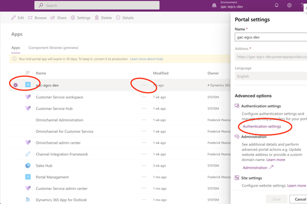

Select “Add Provider” and enter the following details in the Wizard

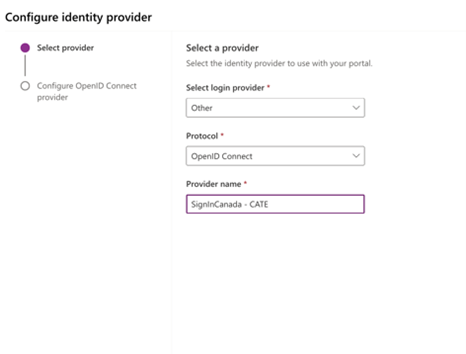

Copy the “Reply URL” and send to the AzureB2C Administrator to obtain the OIDC data you need to finish the configuration

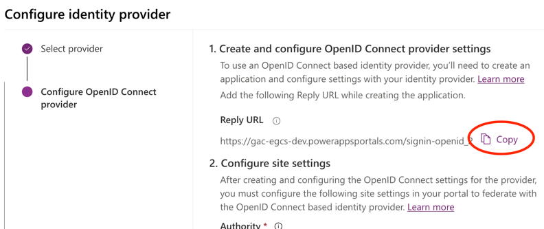

The PowerApps developer will resume the configuration once you’ve provided them with the App Registration information. 

**Step 2 (App Registration) – completed by AzureB2C administrator:** Once you receive the Reply URL, navigation to the App Registrations Blade and create a new App Registration. The naming convention is at your organization’s discretion, but in this example the convention is simply the sub-domain of the PowerApps Portal being on boarded. ***Please note that the PowerAppsPortals.com domain is typically not used in Production. Therefore, the same client may request you to add additional redirect URLs in the Authentication blade within the App Registration record in the future once SSC enters the DNS entry for their Portal in the Canada.ca DNS.***

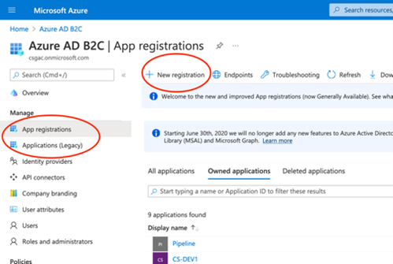

Press “Register”

Next, in the “Authentication” Blade, enter the front channel logout URL which is always the portal URL with /Account/Login/LogOff (for PowerApps). Make sure to select “Access Tokens” and press save.

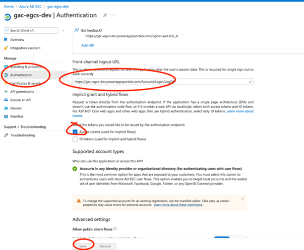

Next click on “Certificates and Secrets” and generate a secret and copy the secret to your clipboard (or somewhere as you will need to send this via encrypted email to the PowerApps Portals developer)

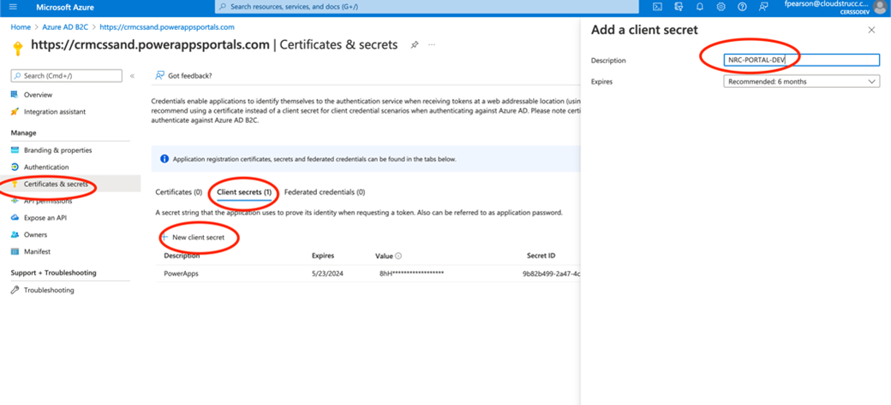

Next click on overview and copy the ClientID.
Send the following information back to the PowerApps Portals developer:
* ClientID 
* Secret
* Metadata:**Error! Hyperlink reference not valid.**  

**Step 3 (Finish configuration – PowerApps):** In your email that includes the ClientID, Secret and Metadata URL to the client, include the following example configuration for the developer to finish the configuration. 

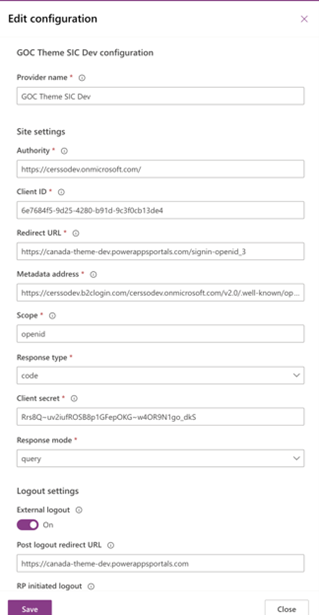

**(Optional) ->** If the PowerApps Portal wants users to automatically be redirected to the SSO service upon navigating to the “SignIn” page, the developer can set the new provider as default

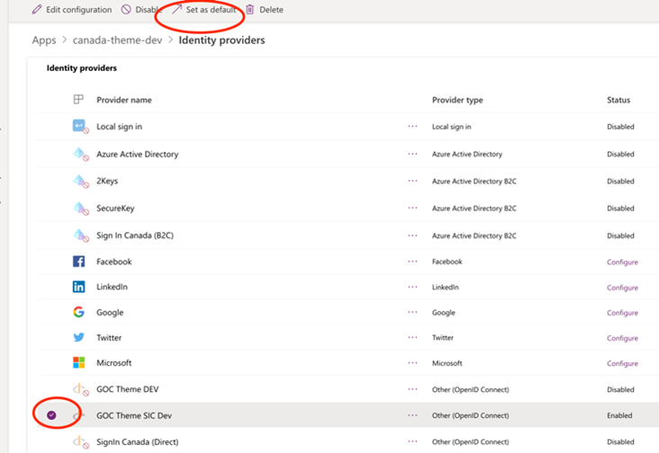

Once completed, you can test by navigating to the integrated portal and invoking the sign in button (or anchor) which will automatically send an authorization request to B2C which in turn will send the request to SIC.

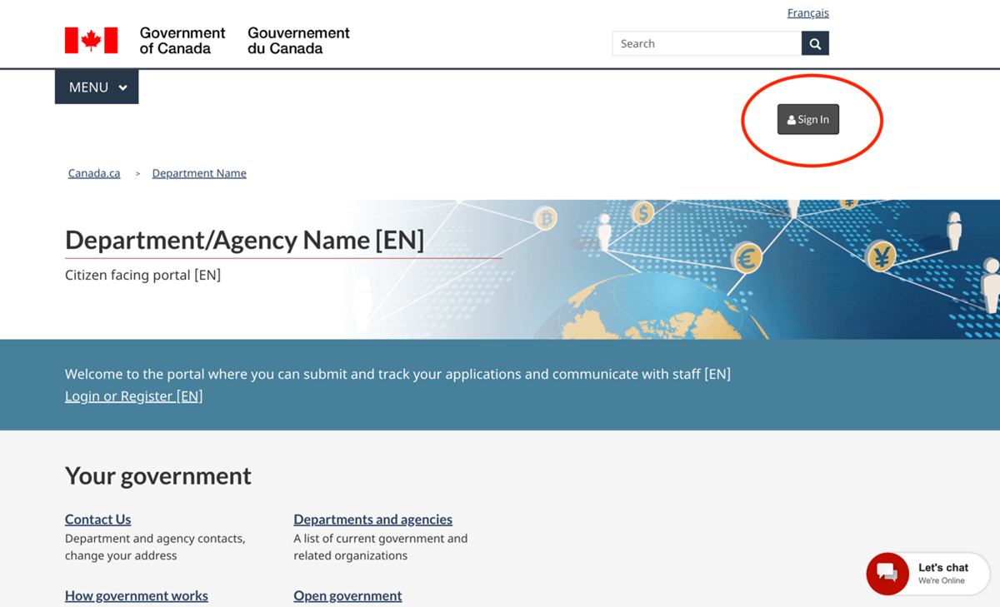

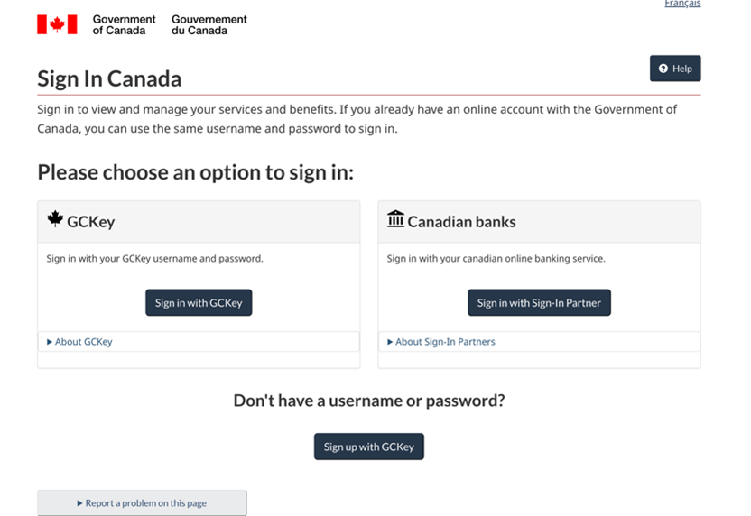

You can then sign up to a GCKey or Sign-In Partner (banks) account, and once successfully signed in, you should be redirected to your portal’s home page if you are an existing portal user. 

***GCKEY Example:***

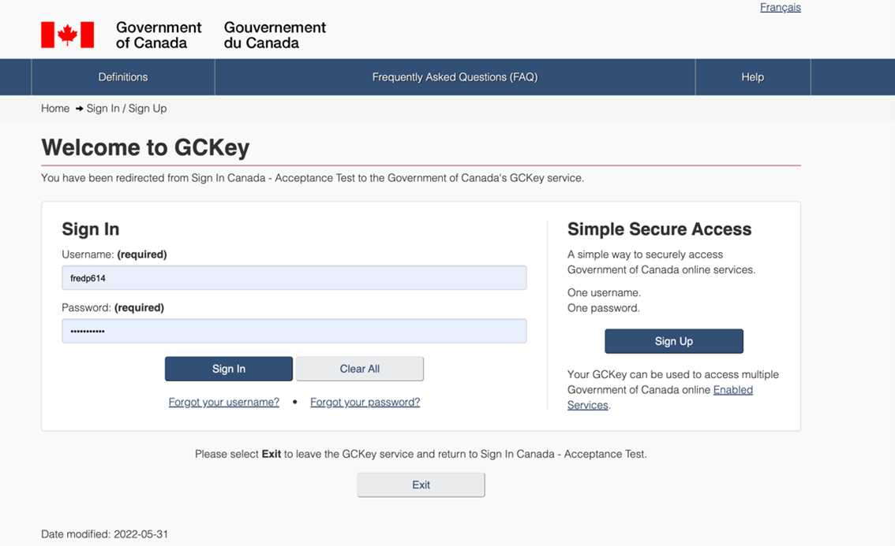

***Canadian Banks Example (recommended during development for ease of use)***

Enter test with an integer suffix (e.g. test12345) and scroll to the bottom of the page and press Login. For a returning user, use the same username (e.g. test12345 in this example) you’ve used as part of the full registration to PowerApps. *When simulating a new PowerApps user registration use a new integer suffix.*

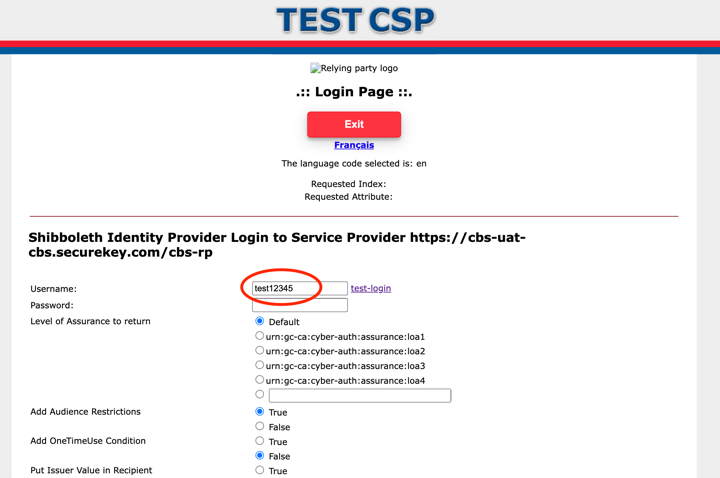

For a new user, you should be prompted to create a profile in the Application as B2C will only send the “Subject-ID” claim to the integrated application which can be leveraged as a unique identifier in the portal application. If a subject-id is not yet associated to a profile in the integrated application, the application should invoke a user journey to create a profile in the application (provided the application requires the use of a profile). Below is what a new user (or new subject-id sent to the app) would invoke in PowerApps Portals (GOC PowerApps Theme)

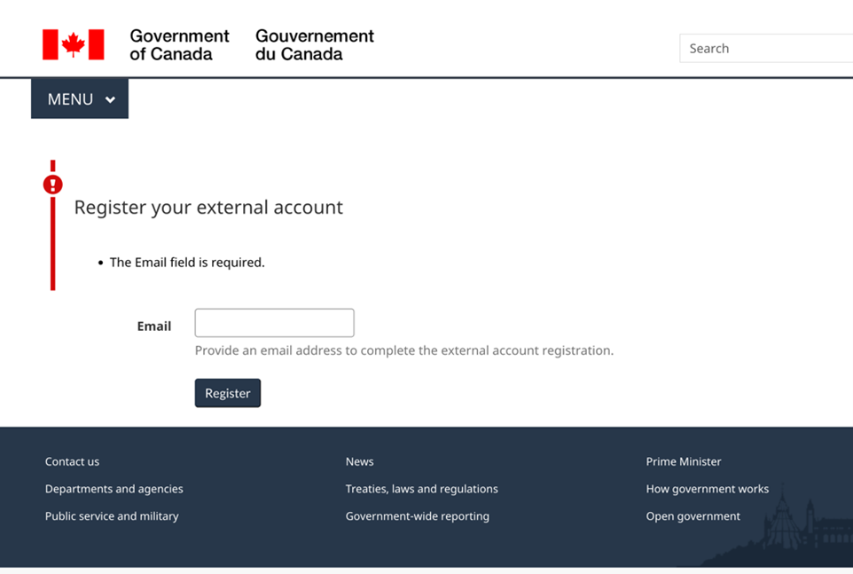

Once the profile is created OR if it’s a returning user, the authenticated home page (or post login redirect) would render. The example below demonstrates the authenticated home page for the GOC PowerApps Theme.

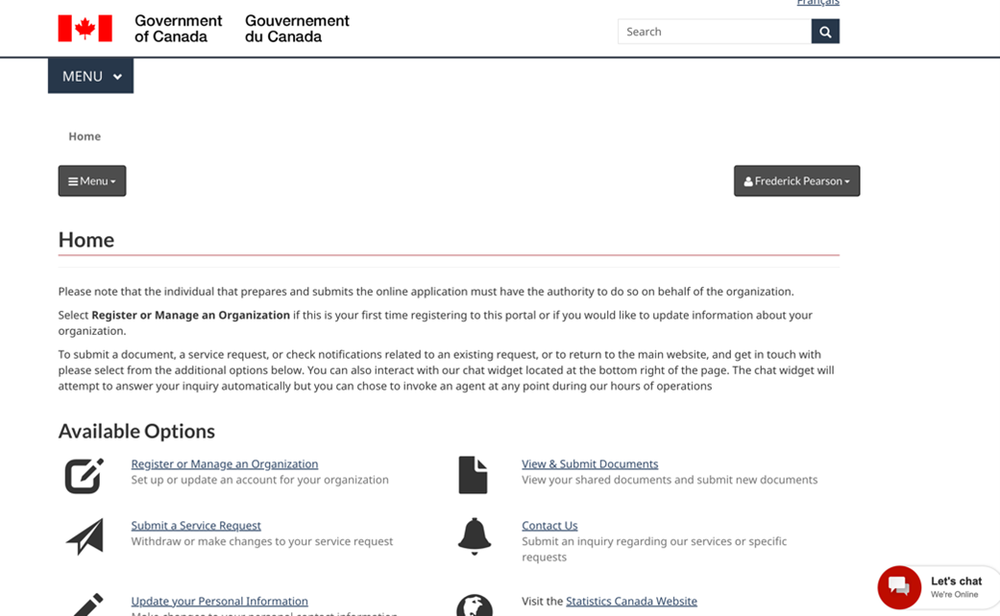

CONFIGURING A WEB API

