# AZURE B2C - SECURE ENTERISE SSO


# DEPARTMENT – AZURE B2C ARCHITECTURE, IMPLEMENTATION & OPERATIONAL GUIDE

### OVERVIEW FOR ENTERPRISE SSO IMLEMENTATION USING AZURE B2C FOR WEB APPS & API’s

######THIS DOCUMENT DESCRIBES THE AZURE B2C AND THE PROCESS FOR IMPLEMENTING AND OPERATIONALIZING AZURE B2C FOR SECURE SINGLE SIGN ON FOR PORTALS AND API AUTHORIZATION. THE GUIDE DESCRIBES LEVERAGING B2C FOR MULTIPLE PLATFORMS INCLUDING POWERAPPS PORTALS, .NET CORE, .NET FRAMEWORK, AND NODE.JS USING OPENID CONNECT (WEB APPS SSO) AND OAUTH 2.0 (API’S). IT WILL ALSO DEMONSTRATE HOW B2C CAN BE LEVERAGED TO INTEGRATE WITH THE GOVERNMENT OF CANADA’S SSO PLATFORMS (ENTERPRISE AUTHORIZATION BROKER (EAB), AND SIGNIN CANADA (SIC)) AND PLUS IMPLEMENTING A STANDALONE SSO & ENTERPRISE PROFILE SO THAT THE DEPARTMENT CAN CENTRALIZE EXTERNAL USER DATA VIA AZURE AD CLAIMS FOR INTEGRATED APPS TO CONSUME. BY LEVERAGING AN ENTERPRISE SSO, CLIENTS CAN LEVERAGE A SINGLE SET OF CREDENTIALS TO ACCESS ANY EXTERNAL FACING APPLICATION AND SINCE B2C PROVIDES AN OIDC LAYER WITH AZURE AD – THE DEPARTMENT CAN IMPLEMENT CONDITIONAL ACCESS POLICIES (CAP), MFA AND OTHER SECURITY FEATURES WITH THE GOAL TO ADHERE TO ITSG 33/ISO STANDARDS. FINALLY, THIS DOCUMENT WILL OUTLINE THE RECOMMENDED GUARDRAILS TO ACHIEVE A PROTECTED B POSTURE AND DESCRIBE THE ALM PROCESS TO GOVERN DEPLOYMENTS AND CHANGES TO AZURE B2C VIA AZURE PIPELINES (AND WILL ALSO DEMONSTRATE MANUAL DEPLOYMENTS).

## PREFACE

The Department is undertaking an initiative to provide a secure single sign on service (SSO) by implementing Azure B2C to its subscription services and configure this technology up to a Protected B posture. Azure Active Directory B2C provides business-to-customer identity as a service and is targeted external users and the Department offers several external facing web applications and API’s that require a secure authorization layer for user and machine authentication. Azure B2C has been chosen as the right tool as it provides secure local account identities to get single sign-on access to the Departments web applications and APIs but also provides the necessary support to integrate as a relying party to SAML 2.0 and OpenID Connect (OIDC) identity providers such as the Enterprise Access Broker (EAB) and SignIn Canada (SIC) both of which are OIDC brokers to the GCCF SAML 2.0 Identity Providers (2keys & Verify.Me).  By using this technology, the Department benefits by centralizing its authentication services into a platform that specializes in this domain and benefits from the leveraging the robust Active Directory toolset including conditional access policies, MFA, groups, monitoring for risky users, automated release pipeline integration, App Registration records (SPN’s) to integrate applications. This document will detail the architecture of the Azure B2C implementation and provide the detailed steps to configure and maintain the service.  The illustration below depicts the high-level architecture of Azure B2C and its integration with PowerApps Portals, Web Applications and APIs.

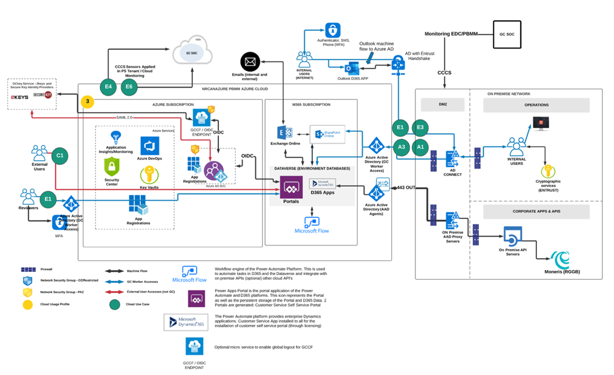

# ALIGNMENT TO TBS CLOUD USAGE PROFILES AND CONNECTION PATTERS

This section describes AzureB2C’s adherence and mapping to the TBS cloud usage profiles and connection patterns. The Government of Canada has a suite of recommendations and hard requirements for implementing cloud systems that host Protected B data or perhaps has inter-connectivity with the data centres hosting Protected B data. Azure B2C is considered a SAAS based technology and therefore, only a subset of the usage profiles and connection patterns will apply to this technology. The entire list of scenarios is outlined below, and the ones that apply to Azure B2C are highlighted below and further described in context of B2C in the following section.
|Reference | Scenario (connection pattern)| Description|
|---|---|---|
|A|GC user access to cloud-based service from GC network| A GC worker accessing a cloud-based GC service on the GC network.|
|B|GC user access to cloud-based service from Internet | A GC worker accessing a cloud-based GC service from outside the GC network over the public Internet. |
|C| External user access to cloud-based service |  A non-GC external user accessing a cloud-based GC service from outside the GC network.|
|D| Service/Application Interoperability | Service and application communications with cloud-based GC services. |
|E| Cloud Administration and Management Traffic | Management of cloud-based components and support for Network Operations Center (NOC) and Security Operations Center (SOC) activities.|

## Scenario C: External User Access to Cloud-Based GC Service

The diagram below depicts an external user accessing Azure B2C indirectly via the internet. The user will access Azure B2C indirectly by first accessing a Web Application that leverages Azure B2C for authentication. This application will redirect the user to Azure B2C for authentication. In the officially approved cloud flow below, this is depicted in use case “C2”: Non-GC user access to cloud-based GC service hosted in Dept. SaaS Application (in this case Azure B2C).

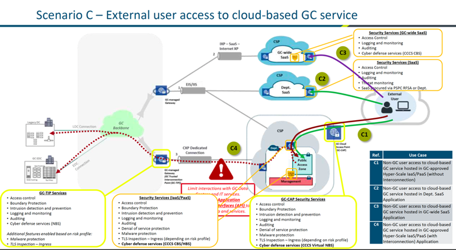

## Scenario D: SERVICE - APPLICATION INTEROPERABILITY

The diagram below depicts an external service (e.g. API) accessing Azure B2C indirectly via the internet. The service will access Azure B2C indirectly by first accessing a department’s service (e.g. API) that leverages Azure B2C for authentication. This application will request a token via OAUTH 2.0 using a Client ID and Secret (or certificate) to perform subsequent http requests over the internet or via trusted channel such as Express Route or Azure AD Application Proxy. In the officially approved cloud flow below, this is depicted in use case “D1”, “D2”, “D4”, “D6”.

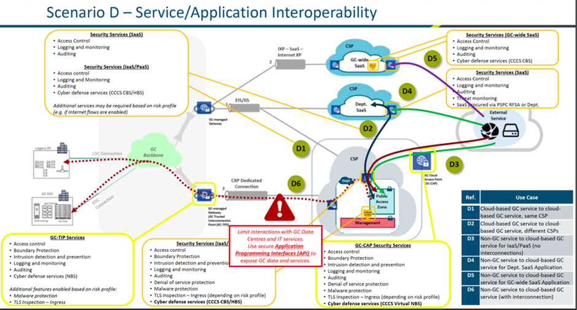

## Scenario E: CLOUD ADMINISTRATION AND MANAGEMENT TRAFFIC

The diagram below depicts how a GC Administrator would access the Azure B2C service’s administrative console. Since Azure B2C is a SAAS application, use case E2 applies to this implementation. 

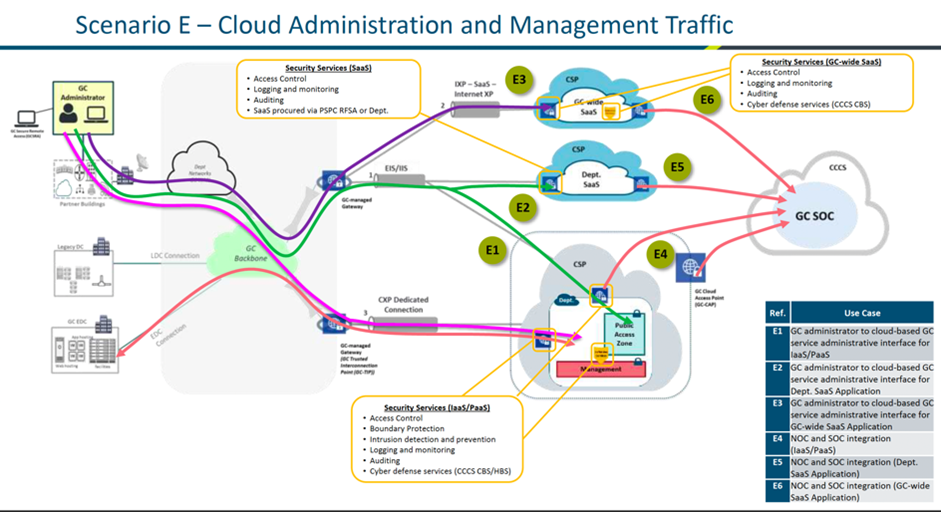

The table below describes the official GoC cloud usage profiles. These are meant to characterize the different types of use cases for cloud and whether they apply to SCED. The profiles 1 and 2 apply to Azure B2C’s development environment whereas profile 4 is applicable to the production Azure B2C implementation.  Even though, Azure B2C serves as an authentication mechanism for both cloud and on-premises applications, since the connection to this services leverages OpenID Connect, the entire flow happens over HTTP/TLS from a client’s browser to the B2C and back. In terms of machine-to-machine flows (APIs), Azure B2C serves an OAUTH 2.0 endpoint to obtain tokens for API calls (bearer tokens). Tokens can only be generated by trusted applications who are awarded an App Registration with a secret or certificate. The API must perform HTTP requests once they’ve received a token from the OAUTH endpoint by passing a ClientID, Secret (or Certificate), TenantID, and Reply URI (unique identifier) in its payload. 

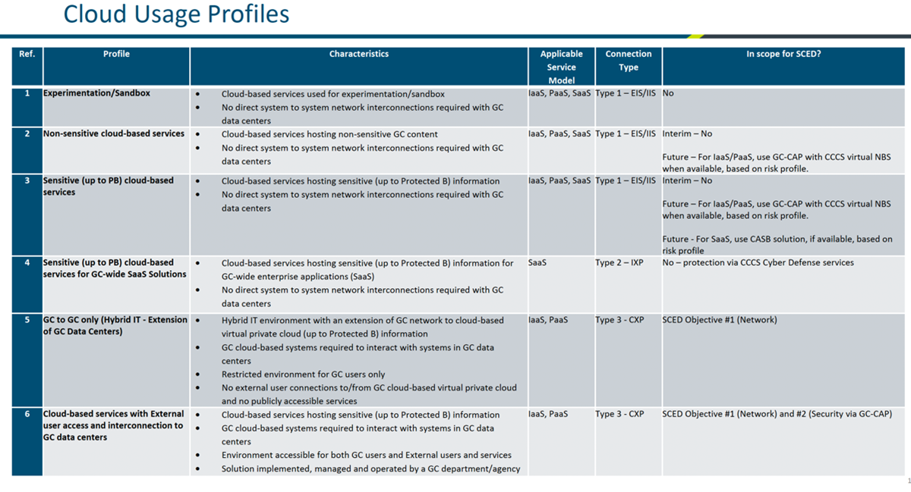

# AZURE B2C CONNECTION PATTERNS – MICROSOFT

This section describes and illustrates the relevant connection patterns that Azure B2C supports out of the box. These patterns are officially supported by Microsoft; however, the Department does have additional flexibility to extend and go beyond the boundaries of these patterns. However, it is recommended that the Department does not deviate or attempt to significantly customize and extend Azure B2C’s capabilities and instead leverage its OOB features and where limitations are found, attempt to refactor the connecting application to integrate with B2C in a native fashion. This is important because Azure B2C has implemented the OpenID Connect and OAUTH 2.0 specifications and, especially, for web portal authentication, following the OIDC specifications is key to ensuring that security standards are met to avoid any potential pitfalls associated with non-standard ways to integrate with the platform.  

## Web Applications

For web applications (including .NET, PHP, Java, Ruby, Python, and Node.js) that are hosted on a server and accessed through a browser, Azure AD B2C supports OpenID Connect for all user experiences. In the Azure AD B2C implementation of OpenID Connect, the web application initiates user experiences by issuing authentication requests to Azure AD. The result of the request is an id_token. This security token represents the user's identity. It also provides information about the user in the form of claims. This also applies to SAAS portal applications such as PowerApps Protals. This technology will abstract the B2C configurations into a user interface to facilitate the integration rather than configuring OIDC parameters and implementing library interfaces and functions in a custom application via code.

Once a JWT is issued to a trusted application, the decrypted version may look like the following:

 ```
// Partial raw id_token
eyJ0eXAiOiJKV1QiLCJhbGciOiJSUzI1NiIsIng1dCI6ImtyaU1QZG1Cd...
 ```

```
// Partial content of a decoded id_token
{
    "name": "John Smith",
    "email": "john.smith@gmail.com",
    "oid": "d9674823-dffc-4e3f-a6eb-62fe4bd48a58"
    ...
} 
```
The above is applicable only to a user flow (described in a later section), that is configured to capture claims beyond the baseline ones like OID and IDP. 

For applications that leverage EAB or SIC (GCCF services), and where Azure B2C is acting as a pass through service to broker the authentication request between the web application and the third party IDPs, the id_token will simply include the GCCF persistent anonymous identifier (PAI). Therefore the object may look like the following:

 ```
// Partial content of a decoded id_token
{
    "sub": "3fffreefde54554efdfdfdfdf32113434232", //PAI
    "name": "John Smith",
    "email": "john.smith@gmail.com",
    "oid": "d9674823-dffc-4e3f-a6eb-62fe4bd48a58"
    ...
}
 ```

In a typical web application that is using Azure B2C takes these high-level steps:

* The user browses to the web application.
* The web application redirects the user to Azure AD B2C indicating the policy to execute.
* The user completes policy.
* Azure AD B2C returns an id_token to the browser.
* The id_token is posted to the redirect URI.
* The id_token is validated, and a session cookie is set.
* A secure page is returned to the user.

Validation of the id_token by using a public signing key that is received from Azure AD is sufficient to verify the identity of the user. This process also sets a session cookie that can be used to identify the user on subsequent page requests.


The sequence diagram below depics 

## SINGLE PAGE WEB APPS (SPA)

In the event the organization integrates an SPA with Azure B2C, a token needs to be generated and returned to the client to perform API calls using JavaScript. SPA’s (without a server side renderer like NextJS) will need to perform API calls to the web API that performs CRUD operations to the server application that governs requests to some persistent store like a database or no SQL database or example, because an SPA architecture means that the entire application is rendered to the client browser and therefore all application interactions happen in the browser using the DOM or Shadow DOM (e.g. React JS). Unlike client-server applications, an SPA wont perform server requests each time a user clicks on a link or navigates to another route, therefore, in the event that the SPA also implements authentication, the SPA must use JavaScript to call Azure B2C (via the Graph API). This means that in the JavaScript request, the SPA will need to pass a bearer token which it receives via the oauth2 endpoint and then uses that token to make authorized requests to the server without having to reload the page. These tokens are short lived to minimize the risk of someone hijacking the token to make malicious requests. This journey is demonstrated in the sequence diagram below:

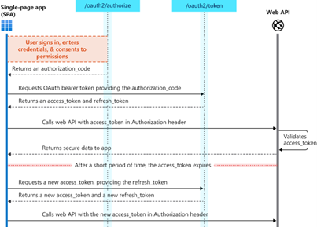

## API’s

Applications that contain long-running processes or that operate without the presence of a user also need a way to access secured resources such as web APIs. These applications can authenticate and get tokens by using their identities (rather than a user's delegated identity) and by using the OAuth 2.0 client credentials flow. In order to configure this, the administrator will set up a credential flow using the AAD and MIP token endpoint: https://login.microsoftonline.com/{TENANT}.onmicrosoft.com/oauth2/v2.0/token. 
Upon receiving a token, the application (Dameon Apps) can perform subsequent HTTP requests using OAUTH 2.0 with a bearer token in the header of the request.
This means that there is no user interaction and OIDC is therefore not being leveraged in this flow. Instead, the API that connects to B2C to interface with another API is responsible in obtaining tokens automatically. This API will be issued a Client ID, Secret (or perhaps a certificate) that will be used to obtain short lived tokens. It is recommended that the secret or certificate are rolled over (or changed) at regular intervals of 6 months. The diagram below depicts this scenario.

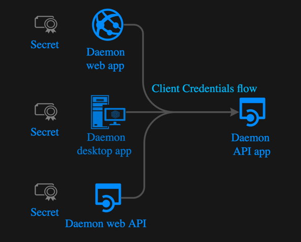

# IMPLEMENTATION ARCHITECTURE COMPONENTS

This section describes the Department’s specific implementation of Azure B2C. More specifically, the Department will be integrating with the official Government of Canada’s GCCF service which is SAML 2.0 based with a OAUTH Broker to support more modern applications and libraries.  Furthermore, the Department will be leveraging PowerApps Portals for its external facing portal services and is leveraging Azure B2C as its authentication mechanism. The Department wishes to use Azure B2C for not only PowerApps but potentially other web applications that require authentication in order to take advantage of creating a single profile for its external user base and facilitate monitoring, administration, reporting and enhance security by standardizing to one authorization platform rather than having multiple portals implement their own authentication systems or patterns which can be prone to security vulnerabilities and costly to maintain/upgrade. The Department is also hoping to continue its effort to minimize IAAS in favor for SAAS applications that can operate at Protected B and therefore minimize the complexities associated with hosting complex infrastructures and maintain servers and or containers to ensure that the latest security patches and other OS artefacts are up to date. By leveraging SAAS, the Department can focus on the application layer, encryption, and enforcing OIDC / OAUTH norms across the organization while providing a better user experience to its clients who will no longer need to maintain multiple sets of credentials to interact with Departmental services. 
The diagram below depicts, at a high level, how one or more web applications would interface with Azure B2C and in turn, how Azure B2C would then broker the authentication requests (login and logoff) to the Government of Canada’s Identity Provider services (2Keys-GCKey & Verify.Me -> partner credentials (banks)).

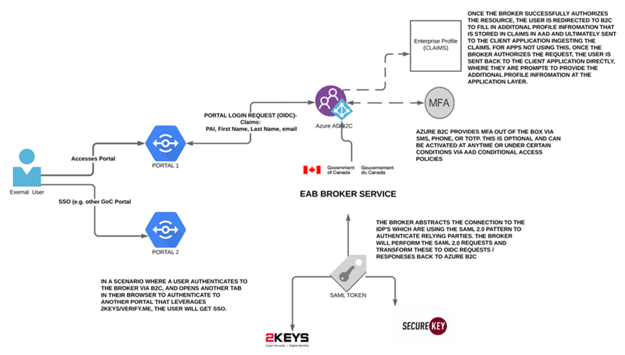

## AZURE FRONT DOOR (CDN)

Because the Department is integrating with the GOC Identity Providers via the Broker, to avoid issues such as CORS or third party cookie / session restrictions in modern browsers, it is recommended that a custom domain on Canada.ca and gc.ca is configured for Azure B2C rather than leveraging the OOB issued domain. Furthermore, TBS and SSC recommend that Departments force the use of TLS 1.2x and despite the fact that Azure B2C does support TLS 1.2x, it still supports earlier versions.  Both of these factors warrant the need to implement Azure Front Door as a Proxy/CDN in front of Azure B2C. AFD has native support for B2C and has a configuring to force TLS 1.2x flows to the service and a custom domain to it as well and block the OOB domain. For this implementation, these are the only two requirements to implement in AFD however AFD has additional features that could be leveraged in the future such as WAF (additional custom firewall policies), custom headers, and health probes. AFD is recommended as it’s a PAAS and therefore will simply compliment the use of B2C while living within the same cloud usage profile and connection patterns as B2C (e.g. unlike Azure Gateway, AFD is not assigned an IP which would otherwise deem it as IAAS).

## KEYVAULTS & ENTRUST CERTIFICATES

B2C provides full support for the usage of certificates to encrypt and decrypt tokens that are sent and received by client applications. Furthermore, since a custom domain is leveraged with TLS, a certificate is required for the AFD CDN in front of AB2C. These certificates are directly installed in both AB2C and AFD however it is recommended that the CSR’s are generated from Azure KeyVaults and once created by the Entrust CA, KeyVaults should be leveraged to generate the PFX files that are installed in both platforms. This ensures that administrators are aware of where the certificates are and when they expire. At the same time, for apps that are leveraging “secrets” (keys) instead of certificates to authenticate using the App Registration, these secrets can be referenced in Azure KeyVault’s via their Secret ID. By using the KeyVaults to centralize all of the certs and keys for B2C and AFD, the Department has control over who is accessing these certs, how, and when they need to be renewed.  Furthermore, the release pipeline automation for deploying AB2C artefacts (polices) leverages Variable Groups that are linked to the Azure KeyVaults hosting the certs and secrets to avoid referencing secrets or certificates directly in configuration files in DevOps / service connections.

## APP REGISTRATIONS

App Registrations are fundamental in AB2C as they are the primary mechanism used to connect to the service. An App Registration is generated for each client application that needs authentication to the GCCF services. The same applies to Apps that require access to API’s that are protected by AB2C. The App Registration is synonymous with an “SPN” or “Service Account” which is like a machine user that is leveraged by an application to perform authorization requests to the AB2C service. When configuring App Registrations, the Department will not allow “Implicit Flows” and therefore should always avoid selecting “ID Tokens” under the authorization flow. Applications must provide a Reply URI as a unique identifier and a “front channel logout” URL which B2C will invoke if it receives a logout request in a different browser tab to ensrue that all sessions within the users’ browser is purged. Once this information is received by the B2C administrator, the requester will receive a ClientID (unique ID that identifies the application integrating with the service – which is the app registration assigned to it), a Secret (key) or Certificate (for apps that can support this), and the tenant ID (if needed) to configure within their application’s code based (or configurations – e.g. PowerApps Portals).

## OPENID CONNECT & SAML 2.0

The GOC Identity Providers GCKey and Verify.Me (formerly SecureKey) that are ran by the Canadian company “Interac” provide a SAML 2.0 authentication pattern. SAML 2.0. Security Assertion Markup Language (SAML) is a login standard that helps users access applications based on sessions in another context, in other words, allowing applications to offload their authentication to another service rather than implementing their own user name and password (or similar) pattern directly within their own application. This pattern allows for single sign on whereby users can reuse the same set of credentials across multiple applications in a secure way using XML and RSA certificates issued by a trusted CA on both sides (application and identity provider).  SAML authenticates users by redirecting the user’s browser to either the GCKey or Verify.Me (or chosen bank) login page, then after successful authentication on that login page, redirecting the user’s browser back to the integrated web app where they are granted access. The key to SAML is browser redirects. 

The diagram below depicts the typical user authorization flow that SAML 2.0 provides to applications:

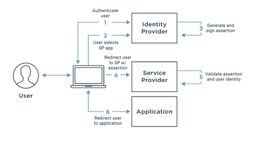

 There are three key artefacts that make up the SAML architecture:

* **Identity Provider (IdP)** - The software tool or service (often visualized by a login page and/or dashboard) that performs the authentication, checking usernames and passwords, verifying account status, invoking two-factor, etc. This is GCKey and Verify.Me.
* **Service Provider (SP)** - The web application where user is trying to gain access. This is the Department’s web application (e.g. PowerApps Portals, or Broker service such as EAB or SIC.
* **SAML Assertion** - A message asserting a user’s identity and often other attributes, sent over HTTP via browser redirects. This is the primary artefact that generates / persists the session.

The issue with SAML is that it is less commonly used in modern applications today as its more complex to implement, and a newer and more streamlined and simplified pattern OAUTH 2.0 has become the norm and standard in the industry. 

However, both the IDPs still only support SAML 2.0. As a result, SSC and TBS have developed OIDC Broker services that abstract the need to implement a SAML Service Provider for web applications. Although Azure B2C does support SAML, it requires a non-trivial customization using custom policies. Furthermore, both IDPs only support the SOAP binding for logout in SAML which is no longer being used by not only B2C but many (most) other SAML supported platforms.  As a result, if the Department were to connect to the IDPs using AB2C directly, they would not be able to implement the back channel single logout pattern implemented by the IDPs as B2C will only support single logout via the redirect binding (so browser based only, not SOAP). Therefore, the Department would not be fully compliant with the GOC’s CATS 2.0 standards and would need to seek an exemption to leverage AB2C. There are ways to implement the SOAP binding and integrate this custom service with AB2C but this would add additional complexity to the architecture and require additional maintenance and niche knowledge. 

SSC and TBS is aware of the emerging industry standards and therefore have developed an OIDC broker service that handles the connection to the IDPs via SAML and provides an OIDC interface to the Department and therefore AB2C will interface indirectly with the IDPs using OIDC rather than SAML and therefore is only responsible to meet the CATS 3.0 requirements which map to the official OIDC specifications which AB2C is fully compliant with.
 
This broker service / SAML abstracted is illustrated below:

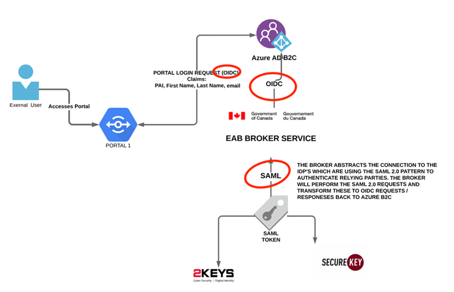

## LOCAL ACCOUNTS (CLAIMS)

The GOC IDPs will only provide a PAI token to the B2C. This means that B2C will be informed that the user has successfully authenticated to one of the IDPs and the only information returned to B2C from the IDP is a token that uniquely identifies the user. Once a token arrives to B2C, B2C will first try and match this value in its storage and if not found will treat this user as a new user and prompt them to provide more information such as their email, first name, last name. If the returning token is found, B2C will simply redirect the user back to the application along with the associated email, first name and last name so that the integrated application knows who the person is and can therefore assign them a session under their user context. For the initial implementation, B2C will not be responsible to gather any claims once it receives a token, instead it will simply store the token and redirect the user to the integrated application where this application will be responsible to gather additional claims such as email, first name and last name plus any additional information that is needed for the application itself. The next time this user signs in, B2C redirects the user to the integration web application and if this application finds this user by its token in its own storage, then the user will not be directed to fill in profile information (unless the application flow forces a user to confirm their profile information before accessing the application). Both options will be implemented in the Department – the benefit of requiring the user to provide their profile information in B2C is that the Department can now share additional claims beyond just the PAI between multiple applications and therefore streamline the user experience by eliminating the need for that same user to enter profile information multiple times in different applications despite using applications within the same Department. For the enterprise profile, only a limited set of fields (claims) will be populated by a user and integrated apps will receive this information and can opt to ask the user for more profile information that is specific to their app’s domain (e.g. a permit application might be interested in knowing which company the user works for, whereas a travel permit or visa application might be interested in obtaining the user’s DOB – these claims would not be captured in B2C but instead directly in the app). 

## MONITORING

AB2C provides extensions for both Azure Monitor to route sign in and auditing logs to the SIEM for longer retention or integrate with security information and event management (SIEM) tool (e.g. Sentinel) to gain more granular insights into the B2C implementation. To route log events, Azure Storage, a Log Analytics Workspace and Event Hub services are used. Most of these services get auto generated by the ARM template (provided in references). 

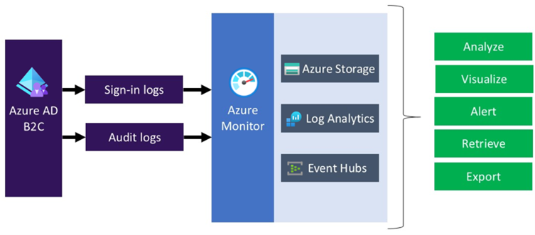

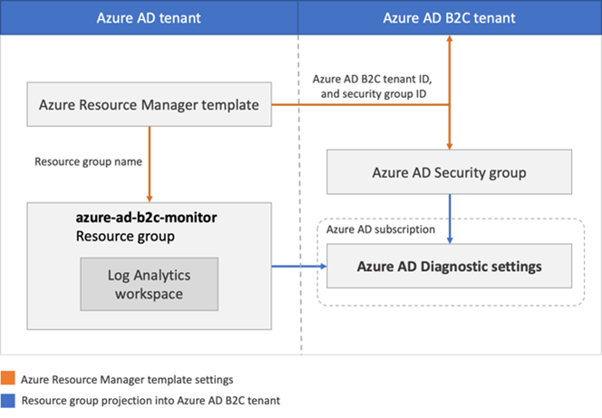

Once the monitoring is configured, the user insights and authentication visual will demonstrate which usage by country, browser, app (portals), by identity provider, by policy (e.g EAB, SIC, Local), and Failures with Reason codes. This provides the Department with a generalized overview of the overall behavior and key metrics for AB2C.

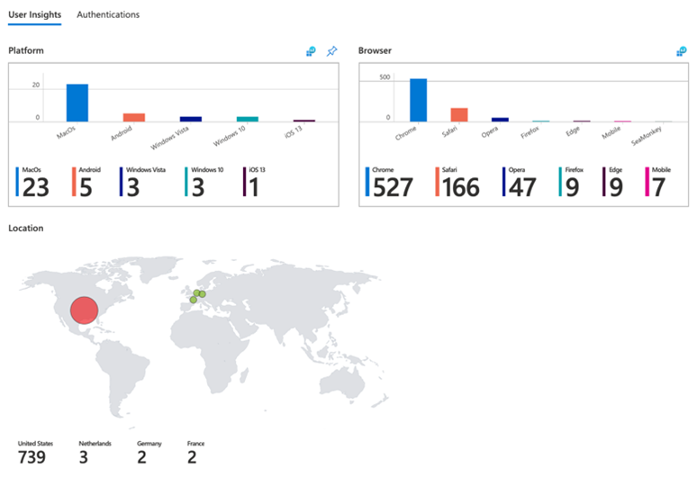

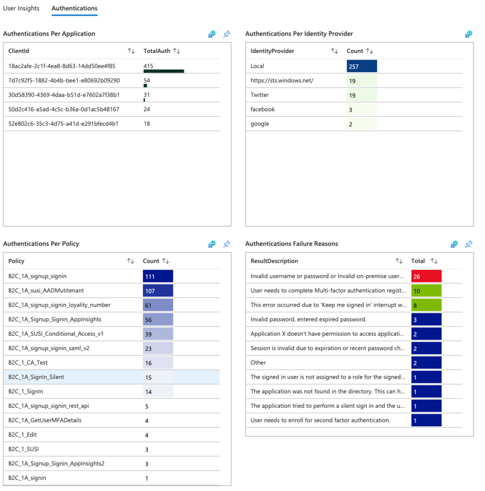

In addition to the common metrics for the overall health and access telemetry of AB2C, the Risk Detection is another report to be implemented that uses Azure AD B2C Sign-in logs to capture risk detections. 

The dashboards / reports will provide the following data and visualizations

* Aggregated Risk Levels
* Risks Levels during SignIn
* Risk Levels by Region
* Risk Events by IP Address (Filterable)
* Risk Events by Type (Filterable)
* Risk Events Details (based on selected Risk Type)
* Risk Events by Geo Coordinates (Filterable)
* Risks Events Over Time

By default, the risk detection criteria’s include the following:

* Anonymous IP address use
* Atypical travel
* Malware linked IP address
* Unfamiliar sign-in properties
* Leaked credentials
* Password spray

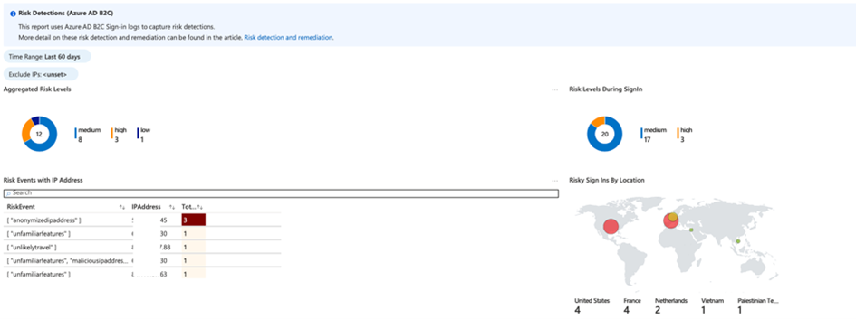

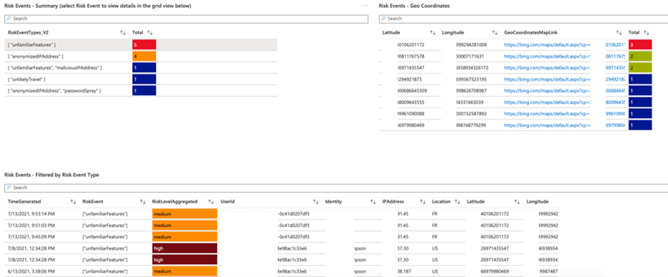

## AUDITING

The information in B2C is limited to the user’s object ID (Azure generated ID) and details about the GCCF Identity Provider coupled with any additional claim information configured for the Enterprise Profile (first name, last name, and email).  Audit logs are retained for 7 days, however this can be extended by leveraging Azure Monitor and Application Insights to extend beyond this period.

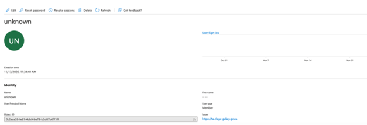
<font size="2">**FIGURE 9: B2C USER TRACKING - USER OBJECT**</font>

As illustrated in the capture below, GCCF only provides the SAML 2.0 issued Token that uniquely identifies the user which is stored in B2C’s Issuer ID field (Claim). B2C will also capture the source of the identity provider being either 2keys (te.clegc-gckey.gc.ca [TEST], clegc-gckey.gc.ca [PROD]) or Verified.Me (cbs-uat-cbs.securekey.com [TEST], cbs.securekey.com [PROD])

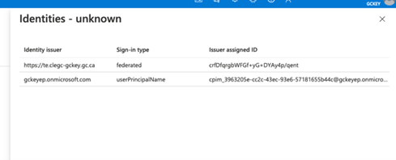
<font size="2">**FIGURE 10: USER OBJECT LOGIN IDENTITY ISSUER (GCCF IDENTITY PROVIDER CHOSEN)**</font>


Subsequent logins from the SAML 2.0 federated user is tracked in the B2C audit logs. 

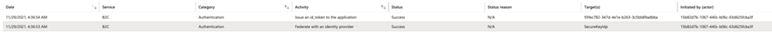
<font size="2">**FIGURE 11: B2C USER LOGIN AUDIT LOG**</font>

There are two key events stored, one for successful SAML 2.0 Federation with the Identity provider which provides useful metrics such as the user’s location, browser, his/her SPN, which IDP they authenticated to as well as the date and time for the authentication. See below capture of this log in DEPARTMENT’s B2C TE environment.

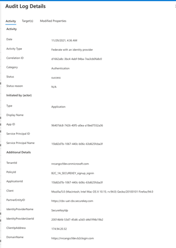
<font size="2">**FIGURE 12: B2C USER LOGIN - AUDIT DETAILED VIEW**</font>

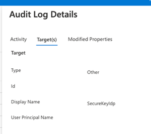
*Modified Properties always blank as GCCF does not map to any property.

<font size="2">**FIGURE 13: TARGET IDP DETAIL**</font>

The second log is the information around the issuance of a Token to the client Application, in this case PowerApps Portals. The log provides the same metrics as the previous log captured above however outlines the target application (AAD App Registration Record):

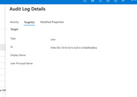
<font size="2">**FIGURE 14: B2C AUDIT LOG DETAIL - POWERAPPS REGISTRATION RECORD**</font>

## GUARDRAILS

Since AB2C creates a new Azure AD Domain that is targeted for external user authentication. A subset of the guardrails the Department would implement for access management by B2C administrators will be implemented. In addition to the access controls, there are a series of settings described in the tables below that need to be configured or activated to ensure that the Department achieves a Protected B posture in its B2C implementation. For the most part, since AB2C is a service that falls within the Departments tenant subscription, the majority of guardrails will be inherited. However, at the AB2C application layer, additional guardrails should be implemented to ensure that the external user and API authentication platform is fully secure and well managed.

|Guardrail|
|---|
|Have a minimum of 2 Global Admins with MFA enabled. The Global Admins should be AD federated accounts and not cloud only accounts.|
|Create Security Group for each web application or API integrating with B2C (segment and separate)|
|Enforce TLS 1.2 by deploying AFD|
|Use a Canada.ca or GC.ca domain by deploying AFD (block the Microsoft domain)|
|Use Entrust TLS Certificate for custom domain|
|(For EAB and SAML implementations) Use Entrust PKI – Encryption and Decryption Certifications|
|Use RSA 2056 or higher for the Tenant Encryption Key (or Use CSE-approved cryptographic algorithms and protocols)|
|(optional) Use JWT signatures for login and logout requests if using IDPs (signature should be done by trusted CA cert – entrust, and not a self-signed certificate)|
|Prohibit the use of implicit flows for applications with the exception of SPA’s (consider leveraging server side for authorization)|
|Do not share Secrets directly with Apps. Instead provide ‘SecretID’ from KeyVaults|
|Enforce Front Channel Logout implementation to client applications |
|Use Risky Users and Risk Detection monitoring services for significantly greater control over risky authentications and access policies. Azure AD B2C Premium P2 is required|
|Ensure one of the Canada regions are set when installing B2C|
|Create multiple environments (Production and non production)|
|Audit log events are only retained for seven days. Integrate with Azure Monitor to retain the logs for long-term use, or integrate with existing (SIEM) tool – extend the retention period to 1 year (instead of 30 days)|
|Setup active alerting and monitoring “Track user behavior” feature in Azure AD B2C using Application Insights.|

# CONFIGURING AZURE B2C

## PRE-REQUISITES

* Global Administrator rights to the {ENVIRONMENT} subscription that will host the Azure B2C Instance
* Access to a “Dev” or “Sandbox” Azure subscription used for creating the AzureB2C Development resource
* Access to a “Production” Azure subscription used for creating the AzureB2C Production resource
* Access to a “Dev” or “Sandbox” Azure subscription used for creating the Azure Front Door (CDN) Development resource
* Access to a “Production” Azure subscription used for creating the Azure Front Door (CDN) Production resource
* Access to an Azure KeyVaults resource to store TLS certificates, Secrets and Keys

## PROVISIONING AZURE B2C

* Sign into the Azure portal as GA.
* Switch to the directory that contains the primary subscription (or a Dev subscription preferably). The directory should be on the domain that is connected to the on premise active directory so that B2C configurators leverage their federated accounts instead of cloud only domain accounts (optional-this can be done using your .onmicrosoft.com identity).

Once in signed into the Azure subscription as Global Administrator or Subscription Owner, select “Create Resource” 

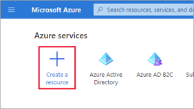

Search for Azure Active Directory B2C, press Enter and select “Create”

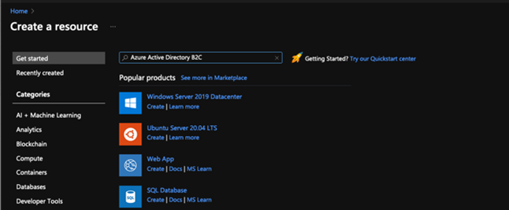

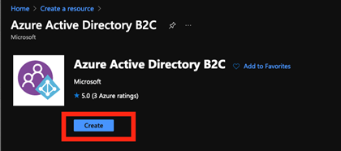

In the Create blade, click on “Create a new Azure AD B2C Tenant” 

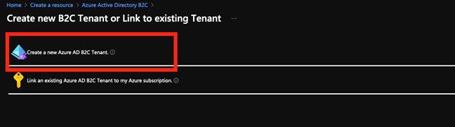

In the following step, enter {ENVIRONMENT}b2cdev for both the organization name and initial domain name (which will be the subdomain) and fill in the country, subscription, resource group and resource group region

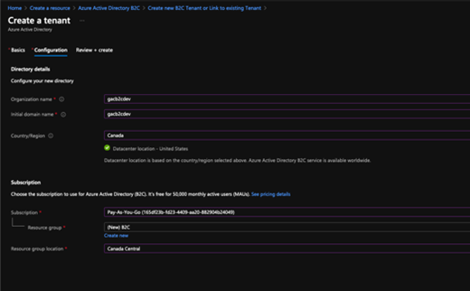

Click on Review and Create and if Validation has passed click on Create. 

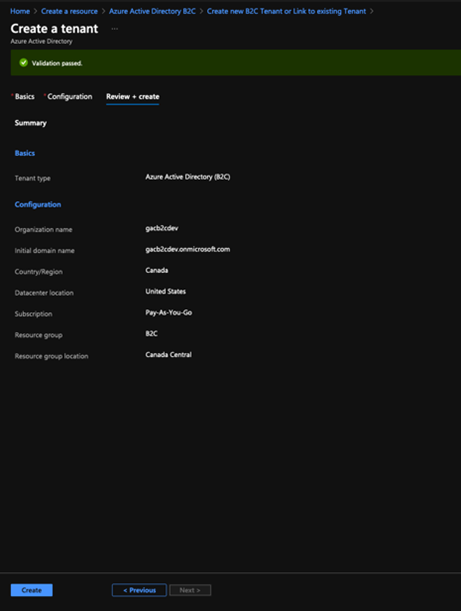

Once created, add additional B2C administrators as Global Administrators to this new B2C environment.

To do so, click on your profile in the top right, and select switch directory, and switch to the new Azure B2C directory just created

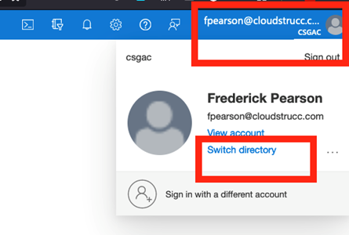

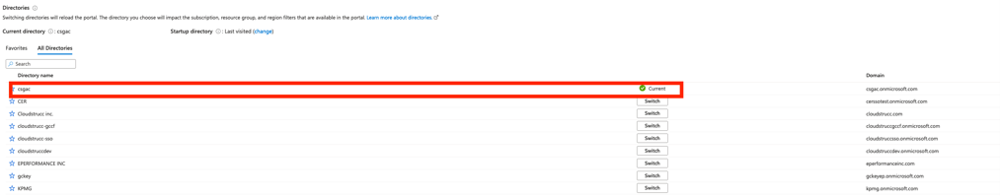

Once you are in the new directory search for Azure AD B2C

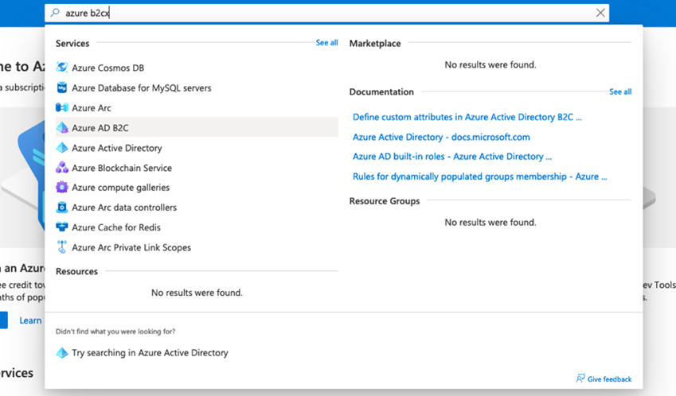

Select Users from the Menu Blade

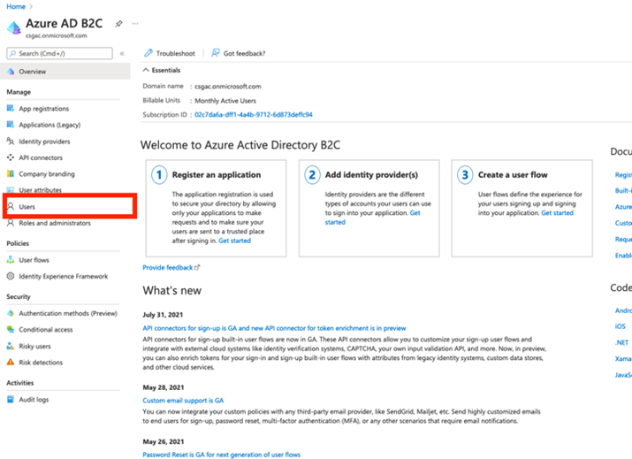

Select New User

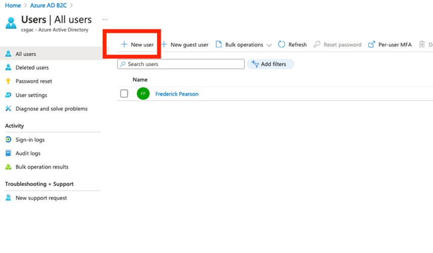

Select “Invite User”, enter the name and email, click on Role “user” and select “Global Administrator” **(note this only applies Global Admin rights to the newly created Dev B2C tenant) and press select. Once completed, press “Invite”.**

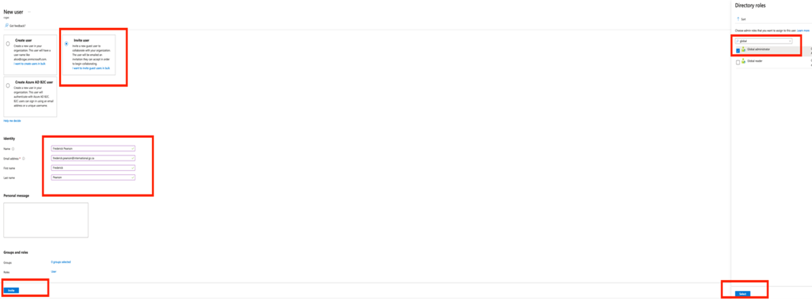

## CONFIGURING THE AZURE B2C THEME (TENANT WIDE)

Select “Company Branding” and choose the Default brand. In the modal, upload the Government of Canada JPEG to the Sign-in page background image and the Canada logo under the Banner logo file upload.

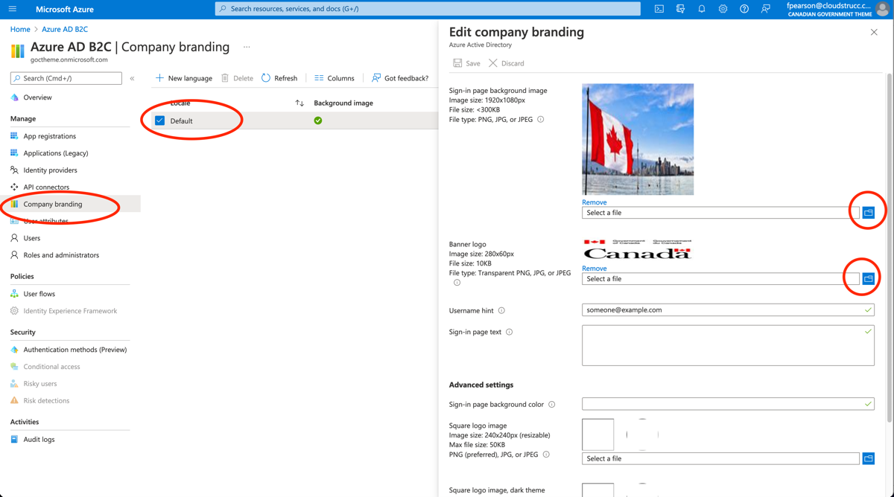

## CONFIGURING A STANDALONE USER FLOW FOR LOCAL AUTHENTICATION (WITHOUT LEVERAGING A THIRD PARTY IDP LIKE EAB OR SIC)

Select User Flows, and click on New user flow

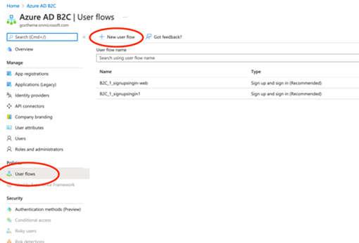

Next, select Sing up and sign in and the recommended tile under “Version”

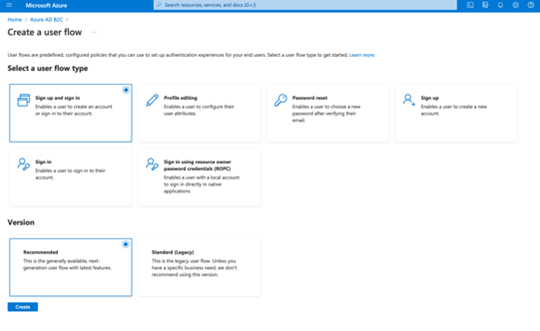

Select Email Signup, TOTP, and Conditional for MFA enforcement (policies to be defined in a later section). For user attributes, select Email Address, Given Name and Surname, press Ok and Create


Once created, navigate to the newly created user flow and click on properties. Ensure to check “Require ID Token in Logout Requests”. 

Next, create a profile and password reset policy.

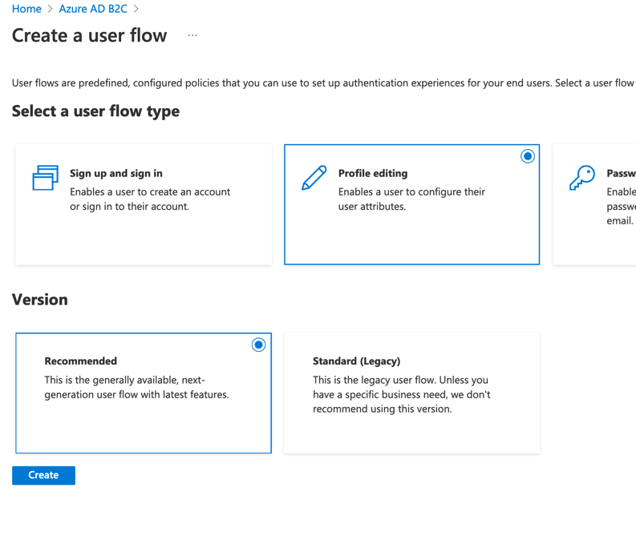

***Apply the same settings from the Sign up and sign in user flow for both policies. For the Password reset policy ensure that the Reset password using email address option is checked.**

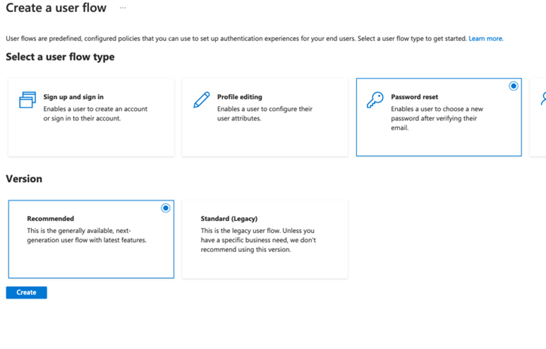

## CONFIGURING SIGN IN CANADA SIC (TBS)

Azure B2C supports integrating with both OpenID Connect and SAML 2.0 Identity Providers. It can act not only as a “service provider” to Applications inside and outside our organization but also as an Identity Provider for your apps. In this section, the guide demonstrates how to integrate Azure B2C with the Government of Canada’s OpenID Connect provider - SignIn Canada. The initial set up connects to SignIn Canada’s test environment (CATE). The same steps are required for configuring production. We recommend creating a separate Azure B2C environment for Production.

## CREATE A NEW IDENTITY PROVIDER - 1

Navigate to the Identity Provider menu blade, and select “New Open ID Connect Provider” and enter the following metadata:

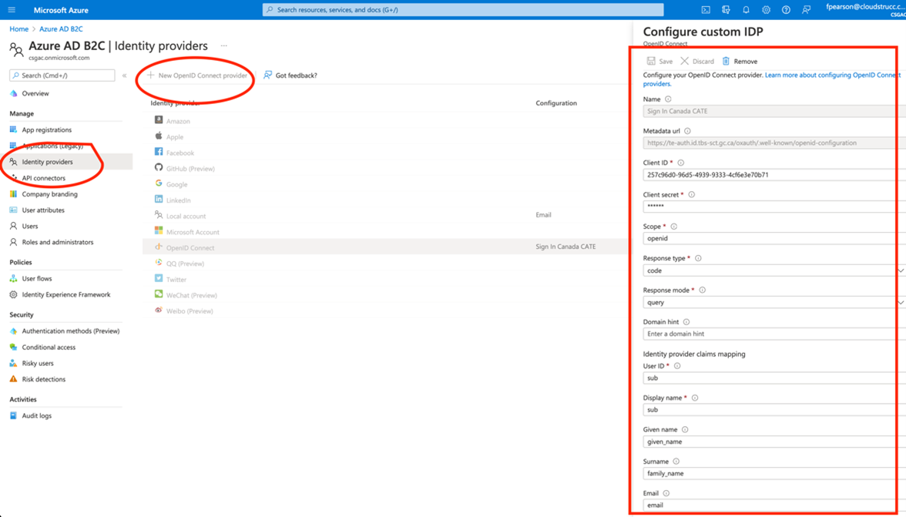

**Name**: Sign In Canada CATE

**Metadata URL**: https://te-auth.id.tbs-sct.gc.ca/oxauth/.well-known/openid-configuration

**ClientID**: {CLIENTID} - ENTER ANY STRING FOR NOW. THIS VALUE WILL BE UPDATED LATER ONCE YOU RECEIVE FROM SIC

**Client secret**: {CLIENTSECRET} - - ENTER ANY STRING FOR NOW. THIS VALUE WILL BE UPDATED LATER ONCE YOU RECEIVE FROM SIC

**Scope**: openid

**Response Type**: code

**Response Mode**: query
 
**User ID**: sub

**Display Name**: sub

## CREATING A USER FLOW - 1

Select User Flows, and Create a new user flow with the following configurations

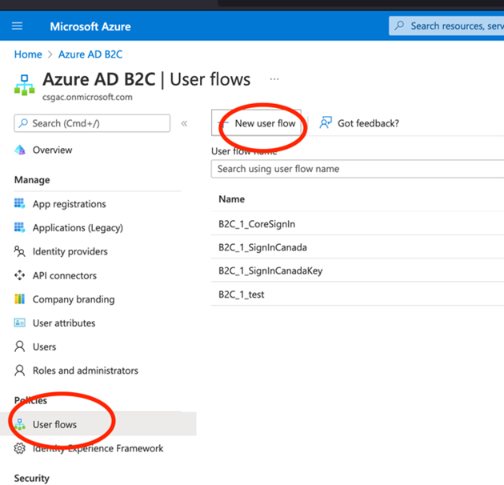

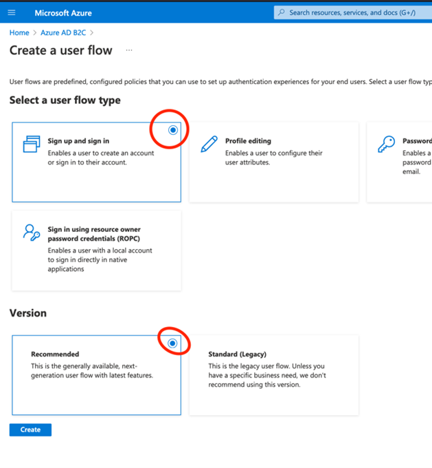

In the Name field enter SignInCanada-CATE (or something that clearly identifies the service), select “None” for the Local Accounts, and Check “SignIn Canada CATE” (the identity provider created in the previous step) and leave everything else as default and press “Create”

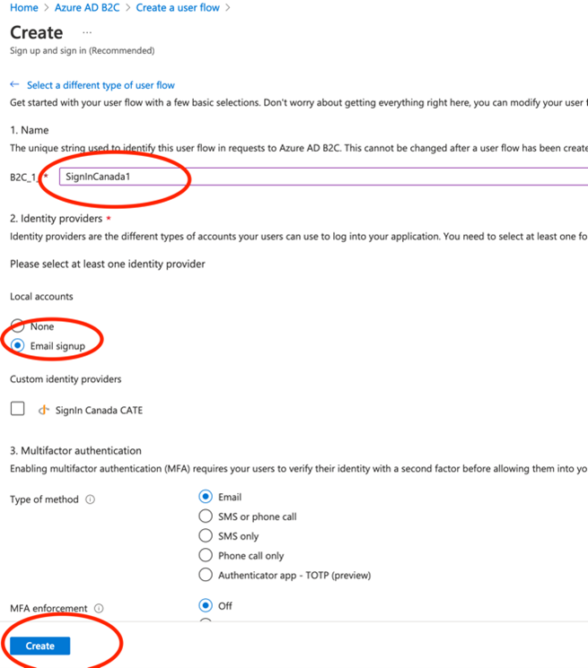

Once created click on “Run User Flow” and copy the Metadata URL as you will need to send this to the SignIn Canada mailbox in your request to onboard to their test service. 

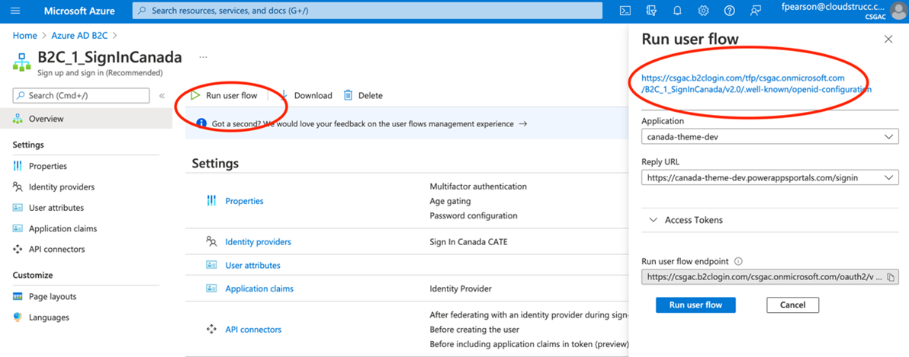

Next, locate your Azure B2C TenantID and copy this value in preparation for your request.

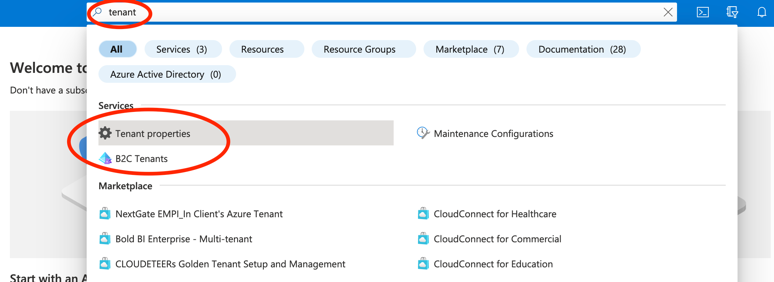

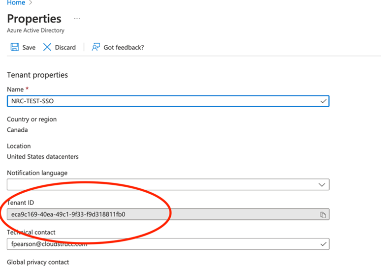

Once the user flow created and metadata ready you can send the request to SignIn Canada by sending an encrypted email to Signin-AuthentiCanada@tbs-sct.gc.ca. 

**Example email (must be sent by an official Government email that can accept encrypted email – Entrust CA)**
<hr />

We would like to onboard to the SignIn Canada’s CATE environment, the information you require is provided below:

Our tenant ID is **{GUID of Azure B2C’s tenant ID}**

Our Metadata URL:  
**Error! Hyperlink reference not valid.**  

Our Redirect URL: **Error! Hyperlink reference not valid.**

Please provide the information required for configuration of your service in Azure B2C.
<hr />

SIC will respond by providing you with the information you need to configure the service which will include their metadata information, configuration options and a client ID and Secret. At which point you can proceed to the next steps.


Once you’ve received the response, navigate to the Identity Provider menu blade, and select the SignIn Canada identity provider and update the ClientID and Secret values you’ve received from SIC:


## CONFIGURING ENTERPRISE ACCESS BROKER EAB (SSC)

Azure B2C supports integrating with both OpenID Connect and SAML 2.0 Identity Providers. It can act not only as a “service provider” to Applications inside and outside our organization but also as an Identity Provider for your apps. In this section, the guide demonstrates how to integrate Azure B2C with the Government of Canada’s OpenID Connect provider - SignIn Canada. The initial set up connects to SignIn Canada’s test environment (CATE). The same steps are required for configuring production. We recommend creating a separate Azure B2C environment for Production.

## CREATE A NEW IDENTITY PROVIDER - 2

Navigate to the Identity Provider menu blade, and select “New Open ID Connect Provider” and enter the following metadata:


**Name**: Sign In Canada CATE

**Metadata URL**: https://te-auth.id.tbs-sct.gc.ca/oxauth/.well-known/openid-configuration

**ClientID**: {CLIENTID} - ENTER ANY STRING FOR NOW. THIS VALUE WILL BE UPDATED LATER ONCE YOU RECEIVE FROM SIC

**Client secret**: {CLIENTSECRET} - - ENTER ANY STRING FOR NOW. THIS VALUE WILL BE UPDATED LATER ONCE YOU RECEIVE FROM SIC

**Scope**: openid

**Response Type**: code

**Response Mode**: query 

**User ID**: sub

**Display Name**: sub

## CREATING A USER FLOW - 2

Select User Flows, and Create a new user flow with the following configurations


In the Name field enter SignInCanada-CATE (or something that clearly identifies the service), select “None” for the Local Accounts, and Check “SignIn Canada CATE” (the identity provider created in the previous step) and leave everything else as default and press “Create”


Once created click on “Run User Flow” and copy the Metadata URL as you will need to send this to the SignIn Canada mailbox in your request to onboard to their test service.


Next, locate your Azure B2C TenantID and copy this value in preparation for your request.


Once the user flow created and metadata ready you can send the request to SignIn Canada by sending an encrypted email to Signin-AuthentiCanada@tbs-sct.gc.ca. 

**Example email (must be sent by an official Government email that can accept encrypted email – Entrust CA)**
<hr />

We would like to onboard to the SignIn Canada’s CATE environment, the information you require is provided below:

Our tenant ID is **{GUID of Azure B2C’s tenant ID}**

Our Metadata URL:  
**Error! Hyperlink reference not valid.** 

Our Redirect URL: **Error! Hyperlink reference not valid.** 

Please provide the information required for configuration of your service in Azure B2C.
<hr />

SIC will respond by providing you with the information you need to configure the service which will include their metadata information, configuration options and a client ID and Secret. At which point you can proceed to the next steps.


Once you’ve received the response, navigate to the Identity Provider menu blade, and select the SignIn Canada identity provider and update the ClientID and Secret values you’ve received from SIC:


# Configure custom domain and force tls 1.2 – azure front door

The following section describes how to configure a custom domain in Azure B2C using AFD. AFD is also required to force TLS 1.2 flows to Azure B2C to meet the GOC guardrail. The illustration below depicts the integration between B2C and AFD

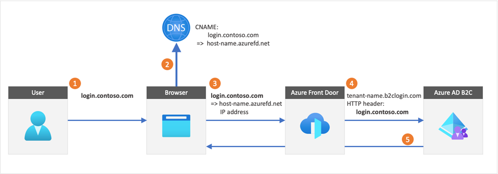

Step 1: Add custom domain to Azure Active Directory (within the B2C tenant)


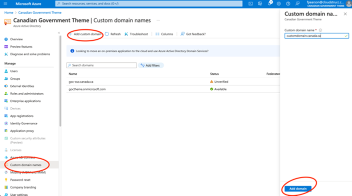

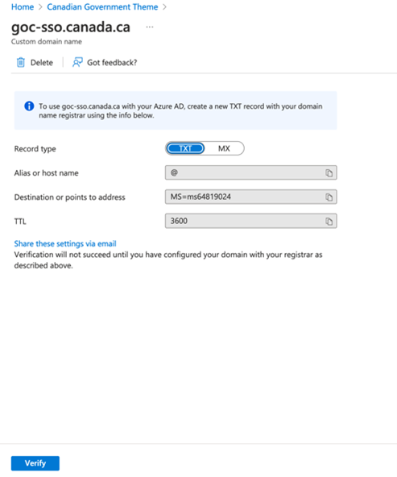

Once added, send the TXT record to the Canada.ca DNS. The request should read:

Type: TXT, Host: mydomain.canada.ca, TXT: MS-ms658…, TTL 3600. 

Once actioned, you can press verify and proceed to next steps. ***NOTE, once verified, SSC needs to delete the TXT entry as this domain will be configured as CNAME in a subsequent request.**

# INTEGRATING web portals TO AZURE B2C

To onboard web applications that require SSO, you will need to provide them with the metadata URL, and a ClientID and Secret. When a client creates a request, they will need to provide you with their “Redirect URL” and their “Front Channel Logout URL”. The latter is required for B2C to know which URL to invoke when it receives a logout request from another integrated web application to ensure that the other apps that have an active session are also logged out. Once you have this information, you can proceed with the steps below.

## Onboarding a PowerApps portal

**Step 1 (Client):** The PowerApps developer will need to provide you with a “Redirect URL”. To do so they must go to the https://make.powerapps.com, select the environment for which they would like to leverage SignIn Canada, select the portal authentication settings and press “Add Provider”, select Other, and choose “OIDC Provider”. Once the modal is displayed, PowerApps generates a “Redirect URL” and before they can configure your service, they will need to email you this URL. In addition to this URL, the client should also provide you with the logout URL fo their portal. By default this should always be (for portals without a custom domain): Error! Hyperlink reference not valid..  Alternatively, if you already know the portal URL, you can create the app registration record in advance and enter any redirect URI using the following convention and provide the details to the developer to configure in PowerApps. Otherwise, the developer will be responsible to provide you with the Redirect URI.

To obtain the Redirect URI directly from PowerApps, the developer can follow these steps:

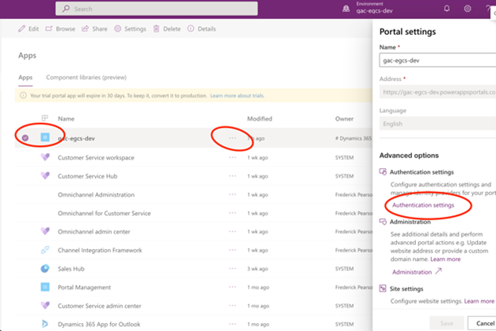

Select “Add Provider” and enter the following details in the Wizard

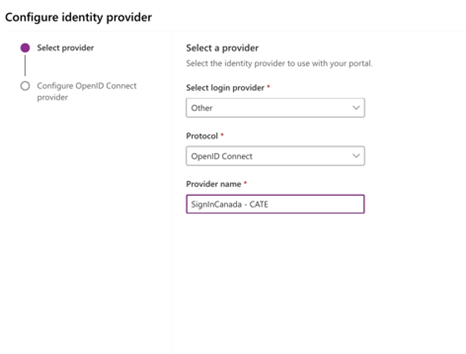

Copy the “Reply URL” and send to the AzureB2C Administrator to obtain the OIDC data you need to finish the configuration

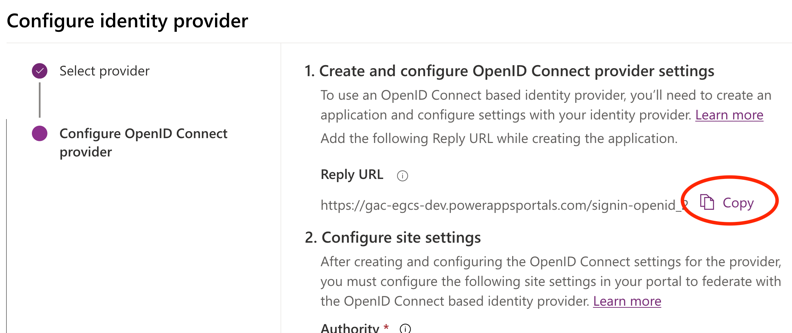

The PowerApps developer will resume the configuration once you’ve provided them with the App Registration information. 

**Step 2 (App Registration) – completed by AzureB2C administrator:** Once you receive the Reply URL, navigation to the App Registrations Blade and create a new App Registration. The naming convention is at your organization’s discretion, but in this example the convention is simply the sub-domain of the PowerApps Portal being on boarded. ***Please note that the PowerAppsPortals.com domain is typically not used in Production. Therefore, the same client may request you to add additional redirect URLs in the Authentication blade within the App Registration record in the future once SSC enters the DNS entry for their Portal in the Canada.ca DNS.***

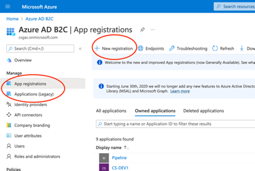

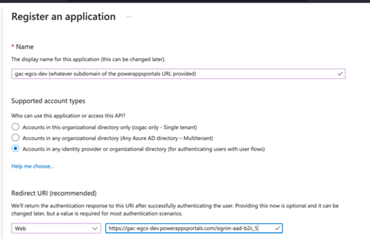

Press “Register”

Next, in the “Authentication” Blade, enter the front channel logout URL which is always the portal URL with /Account/Login/LogOff (for PowerApps). Make sure to select “Access Tokens” and press save.

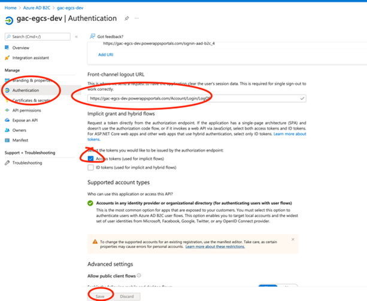

Next click on “Certificates and Secrets” and generate a secret and copy the secret to your clipboard (or somewhere as you will need to send this via encrypted email to the PowerApps Portals developer)

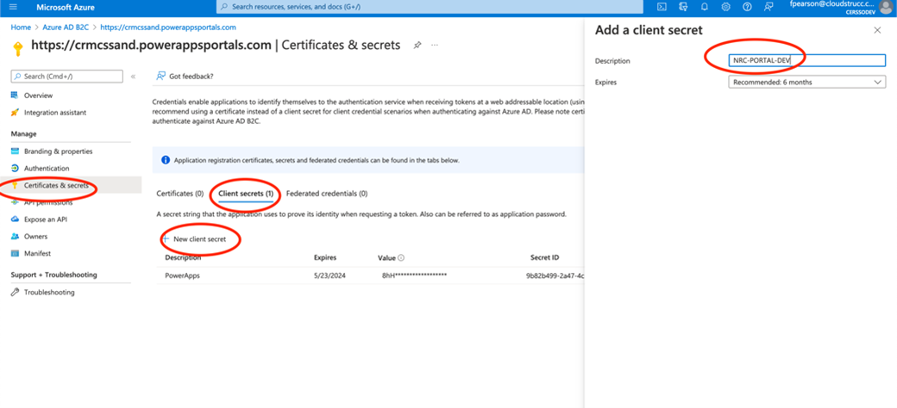

Next click on overview and copy the ClientID.
Send the following information back to the PowerApps Portals developer:
* ClientID 
* Secret
* Metadata:**Error! Hyperlink reference not valid.**  

**Step 3 (Finish configuration – PowerApps):** In your email that includes the ClientID, Secret and Metadata URL to the client, include the following example configuration for the developer to finish the configuration. 

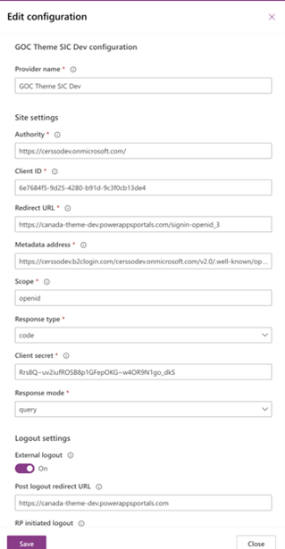

**(Optional) ->** If the PowerApps Portal wants users to automatically be redirected to the SSO service upon navigating to the “SignIn” page, the developer can set the new provider as default

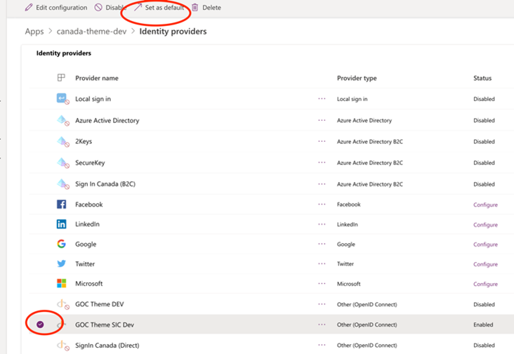

Once completed, you can test by navigating to the integrated portal and invoking the sign in button (or anchor) which will automatically send an authorization request to B2C which in turn will send the request to SIC.

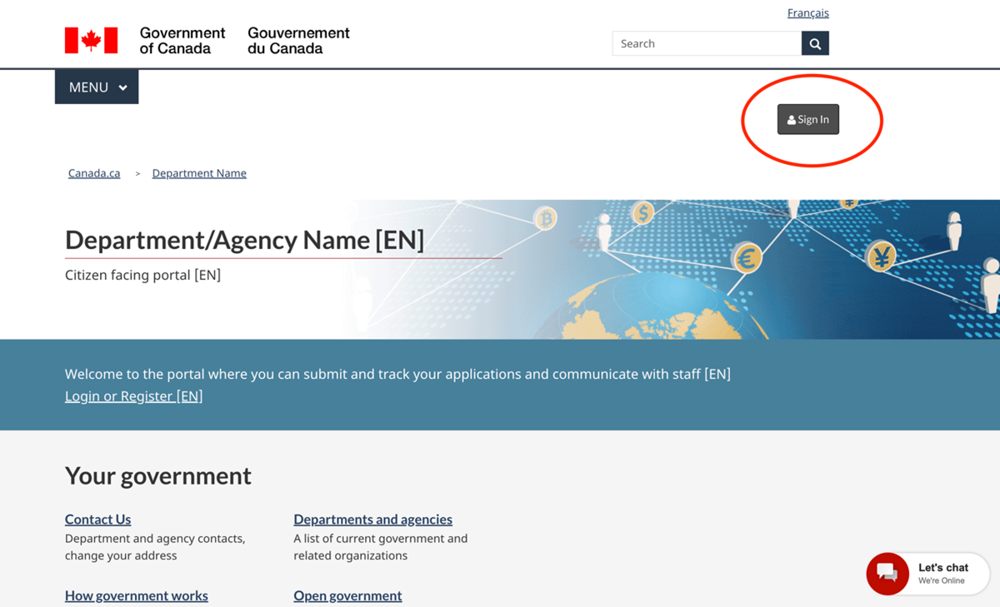

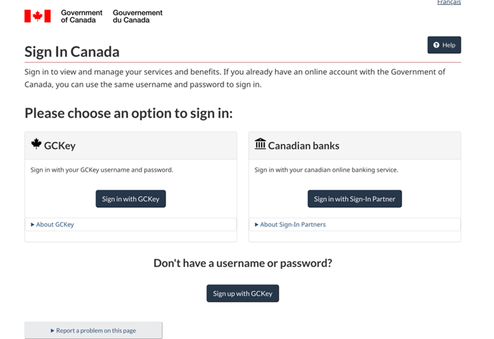

You can then sign up to a GCKey or Sign-In Partner (banks) account, and once successfully signed in, you should be redirected to your portal’s home page if you are an existing portal user. 

***GCKEY Example:***

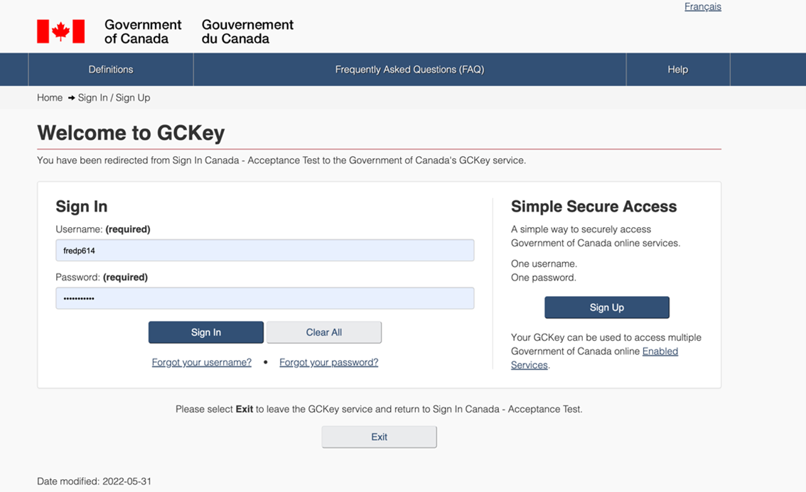

***Canadian Banks Example (recommended during development for ease of use)***

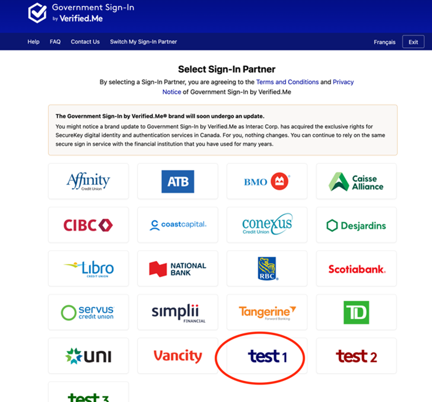

Enter test with an integer suffix (e.g. test12345) and scroll to the bottom of the page and press Login. For a returning user, use the same username (e.g. test12345 in this example) you’ve used as part of the full registration to PowerApps. *When simulating a new PowerApps user registration use a new integer suffix.*

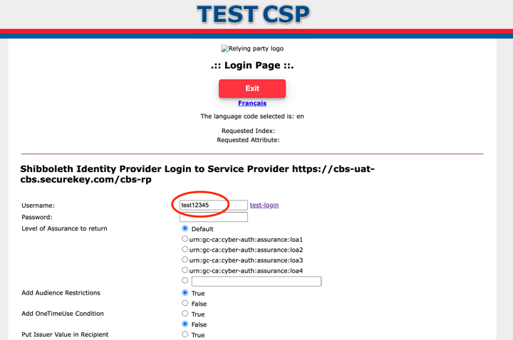

For a new user, you should be prompted to create a profile in the Application as B2C will only send the “Subject-ID” claim to the integrated application which can be leveraged as a unique identifier in the portal application. If a subject-id is not yet associated to a profile in the integrated application, the application should invoke a user journey to create a profile in the application (provided the application requires the use of a profile). Below is what a new user (or new subject-id sent to the app) would invoke in PowerApps Portals (GOC PowerApps Theme)

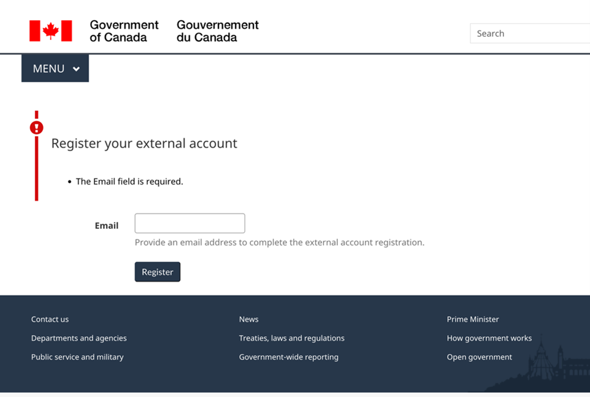

Once the profile is created OR if it’s a returning user, the authenticated home page (or post login redirect) would render. The example below demonstrates the authenticated home page for the GOC PowerApps Theme.

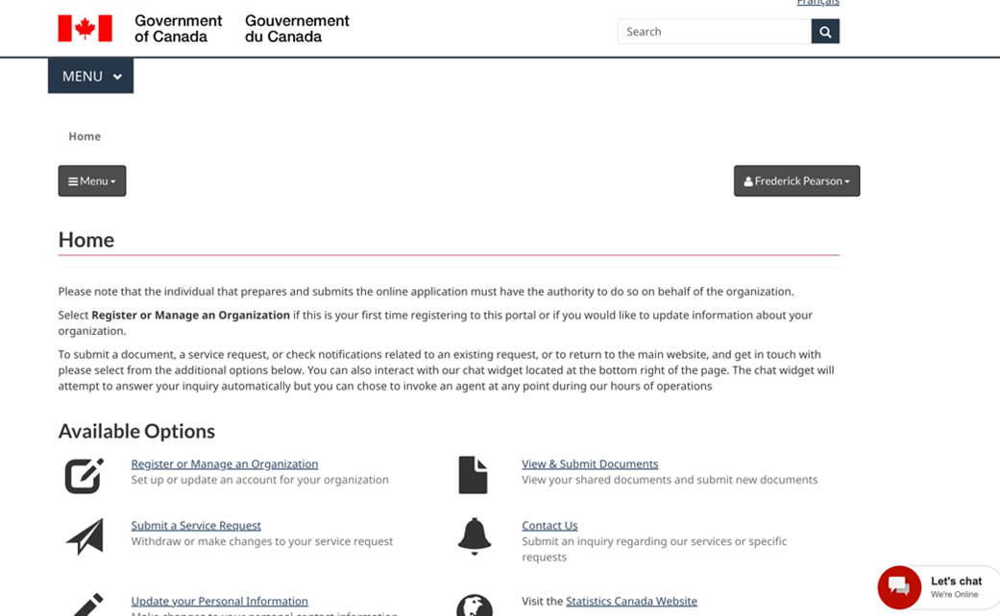

CONFIGURING A WEB API