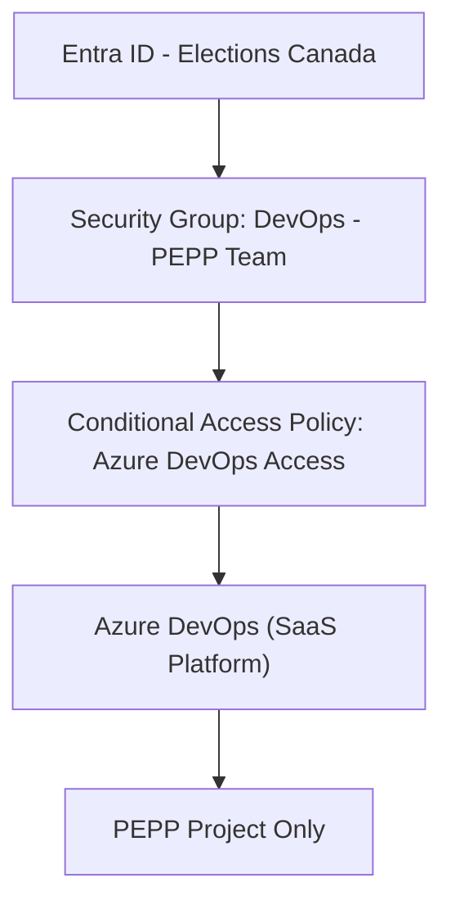

# Azure DevOps Access request for the PEPP project team

## Project: PEPP – Elections Canada

## Purpose

This document outlines the solution design for restricting access to **Azure DevOps** (a SaaS-based CI/CD platform) to a **specific Entra ID (Azure AD) group** under the **Protected B Cloud Security Guidelines** of the Government of Canada. The implementation ensures that the platform is only accessible to authorized developers assigned to the PEPP project and is shielded from broader organizational exposure until formal authority to operate (ATO) is granted.

### Requirement Overview

The PEPP team at Elections Canada requires the use of Azure DevOps as an Application Lifecycle Management (ALM) platform to support their Power Platform application development, which includes Dataverse and Power Pages components. Elections Canada currently leverages an on-premises instance of Team Foundation Server (TFS) for ALM across the organization. However, Azure DevOps provides a more productive and integrated alternative for Power Platform projects by offering native capabilities such as Git-based source control, environment-aware deployment pipelines, seamless integration with Microsoft Dataverse, and built-in support for tracking and managing solution changes.

Azure DevOps simplifies the management of Power Platform solutions by automating export/import of unmanaged and managed solutions, allowing for better collaboration, continuous integration/continuous delivery (CI/CD), and modular solution deployment. This level of automation and environment coordination is not easily achievable with the legacy on-premises TFS tooling.

To securely enable access for this specific use case while respecting Elections Canada’s strict information security practices and existing access restrictions, a scoped Conditional Access policy is required. This policy must ensure that only the PEPP development team can access Azure DevOps while maintaining restricted access for all other users.

---

## Security Context: GoC Protected B Compliance

### Key Guidelines Followed

* **Access Control**: Principle of least privilege
* **Audit and Traceability**: Role-based access control with centralized logs
* **Identity Management**: Centralized Entra ID with Conditional Access
* **Cloud SaaS Controls**: Restricted surface area exposure

---

## Target Architecture



* **PEPP Team only** has access to Azure DevOps
* **All other users** are explicitly blocked regardless of license
* **Project artifacts and environments are isolated**

---

## Isolation Rationale

* **Single Entra ID Group Access**: Prevents accidental access from E3/E5/Visual Subscriber licensed users in the broader tenant
* **Scoped to PEPP Only**: Azure DevOps org is configured to restrict access and visibility to PEPP project team
* **Organization Creation Blocked**: Enforced at tenant level
* **Awaiting Full ATO**: Access constrained until ATO granted
* **Pre-existing Block Policies Must Be Addressed**: Elections Canada has a tenant-wide Conditional Access policy that currently blocks Azure DevOps access for all users except those on a secured VPN subnet. This policy, while effective for general enterprise control, will conflict with the PEPP-specific access model unless:

  1. It is **modified to exclude the `DevOps - PEPP Team` group**, or
  2. It is **replaced** with the new scoped Conditional Access policy defined in this document.

⚠️ **Important**: If the existing broader Conditional Access policy remains, the new PEPP policy may not apply due to precedence and conflict. Admins should ensure that only one effective policy governs Azure DevOps access for this group.

---

## Compliance Statement

This restriction supports Elections Canada’s compliance with:

* **TBS ITSG-33 (IT Security Risk Management)**
* **Cloud Guardrails for Protected B SaaS**
* **Identity & Access Management Framework for GC**

The configuration aligns with the **iATO** (interim ATO) status granted to the PEPP development initiative, with full rollout of Azure DevOps contingent on project-level ATO review.

---

## Annex: Build Book

### Licensing Considerations

The implementation of Azure DevOps for the PEPP project will incur no additional cost to Elections Canada. This is because the project team is leveraging services already available under existing licensing entitlements:

Developers on the PEPP team have active Visual Studio subscriptions and Microsoft 365 E5 licenses tied to their Entra ID accounts. These subscriptions include full Azure DevOps access.

Non-developer roles such as Quality Assurance (QA), Business Analysts (BA), and Project Managers (PM) will use the Azure DevOps Stakeholder license, which is free of charge and provides sufficient access for work item tracking, dashboards, and basic project management functions.

This request does not introduce new licensing requirements or costs, as all role-based access levels are covered by the current license agreements in place.

### Manual Implementation Process

#### 1. Create a Security Group

* Go to Entra ID portal → Groups → New Group
* Type: Security
* Name: `DevOps - PEPP Team`
* Add only PEPP developers

#### 2. Assign Graph API Permissions to Application

* Go to Entra Admin Center → App registrations → Your App → API permissions → Add permission → Microsoft Graph → Application → `Policy.ReadWrite.ConditionalAccess`
* Click “Grant admin consent”

#### 3. Create Conditional Access Policy

* Navigate to Entra Admin Center → Protection → Conditional Access
* Click “New Policy”
* Name: `Restrict Azure DevOps Access`
* Users: Include “All users” and exclude the `DevOps - PEPP Team` group
* Cloud apps: Select **Azure DevOps**
* Grant: **Block access**
* Enable the policy

> 🔁 **Ensure any existing conflicting Conditional Access policies are disabled or amended**. The new policy must take precedence or operate without contradiction.

#### 4. Validate Policy

* Sign into Azure DevOps as a user outside the group (access should be blocked)
* Sign in as a group member (access should be granted)

#### 5. (Optional) Create Managed Identity (for automation later)

A **User-Assigned Managed Identity (UAMI)** is a secure identity created and managed within Azure that can be granted access to Azure resources. In this case, it is used to automate the deployment of Conditional Access policies through Infrastructure as Code (IaC).

**Steps:**

* Navigate to Azure Portal → Search for **Managed Identities** → Click **+ Create**
* Choose your **subscription**, **resource group**, and provide a name (e.g., `devopsPolicyRunner`)
* Select **Region**, then click **Review + Create**

Once created, this identity can be referenced in deployment scripts or Bicep files to execute secure, policy-governed operations such as conditional access configuration.

#### 6. Query and Review Existing Conditional Access Policies for Azure DevOps

To ensure there are no conflicting rules already in place:

* Navigate to **Microsoft Entra Admin Center** → **Protection** → **Conditional Access**
* In the **search bar**, look for policies where **Cloud Apps** include `Azure DevOps`
* Review each listed policy:

  * Check **Assignments** → Users and groups
  * Check **Cloud apps or actions** for app ID `499b84ac-1321-427f-aa17-267ca6975798`
  * Confirm **grant control** is not conflicting (e.g., another policy is blocking access without exceptions)
* Disable or update any overlapping policies to ensure the PEPP-specific rule takes effect.

For script-based query:

```powershell
Connect-MgGraph -Scopes "Policy.Read.All"
Get-MgConditionalAccessPolicy | Where-Object {
  $_.Conditions.Applications.IncludeApplications -contains "499b84ac-1321-427f-aa17-267ca6975798"
} | Select DisplayName, Conditions, State
```

---

### Automated Implementation – Using PowerShell

#### 1. Install and Connect Microsoft Graph

```powershell
Install-Module Microsoft.Graph -Scope CurrentUser
Connect-MgGraph -Scopes "Policy.ReadWrite.ConditionalAccess"
```

#### 2. Create Security Group

```powershell
New-AzureADGroup -DisplayName "DevOps - PEPP Team" -MailEnabled $false -SecurityEnabled $true -MailNickname "devopspepp"
```

#### 3. Define and Apply Policy via Script

```powershell
$policy = @{
  displayName = "Restrict Azure DevOps Access"
  state       = "enabled"
  conditions  = @{
    users = @{
      includeUsers  = @("All")
      excludeGroups = @("<group-object-id>")
    }
    applications = @{
      includeApplications = @("499b84ac-1321-427f-aa17-267ca6975798")
    }
  }
  grantControls = @{
    operator        = "OR"
    builtInControls = @("block")
  }
  sessionControls = @{}
}

New-MgConditionalAccessPolicy -BodyParameter $policy
```

#### 4. Verify

```powershell
Get-MgConditionalAccessPolicy | Where-Object { $_.DisplayName -eq "Restrict Azure DevOps Access" }
```

---

### Automated Implementation – Using Bicep + Deployment Script

#### 1. Create User-Assigned Managed Identity (CLI)

```bash
az identity create --name devopsPolicyRunner --resource-group <rg-name>
```

#### 2. Grant Required Permissions

```bash
az role assignment create --assignee <identity-id> --role "Contributor" --scope /subscriptions/<subscription-id>
```

Assign `Policy.ReadWrite.ConditionalAccess` to the Managed Identity in Entra Admin Center (Enterprise Apps > App permissions).

#### 3. Define `main.bicep`

```bicep
param groupId string
resource script 'Microsoft.Resources/deploymentScripts@2020-10-01' = {
  name: 'createCAPolicyScript'
  location: resourceGroup().location
  kind: 'AzurePowerShell'
  identity: {
    type: 'UserAssigned'
    userAssignedIdentities: {
      '/subscriptions/<subscription-id>/resourceGroups/<rg-name>/providers/Microsoft.ManagedIdentity/userAssignedIdentities/<identity-name>': {}
    }
  }
  properties: {
    azPowerShellVersion: '10.0'
    scriptContent: loadTextContent('create-ca-policy.ps1')
    arguments: '-groupId "${groupId}"'
    forceUpdateTag: utcNow()
    retentionInterval: 'P1D'
    cleanupPreference: 'Always'
  }
}
```

#### 4. Deploy Bicep Template

```bash
az deployment group create \
  --resource-group <rg-name> \
  --template-file main.bicep \
  --parameters groupId='<group-object-id>'
```

#### 5. Verify in Entra Admin Center

* Navigate to Conditional Access → Confirm policy exists and is enabled
