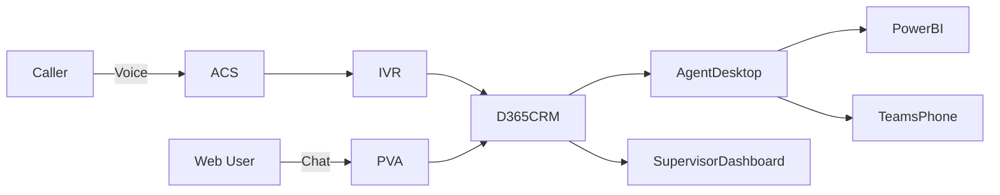

# Statement of Work

## Microsoft Dynamics 365 Cloud Contact Centre (VCC) Solution

### 1. Title: Elections Canada Virtual Cloud Contact Centre Project

### 2. Background

Elections Canada’s existing on-premises Genesys Contact Centre Service is nearing end of life, and EC must decide to evergreen the existing Genesys system and move to a new Cloud Based Virtual Cloud Contact Centre service by the Summer of 2027 at the latest. EC has been working with Shared Services Canada on the migration strategy and have recently concluded that AWS Connect at SSC’s recommendation is the VCC direction for now to address the voice component of the Elections Canada Contact Centre requirement. Possible complications in this approach are raising questions on the direction; it seems the completeness of the SSC approach is being evaluated, and EC is wanting to look again at the Microsoft’s Dynamics 365 Cloud Contact Centre (DCCC) to possibly address the entirety of the Contact Centre requirement. EC has no choice and must implement or migrate to a new Contact Centre service before July 31st, 2027, as the current CC requirement is deemed “mission critical” in support operations of all Electoral events, including General Elections and Bi-Elections.

To enable this project, EC requires the assistance of Professional Services of Cloud & Security Architects, as well as D365 Developers, Business Analysts and PM; as well as Microsoft Consulting Services for guidance and advisory. This Statement of Work is representative of the levels of effort for these professional services resources.

### 3. Objective

The objective of this engagement is to onboard the Microsoft Dynamics 365 Cloud Contact Centre solution leveraging some of the existing Dynamics 365 Enterprise licensing. However, to achieve all of the Omnichannel customer service and engagement capabilities, new Dynamics 365 licensing will be required for these EC Agents. SSC will provide the Azure Communications Services, and the integration of the Session Border Controllers and SIP Trunking. This project team’s scope will be to set up the IVR integration with the Dynamics 365 service, setup Power Virtual Agents and the Omnichannel capabilities for Caller to Agent use cases and access models (Caller to IVR; Escalated call from IVR to an Agent; Caller to Omnichannel services like Chat, Website Bot to IVR to Agent, etc.).

### 4. Service Requirements

|                       | During a General Election (peak) | During Non-Event Periods       |
| --------------------- | -------------------------------- | ------------------------------ |
| Call Volume           | 400,000+ calls in 36 days        | 70 calls per day               |
| Peak Day              | 35,000+ calls on polling day     | N/A                            |
| Agent Licenses        | 600 agents (250-300 concurrent)  | 200 agents (85-125 concurrent) |
| Supervisor Licenses   | 60 supervisors                   | 30 supervisors                 |
| Call Ports            | 3,500                            | 1,200                          |
| Business Lines        | 15 business lines                | 9 business lines               |
| 3rd Party Integration | Maximus call overflow            | Maximus call overflow          |

### 5. Professional Services Resources Required

* 1 x Sr. Dynamics 365 CRM & Power Platform Architect – Full Time
* 1 x Senior Security Architect/SA\&A Practitioner – Part Time
* 2 x Sr. Web Developers – Full Time
* 1 x QA Consultant – Part Time
* 1 x Security QA Assessor – Part Time
* 2 x Business Analysts – Full Time
* 1 x Project Manager – Full Time or Part Time

Work Duration: 12 to 18 months to full completion.

### 6. Deployment Model

#### 6A. Planning & Licensing Assessment

* **Assess contact centre requirements**: Review peak loads, agent concurrency, and required engagement channels to determine full project scope.
* **Evaluate current D365 licenses**: Analyze Elections Canada’s existing Dynamics 365 licenses to determine what can be reused.
* **Determine licensing gaps**: Identify the need for additional Omnichannel and voice channel licenses to support all scenarios.
* **Coordinate with Microsoft**: Engage with Microsoft licensing teams to receive tailored recommendations and cost-effective licensing bundles.
* **Define agent workflows**: Establish the complete agent experience using D365 CRM, Teams, and ACS capabilities.

#### 6B. Technical Setup

* **Implement DCCP stack**: Deploy Microsoft’s Digital Contact Center Platform, including Dynamics 365, ACS, PVA, and Power BI.
* **Connect SBC and SIP trunks**: Integrate with SSC-provided telecom infrastructure using certified ACS routing (or other routing service).
* **Set up Omnichannel Admin app**: Enable management and configuration of chat, voice, and messaging channels.
* **Deploy chatbot to website**: Configure pre-call deflection and support via Power Virtual Agents on EC’s public site.

#### DCCC Architecture Overview 

#### 6C. IVR, AI, and Copilot for Dynamics 365 Integration

* **Build IVR with ACS + PVA**: Configure intuitive voice menus and call handling logic with Azure and Power Virtual Agents.
* **Enable Copilot (TBD))**: Activate Copilot for Customer Service to assist agents with AI-generated responses and summaries.
* **Configure dynamic routing**: Route calls based on input and context from IVR and chatbot interactions.

#### 6D. Testing & Training

* **Conduct UAT and load tests**: Validate performance under expected call volumes and concurrency.
* **Deliver staff training**: Prepare user guides and host knowledge transfer sessions.
* **Provide sandbox environments**: Set up test environments to support training and early configuration validation.

#### 6E. Full Rollout & Optimization

* **Pilot with real users**: Launch a pilot with defined business lines and monitor usage.
* **Deploy fully and monitor**: Roll out the platform agency-wide and use telemetry for proactive monitoring.
* **Refine workflows**: Continuously optimize routing and handling based on Power BI analytics and feedback.

### 7. Deliverables

* **a) Work Plan**: A comprehensive schedule of project phases, milestones, dependencies, and mitigation strategies.
* **b) Cloud Contact Centre Roadmap**: Strategic plan showing how D365 Omnichannel maps to Elections Canada’s digital goals.
* **c) Solution Design Document**: A detailed technical specification of how all components integrate and interact.
* **d) Architecture Diagrams**: Logical and physical diagrams depicting platform setup, SIP routing, and user interfaces.
* **e) SA\&A Documentation**: All necessary security, privacy, and compliance artifacts required for production readiness.
* **f) Validated Workflows**: Documented call routing and user journeys verified with business and telecom stakeholders.
* **g) SOPs**: Procedures for managing and administering the solution post-deployment.
* **h) Technical Workshops**: Instructor-led sessions and recorded materials to ensure operational readiness across EC teams.
* **i) System Configuration & Deployment**: All activities required to implement and operationalize the D365 Omnichannel system, including configuration, code deployment, ACS routing, and agent desktop setup.
* **j) Quality Assurance Testing Results**: Test plans, scripts, and results for system testing, integration testing, user acceptance testing, and load testing.
