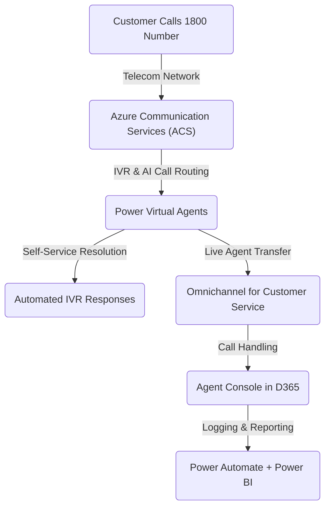
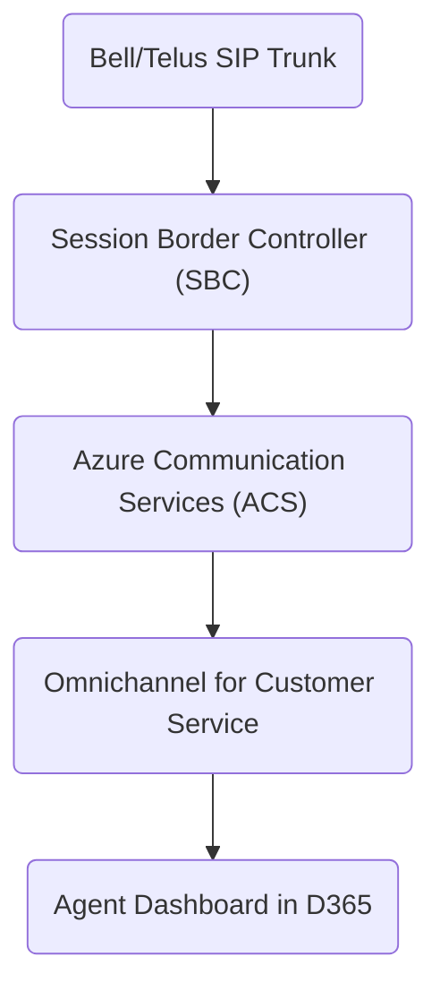
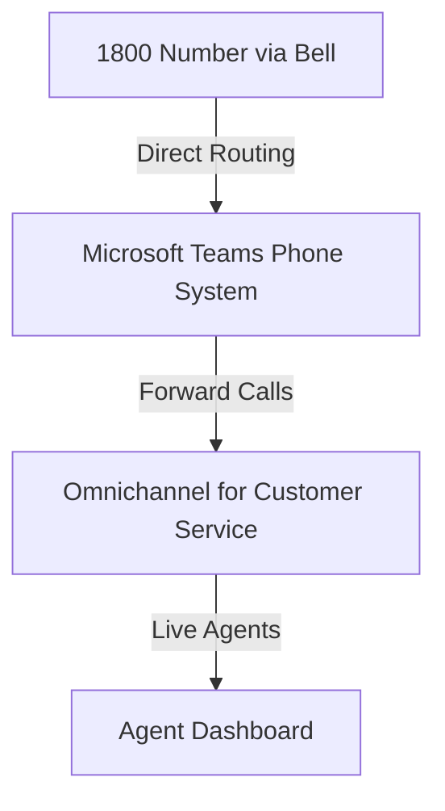
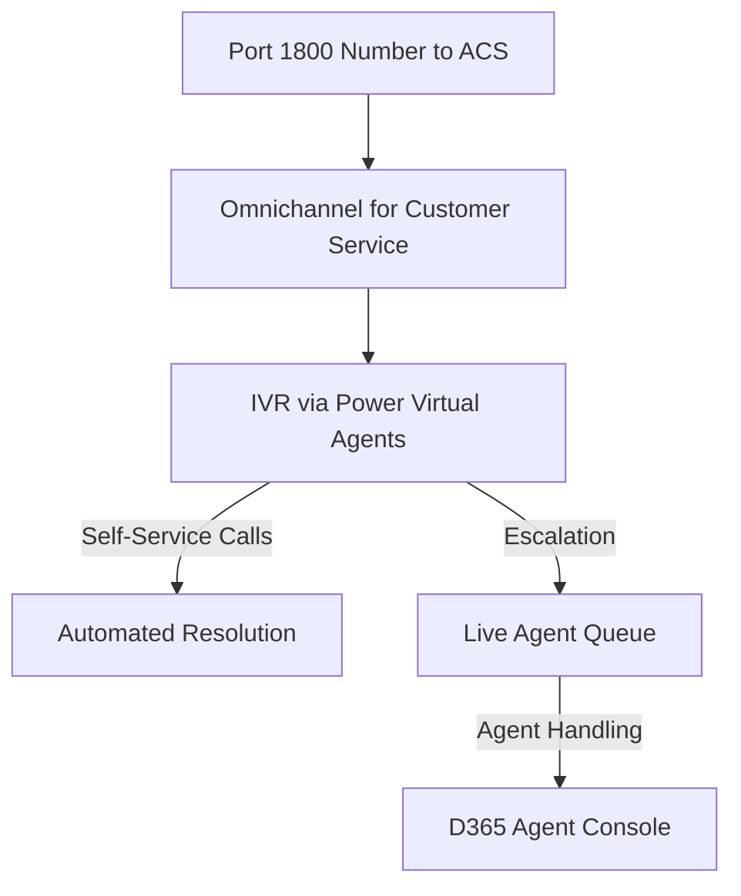
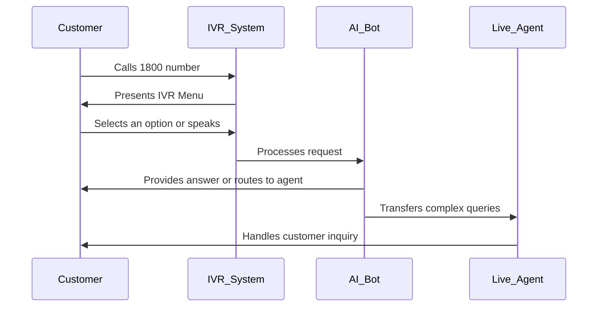

# **Comprehensive Guide: Augmenting Services with D365/Power Platform Call Centre & Voice Features for Elections Canada**

## **1. Introduction**

Elections Canada can enhance its voter support and operational efficiency by leveraging Microsoft Dynamics 365 and Power Platform call centre capabilities. These solutions provide automated call handling, IVR self-service, and omnichannel support to assist voters, election workers, and internal staff.

### **Business Benefits:**

* Improved  **voter and election staff support experience** .
* Automated **IVR for intelligent call routing** to the appropriate department.
* **Omnichannel support** across voice, chat, email, and SMS.
* **AI-powered sentiment analysis** and real-time agent assistance to improve interactions.

### **Use Cases:**

* Voter assistance and inquiries.
* Registration and polling station information.
* Support for election officers and staff.
* IT and logistics support for Elections Canada personnel.

---

## **2. Licensing Requirements**

### **Microsoft Licensing Structure for Voice Features**

* **Dynamics 365 Customer Service Enterprise** – Required for omnichannel and voice capabilities.
* **Omnichannel for Customer Service Add-on** – Enables chat, SMS, and voice.
* **Microsoft Teams Phone System** (Optional) – For voice integration with Teams.
* **Power Virtual Agents** – For AI-driven IVR chatbots handling voter queries.
* **Azure Communication Services (ACS)** – Consumption-based telephony for call routing.

### **Additional Licensing Considerations:**

* **Per-user vs. consumption-based pricing** for seasonal scalability.
* **Integration with government-approved third-party solutions** .

---

## **3. Call Centre Architecture**

### **Cloud-Based Architecture:**

* **Dynamics 365 Omnichannel for Customer Service** (Core platform for Elections Canada agents).
* **Azure Communication Services (ACS)** – Manages voice infrastructure.
* **Power Platform** – Automates workflows and reporting.
* **Microsoft Teams** – Enables internal/external call integration for election officials.
* **AI & Chatbot Integration** – Power Virtual Agents & AI Builder for automated voter assistance.

### **On-Premise & Hybrid Considerations:**

* **VPN or ExpressRoute** for secure hybrid deployments.
* **Session Border Controller (SBC)** for on-prem PSTN setups if required.

---

## **4. Technical Requirements**

### **Infrastructure Needs:**

* **Microsoft 365 Tenant with D365 Customer Service** .
* **ACS setup for PSTN** to handle inbound/outbound calls.
* **Teams integration (if required for internal collaboration)** .
* **High-bandwidth internet for VoIP call quality and election-specific spikes in traffic** .

### **Security & Compliance Considerations:**

* **Data residency compliance in Canada** .
* **Call recording policies for voter interactions and security audits** .
* **Role-based access control (RBAC) for Elections Canada call centre agents** .

---

## **5. Interactive Voice Response (IVR) Implementation**

### **IVR Setup in Power Virtual Agents + Omnichannel:**

* **No-code IVR for self-service voter inquiries** .
* **AI-driven call routing based on voter intent** (e.g., “Where do I vote?”).
* **Integration with Elections Canada voter registration databases** .

### **IVR Features & Capabilities:**

* **Multi-language support for Canada’s official languages** .
* **Queue management for handling peak election period traffic** .
* **Escalation to live agents for complex inquiries** .
* **Automated voter lookup and FAQ handling** .

---

## **6. Omnichannel Capabilities**

### **Voice & Chat Integration:**

* **Unified agent experience for managing voter inquiries** .
* **Seamless transition between voice, chat, and email for election-related support** .
* **Microsoft Teams collaboration for internal election coordination** .

### **AI-Powered Features:**

* **Sentiment analysis to detect voter frustration** and escalate issues accordingly.
* **Real-time agent assistance for faster resolution of voter concerns** .
* **Automated call summaries for audit and reporting purposes** .

---

## **7. Automation & Power Platform Enhancements**

### **Power Automate for Call Workflows:**

* **Automated logging of voter inquiries** .
* **SLA-based escalation for time-sensitive election issues** .

### **Power BI for Call Analytics:**

* **Real-time dashboards monitoring voter inquiry trends** .
* **Election day performance analytics to optimize resource allocation** .

### **AI Builder for Voice Insights:**

* **Transcription & keyword analysis for tracking election-related concerns** .
* **Predictive analytics to anticipate peak call volumes before election events** .
* **AI-driven voice pattern recognition** to detect urgency in voter interactions.

---

## **8. Deployment & Implementation Roadmap**

1. **Planning & Licensing Assessment:**
   * Evaluate licensing needs based on election cycles.
   * Identify key integration points with Elections Canada’s existing infrastructure.
2. **Technical Setup:**
   * Configure Omnichannel for voter assistance and staff support.
   * Set up Azure Communication Services for scalable call routing.
3. **IVR & AI Integration:**
   * Develop self-service IVR flows for voter queries.
   * Deploy Power Virtual Agents for automated voter information.
4. **Testing & Training:**
   * Conduct pilot deployment during pre-election preparation.
   * Train election officers and support staff on the new system.
5. **Full Rollout & Optimization:**
   * Go live during the official election period with real-time monitoring.
   * Optimize workflows based on analytics and voter feedback.

---

## **9. Case Management & AI Training Enhancements**

### **Case Management Integration Features:**

* **Seamless integration with Microsoft 365 services, including Outlook, SharePoint, and Teams** .
* **Automated case creation for voter complaints and inquiries** linked to an Elections Canada CRM.
* **AI-driven case categorization to prioritize urgent voter requests** .
* **Real-time case tracking dashboards powered by Power BI** .
* **Power Automate workflows to assign and escalate cases efficiently** .

### **AI Model Training & Optimization:**

* **Utilizing historical transcriptions and case data to refine AI models** .
* **Continuous learning based on voter sentiment analysis to improve self-service options** .
* **Automated tagging and clustering of inquiries for AI-driven insights** .
* **Predictive modeling to preemptively allocate resources based on demand forecasts** .
* **AI-assisted agent support that suggests relevant knowledge articles based on case context** .

---

## **10. Conclusion**

* **Summary of how D365/Power Platform enhances voter support and election operations** .
* **Next steps for full-scale adoption and scaling** :
* **Expand agent capacity based on expected voter engagement** .
* **Enhance IVR capabilities for self-service efficiency** .
* **Integrate with other government agencies for seamless information sharing** .
* **Continuously optimize workflows using Power Automate and Power BI insights** .
* **Ensure high security and compliance standards for handling voter data** .
* **Future-proofing with AI-powered automation** :
* **Implement AI-driven case resolution for common voter issues** .
* **Use predictive analytics to allocate resources efficiently during elections** .
* **Leverage natural language processing (NLP) for improved chatbot interactions** .
* **Enable real-time sentiment analysis to assist with voter frustration management** .
* **Develop proactive voter engagement strategies using AI insights** .

# **Migrating to Microsoft Azure & M365 Telephony Services**

## **A Comprehensive Guide for Leveraging Dynamics 365 & Omnichannel for Voice & IVR Integration**

---

## **1. Introduction**

Many organizations rely on traditional **telecom call centers** (e.g., Bell, Rogers, Telus) to manage customer interactions.

By migrating to **Microsoft Azure Communication Services (ACS)** and  **Microsoft 365 telephony solutions** , organizations can **modernize their call center** to provide:

* **AI-powered call routing & IVR automation**
* **Unified customer interactions across voice, chat, and email**
* **Scalability and cost efficiency**
* **Deep integration with Dynamics 365 and Microsoft Teams**

---

## **2. Business Benefits of Migration**

### **Key Benefits:**

✅ **Cost Savings** – Reduce dependence on expensive telecom services.

✅ **Cloud Scalability** – Handle millions of calls dynamically.

✅ **AI & IVR Automation** – Improve self-service with virtual agents.

✅ **Omnichannel Communication** – Customers can call, chat, email, or text seamlessly.

✅ **Advanced Analytics** – Use Power BI to track customer interactions and agent performance.

### **Challenges & Considerations:**

❌ **Telephony Migration Complexity** – Number porting and SIP trunking setup may require expertise.

❌ **Licensing Costs** – Microsoft 365 and ACS have different pricing models.

❌ **Agent Training** – Agents need to adapt to the new system and interface.

---

## **3. Licensing & Cost Considerations**

### **Microsoft Licensing for Cloud Telephony**

| **Feature**                          | **License Required**               |
| ------------------------------------------ | ---------------------------------------- |
| **Omnichannel & Voice Capabilities** | Dynamics 365 Customer Service Enterprise |
| **Telephony Integration (PSTN)**     | Azure Communication Services (ACS)       |
| **IVR & Call Routing**               | Power Virtual Agents                     |
| **Chat, Email, SMS**                 | Omnichannel for Customer Service Add-On  |
| **Automation & Case Management**     | Power Automate                           |
| **Agent Performance Analytics**      | Power BI Pro                             |

### **Estimated Costs**

* **D365 Omnichannel License:** $150-200 per agent/month
* **Azure Communication Services (ACS) PSTN Usage:** ~$0.004-0.013 per minute
* **Power Virtual Agents for IVR AI Conversations:** ~$200 per 50K messages

---

## **4. Call Center Architecture**

### **Cloud-Based Call Center with Microsoft Omnichannel**

### **Core Components**

1. **Azure Communication Services (ACS)** – Cloud-based telephony
2. **Power Virtual Agents (PVA)** – AI-driven IVR & call routing
3. **Dynamics 365 Omnichannel** – Live agent call handling
4. **Power Automate & Power BI** – Automation & analytics

---

## **5. Telco Integration Options**

### **Option 1: SIP Trunking via SBC (Session Border Controller) - using Telus/Bell as example (not required)**

✅ **Retains existing telco contracts**

❌ **Requires SBC hardware & setup**

### **Option 2: Microsoft Teams Direct Routing**

✅ **Unifies calls in Teams**

❌ **Requires additional licensing for Teams Phone**

### **Option 3: Full Migration to Azure Communication Services**

✅ **Fully cloud-native**

❌ **Requires number porting**

---

## **6. IVR Call Routing & AI Automation**

### **IVR Call Flow**

✅ **AI-powered call classification**

✅ **Self-service automation**

---

## **7. Deployment Plan**

### **Phase 1: Pilot & Testing (3-6 Months)**

* Configure **Omnichannel & IVR for a small agent group**
* Deploy **test voice services (ACS or SIP trunk)**
* Train agents & test call routing

### **Phase 2: Full Migration & Rollout (6-12 Months)**

* Implement **production IVR & AI automation**
* Train **all agents on Omnichannel UI & workflows**
* Migrate **inbound call flows from Bell/Rogers**

### **Phase 3: Optimization & Scaling (12+ Months)**

* Expand **Power Virtual Agents AI for self-service**
* Automate **follow-ups, case logging with Power Automate**
* Optimize **customer analytics via Power BI**

---

## **8. Benefits for Agents Using Microsoft 365**

### **Why Existing M365 Users Benefit from Omnichannel**

✅ **Familiar UI & Single Sign-On (SSO)** – Use Microsoft 365 login for seamless access

✅ **Microsoft Teams Integration** – Agents collaborate with internal experts

✅ **Unified Telephony & Chat** – Manage calls, chats, and emails from one dashboard

✅ **AI-Powered Suggestions & Analytics** – Power BI & AI improve customer interactions

---

## **9. Conclusion & Next Steps**

### **Next Steps**

1. Choose **integration method (SBC, Teams, ACS)**
2. Pilot **Omnichannel setup & IVR call flow**
3. Migrate & **scale based on customer needs**

🚀 **Microsoft Omnichannel + AI-powered IVR = Future of Call Centers!** 🚀
