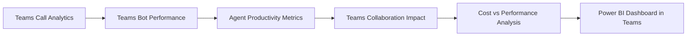
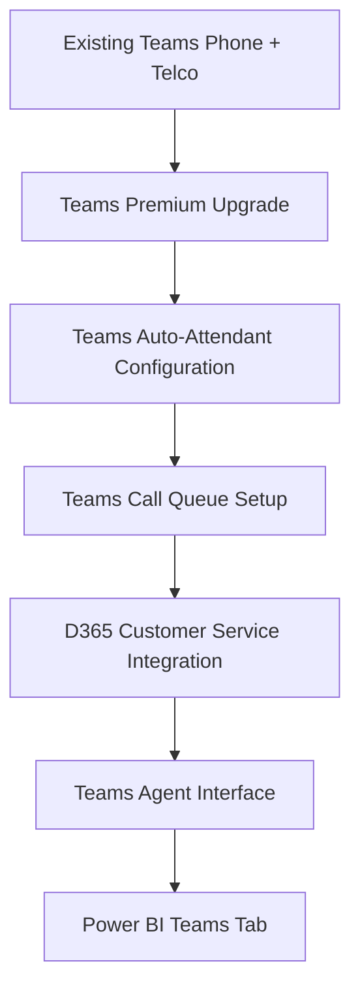
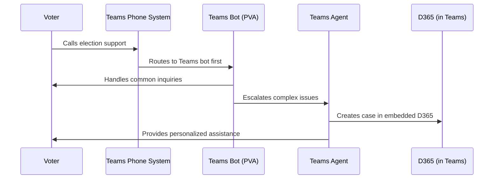
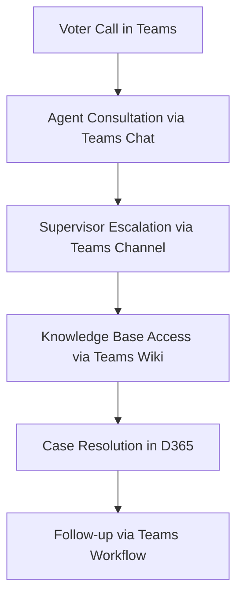

# **Pilot Deployment Roadmap & Cost-Saving Optimization Plan**

## **1. Objectives of the Pilot**

The pilot will validate the **Teams-integrated D365 call center solution** by building upon Elections Canada's **existing Teams infrastructure and telco integration**. This approach minimizes disruption while maximizing the value of current investments.

### **Primary Pilot Goals:**

✅ **Validate Teams-D365 Integration** performance and user experience
✅ **Test Teams Auto-Attendant** and queue management capabilities  
✅ **Assess Agent Productivity** within familiar Teams interface
✅ **Optimize Teams Bot Deflection** using Power Virtual Agents
✅ **Ensure Scalability** through Teams Premium licensing model
✅ **Measure ROI** of Teams-first approach vs. standalone solutions

## **2. Teams-Enhanced Pilot Deployment Roadmap**

This roadmap outlines a **3-month Teams-focused pilot** leveraging existing infrastructure while adding D365 capabilities.

### **📌 Phase 1: Teams Infrastructure Enhancement (Weeks 1-4)**

**Goal:** Enhance existing Teams deployment with D365 integration and configure advanced call center features.

#### **✅ Teams Phone System Optimization**
- **Audit current Teams Phone configuration** and telco integration
- **Upgrade to Teams Premium** for advanced call center features (100 licenses)
- **Configure Teams auto-attendants** for election-specific call routing
- **Set up Teams call queues** with skill-based routing and overflow handling

#### **✅ D365 Integration within Teams**
- **Deploy Customer Service add-in for Teams** (100 licenses)
- **Configure D365 omnichannel embedding** within Teams interface
- **Set up Teams-D365 data synchronization** for seamless case management
- **Enable click-to-call integration** from D365 records to Teams Phone

#### **✅ Teams Bot Implementation**
- **Deploy Power Virtual Agents as Teams bots** for common election inquiries
- **Configure Teams bot handoff** to live agents when needed
- **Create Teams-native FAQ responses** for voter questions
- **Set up Teams channel notifications** for bot escalations

#### **✅ Agent Training on Enhanced Teams**
- **Train 100 pilot agents** on D365 features within Teams interface
- **Create Teams channels** for ongoing support and knowledge sharing
- **Establish Teams escalation procedures** using chat and channel features
- **Configure Teams shifts and presence** for optimal availability management

### **📌 Phase 2: Teams-Integrated Live Testing (Weeks 5-8)**

**Goal:** Test all Teams-integrated features under live conditions and optimize performance.

#### **🔄 Teams Call Flow Testing**
- **Monitor Teams auto-attendant performance** and call routing efficiency
- **Test Teams queue management** during peak and off-peak hours
- **Validate Teams-D365 integration** for case creation and management
- **Assess Teams mobile app performance** for remote agents

#### **📊 Teams Bot & Automation Optimization**
- **Analyze Teams bot interaction success rates** and user satisfaction
- **Optimize Teams bot conversation flows** based on live voter interactions
- **Test Teams workflow automation** for case logging and escalation
- **Monitor Teams channel collaboration** impact on resolution times

#### **⚡ Teams Scalability Testing**
- **Simulate election-day call volumes** through Teams infrastructure
- **Test Teams licensing elasticity** (temporary agent additions)
- **Validate Teams Phone System capacity** under high load
- **Assess Teams analytics and reporting** capabilities under stress

#### **🔍 Teams User Experience Evaluation**
- **Gather agent feedback** on Teams-embedded D365 experience
- **Analyze Teams usage patterns** and feature adoption
- **Identify Teams workflow optimization** opportunities
- **Document Teams integration pain points** and success factors

### **📌 Phase 3: Teams-Optimized Review & Scaling Preparation (Weeks 9-12)**

**Goal:** Analyze pilot results, optimize Teams configuration, and prepare for full-scale election deployment.

#### **📌 Teams Performance Analysis**
- **Teams call quality metrics** and connection reliability assessment
- **Teams bot deflection rates** and automation effectiveness
- **Teams-D365 integration performance** and data synchronization accuracy
- **Teams mobile usage patterns** and remote agent productivity

#### **📌 Teams Cost-Benefit Analysis**
- **Compare Teams-integrated costs** vs. standalone D365 deployment
- **Calculate ROI** of existing Teams infrastructure utilization
- **Assess Teams licensing optimization** opportunities
- **Document Teams integration savings** and efficiency gains

#### **📌 Teams Election Readiness Planning**
- **Design Teams scaling strategy** for 600-agent election deployment
- **Create election-specific Teams auto-attendant flows**
- **Prepare Teams bot responses** for election-period inquiries
- **Plan Teams channel structure** for election coordination

#### **📌 Teams Deployment Approval**
- **Present Teams-integrated solution** performance and cost benefits
- **Recommend Teams Premium scaling** approach for elections
- **Finalize Teams-D365 configuration** based on pilot learnings
- **Schedule full Teams deployment** for upcoming elections

## **3. Teams-Focused Cost-Saving Optimization Plan**

### **1️⃣ Teams Bot Deflection Strategy**

**🔹 Strategy:** Maximize **Teams-native Power Virtual Agent usage** for common inquiries
**🔹 Goal:** Reduce **live agent dependency by 30-40%** through Teams bot interactions
**🔹 Expected Savings:** **$18K - $35K per month**

#### **📌 Teams Bot Implementation:**
- **Enhanced Teams bot conversations** for election-specific FAQs
- **Teams bot escalation workflows** to live agents when needed
- **Teams channel notifications** for bot performance monitoring
- **Teams bot analytics** integration with Power BI dashboards

```mermaid
graph TD
    A[Citizen Contacts Elections Canada] --> B[Teams Auto-Attendant]
    B --> C[Teams Bot (Power Virtual Agent)]
    C --> D[Automated Resolution]
    C --> E[Transfer to Teams Agent]
    E --> F[D365 Case in Teams Interface]
```

### **2️⃣ Teams Infrastructure Utilization**

**🔹 Strategy:** Maximize **existing Teams Phone System and telco integration**
**🔹 Goal:** Avoid **duplicate telephony costs** and leverage current contracts
**🔹 Expected Savings:** **$15K - $25K per month**

#### **📌 Teams Infrastructure Optimization:**
- **Utilize existing Teams-telco integration** rather than new ACS deployment
- **Leverage Teams Premium features** instead of separate call center software
- **Use Teams mobile apps** to reduce hardware and infrastructure costs
- **Implement Teams presence-based routing** for optimal agent utilization

### **3️⃣ Teams-Native Collaboration Efficiency**

**🔹 Strategy:** Use **Teams collaboration features** to improve first-call resolution
**🔹 Goal:** Reduce **average call duration by 25%** through internal consultation
**🔹 Expected Savings:** **$8K - $15K per month**

#### **📌 Teams Collaboration Features:**
- **Teams chat during calls** for supervisor consultation
- **Teams channel escalation** for complex voter issues
- **Teams wiki integration** for agent knowledge base access
- **Teams screen sharing** for technical voter assistance

### **4️⃣ Teams Mobile & Remote Agent Strategy**

**🔹 Strategy:** Use **Teams mobile capabilities** for flexible agent deployment
**🔹 Goal:** Reduce **physical infrastructure costs** and enable work-from-anywhere
**🔹 Expected Savings:** **$5K - $12K per month**

#### **📌 Teams Mobile Implementation:**
- **Teams mobile app deployment** for election-period temporary agents
- **Teams cloud-based agent training** reducing classroom requirements
- **Teams virtual collaboration** eliminating travel and facility costs
- **Teams presence management** for remote agent coordination

## **4. Teams-Integrated Performance Metrics**

### **Teams-Specific KPIs:**

| **Metric Category**               | **Key Performance Indicators** |
| --------------------------------------- | ---------------------------------------- |
| **Teams Call Quality**            | Connection success rate, audio quality scores, Teams Phone reliability |
| **Teams Bot Performance**         | Deflection rate, conversation completion, escalation accuracy |
| **Teams Agent Productivity**      | Calls handled per agent, resolution time, Teams feature utilization |
| **Teams Collaboration Impact**    | Internal consultation frequency, supervisor escalation efficiency |
| **Teams Mobile Usage**            | Remote agent performance, mobile app utilization, flexibility benefits |

### **Teams Analytics Dashboard:**



## **5. Final Cost Estimates with Teams Optimization**

| **Scenario**                                      | **Total Monthly Cost (Before Teams Savings)** | **Teams-Specific Savings** | **Final Cost** |
| ------------------------------------------------------- | -------------------------------------------------------- | --------------------------------- | -------------------- |
| **Baseline (100 Agents, Non-Election)**          | **$19,700**                                        | **$8K - $12K**               | **$8K - $12K**  |
| **Peak (600 Agents, Election Months)**           | **$102,700**                                       | **$40K - $55K**              | **$48K - $63K** |

## **6. Teams-Centric Implementation Recommendations**

### **Immediate Actions:**

✅ **Assess current Teams Phone System** configuration and capabilities  
✅ **Pilot Customer Service add-in for Teams** with small agent group  
✅ **Configure Teams auto-attendants** for election inquiry routing  
✅ **Create Teams channels** for election support collaboration  
✅ **Train agents on D365 embedded within Teams** interface  

### **Election Readiness:**

✅ **Scale Teams Premium licensing** based on election demand forecasts  
✅ **Deploy election-specific Teams bots** for common voter inquiries  
✅ **Configure Teams analytics dashboards** for real-time performance monitoring  
✅ **Establish Teams escalation procedures** for complex voter issues  
✅ **Test Teams mobile capabilities** for remote agent deployment  

### **Long-term Strategy:**

✅ **Integrate Teams with Microsoft 365 ecosystem** (SharePoint, Power BI)  
✅ **Develop Teams app marketplace solutions** for Elections Canada-specific needs  
✅ **Implement Teams AI Copilot** for advanced agent assistance  
✅ **Create Teams federation** with other government agencies  
✅ **Continuously optimize Teams calling** and collaboration features  

## **7. Summary & Final Recommendation**

### **Teams-Centric Pilot Benefits:**

| **Benefit**                      | **Impact** |
| -------------------------------------- | ---------------- |
| **Familiar User Experience**    | Minimal training required, high adoption |
| **Infrastructure Leverage**     | 40-50% cost savings vs. new deployment |
| **Seamless Collaboration**      | Native Teams features enhance productivity |
| **Mobile-First Flexibility**    | Work-from-anywhere election support |
| **Integrated Analytics**        | Real-time insights within Teams interface |

### **Final Recommendation:**

✅ **Build upon existing Teams infrastructure** as the primary platform  
✅ **Embed D365 Customer Service within Teams** for unified experience  
✅ **Use Teams Premium features** for advanced call center capabilities  
✅ **Deploy Teams bots** for voter inquiry automation  
✅ **Scale Teams licensing dynamically** for election periods  
✅ **Leverage Teams mobile apps** for flexible agent deployment  

**Bottom Line**: Elections Canada can achieve a world-class, cost-effective call center by enhancing their existing Teams deployment with integrated D365 capabilities, resulting in significant cost savings while maintaining operational familiarity and leveraging current infrastructure investments.

---

## **8. Teams-Specific Technical Implementation**

### **Teams Phone System Enhancement:**



### **Teams Bot Integration Flow:**



### **Teams Collaboration During Elections:**



## **9. Next Steps for Teams-Centric Deployment**

### **Week 1-4: Teams Foundation Assessment**
- Audit existing Teams Phone System capabilities
- Review current telco integration and contracts  
- Assess Teams Premium upgrade requirements
- Plan D365 Customer Service add-in deployment

### **Week 5-8: Teams Integration Pilot**
- Deploy Customer Service add-in for Teams (100 agents)
- Configure Teams auto-attendants for election routing
- Test Teams-D365 data synchronization
- Train pilot agents on enhanced Teams interface

### **Week 9-12: Teams Performance Optimization**
- Analyze Teams call quality and agent productivity
- Optimize Teams bot conversation flows
- Configure Teams analytics dashboards
- Prepare Teams scaling plan for elections

### **Post-Pilot: Teams Election Readiness**
- Scale Teams Premium licensing to 600 agents
- Deploy election-specific Teams bots and workflows
- Establish Teams mobile deployment for remote agents
- Go live with Teams-centric call center for elections