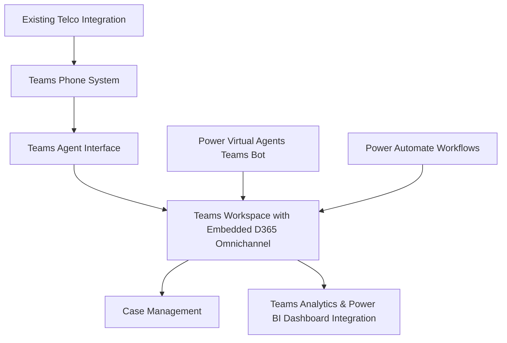
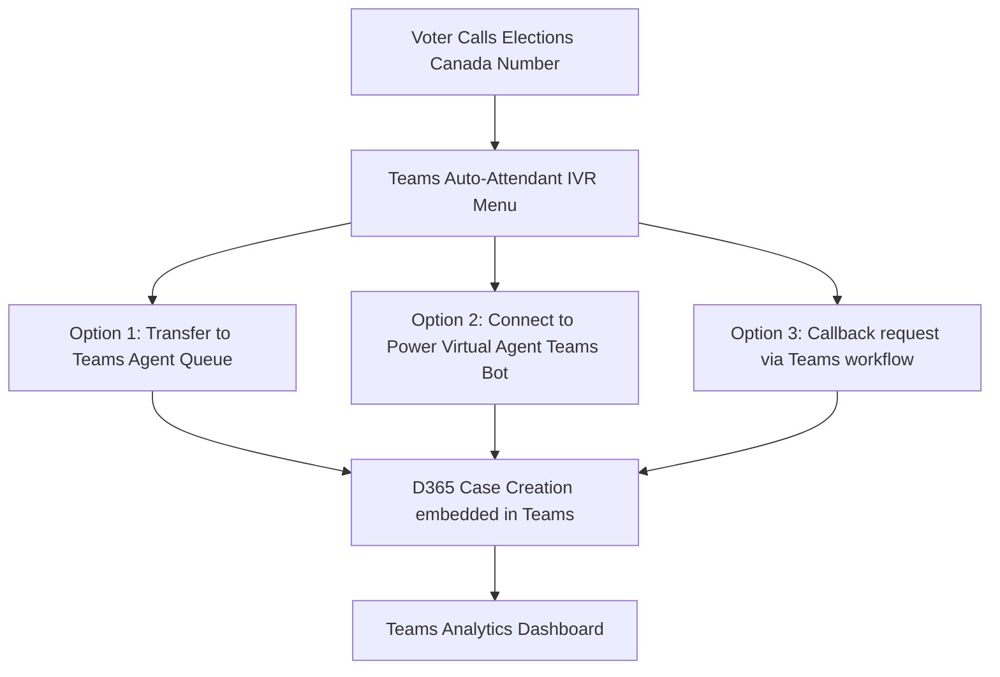
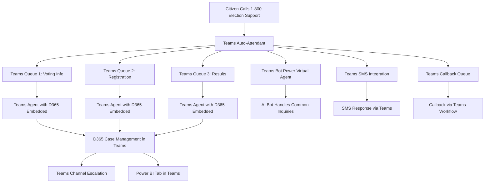
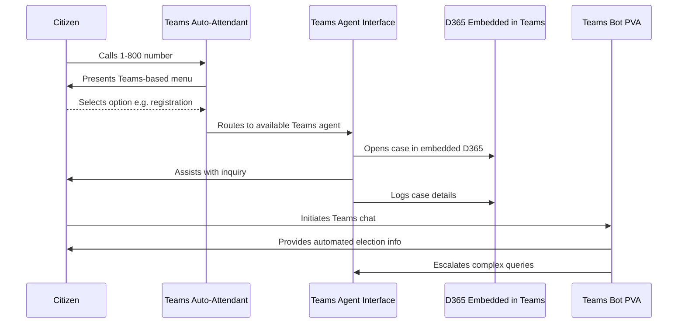
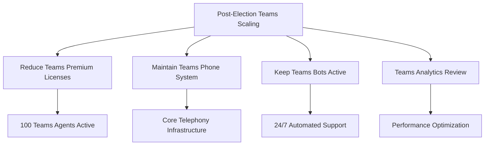
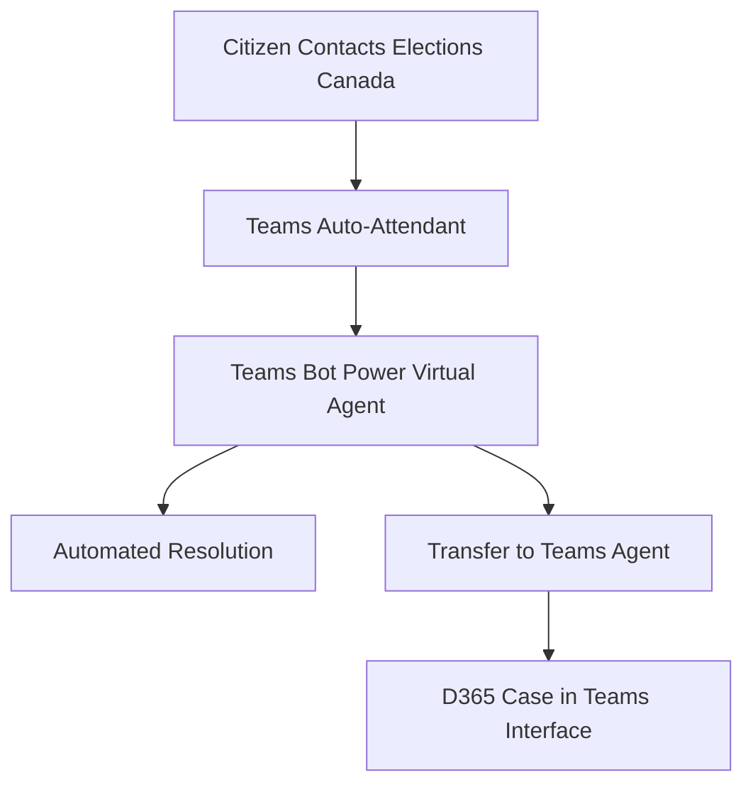
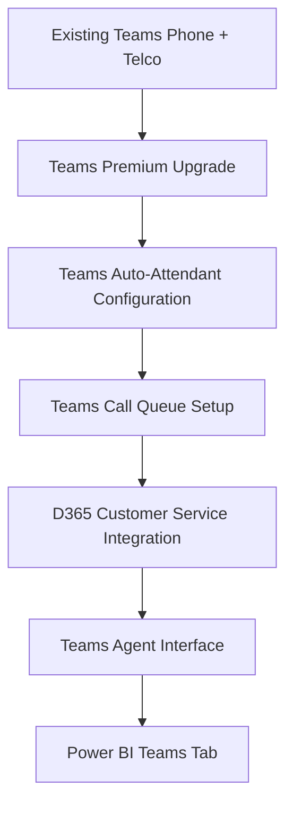
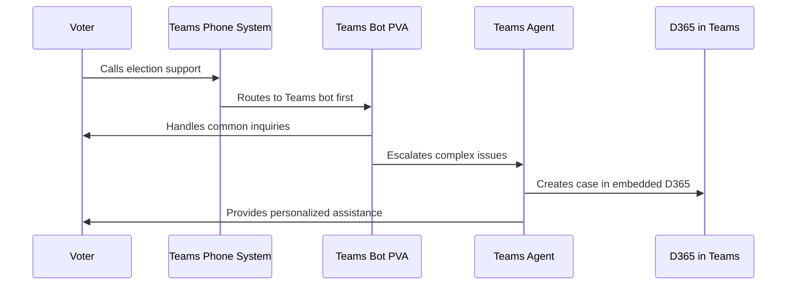
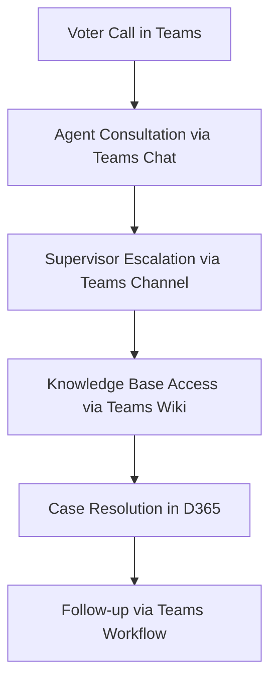

# **Comprehensive Guide - Teams-Centric D365/Power Platform Call Centre & Voice Features for Elections Canada**

## **1. Introduction**

Elections Canada can enhance its voter support and operational efficiency by leveraging its **existing Microsoft Teams infrastructure** integrated with **Dynamics 365 and Power Platform** call centre capabilities. This approach builds upon Elections Canada's current Teams deployment and telco integration to provide automated call handling, IVR self-service, and omnichannel support.

### **Business Benefits:**

* **Leverages existing Teams investment** and agent familiarity
* **Unified agent experience** within Teams interface for all voter interactions
* Automated **IVR for intelligent call routing** directly through Teams Phone System
* **Omnichannel support** embedded in Teams workspace (voice, chat, email, SMS)
* **AI-powered sentiment analysis** and real-time agent assistance within Teams environment
* **Seamless internal collaboration** using existing Teams channels and expertise

### **Use Cases:**

* Voter assistance and inquiries handled through Teams interface
* Registration and polling station information via Teams-integrated D365
* Support for election officers using familiar Teams collaboration tools
* IT and logistics support leveraging Teams presence and availability

---

## **2. Licensing Requirements**

### **Microsoft Licensing Structure for Teams-Integrated Voice Features**

* **Microsoft Teams Phone System** – Core telephony (already deployed at Elections Canada)
* **Dynamics 365 Customer Service Enterprise** – Required for omnichannel and case management
* **Customer Service add-in for Microsoft Teams** – Embeds D365 capabilities in Teams
* **Power Virtual Agents** – For AI-driven IVR chatbots integrated with Teams
* **Azure Communication Services (ACS)** – Enhanced telephony features and call automation

### **Additional Licensing Considerations:**

* **Teams Premium** – For advanced calling features and analytics
* **Power Platform integration** for workflow automation within Teams
* **Call recording and compliance** features through Teams Phone System

---

## **3. Teams-Centric Call Centre Architecture**

### **Core Architecture:**

* **Microsoft Teams Phone System** (Primary telephony platform - existing infrastructure)
* **D365 Customer Service embedded in Teams** – Unified agent workspace
* **Teams-native omnichannel** – Voice, chat, email integration within Teams interface
* **Power Virtual Agents integrated with Teams** – AI chatbots accessible from Teams
* **Power Platform workflows** – Automated processes triggered from Teams interactions
* **Teams collaboration features** – Internal escalation and knowledge sharing

### **Architecture Diagram:**

### **Integration Benefits:**

* **Single pane of glass**: All voter interactions managed within Teams
* **Familiar interface**: Agents use existing Teams skills and workflows
* **Native collaboration**: Instant escalation to supervisors via Teams chat/calls
* **Mobile flexibility**: Teams mobile apps enable remote agent capabilities

---

## **4. Technical Requirements**

### **Infrastructure Needs:**

* **Existing Teams Phone System** (already deployed)
* **D365 Customer Service licenses** with Teams integration
* **Customer Service add-in for Teams** deployment
* **Enhanced bandwidth** for combined Teams calling and D365 data synchronization
* **Teams Premium licensing** for advanced call center features

### **Security & Compliance Considerations:**

* **Teams native call recording** for voter interaction compliance
* **Data residency** maintained through existing Teams Canadian data centers
* **Role-based access control** through Teams and D365 integration
* **Compliance policies** managed through Teams admin center

---

## **5. Teams-Integrated IVR Implementation**

### **IVR Setup via Teams Phone System + Power Virtual Agents:**

* **Teams auto-attendant** for initial call routing
* **Power Virtual Agents** deployed as Teams bots for complex queries
* **Seamless transfer** from bot to live Teams agent
* **Integration with Elections Canada databases** through Teams-connected D365

### **Teams IVR Features & Capabilities:**

* **Multi-language support** using Teams language packs
* **Teams queue management** for handling peak election traffic
* **Intelligent routing** based on Teams presence and availability
* **Call park and transfer** using native Teams features

### **Implementation Flow:**

---

## **6. Teams-Native Omnichannel Capabilities**

### **Unified Agent Experience in Teams:**

* **Teams phone calls** with embedded D365 customer information
* **Teams chat** for internal consultation during voter calls
* **Email integration** through Outlook within Teams
* **Screen sharing** for complex voter assistance scenarios

### **AI-Powered Features Within Teams:**

* **Real-time transcription** during Teams calls with voter sentiment analysis
* **Teams bot suggestions** for quick responses to common voter queries
* **Power BI integration** within Teams for real-time performance dashboards
* **Automated case summarization** posted to Teams channels for supervisors

---

## **7. Teams-Enhanced Automation & Power Platform**

### **Power Automate Workflows Triggered from Teams:**

* **Automated case logging** when Teams calls end
* **Teams notifications** for SLA-based escalations
* **Workflow approvals** through Teams adaptive cards
* **Integration with SharePoint** for document management within Teams

### **Power BI Dashboards in Teams:**

* **Real-time agent performance** displayed as Teams tabs
* **Election day analytics** accessible within Teams channels
* **Call volume trends** shared across Teams departments
* **Supervisor dashboards** pinned to Teams channels

### **AI Builder Integration:**

* **Teams meeting transcription** analysis for training purposes
* **Automated tagging** of voter inquiries through Teams bot interactions
* **Predictive analytics** displayed within Teams for resource planning

---

## **8. Teams-Centric Deployment & Implementation Roadmap**

1. **Teams Assessment & Enhancement:**
   * Evaluate current Teams Phone System capabilities
   * Upgrade to Teams Premium if needed for advanced call center features
   * Configure Teams auto-attendants and call queues

2. **D365 Integration with Teams:**
   * Deploy Customer Service add-in for Teams
   * Configure D365 omnichannel embedding within Teams interface
   * Set up Teams-D365 data synchronization

3. **Power Platform Integration:**
   * Deploy Power Virtual Agents as Teams bots
   * Create Power Automate workflows triggered from Teams interactions
   * Embed Power BI dashboards as Teams tabs

4. **Agent Training & Transition:**
   * Train agents on D365 features within familiar Teams interface
   * Establish Teams channels for ongoing support and knowledge sharing
   * Create Teams-based training materials and resources

5. **Go-Live & Optimization:**
   * Soft launch with pilot agent group using Teams interface
   * Monitor performance through Teams admin center and Power BI
   * Optimize based on Teams usage analytics and agent feedback

---

## **9. Teams-Enhanced Case Management & AI Training**

### **Case Management Within Teams:**

* **Seamless case creation** from Teams calls with automatic context capture
* **Teams channel integration** for case collaboration and escalation
* **SharePoint document integration** accessible within Teams case interface
* **Teams bot notifications** for case updates and SLA alerts
* **Power BI case analytics** embedded as Teams dashboard tabs

### **AI Model Training Using Teams Data:**

* **Teams call transcriptions** for improving AI model accuracy
* **Teams chat analysis** for understanding agent-supervisor collaboration patterns
* **Power Virtual Agent optimization** based on Teams bot interaction data
* **Predictive modeling** using Teams usage patterns and historical call data
* **Teams-integrated knowledge base** suggestions based on successful case resolutions

---

## **10. Conclusion**

### **Teams-Centric Implementation Benefits:**

* **Minimal disruption**: Builds on existing Teams infrastructure and user familiarity
* **Cost efficiency**: Leverages existing Teams Phone System investment
* **Enhanced collaboration**: Native Teams features improve internal communication
* **Scalability**: Teams infrastructure can handle election period volume spikes
* **Future-ready**: Positions Elections Canada for ongoing Microsoft ecosystem evolution

### **Next Steps for Teams-Centric Adoption:**

* **Assess current Teams deployment** and identify enhancement opportunities
* **Plan D365 integration** that maximizes Teams interface utilization
* **Design Teams channels** for different election support functions
* **Implement Power Platform tools** that work seamlessly within Teams
* **Train agents** on enhanced Teams capabilities with embedded D365 features

### **Future-Proofing with Teams Integration:**

* **Teams AI Copilot integration** for advanced agent assistance
* **Teams Premium features** for enhanced call center capabilities
* **Microsoft Viva integration** for agent training and knowledge management
* **Teams platform extensibility** for custom Elections Canada applications
* **Cross-government Teams federation** for inter-agency collaboration during elections

---

# **Scalable Teams-Based Microsoft Call Center for Elections Canada**

## **1. Overview**

Elections Canada requires a **periodic scalable call center** that leverages their **existing Microsoft Teams infrastructure** to handle **high-volume inquiries during elections** while maintaining a **smaller baseline operation during non-election periods**. This document outlines an **optimized, cost-effective, and Teams-centric** solution that builds upon the current **Teams Phone System with telco integration**.

### **Key Objectives**

✅ **Teams-Native**: All agent interactions occur within familiar Teams interface
✅ **Scalable**: Dynamically **scale up** during elections using Teams licensing flexibility
✅ **Inbound-Only**: All interactions (**Teams calls, chat, SMS, social messages**) are inbound
✅ **Cost-Effective**: Uses **Teams Premium + D365 monthly licensing** for optimal cost management
✅ **Omnichannel**: Unified experience across **Teams Phone, Teams Chat, email, and social media**
✅ **AI & Automation**: Teams bots and Power Platform integration reduce agent workload

## **2. Teams-Centric High-Level Architecture**

### **Scalable Teams Call Center Model**

### **Teams Integration Benefits:**

* **Familiar Interface**: Agents work within existing Teams environment
* **Native Collaboration**: Instant supervisor consultation via Teams chat during calls
* **Mobile Flexibility**: Teams mobile apps enable work-from-anywhere capabilities
* **Integrated Analytics**: Power BI dashboards embedded as Teams tabs
* **Seamless Escalation**: Complex cases escalated through Teams channels

## **3. Teams-Enhanced Implementation Plan**

### **📌 Phase 1: Teams Foundation Enhancement (Baseline, 100 Agents)**

- **Enhance Existing Teams Phone System**
  - Upgrade to **Teams Premium** for advanced call center features
  - Configure **Teams auto-attendants** for election-specific routing
  - Set up **Teams call queues** with skill-based routing
  
- **Deploy D365 Customer Service Integration**
  - Install **Customer Service add-in for Teams**
  - Configure **D365 omnichannel embedded within Teams interface**
  - Enable **click-to-call integration** from D365 records to Teams
  
- **Implement Teams-Native Automation**
  - Deploy **Power Virtual Agents as Teams bots**
  - Create **Teams workflows** for automated case creation
  - Set up **Teams channel notifications** for escalations

### **📌 Phase 2: Teams-Based Election Scaling (General & By-Elections)**

- **Scale Teams Licensing**
  - Increase from **100 to 600 Teams Premium licenses**
  - Add **temporary D365 Customer Service licenses** for seasonal agents
  - Enable **Teams Phone System** for all election agents
  
- **Expand Teams Omnichannel Capabilities**
  - Activate **Teams chat, SMS, and social media** integration
  - Deploy **election-specific Teams bots** for FAQ automation
  - Configure **Teams presence-based routing** for optimal agent distribution
  
- **Teams-Integrated Election Support**
  - Create **election-specific Teams channels** for different query types
  - Update **Teams auto-attendant** with election-specific prompts
  - Deploy **Power BI election dashboards** as Teams tabs

### **📌 Phase 3: Teams-Optimized Post-Election Scaling**

- **Teams License Management**
  - Scale down **Teams Premium licenses from 600 → 100**
  - Maintain **Teams Phone System** for core agent pool
  - Keep **Power Virtual Agents** active for 24/7 Teams bot support
  
- **Teams Analytics & Optimization**
  - Analyze **Teams call quality metrics** and agent performance
  - Optimize **Teams auto-attendant flows** based on usage data
  - Maintain **Teams channel knowledge base** for ongoing support

## **4. Teams-Centric Cost Breakdown**

### **📌 Baseline Monthly Costs (Non-Election Period, 100 Agents)**

| **Cost Category**                         | **Unit Cost** | **Users** | **Total Cost** |
| ----------------------------------------------- | ------------------- | --------------- | -------------------- |
| Teams Premium (with Phone System)              | $22                 | 100             | $2,200               |
| D365 Customer Service Enterprise                | $105                | 100             | $10,500              |
| Customer Service add-in for Teams              | $20                 | 100             | $2,000               |
| Power Virtual Agents (Teams bot)               | Fixed               | -               | $1,000               |
| Teams calling usage (existing telco)           | $0.008/min          | 500K mins       | $4,000               |
| **Total Non-Election Monthly Cost**      |                     |                 | **$19,700**    |

### **📌 Peak Election Period Costs (600 Agents)**

| **Cost Category**                   | **Unit Cost** | **Users** | **Total Cost** |
| ----------------------------------------- | ------------------- | --------------- | -------------------- |
| Teams Premium (with Phone System)        | $22                 | 600             | $13,200              |
| D365 Customer Service Enterprise          | $105                | 600             | $63,000              |
| Customer Service add-in for Teams        | $20                 | 600             | $12,000              |
| Power Virtual Agents (Teams bot)         | Fixed               | -               | $2,500               |
| Teams calling usage (peak volume)        | $0.008/min          | 1.5M mins       | $12,000              |
| **Total Election Month Cost**       |                     |                 | **$102,700**   |

### **📌 Teams Integration Cost Savings**

| **Teams Advantage**                      | **Savings vs. Standalone** |
| ---------------------------------------------- | --------------------------------- |
| Existing Teams Phone System utilization       | $15K - $25K/month                 |
| No additional softphone licensing required    | $5K - $10K/month                  |
| Reduced training costs (familiar interface)   | $10K - $15K one-time              |
| Native collaboration reduces support overhead | $3K - $5K/month                   |

## **5. Teams-Specific ROI & Optimization Strategies**

### **Teams-Native Cost Optimization**

| **Strategy**                                   | **Potential Savings** | **Implementation** |
| ---------------------------------------------------- | --------------------------- | ------------------------ |
| Teams Bot Deflection (Reduce Human Calls)           | $15K - $30K/month           | Enhanced Power Virtual Agents |
| Teams Presence-Based Routing (Efficiency)           | $8K - $12K/month            | Smart queue management   |
| Teams Mobile for Remote Agents (Reduced Overhead)   | $5K - $10K/month            | Work-from-anywhere model |
| Teams Channel Knowledge Sharing (Faster Resolution) | $3K - $8K/month             | Collaborative problem-solving |

### **Teams-Enhanced Performance Metrics**

* **Teams call quality scores** and connection reliability
* **Teams presence utilization** for optimal agent availability
* **Teams bot interaction success rates** and deflection metrics
* **Teams channel collaboration** impact on case resolution times
* **Teams mobile usage** patterns and remote agent productivity

## **6. Teams Implementation Advantages**

### **Why Teams-First Approach Works for Elections Canada:**

✅ **Zero Interface Learning Curve**: Agents already proficient in Teams
✅ **Existing Infrastructure**: Teams Phone System already deployed and configured
✅ **Native Collaboration**: Supervisors can join calls, chat during interactions
✅ **Mobile-Ready**: Teams mobile apps enable flexible agent deployment
✅ **Integrated Analytics**: Power BI dashboards embedded within Teams workspace
✅ **Cost Optimization**: Leverages existing Teams licensing and telco contracts

### **Teams-Specific Features for Elections:**

* **Teams live events** for election night coordination
* **Teams channels** for different election types (federal, by-election, municipal)
* **Teams wiki** for election-specific knowledge base accessible during calls
* **Teams approvals** for escalated voter issue resolution
* **Teams shifts** for election period agent scheduling

## **7. Final Cost Estimates with Teams Optimization**

| **Scenario**                                    | **Total Monthly Cost** | **Teams Savings** | **Final Cost** |
| ----------------------------------------------------- | ---------------------------- | ----------------------- | -------------------- |
| **Baseline (100 Agents, Non-Election)**        | **$19,700**            | **$5K - $8K**     | **$12K - $15K** |
| **Peak (600 Agents, Election Months)**         | **$102,700**           | **$25K - $45K**   | **$58K - $78K** |

## **8. Teams-Centric Implementation Recommendations**

### **Immediate Actions:**

✅ **Audit current Teams Phone System** configuration and capabilities
✅ **Pilot D365 Customer Service add-in** with small agent group
✅ **Deploy Teams auto-attendants** for basic election inquiry routing
✅ **Create Teams channels** for election support collaboration
✅ **Train agents on embedded D365** within Teams interface

### **Election Readiness:**

✅ **Scale Teams Premium licensing** based on election demand forecasts
✅ **Deploy election-specific Teams bots** for common voter inquiries
✅ **Configure Teams analytics dashboards** for real-time performance monitoring
✅ **Establish Teams escalation procedures** for complex voter issues
✅ **Test Teams mobile capabilities** for remote agent deployment

### **Long-term Strategy:**

✅ **Integrate Teams with other Microsoft 365** services (SharePoint, Power BI)
✅ **Develop Teams app marketplace** solutions for Elections Canada-specific needs
✅ **Implement Teams AI Copilot** for advanced agent assistance
✅ **Create Teams federation** with other government agencies for election coordination
✅ **Continuously optimize Teams calling** and collaboration features

## **9. Summary & Final Recommendation**

### **Teams-Centric Approach Benefits:**

| **Benefit**                    | **Impact** |
| ------------------------------------ | ---------------- |
| **Familiar User Experience**  | High adoption rate, minimal training |
| **Cost Efficiency**           | 20-40% savings vs. standalone solution |
| **Scalability**               | Seamless election period scaling |
| **Collaboration**             | Native Teams features enhance support |
| **Mobile Flexibility**        | Work-from-anywhere capabilities |

### **Final Recommendation:**

✅ **Build upon existing Teams infrastructure** rather than replacing it
✅ **Embed D365 capabilities within Teams** for unified agent experience  
✅ **Use Teams Premium features** for advanced call center functionality
✅ **Leverage Teams bots and automation** to reduce agent workload
✅ **Scale Teams licensing dynamically** for election periods
✅ **Optimize costs through Teams-native features** and existing telco integration

**Bottom Line**: Elections Canada can achieve a world-class call center by enhancing their existing Teams deployment with D365 integration, resulting in significant cost savings while maintaining familiar user experiences and leveraging existing infrastructure investments.

---

# **Pilot Deployment Roadmap & Cost-Saving Optimization Plan**

## **1. Objectives of the Teams-Centric Pilot**

The pilot will validate the **Teams-integrated D365 call center solution** by building upon Elections Canada's **existing Teams infrastructure and telco integration**. This approach minimizes disruption while maximizing the value of current investments.

### **Primary Pilot Goals:**

✅ **Validate Teams-D365 Integration** performance and user experience
✅ **Test Teams Auto-Attendant** and queue management capabilities  
✅ **Assess Agent Productivity** within familiar Teams interface
✅ **Optimize Teams Bot Deflection** using Power Virtual Agents
✅ **Ensure Scalability** through Teams Premium licensing model
✅ **Measure ROI** of Teams-first approach vs. standalone solutions

## **2. Teams-Enhanced Pilot Deployment Roadmap**

This roadmap outlines a **3-month Teams-focused pilot** leveraging existing infrastructure while adding D365 capabilities.

### **📌 Phase 1: Teams Infrastructure Enhancement (Weeks 1-4)**

**Goal:** Enhance existing Teams deployment with D365 integration and configure advanced call center features.

#### **✅ Teams Phone System Optimization**
- **Audit current Teams Phone configuration** and telco integration
- **Upgrade to Teams Premium** for advanced call center features (100 licenses)
- **Configure Teams auto-attendants** for election-specific call routing
- **Set up Teams call queues** with skill-based routing and overflow handling

#### **✅ D365 Integration within Teams**
- **Deploy Customer Service add-in for Teams** (100 licenses)
- **Configure D365 omnichannel embedding** within Teams interface
- **Set up Teams-D365 data synchronization** for seamless case management
- **Enable click-to-call integration** from D365 records to Teams Phone

#### **✅ Teams Bot Implementation**
- **Deploy Power Virtual Agents as Teams bots** for common election inquiries
- **Configure Teams bot handoff** to live agents when needed
- **Create Teams-native FAQ responses** for voter questions
- **Set up Teams channel notifications** for bot escalations

#### **✅ Agent Training on Enhanced Teams**
- **Train 100 pilot agents** on D365 features within Teams interface
- **Create Teams channels** for ongoing support and knowledge sharing
- **Establish Teams escalation procedures** using chat and channel features
- **Configure Teams shifts and presence** for optimal availability management

### **📌 Phase 2: Teams-Integrated Live Testing (Weeks 5-8)**

**Goal:** Test all Teams-integrated features under live conditions and optimize performance.

#### **🔄 Teams Call Flow Testing**
- **Monitor Teams auto-attendant performance** and call routing efficiency
- **Test Teams queue management** during peak and off-peak hours
- **Validate Teams-D365 integration** for case creation and management
- **Assess Teams mobile app performance** for remote agents

#### **📊 Teams Bot & Automation Optimization**
- **Analyze Teams bot interaction success rates** and user satisfaction
- **Optimize Teams bot conversation flows** based on live voter interactions
- **Test Teams workflow automation** for case logging and escalation
- **Monitor Teams channel collaboration** impact on resolution times

#### **⚡ Teams Scalability Testing**
- **Simulate election-day call volumes** through Teams infrastructure
- **Test Teams licensing elasticity** (temporary agent additions)
- **Validate Teams Phone System capacity** under high load
- **Assess Teams analytics and reporting** capabilities under stress

#### **🔍 Teams User Experience Evaluation**
- **Gather agent feedback** on Teams-embedded D365 experience
- **Analyze Teams usage patterns** and feature adoption
- **Identify Teams workflow optimization** opportunities
- **Document Teams integration pain points** and success factors

### **📌 Phase 3: Teams-Optimized Review & Scaling Preparation (Weeks 9-12)**

**Goal:** Analyze pilot results, optimize Teams configuration, and prepare for full-scale election deployment.

#### **📌 Teams Performance Analysis**
- **Teams call quality metrics** and connection reliability assessment
- **Teams bot deflection rates** and automation effectiveness
- **Teams-D365 integration performance** and data synchronization accuracy
- **Teams mobile usage patterns** and remote agent productivity

#### **📌 Teams Cost-Benefit Analysis**
- **Compare Teams-integrated costs** vs. standalone D365 deployment
- **Calculate ROI** of existing Teams infrastructure utilization
- **Assess Teams licensing optimization** opportunities
- **Document Teams integration savings** and efficiency gains

#### **📌 Teams Election Readiness Planning**
- **Design Teams scaling strategy** for 600-agent election deployment
- **Create election-specific Teams auto-attendant flows**
- **Prepare Teams bot responses** for election-period inquiries
- **Plan Teams channel structure** for election coordination

#### **📌 Teams Deployment Approval**
- **Present Teams-integrated solution** performance and cost benefits
- **Recommend Teams Premium scaling** approach for elections
- **Finalize Teams-D365 configuration** based on pilot learnings
- **Schedule full Teams deployment** for upcoming elections

## **3. Teams-Focused Cost-Saving Optimization Plan**

### **1️⃣ Teams Bot Deflection Strategy**

**🔹 Strategy:** Maximize **Teams-native Power Virtual Agent usage** for common inquiries
**🔹 Goal:** Reduce **live agent dependency by 30-40%** through Teams bot interactions
**🔹 Expected Savings:** **$18K - $35K per month**

#### **📌 Teams Bot Implementation:**
- **Enhanced Teams bot conversations** for election-specific FAQs
- **Teams bot escalation workflows** to live agents when needed
- **Teams channel notifications** for bot performance monitoring
- **Teams bot analytics** integration with Power BI dashboards

### **2️⃣ Teams Infrastructure Utilization**

**🔹 Strategy:** Maximize **existing Teams Phone System and telco integration**
**🔹 Goal:** Avoid **duplicate telephony costs** and leverage current contracts
**🔹 Expected Savings:** **$15K - $25K per month**

#### **📌 Teams Infrastructure Optimization:**
- **Utilize existing Teams-telco integration** rather than new ACS deployment
- **Leverage Teams Premium features** instead of separate call center software
- **Use Teams mobile apps** to reduce hardware and infrastructure costs
- **Implement Teams presence-based routing** for optimal agent utilization

### **3️⃣ Teams-Native Collaboration Efficiency**

**🔹 Strategy:** Use **Teams collaboration features** to improve first-call resolution
**🔹 Goal:** Reduce **average call duration by 25%** through internal consultation
**🔹 Expected Savings:** **$8K - $15K per month**

#### **📌 Teams Collaboration Features:**
- **Teams chat during calls** for supervisor consultation
- **Teams channel escalation** for complex voter issues
- **Teams wiki integration** for agent knowledge base access
- **Teams screen sharing** for technical voter assistance

### **4️⃣ Teams Mobile & Remote Agent Strategy**

**🔹 Strategy:** Use **Teams mobile capabilities** for flexible agent deployment
**🔹 Goal:** Reduce **physical infrastructure costs** and enable work-from-anywhere
**🔹 Expected Savings:** **$5K - $12K per month**

#### **📌 Teams Mobile Implementation:**
- **Teams mobile app deployment** for election-period temporary agents
- **Teams cloud-based agent training** reducing classroom requirements
- **Teams virtual collaboration** eliminating travel and facility costs
- **Teams presence management** for remote agent coordination

## **4. Teams-Integrated Performance Metrics**

### **Teams-Specific KPIs:**

| **Metric Category**               | **Key Performance Indicators** |
| --------------------------------------- | ---------------------------------------- |
| **Teams Call Quality**            | Connection success rate, audio quality scores, Teams Phone reliability |
| **Teams Bot Performance**         | Deflection rate, conversation completion, escalation accuracy |
| **Teams Agent Productivity**      | Calls handled per agent, resolution time, Teams feature utilization |
| **Teams Collaboration Impact**    | Internal consultation frequency, supervisor escalation efficiency |
| **Teams Mobile Usage**            | Remote agent performance, mobile app utilization, flexibility benefits |

### **Teams Analytics Dashboard:**

## **5. Final Cost Estimates with Teams Optimization**

| **Scenario**                                      | **Total Monthly Cost (Before Teams Savings)** | **Teams-Specific Savings** | **Final Cost** |
| ------------------------------------------------------- | -------------------------------------------------------- | --------------------------------- | -------------------- |
| **Baseline (100 Agents, Non-Election)**          | **$19,700**                                        | **$8K - $12K**               | **$8K - $12K**  |
| **Peak (600 Agents, Election Months)**           | **$102,700**                                       | **$40K - $55K**              | **$48K - $63K** |

## **6. Teams-Centric Implementation Recommendations**

### **Immediate Actions:**

✅ **Assess current Teams Phone System** configuration and capabilities  
✅ **Pilot Customer Service add-in for Teams** with small agent group  
✅ **Configure Teams auto-attendants** for election inquiry routing  
✅ **Create Teams channels** for election support collaboration  
✅ **Train agents on D365 embedded within Teams** interface  

### **Election Readiness:**

✅ **Scale Teams Premium licensing** based on election demand forecasts  
✅ **Deploy election-specific Teams bots** for common voter inquiries  
✅ **Configure Teams analytics dashboards** for real-time performance monitoring  
✅ **Establish Teams escalation procedures** for complex voter issues  
✅ **Test Teams mobile capabilities** for remote agent deployment  

### **Long-term Strategy:**

✅ **Integrate Teams with Microsoft 365 ecosystem** (SharePoint, Power BI)  
✅ **Develop Teams app marketplace solutions** for Elections Canada-specific needs  
✅ **Implement Teams AI Copilot** for advanced agent assistance  
✅ **Create Teams federation** with other government agencies  
✅ **Continuously optimize Teams calling** and collaboration features  

## **7. Summary & Final Recommendation**

### **Teams-Centric Pilot Benefits:**

| **Benefit**                      | **Impact** |
| -------------------------------------- | ---------------- |
| **Familiar User Experience**    | Minimal training required, high adoption |
| **Infrastructure Leverage**     | 40-50% cost savings vs. new deployment |
| **Seamless Collaboration**      | Native Teams features enhance productivity |
| **Mobile-First Flexibility**    | Work-from-anywhere election support |
| **Integrated Analytics**        | Real-time insights within Teams interface |

### **Final Recommendation:**

✅ **Build upon existing Teams infrastructure** as the primary platform  
✅ **Embed D365 Customer Service within Teams** for unified experience  
✅ **Use Teams Premium features** for advanced call center capabilities  
✅ **Deploy Teams bots** for voter inquiry automation  
✅ **Scale Teams licensing dynamically** for election periods  
✅ **Leverage Teams mobile apps** for flexible agent deployment  

**Bottom Line**: Elections Canada can achieve a world-class, cost-effective call center by enhancing their existing Teams deployment with integrated D365 capabilities, resulting in significant cost savings while maintaining operational familiarity and leveraging current infrastructure investments.

---

## **8. Teams-Specific Technical Implementation**

### **Teams Phone System Enhancement:**

### **Teams Bot Integration Flow:**

### **Teams Collaboration During Elections:**

## **9. Next Steps for Teams-Centric Deployment**

### **Week 1-4: Teams Foundation Assessment**
- Audit existing Teams Phone System capabilities
- Review current telco integration and contracts  
- Assess Teams Premium upgrade requirements
- Plan D365 Customer Service add-in deployment

### **Week 5-8: Teams Integration Pilot**
- Deploy Customer Service add-in for Teams (100 agents)
- Configure Teams auto-attendants for election routing
- Test Teams-D365 data synchronization
- Train pilot agents on enhanced Teams interface

### **Week 9-12: Teams Performance Optimization**
- Analyze Teams call quality and agent productivity
- Optimize Teams bot conversation flows
- Configure Teams analytics dashboards
- Prepare Teams scaling plan for elections

### **Post-Pilot: Teams Election Readiness**
- Scale Teams Premium licensing to 600 agents
- Deploy election-specific Teams bots and workflows
- Establish Teams mobile deployment for remote agents
- Go live with Teams-centric call center for elections