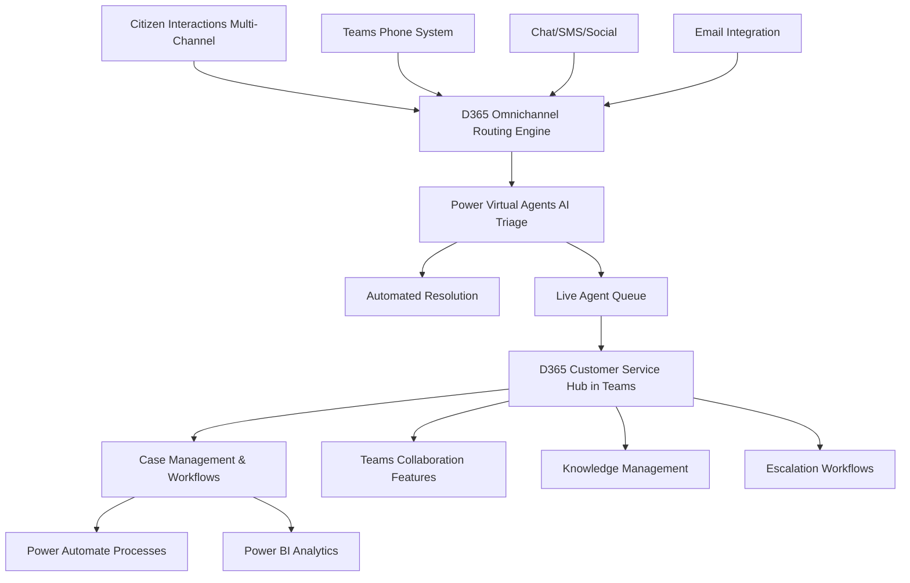
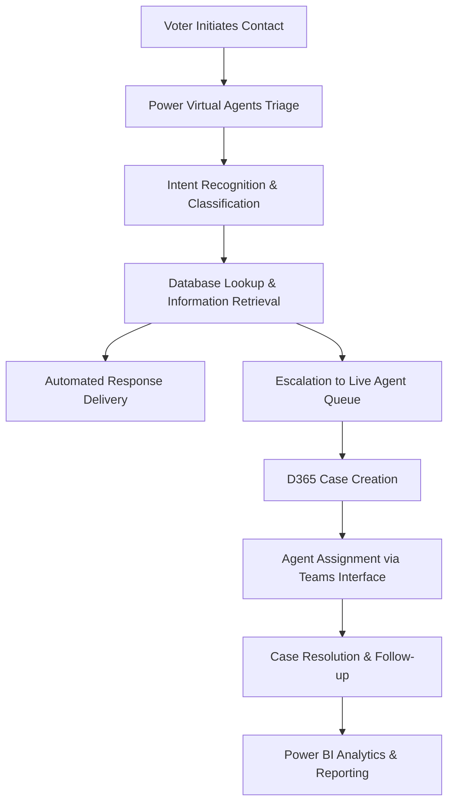
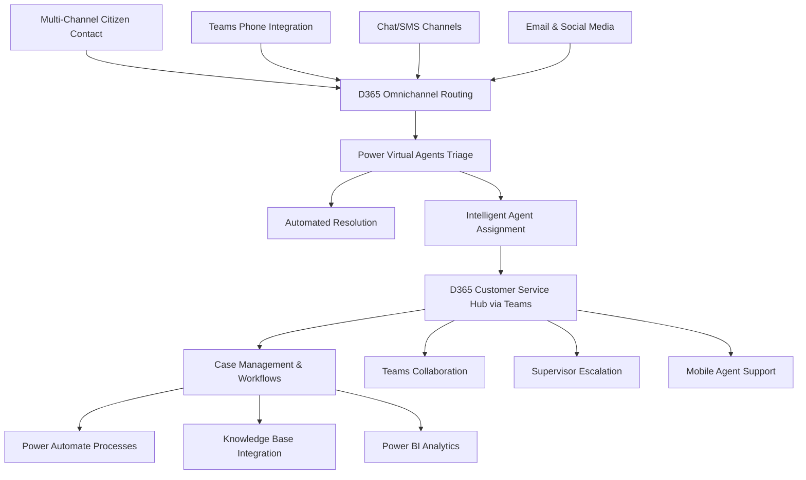
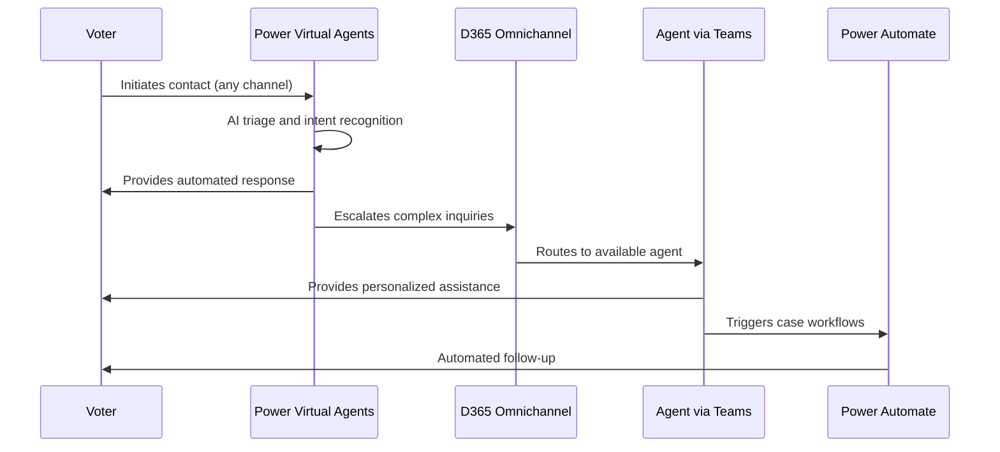
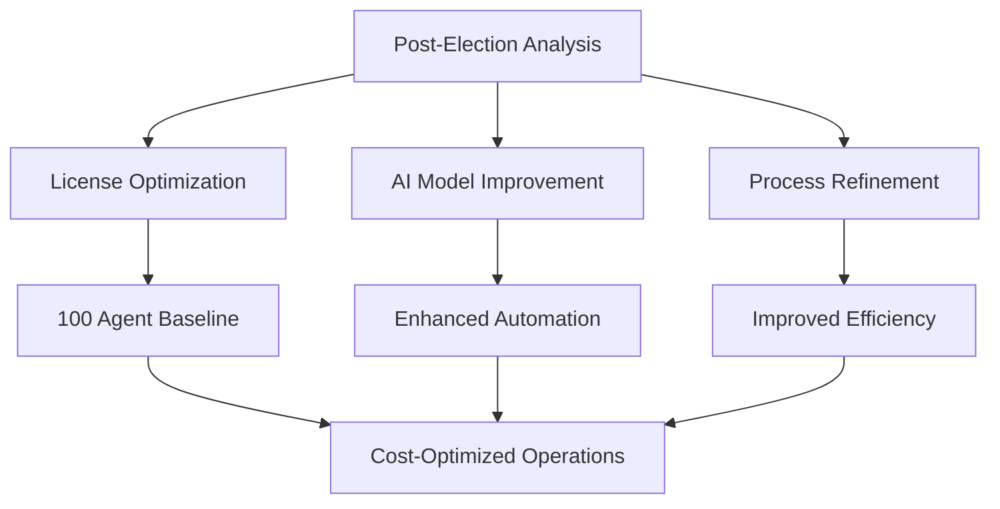
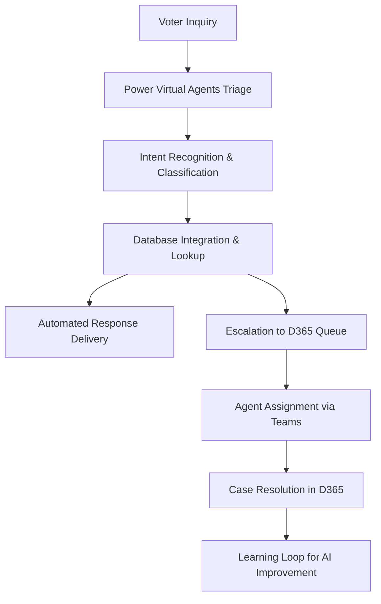
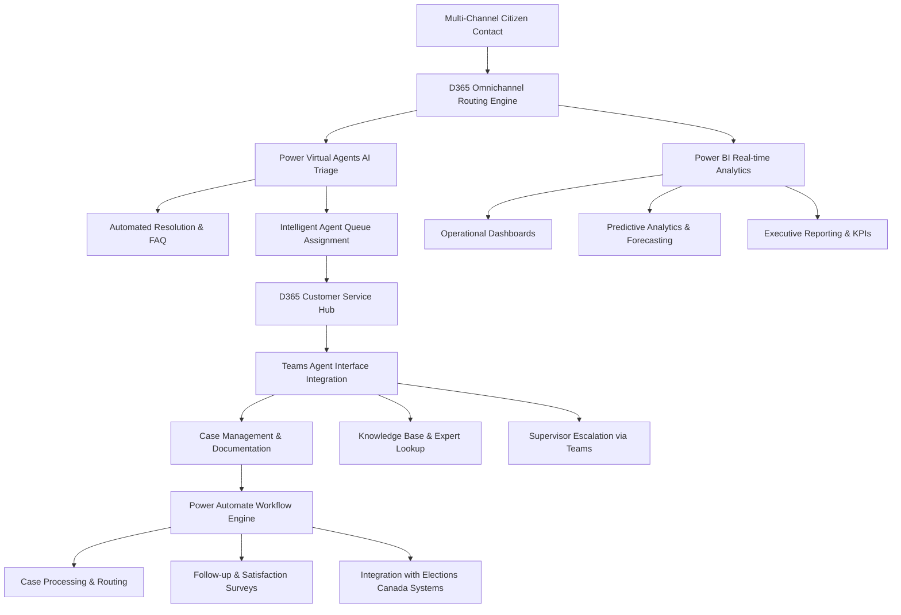
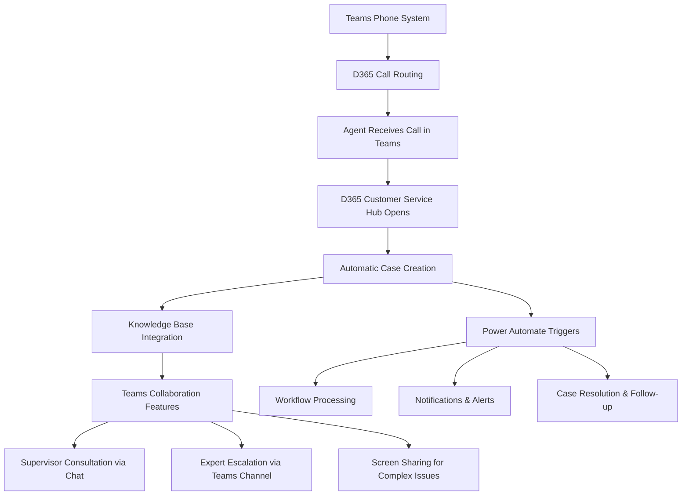
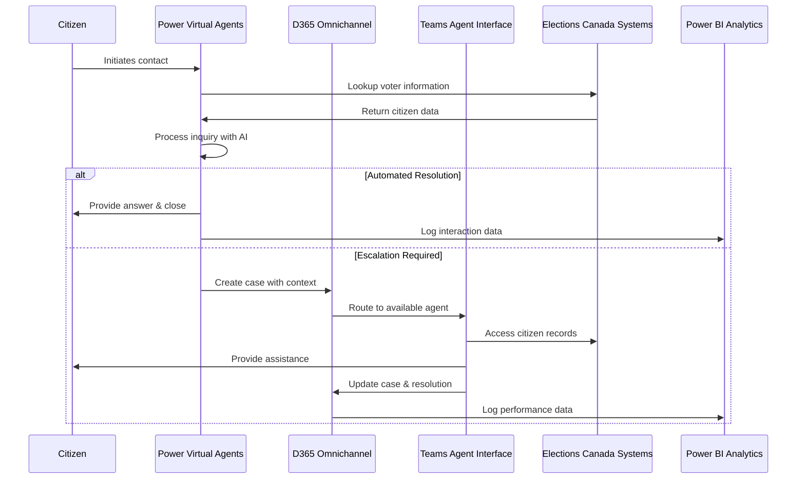

<div align="center">

# 🇨🇦 **ÉLECTIONS CANADA | ELECTIONS CANADA**

---

## **Call Centre Modernization Project**

### *Transforming Citizen Engagement Through Microsoft D365 & Power Platform*

---

</div>

<br>

<div align="center">

| **Microsoft Technology Stack** |
|:---:|
| **Dynamics 365** • **Power Platform** • **Microsoft Teams** • **Power BI** • **AI Builder** |

</div>

<br>

## 📋 **Project Overview**

| **Category** | **Details** |
|:-------------|:------------|
| **🎯 Project Scope** | Full-Scale Call Center Implementation |
| **👥 Agent Capacity** | 100-600 Scalable Agents |
| **📞 Channels** | Voice, Chat, Email, SMS, Social Media |
| **💰 Expected ROI** | 410-764% Over 3 Years |
| **⚡ Implementation** | Leveraging Existing Power Platform Expertise |
| **📅 Timeline** | 6-Month Phased Deployment |

<br>

## 🚀 **Key Technologies**

<div align="center">

```
┌─────────────────────────────────────────────────────────────┐
│  🔧 DYNAMICS 365 CUSTOMER SERVICE ENTERPRISE               │
│  ├── Omnichannel for Customer Service                      │
│  ├── Case Management & Workflows                           │
│  └── Teams Integration via Customer Service Add-in         │
├─────────────────────────────────────────────────────────────┤
│  🤖 POWER PLATFORM                                         │
│  ├── Power Virtual Agents (AI Chatbots)                    │
│  ├── Power Automate (Workflow Automation)                  │
│  ├── Power BI (Analytics & Dashboards)                     │
│  └── AI Builder (Custom AI Models)                         │
├─────────────────────────────────────────────────────────────┤
│  💬 MICROSOFT TEAMS INTEGRATION                            │
│  ├── Primary Agent Interface Channel                       │
│  ├── Phone System Integration                              │
│  ├── Collaboration & Escalation                            │
│  └── Mobile Agent Support                                  │
└─────────────────────────────────────────────────────────────┘
```

</div>

<br>

## 💼 **Business Value Proposition**

<div align="center">

| **Benefit Category** | **Impact** |
|:---------------------|:-----------|
| **💰 Cost Optimization** | $58K-$98K Monthly Savings Through Automation |
| **⚡ Efficiency Gains** | 85% First-Call Resolution Rate Target |
| **🤖 Automation** | 30-40% Case Deflection via AI |
| **📊 Analytics** | Real-time Performance & Predictive Insights |
| **📱 Scalability** | Dynamic Election Period Scaling |

</div>

<br>

## 🏛️ **Elections Canada Advantages**

> **✅ Existing Power Platform Licensing & Expertise**  
> **✅ Teams Phone System Already Deployed**  
> **✅ Internal Implementation Capabilities**  
> **✅ Microsoft 365 Ecosystem Integration**  
> **✅ Canadian Data Residency Compliance**  

<br>

---

<div align="center">

**Comprehensive D365/Power Platform Call Centre Implementation**  
*With Microsoft Teams Integration for Enhanced Agent Experience*

**Powered by** `Microsoft Cloud` • `Azure AI` • `Power Platform`

---

**Version 1.0** | **Elections Canada IT Modernization Initiative**

</div>

## **1. Introduction**

Elections Canada can implement a world-class call center solution by deploying **Microsoft Dynamics 365 Customer Service Enterprise and Power Platform capabilities**, utilizing **Microsoft Teams as the primary agent interface channel**. This approach leverages Elections Canada's **existing Power Platform licensing and internal implementation expertise** to deliver automated call handling, AI-powered IVR, omnichannel support, and advanced analytics.

### **Business Benefits:**

* **Full-scale D365 call center** with comprehensive case management and workflow automation
* **Power Platform integration** for advanced automation, AI, and analytics capabilities
* **Teams as primary agent channel** for familiar user experience and collaboration
* **Omnichannel customer engagement** across voice, chat, email, SMS, and social media
* **AI-powered automation** reducing agent workload through Power Virtual Agents and AI Builder
* **Advanced analytics and reporting** via Power BI for operational insights

### **Use Cases:**

* **Voter inquiry management** with full case lifecycle tracking
* **Election officer support** with escalation workflows and knowledge management
* **Multi-channel citizen engagement** during election periods
* **Automated FAQ handling** and intelligent call routing
* **Performance analytics and optimization** for continuous improvement

---

## **2. D365/Power Platform Licensing Requirements**

### **Core D365 Call Center Licensing**

* **Dynamics 365 Customer Service Enterprise** – Core call center platform with omnichannel capabilities
* **Omnichannel for Customer Service Add-on** – Enables voice, chat, SMS, and social media channels
* **Power Virtual Agents** – AI-driven chatbots and IVR automation for self-service
* **Power Automate** – Workflow automation and process orchestration
* **Power BI Pro** – Advanced analytics and real-time dashboards
* **AI Builder** – Custom AI models for sentiment analysis and automation

### **Teams Integration Licensing**

* **Customer Service add-in for Microsoft Teams** – Embeds D365 capabilities within Teams interface
* **Microsoft Teams Phone System** – Voice channel integration (already deployed at Elections Canada)
* **Teams Premium** – Advanced calling features and analytics integration

### **Existing Elections Canada Assets**

* **Power Platform licensing** already in place for foundational capabilities
* **Internal implementation expertise** available for deployment and customization
* **Teams Phone System** infrastructure ready for integration
* **Microsoft 365 ecosystem** providing seamless data and workflow integration

---

## **3. D365 Call Center Architecture with Teams Channel Integration**

### **Core D365 Call Center Components:**

* **Dynamics 365 Customer Service Hub** – Central case management and agent workspace
* **Omnichannel for Customer Service** – Unified queue management and routing engine
* **Power Virtual Agents** – AI-powered chatbots for automated voter assistance
* **Power Automate workflows** – Automated case routing, escalation, and follow-up processes
* **Power BI Analytics** – Real-time performance monitoring and optimization insights
* **AI Builder models** – Custom AI for sentiment analysis and predictive routing

### **Teams as Primary Agent Channel:**

* **Customer Service add-in for Teams** provides D365 interface within Teams
* **Teams Phone System integration** for seamless voice channel management
* **Teams collaboration features** enable supervisor consultation and escalation
* **Teams mobile apps** support remote and flexible agent deployment

### **Architecture Diagram:**



---

## **4. Technical Infrastructure Requirements**

### **D365 Call Center Infrastructure:**

* **Dynamics 365 Customer Service Enterprise** deployment and configuration
* **Omnichannel for Customer Service** setup with multi-channel routing
* **Power Platform environment** configuration for workflows and analytics
* **Azure infrastructure** for AI Builder and advanced analytics processing
* **Integration connectors** for Elections Canada databases and systems

### **Teams Channel Integration:**

* **Customer Service add-in for Teams** deployment across agent population
* **Teams Phone System** integration with D365 call routing
* **Teams workspace customization** for election-specific workflows
* **Mobile Teams apps** configuration for remote agent capabilities

### **Security & Compliance:**

* **Canadian data residency** compliance through Azure Canada regions
* **Call recording and audit** capabilities for voter interaction compliance
* **Role-based access control** across D365 and Teams integration
* **Advanced security policies** for sensitive voter information handling

---

## **5. Power Virtual Agents & AI-Powered IVR Implementation**

### **Power Virtual Agents Core Capabilities:**

* **No-code chatbot development** for common voter inquiries
* **Natural language processing** for intent recognition and response
* **Multi-language support** for English and French voter interactions
* **Integration with Elections Canada databases** for real-time voter information
* **Seamless escalation workflows** to live agents when needed

### **IVR & Call Routing Features:**

* **Intelligent call classification** based on voter intent and urgency
* **Dynamic queue assignment** based on agent skills and availability
* **Callback scheduling** during high-volume election periods
* **Automated voter lookup** and information delivery
* **Election-specific routing rules** for different types of inquiries

### **Implementation Flow:**



---

## **6. Omnichannel Customer Service Capabilities**

### **Multi-Channel Integration:**

* **Voice integration** through Teams Phone System with D365 case context
* **Live chat** embedded on Elections Canada websites and portals
* **SMS support** for quick voter information and updates
* **Social media monitoring** for voter concerns and public sentiment
* **Email integration** with automated case creation and routing

### **Unified Agent Experience:**

* **Single agent workspace** in D365 Customer Service Hub accessible via Teams
* **Contextual customer information** available across all interaction channels
* **Seamless channel switching** without losing conversation context
* **Real-time collaboration** with supervisors and subject matter experts via Teams
* **Mobile-responsive interface** for flexible agent deployment

### **AI-Enhanced Features:**

* **Real-time sentiment analysis** to identify frustrated voters and prioritize cases
* **Suggested responses** based on historical case resolutions and knowledge base
* **Automated case summarization** for efficient hand-offs and reporting
* **Predictive routing** to match voters with best-suited agents
* **Performance insights** for continuous agent coaching and improvement

---

## **7. Power Platform Automation & Analytics**

### **Power Automate Workflow Capabilities:**

* **Automated case creation** from all inbound channels with proper categorization
* **Escalation workflows** based on case urgency, voter type, and SLA requirements
* **Follow-up automation** for case resolution confirmation and satisfaction surveys
* **Integration workflows** with Elections Canada systems for voter data synchronization
* **Approval processes** for complex voter issues requiring management review

### **Power BI Analytics & Reporting:**

* **Real-time operational dashboards** for call volume, wait times, and agent performance
* **Election-specific analytics** for voter inquiry trends and satisfaction metrics
* **Predictive analytics** for resource planning and capacity management
* **Executive reporting** with KPIs and performance benchmarks
* **Custom reports** for Elections Canada compliance and audit requirements

### **AI Builder Integration:**

* **Custom AI models** for Elections Canada-specific voter inquiry classification
* **Document processing** for automated form and application handling
* **Sentiment analysis** across all voter interactions for service improvement
* **Predictive models** for election period demand forecasting
* **Voice analytics** for quality assurance and training purposes

---

## **8. Implementation Roadmap & Deployment Strategy**

### **Phase 1: D365 Call Center Foundation (Months 1-2)**

1. **D365 Customer Service Enterprise Setup**
   * Configure customer service hub and case management
   * Set up omnichannel routing and queue management
   * Deploy user roles and security policies

2. **Power Platform Integration**
   * Configure Power Automate workflows for case processing
   * Set up Power BI analytics and reporting infrastructure
   * Deploy AI Builder models for basic automation

3. **Teams Channel Integration**
   * Install Customer Service add-in for Teams
   * Configure Teams Phone System integration
   * Set up agent workspaces and collaboration features

### **Phase 2: Advanced Automation & AI (Months 3-4)**

1. **Power Virtual Agents Deployment**
   * Build election-specific chatbots and IVR flows
   * Train AI models on Elections Canada data and scenarios
   * Implement multi-language support and testing

2. **Omnichannel Expansion**
   * Deploy chat, SMS, and social media channels
   * Configure advanced routing and escalation rules
   * Implement cross-channel continuity features

3. **Analytics & Optimization**
   * Deploy comprehensive Power BI dashboards
   * Implement predictive analytics and forecasting
   * Set up performance monitoring and alerting

### **Phase 3: Testing & Optimization (Months 5-6)**

1. **Pilot Testing**
   * Conduct pilot with limited agent group
   * Test all channels and automation features
   * Gather feedback and optimize configurations

2. **Training & Knowledge Transfer**
   * Train agents on D365 features and Teams integration
   * Develop knowledge base and self-service resources
   * Create operational procedures and escalation protocols

3. **Go-Live Preparation**
   * Finalize configurations and security settings
   * Conduct stress testing for election-period volumes
   * Prepare rollback and contingency plans

---

## **9. Advanced Case Management & Knowledge Systems**

### **D365 Case Management Features:**

* **Comprehensive case lifecycle** from creation to resolution with full audit trail
* **Automated case classification** using AI Builder for consistent categorization
* **SLA management** with automated escalation and deadline tracking
* **Knowledge base integration** with suggested articles and resolution guidance
* **Case collaboration** through Teams channels for complex voter issues

### **Knowledge Management System:**

* **Centralized knowledge base** accessible through D365 and Teams interface
* **Automated article suggestions** based on case context and agent activity
* **Version control and approval workflows** for knowledge content updates
* **Search and discovery** features for rapid information retrieval
* **Performance analytics** on knowledge base usage and effectiveness

### **Quality Assurance & Training:**

* **Call recording and analysis** through integrated voice analytics
* **Performance coaching** based on case resolution metrics and customer satisfaction
* **Training content delivery** through Microsoft Viva Learning integration
* **Competency tracking** and skill development programs
* **Best practice sharing** through Teams communities and channels

---

## **10. Implementation Advantages & Business Value**

### **Leveraging Existing Elections Canada Assets:**

* **Power Platform expertise** accelerates implementation and reduces external consulting needs
* **Existing licensing** provides cost advantages and faster deployment timeline
* **Teams familiarity** ensures high agent adoption and minimal training requirements
* **Microsoft 365 integration** enables seamless workflow and data connectivity
* **Government compliance** built into Microsoft cloud services for Canadian requirements

### **Operational Benefits:**

* **Scalable architecture** supporting both baseline and election-period demand
* **Cost optimization** through automation and efficient resource utilization
* **Improved voter satisfaction** via faster resolution and multi-channel options
* **Enhanced visibility** into operations through comprehensive analytics
* **Future-ready platform** enabling continuous improvement and expansion

### **Strategic Value:**

* **Digital transformation** positioning Elections Canada as a modern, citizen-centric organization
* **Operational excellence** through data-driven decision making and optimization
* **Innovation platform** enabling new services and capabilities as needs evolve
* **Cross-government collaboration** potential through shared Microsoft ecosystem
* **Compliance and security** built-in for sensitive government operations

---

# **Scalable D365 Call Center with Teams Channel Integration for Elections Canada**

## **1. Overview**

Elections Canada requires a **scalable D365 Customer Service Enterprise call center** that can handle **periodic high-volume election inquiries** while maintaining efficient baseline operations. This solution leverages **Power Platform capabilities and Teams as the primary agent channel** to deliver cost-effective, automated, and intelligent voter support services.

### **Key Objectives**

✅ **D365-Powered**: Full call center capabilities with comprehensive case management and automation
✅ **Scalable Architecture**: Dynamic scaling from 100 to 600 agents based on election cycles
✅ **Multi-Channel Support**: Voice, chat, email, SMS, and social media integration
✅ **AI-Driven Automation**: Power Virtual Agents and AI Builder reducing agent workload
✅ **Teams Integration**: Familiar interface channel for agent efficiency and collaboration
✅ **Cost-Effective**: Leveraging existing Elections Canada Power Platform licensing and expertise

## **2. D365 Call Center Architecture & Scaling Model**

### **Core D365 Infrastructure:**



### **Scalability Features:**

* **Dynamic licensing model** supporting 100-600 agent scaling
* **Elastic infrastructure** through Azure cloud services
* **Automated load balancing** across agent pools and channels
* **Queue management** with overflow and callback capabilities
* **Resource optimization** through AI-driven workload distribution

## **3. Implementation Phases & Scaling Strategy**

### **📌 Phase 1: D365 Foundation Deployment (Baseline 100 Agents)**

#### **Core D365 Call Center Setup:**
- **Dynamics 365 Customer Service Enterprise** deployment with full case management
- **Omnichannel for Customer Service** configuration with multi-channel routing
- **Power Virtual Agents** development for common voter inquiries
- **Power Automate workflows** for case processing and escalation
- **Power BI dashboards** for operational monitoring and analytics

#### **Teams Channel Integration:**
- **Customer Service add-in for Teams** deployment for unified agent experience
- **Teams Phone System integration** with D365 call routing and case context
- **Teams workspace customization** for election-specific workflows and collaboration
- **Mobile Teams configuration** for flexible agent deployment options

#### **Automation & AI Implementation:**
- **AI Builder models** for intent recognition and case classification
- **Knowledge base deployment** with automated article suggestions
- **Workflow automation** for routine case processing and follow-up
- **Analytics and reporting** setup for performance monitoring

### **📌 Phase 2: Election Period Scaling (600 Agents)**

#### **Capacity Expansion:**
- **Scale D365 licenses** from 100 to 600 agents with temporary licensing
- **Expand Teams integration** to support increased agent population
- **Enhance Power Virtual Agents** with election-specific capabilities
- **Increase infrastructure capacity** through Azure scaling features

#### **Advanced Automation Deployment:**
- **Enhanced AI models** for election-period inquiry patterns
- **Predictive analytics** for demand forecasting and resource optimization
- **Advanced routing algorithms** for specialized election support queues
- **Real-time monitoring** and alerting for high-volume periods

#### **Multi-Channel Optimization:**
- **Expanded chat and SMS** capabilities for voter convenience
- **Social media monitoring** for election-related sentiment and issues
- **Email automation** for follow-up communications and information delivery
- **Mobile-first design** for citizen self-service options



### **📌 Phase 3: Post-Election Optimization (Return to 100 Agents)**

#### **License Optimization:**
- **Scale down temporary licenses** while maintaining core capabilities
- **Optimize automation** to handle increased self-service adoption
- **Maintain AI models** with improved accuracy from election period data
- **Continue analytics** for ongoing operational improvement

#### **Continuous Improvement:**
- **Performance analysis** using comprehensive election period data
- **AI model refinement** based on actual voter interaction patterns
- **Process optimization** for improved efficiency and satisfaction
- **Knowledge base updates** with new insights and best practices



## **4. Cost Analysis & Investment Breakdown**

### **📌 Baseline Monthly Costs (100 Agents, Non-Election Period)**

| **Component**                           | **Unit Cost** | **Quantity** | **Monthly Cost** |
| --------------------------------------------- | ------------------- | ------------------ | ---------------------- |
| D365 Customer Service Enterprise              | $105                | 100 agents        | $10,500                |
| Omnichannel for Customer Service Add-on      | $95                 | 100 agents        | $9,500                 |
| Customer Service add-in for Teams            | $20                 | 100 agents        | $2,000                 |
| Power Virtual Agents                          | Fixed               | -                  | $1,500                 |
| Power BI Pro                                  | $10                 | 20 supervisors     | $200                   |
| Azure consumption (AI Builder, storage)      | Fixed               | -                  | $800                   |
| Voice/telephony costs                         | $0.008/min          | 400K minutes       | $3,200                 |
| **Total Baseline Monthly Cost**         |                     |                    | **$27,700**      |

### **📌 Election Period Costs (600 Agents)**

| **Component**                           | **Unit Cost** | **Quantity** | **Monthly Cost** |
| --------------------------------------------- | ------------------- | ------------------ | ---------------------- |
| D365 Customer Service Enterprise              | $105                | 600 agents        | $63,000                |
| Omnichannel for Customer Service Add-on      | $95                 | 600 agents        | $57,000                |
| Customer Service add-in for Teams            | $20                 | 600 agents        | $12,000                |
| Power Virtual Agents (enhanced)               | Fixed               | -                  | $3,000                 |
| Power BI Pro                                  | $10                 | 60 supervisors     | $600                   |
| Azure consumption (increased load)            | Fixed               | -                  | $2,500                 |
| Voice/telephony costs                         | $0.008/min          | 1.2M minutes       | $9,600                 |
| **Total Election Period Monthly Cost** |                     |                    | **$147,700**     |

### **📌 Cost Optimization Through Automation**

| **Optimization Strategy**               | **Potential Monthly Savings** |
| --------------------------------------------- | ----------------------------------- |
| Power Virtual Agents deflection (30%)        | $18K - $25K                         |
| Automated case processing                     | $8K - $12K                          |
| Intelligent routing optimization              | $5K - $8K                           |
| Self-service portal adoption                  | $10K - $15K                         |
| **Total Potential Savings**            | **$41K - $60K**               |

## **5. Power Platform ROI & Value Realization**

### **Immediate Value Drivers:**

* **Automated case processing** reducing manual agent workload by 40-50%
* **Intelligent routing** improving first-call resolution rates to 85%+
* **Self-service automation** deflecting 30-40% of routine inquiries
* **Predictive analytics** enabling proactive resource allocation and planning
* **Multi-channel efficiency** providing voters with convenient service options

### **Long-term Strategic Benefits:**

* **Operational excellence** through data-driven continuous improvement
* **Citizen satisfaction** improvements through faster, more accurate service
* **Cost optimization** via automation and efficient resource utilization
* **Scalability foundation** for future elections and expanded services
* **Innovation platform** enabling new capabilities and service offerings

### **Elections Canada Competitive Advantages:**

* **Existing Power Platform expertise** reducing implementation risk and timeline
* **Current licensing investments** providing cost advantages over new deployments
* **Teams integration** ensuring high agent adoption and productivity
* **Microsoft ecosystem** enabling seamless data and workflow connectivity
* **Government compliance** built into platform for regulatory requirements

## **6. Implementation Timeline & Milestones**

### **Months 1-2: Foundation Setup**
- D365 Customer Service Enterprise deployment and configuration
- Omnichannel routing and queue management setup
- Basic Power Virtual Agents and automation workflows
- Teams integration and agent workspace configuration

### **Months 3-4: Advanced Features**
- AI Builder model development and training
- Knowledge base deployment and content creation
- Power BI analytics and dashboard implementation
- Multi-channel expansion and testing

### **Months 5-6: Testing & Optimization**
- Pilot deployment with limited agent group
- Load testing and performance optimization
- Agent training and knowledge transfer
- Final configuration and go-live preparation

### **Ongoing: Continuous Improvement**
- Performance monitoring and optimization
- AI model refinement and enhancement
- User feedback integration and feature updates
- Scaling preparation for upcoming elections

## **7. Success Metrics & KPIs**

### **Operational Metrics:**
* **Average handle time** reduction through automation and knowledge base
* **First-call resolution rate** improvement via intelligent routing and AI assistance
* **Agent utilization** optimization through workload balancing and scheduling
* **Queue wait times** minimization during peak election periods
* **Multi-channel adoption** rates and citizen satisfaction scores

### **Business Value Metrics:**
* **Cost per interaction** reduction through automation and efficiency gains
* **Agent productivity** improvements measured by cases resolved per hour
* **Citizen satisfaction** scores across all channels and interaction types
* **Automation success rate** for Power Virtual Agents and self-service options
* **Scalability effectiveness** during election period volume spikes

### **Technology Performance:**
* **System availability** and reliability during critical election periods
* **Response time** performance across all channels and features
* **Integration effectiveness** between D365, Teams, and other systems
* **AI model accuracy** for intent recognition and automated responses
* **Analytics and reporting** capability and insight generation

---

# **D365 Call Center Pilot Deployment & Optimization Roadmap for Elections Canada**

## **1. Pilot Objectives & Success Criteria**

The pilot deployment will validate **Dynamics 365 Customer Service Enterprise and Power Platform call center capabilities** with **Teams as the primary agent channel** before full-scale implementation. This approach leverages Elections Canada's **existing Power Platform expertise and licensing** to ensure successful deployment and optimization.

### **Primary Pilot Goals:**

✅ **Validate D365 call center** functionality and performance under real-world conditions
✅ **Test Power Platform automation** including Power Virtual Agents and workflow efficiency
✅ **Assess Teams integration** effectiveness for agent productivity and collaboration
✅ **Measure automation impact** on case deflection and resolution times
✅ **Evaluate scalability** for election period volume requirements
✅ **Demonstrate ROI** through cost savings and operational improvements

### **Success Criteria:**

* **30% case deflection** through Power Virtual Agents automation
* **85% first-call resolution** rate with D365 knowledge base integration
* **20% improvement** in average handle time through Teams collaboration features
* **95% system availability** during pilot testing period
* **High agent satisfaction** with Teams-integrated D365 interface

## **2. Comprehensive Pilot Deployment Roadmap**

### **📌 Phase 1: D365 Foundation & Teams Integration (Weeks 1-4)**

#### **D365 Customer Service Enterprise Setup:**
- **Deploy D365 Customer Service Hub** with comprehensive case management capabilities
- **Configure Omnichannel for Customer Service** with multi-channel routing and queues
- **Set up user roles and security** aligned with Elections Canada requirements
- **Integrate with existing systems** for voter data and case context

#### **Power Platform Implementation:**
- **Deploy Power Virtual Agents** with basic election inquiry automation
- **Configure Power Automate workflows** for case creation, routing, and escalation
- **Set up AI Builder models** for intent recognition and case classification
- **Implement Power BI dashboards** for real-time monitoring and analytics

#### **Teams Channel Integration:**
- **Install Customer Service add-in for Teams** across pilot agent group (100 agents)
- **Configure Teams Phone System integration** with D365 call routing
- **Set up Teams workspaces** with election-specific channels and collaboration features
- **Deploy Teams mobile apps** for flexible agent deployment testing

#### **Knowledge Management & Training:**
- **Deploy knowledge base** with Elections Canada content and FAQ articles
- **Create agent training materials** for D365 features and Teams integration
- **Establish escalation procedures** using Teams channels and D365 workflows
- **Configure performance monitoring** and quality assurance processes

### **📌 Phase 2: Live Testing & Optimization (Weeks 5-8)**

#### **Multi-Channel Testing:**
- **Voice channel validation** through Teams Phone System integration with D365
- **Chat and SMS testing** via omnichannel routing and agent workflows
- **Email integration testing** with automated case creation and assignment
- **Social media monitoring** setup and escalation workflow validation

#### **Power Virtual Agents Optimization:**
- **Test AI chatbot performance** with real voter inquiries and scenarios
- **Optimize conversation flows** based on actual interaction patterns
- **Enhance natural language processing** for better intent recognition
- **Configure escalation triggers** for seamless handoff to live agents

#### **Automation & Workflow Testing:**
- **Validate Power Automate workflows** for case processing and escalation
- **Test AI Builder models** for accuracy in case classification and routing
- **Evaluate knowledge base integration** and automated article suggestions
- **Monitor performance metrics** and identify optimization opportunities

#### **Teams Collaboration Validation:**
- **Test supervisor consultation** features during live voter interactions
- **Validate escalation procedures** through Teams channels and D365 workflows
- **Assess mobile agent capabilities** using Teams apps for remote work scenarios
- **Evaluate collaboration impact** on case resolution times and quality

### **📌 Phase 3: Performance Analysis & Scaling Preparation (Weeks 9-12)**

#### **Comprehensive Performance Analysis:**
- **Analyze pilot metrics** including case deflection, resolution times, and satisfaction
- **Evaluate automation effectiveness** and identify areas for improvement
- **Assess agent productivity** and Teams integration benefits
- **Review system performance** under various load conditions and scenarios

#### **Cost-Benefit Analysis:**
- **Calculate pilot ROI** including cost savings from automation and efficiency gains
- **Project full-scale benefits** based on pilot performance and scalability testing
- **Assess infrastructure costs** for election period scaling requirements
- **Validate business case** for full D365 call center implementation

#### **Election Readiness Planning:**
- **Design scaling strategy** for 600-agent election deployment
- **Plan automation enhancements** for election-specific inquiry patterns
- **Prepare performance monitoring** and alerting for high-volume periods
- **Develop contingency plans** and rollback procedures for risk mitigation

#### **Final Optimization & Go-Live Preparation:**
- **Implement pilot learnings** and configuration improvements
- **Finalize agent training** and knowledge transfer programs
- **Complete security and compliance** validation for production deployment
- **Prepare deployment timeline** and resource allocation for full implementation

## **3. Power Platform Optimization & Cost Reduction Strategies**

### **1️⃣ Power Virtual Agents Automation Strategy**

**🔹 Objective:** Maximize automated case resolution and reduce live agent dependency
**🔹 Target:** 35-40% case deflection through AI automation
**🔹 Expected Savings:** $25K - $40K per month

#### **Implementation Approach:**
- **Enhanced conversation design** with natural language processing optimization
- **Integration with Elections Canada databases** for real-time voter information lookup
- **Multi-language support** for English and French voter interactions
- **Continuous learning** from agent interactions to improve automation accuracy



### **2️⃣ D365 Workflow Automation Strategy**

**🔹 Objective:** Automate routine case processing and administrative tasks
**🔹 Target:** 50% reduction in manual case handling time
**🔹 Expected Savings:** $15K - $25K per month

#### **Automation Areas:**
- **Automatic case creation** from all inbound channels with proper categorization
- **Intelligent routing** based on case type, urgency, and agent skills
- **Escalation workflows** with automated approvals and notifications
- **Follow-up automation** for case resolution confirmation and satisfaction surveys

### **3️⃣ Teams Collaboration Efficiency Strategy**

**🔹 Objective:** Leverage Teams features to improve first-call resolution
**🔹 Target:** 25% improvement in case resolution speed
**🔹 Expected Savings:** $10K - $18K per month

#### **Collaboration Features:**
- **Real-time supervisor consultation** during complex voter interactions
- **Knowledge sharing** through Teams channels and collaborative workflows
- **Expert escalation** via Teams chat and screen sharing capabilities
- **Mobile agent flexibility** for expanded coverage and reduced infrastructure costs

### **4️⃣ Analytics-Driven Optimization Strategy**

**🔹 Objective:** Use Power BI insights for continuous improvement and resource optimization
**🔹 Target:** 15% overall operational efficiency improvement
**🔹 Expected Savings:** $8K - $15K per month

#### **Analytics Applications:**
- **Predictive capacity planning** for election period resource allocation
- **Performance optimization** based on agent and channel analytics
- **Citizen journey analysis** for improved service design and delivery
- **Cost optimization** through data-driven decision making and resource allocation

## **4. Pilot Performance Metrics & Success Measurement**

### **Technical Performance KPIs:**

| **Metric Category**                 | **Target Performance**              | **Measurement Method** |
| ----------------------------------------- | ----------------------------------------- | ----------------------------- |
| **System Availability**            | 99.5% uptime during pilot             | Azure monitoring & alerting   |
| **Response Time**                   | <2 seconds for D365 interface loading | Performance testing tools     |
| **Teams Integration Performance**   | <1 second for call routing to agent   | Teams analytics & reporting   |
| **AI Accuracy**                     | 85% intent recognition success rate   | Power Virtual Agents analytics |
| **Data Synchronization**            | 100% accuracy across systems          | Automated testing & validation |

### **Operational Performance KPIs:**

| **Metric Category**               | **Baseline Target**                 | **Pilot Achievement Goal** |
| --------------------------------------- | ----------------------------------------- | --------------------------------- |
| **Case Deflection Rate**         | 20% through automation               | 30% via Power Virtual Agents     |
| **First-Call Resolution**         | 75% with manual processes            | 85% with D365 knowledge base     |
| **Average Handle Time**           | 8 minutes current average            | 6 minutes with automation        |
| **Agent Utilization**             | 70% effective time                   | 85% with intelligent routing     |
| **Customer Satisfaction**         | 3.8/5 current rating                | 4.2/5 with improved service      |

### **Business Value KPIs:**

| **Value Metric**                    | **Current State**                   | **Pilot Target**                |
| ----------------------------------------- | ----------------------------------------- | -------------------------------------- |
| **Cost per Case**                   | $15 average handling cost            | $10 with automation               |
| **Agent Productivity**              | 25 cases per agent per day          | 35 cases with D365 efficiency    |
| **Automation ROI**                  | N/A baseline                         | 200%+ return on investment        |
| **Training Time Reduction**         | 40 hours for new agents             | 24 hours with Teams familiarity  |
| **Infrastructure Savings**          | N/A baseline                         | 30% reduction in hardware needs   |

## **5. Risk Mitigation & Quality Assurance**

### **Technical Risk Management:**

* **System integration testing** with comprehensive end-to-end scenarios
* **Performance stress testing** to validate election period volume handling
* **Security penetration testing** for voter data protection validation
* **Disaster recovery testing** and business continuity planning
* **Rollback procedures** and contingency planning for critical issues

### **Operational Risk Management:**

* **Agent training programs** with certification requirements and ongoing support
* **Change management** processes for smooth transition from existing systems
* **Quality assurance** protocols with call monitoring and performance coaching
* **Escalation procedures** for complex cases and system issues
* **Communication plans** for stakeholders and citizen impact management

### **Compliance & Governance:**

* **Data privacy compliance** with Canadian federal privacy regulations
* **Accessibility standards** compliance for citizen-facing interfaces
* **Security compliance** with government IT security requirements
* **Audit trail maintenance** for all voter interactions and case processing
* **Regulatory reporting** capabilities for Elections Canada compliance needs

## **6. Final Cost Optimization Analysis**

### **Pilot Investment vs. Expected Returns:**

| **Investment Category**                | **Pilot Cost** | **Annual Projection** | **3-Year ROI** |
| -------------------------------------------- | -------------------- | ---------------------------- | -------------------- |
| **D365 Licensing (100 agents)**        | $27,700/month        | $332,400/year               | Cost baseline        |
| **Implementation Services**             | $150,000 one-time    | Amortized over 3 years      | $50,000/year         |
| **Training & Change Management**        | $75,000 one-time     | Amortized over 3 years      | $25,000/year         |
| **Total Investment**                    | $252,700 first year | $407,400/year steady state | $407,400/year        |

### **Expected Savings & Value Generation:**

| **Savings Category**                   | **Monthly Savings** | **Annual Value**      | **3-Year Total** |
| -------------------------------------------- | ------------------------- | --------------------------- | ---------------------- |
| **Automation Cost Reduction**          | $25K - $40K               | $300K - $480K               | $900K - $1.44M         |
| **Efficiency Improvements**            | $15K - $25K               | $180K - $300K               | $540K - $900K          |
| **Infrastructure Optimization**        | $10K - $18K               | $120K - $216K               | $360K - $648K          |
| **Quality & Satisfaction Gains**       | $8K - $15K                | $96K - $180K                | $288K - $540K          |
| **Total Expected Savings**             | $58K - $98K               | $696K - $1.176M            | $2.088M - $3.528M     |

### **Net ROI Calculation:**

* **Break-even point:** 8-12 months after full deployment
* **3-year net value:** $1.68M - $3.12M positive return
* **ROI percentage:** 410% - 764% over 3-year period

## **7. Post-Pilot Implementation Strategy**

### **Immediate Actions (Weeks 13-16):**

✅ **Analyze pilot results** and prepare comprehensive business case presentation
✅ **Secure stakeholder approval** for full-scale D365 call center implementation
✅ **Finalize licensing strategy** for baseline and election period scaling
✅ **Plan resource allocation** for implementation team and agent training
✅ **Prepare vendor contracts** and procurement processes for additional services

### **Full Implementation Timeline (Months 4-9):**

✅ **Scale infrastructure** to support 100 baseline agents with election expansion capability
✅ **Deploy enhanced automation** based on pilot learnings and optimization
✅ **Implement advanced analytics** and predictive capabilities for election planning
✅ **Complete agent training** and knowledge transfer across entire agent population
✅ **Establish operational procedures** and continuous improvement processes

### **Election Readiness (Months 10-12):**

✅ **Test election scaling** from 100 to 600 agents with temporary licensing
✅ **Validate automation performance** under high-volume election scenarios
✅ **Complete compliance audits** and security certifications for production use
✅ **Prepare contingency plans** and support procedures for election periods
✅ **Go live with full capability** for next scheduled election event

## **8. Technology Integration Architecture**

### **D365 Call Center Core Components:**



### **Teams Integration Architecture:**



### **Data Flow & Integration Points:**



## **9. Continuous Improvement & Future Roadmap**

### **Phase 1 Enhancements (Year 1):**
* **Advanced AI models** trained on Elections Canada-specific data patterns
* **Predictive analytics** for election period demand forecasting and resource planning
* **Enhanced automation** for complex case routing and resolution workflows
* **Mobile-first citizen portals** integrated with D365 for self-service options

### **Phase 2 Expansion (Year 2):**
* **Cross-government integration** for shared services and citizen data
* **Advanced voice analytics** for sentiment analysis and quality improvement
* **Proactive citizen engagement** through predictive service delivery
* **Integration with emerging technologies** like Microsoft Copilot for enhanced agent assistance

### **Phase 3 Innovation (Year 3):**
* **AI-powered citizen experience** with personalized service delivery
* **Blockchain integration** for secure voter verification and case audit trails
* **Advanced analytics platforms** with machine learning for continuous optimization
* **Cross-platform federation** with other government services and agencies

### **Success Measurement & Optimization:**

* **Quarterly performance reviews** with stakeholder feedback and improvement planning
* **Continuous A/B testing** of automation workflows and citizen interaction designs
* **Regular technology updates** to leverage new Microsoft platform capabilities
* **Agent feedback integration** for user experience improvement and feature enhancement
* **Citizen satisfaction monitoring** with proactive service improvement initiatives

**Bottom Line**: Elections Canada's D365 call center implementation with Teams integration represents a strategic investment in digital transformation that will deliver immediate operational benefits while establishing a foundation for continued innovation and service excellence in citizen engagement.

# **References and Sources**

## **Microsoft Official Documentation**

### **Dynamics 365 Customer Service**
- [Dynamics 365 Customer Service Overview](https://docs.microsoft.com/en-us/dynamics365/customer-service/overview)
- [Omnichannel for Customer Service](https://docs.microsoft.com/en-us/dynamics365/customer-service/introduction-omnichannel)
- [Customer Service Enterprise Licensing](https://docs.microsoft.com/en-us/dynamics365/customer-service/system-requirements-omnichannel)
- [Case Management in Dynamics 365](https://docs.microsoft.com/en-us/dynamics365/customer-service/customer-service-hub-user-guide-case-sla)

### **Microsoft Teams Integration**
- [Customer Service add-in for Microsoft Teams](https://docs.microsoft.com/en-us/dynamics365/customer-service/teams-integration)
- [Microsoft Teams Phone System](https://docs.microsoft.com/en-us/microsoftteams/cloud-voice-landing-page)
- [Teams Premium Features](https://docs.microsoft.com/en-us/microsoftteams/teams-add-on-licensing/microsoft-teams-premium)
- [Teams Direct Routing](https://docs.microsoft.com/en-us/microsoftteams/direct-routing-landing-page)

### **Power Platform**
- [Power Virtual Agents Documentation](https://docs.microsoft.com/en-us/power-virtual-agents/)
- [Power Automate for Customer Service](https://docs.microsoft.com/en-us/power-automate/getting-started)
- [Power BI Integration with Dynamics 365](https://docs.microsoft.com/en-us/power-bi/connect-data/service-connect-to-microsoft-dynamics-crm)
- [AI Builder Overview](https://docs.microsoft.com/en-us/ai-builder/overview)

### **Azure Services**
- [Azure Communication Services](https://docs.microsoft.com/en-us/azure/communication-services/)
- [Azure AI Services](https://docs.microsoft.com/en-us/azure/cognitive-services/)
- [Azure Canada Data Residency](https://docs.microsoft.com/en-us/azure/canada/)

## **Microsoft Licensing and Pricing**

### **Official Pricing Pages**
- [Dynamics 365 Pricing](https://dynamics.microsoft.com/en-us/pricing/)
- [Microsoft Teams Pricing](https://www.microsoft.com/en-us/microsoft-teams/compare-microsoft-teams-options)
- [Power Platform Pricing](https://powerapps.microsoft.com/en-us/pricing/)
- [Azure Communication Services Pricing](https://azure.microsoft.com/en-us/pricing/details/communication-services/)

### **Licensing Guides**
- [Dynamics 365 Licensing Guide](https://go.microsoft.com/fwlink/?LinkId=866544)
- [Microsoft 365 and Teams Licensing](https://docs.microsoft.com/en-us/office365/servicedescriptions/teams-service-description)
- [Power Platform Licensing FAQ](https://docs.microsoft.com/en-us/power-platform/admin/powerapps-flow-licensing-faq)

## **Government and Compliance**

### **Canadian Government Cloud Services**
- [Microsoft Cloud for Government](https://www.microsoft.com/en-us/enterprise/government)
- [Azure Government Canada](https://azure.microsoft.com/en-us/global-infrastructure/government/)
- [Government Data Residency Requirements](https://docs.microsoft.com/en-us/compliance/regulatory/offering-canada-privacy-laws)

### **Security and Compliance Documentation**
- [Microsoft Trust Center](https://www.microsoft.com/en-us/trust-center)
- [Dynamics 365 Security](https://docs.microsoft.com/en-us/dynamics365/customer-service/implement-security)
- [Teams Security and Compliance](https://docs.microsoft.com/en-us/microsoftteams/security-compliance-overview)

## **Industry Best Practices and Case Studies**

### **Call Center Modernization**
- [Microsoft Customer Service Solutions](https://www.microsoft.com/en-us/industry/public-sector/customer-service)
- [Digital Transformation in Government](https://info.microsoft.com/ww-landing-government-digital-transformation.html)
- [Contact Center AI Solutions](https://www.microsoft.com/en-us/ai/ai-for-customer-service)

### **Government Technology Implementation**
- [Government Technology Trends](https://www.microsoft.com/en-us/industry/government/digital-government)
- [Public Sector Digital Services](https://azure.microsoft.com/en-us/industries/government/)

## **Technical Architecture References**

### **Implementation Guides**
- [Omnichannel Implementation Guide](https://docs.microsoft.com/en-us/dynamics365/customer-service/implement-omnichannel-customer-service)
- [Power Virtual Agents Implementation](https://docs.microsoft.com/en-us/power-virtual-agents/fundamentals-what-is-power-virtual-agents)
- [Teams Phone System Setup](https://docs.microsoft.com/en-us/microsoftteams/setting-up-your-phone-system)

### **Integration Patterns**
- [Microsoft Cloud Architecture Patterns](https://docs.microsoft.com/en-us/azure/architecture/)
- [Power Platform Integration Scenarios](https://docs.microsoft.com/en-us/power-platform/admin/data-integrator)
- [Teams App Development](https://docs.microsoft.com/en-us/microsoftteams/platform/)

## **Performance and Analytics**

### **Monitoring and Analytics**
- [Power BI for Customer Service Analytics](https://docs.microsoft.com/en-us/dynamics365/customer-service/configure-customer-service-analytics-insights-csh)
- [Teams Analytics and Reporting](https://docs.microsoft.com/en-us/microsoftteams/teams-analytics-and-reports/)
- [Azure Monitor for Applications](https://docs.microsoft.com/en-us/azure/azure-monitor/)

### **Performance Optimization**
- [Dynamics 365 Performance Optimization](https://docs.microsoft.com/en-us/dynamics365/customer-service/system-requirements-omnichannel)
- [Teams Performance Best Practices](https://docs.microsoft.com/en-us/microsoftteams/prepare-network)

## **Training and Adoption Resources**

### **Microsoft Learn Paths**
- [Dynamics 365 Customer Service Learning Path](https://docs.microsoft.com/en-us/learn/browse/?products=dynamics-customer-service)
- [Power Platform Learning Paths](https://docs.microsoft.com/en-us/learn/browse/?products=power-platform)
- [Microsoft Teams Training](https://docs.microsoft.com/en-us/learn/browse/?products=m365-teams)

### **Certification Programs**
- [Microsoft Certified: Dynamics 365 Customer Service Functional Consultant](https://docs.microsoft.com/en-us/learn/certifications/d365-functional-consultant-customer-service/)
- [Microsoft Certified: Power Platform Solution Architect](https://docs.microsoft.com/en-us/learn/certifications/power-platform-solution-architect-expert/)

## **Support and Community Resources**

### **Official Support Channels**
- [Microsoft Support for Business](https://support.microsoft.com/en-us/business)
- [Dynamics 365 Community](https://community.dynamics.com/)
- [Power Platform Community](https://powerusers.microsoft.com/)
- [Microsoft Tech Community](https://techcommunity.microsoft.com/)

### **Government-Specific Resources**
- [Microsoft Government Support](https://www.microsoft.com/en-us/enterprise/government/support)
- [Azure Government Documentation](https://docs.microsoft.com/en-us/azure/azure-government/)

## **ROI and Business Case References**

### **Total Economic Impact Studies**
- [Forrester TEI of Microsoft Dynamics 365](https://www.microsoft.com/en-us/dynamics365/forrester-tei-study)
- [Power Platform ROI Studies](https://powerapps.microsoft.com/en-us/roi-calculator/)
- [Teams ROI Calculator](https://www.microsoft.com/en-us/microsoft-teams/roi)

### **Industry Benchmarks**
- [Gartner Customer Service Technology Reports](https://www.gartner.com/en/information-technology)
- [IDC Digital Transformation Studies](https://www.idc.com/)

## **Elections Canada Specific Context**

### **Canadian Electoral System**
- [Elections Canada Official Website](https://www.elections.ca/)
- [Canadian Electoral System Overview](https://www.elections.ca/content.aspx?section=res&dir=ces&document=part1&lang=e)

### **Government IT Modernization**
- [Government of Canada Digital Operations Strategic Plan](https://www.canada.ca/en/government/system/digital-government/digital-operations-strategic-plan-2018-2022.html)
- [Treasury Board Digital Standards](https://www.canada.ca/en/government/system/digital-government/government-canada-digital-standards.html)

---

**Note:** All Microsoft documentation links are current as of the knowledge cutoff date. For the most up-to-date information, please visit the official Microsoft documentation sites directly. Some links may require Microsoft account access or specific licensing to view detailed technical documentation.

**Government Resources:** Elections Canada should also consult with their internal IT governance and compliance teams to ensure all implementations align with current federal government standards and requirements.