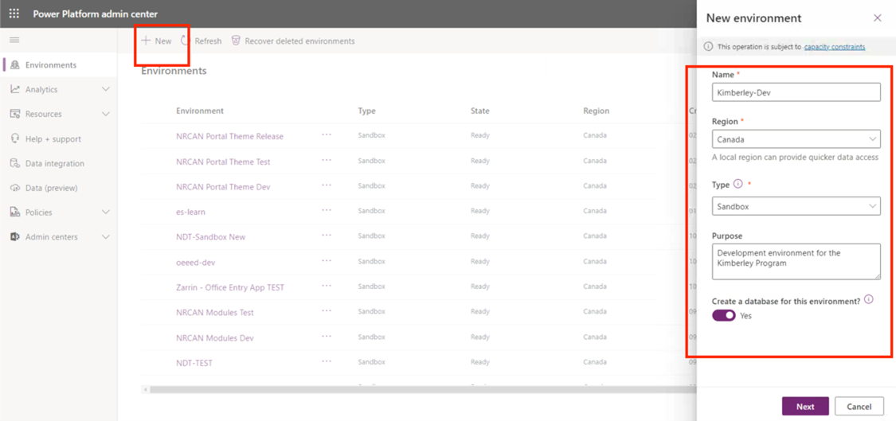
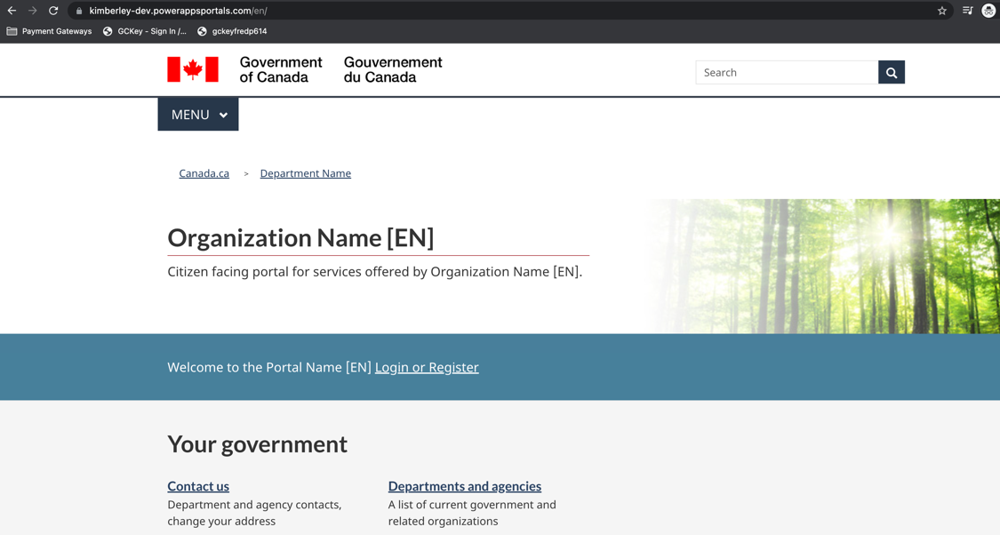

# PowerApps Portal Theme Deployment

Navigate to the https://admin.powerplatform.microsoft.com and In the environments menu press “New Environment”. Fill in a title (format should be EN(Acronym)-FR(Acronym)-Dev(Environment Type), description and ensure to select custom URL to ensure that the subdomain is not random and that you’ve selected English and $CAD as the default language and currency respectively. Since the {DEPARTMENT} Portal Theme relies on the Dynamics 365 Customer Service App to be installed, ensure to check “Enable Dynamics Apps” and select customer service pro.  *Optional (but recommended) * - {DEPARTMENT} should assign an Azure AD security group to govern access to any environment. This can be applied later, however if one is provided beforehand, make sure to set the Security group in this wizard. This environment provisioning can take up to 30 minutes.

Once the environment has been provisioned, navigate to the https://make.powerapps.com  and select the newly created environment. In the side panel, select “Create” and once the application library is rendered, select “Customer self-service”. The follow the convention, it is recommended that the portal title and subdomain matches the title of the environment.  The portal provisioning process can take up to 20 minutes.

Once provisioned, navigate to the portal application to ensure its running

Delete the newly created portal application in PowerApps as this will be replaced with the Enterprise Theme. The portal installation is required to ensure the environment has the necessary solutions and web application configured.

Go to the Portal Management Model Driven App and Delete the website record

Navigate to the Dynamics 365 System Settings and temporarily remove file attachment and file size (adjust) restrictions. This ensures that the theme’s JavaScript files can be uploaded and not blocked by the API. Make sure to copy the file restrictions to your notepad or elsewhere as once the theme has been uploaded, you will need to add these restrictions back.

Next install the French Language Pack by going back to the System’s administration settings and selecting Languages, and then French (1036)

To deploy the {DEPARTMENT} Enterprise Theme, download the portal CLI extension in Visual Studio Code. Once downloaded, create a new project in an empty directory on your computer. Next, once the empty project is opened in your IDE, connect and download the {DEPARTMENT} Portal Theme – Release environment by using the commands below.

Before running these commands, download the portal from the following GIT repository:
https://github.com/Cloudstrucc/PowerApps-WET-Canada (e.g download the files, or clone the repository)

* pac auth create --url "https://{**ENVIRONMENT-SUBDOMAIN**}.crm3.dynamics.com" --applicationId "" --tenant "" --clientSecret "" **<-Connect to theme environment**
* pac paportal upload -p .\customer-self-service\ **<-Folder of downloaded portal from GITHUB (folder is in the PowerApps-WET-Canada folder downloaded from GITHUB**

Once the upload is completed, return to make.powerapps.com, select your environment, and create a new portal application and make sure to check “use existing website record” and select “customer-self-service”. Allow the Dataverse to finalize the deployment for 10 minutes. Once the 10 minutes has elapsed, you should be able to navigate to the portal and the Canada.ca theme will render.

Convert the Portal from Trial to Production. Go the portals admin console and in the Portal details menu select Convert and confirm. Before doing so locate the App Registration user in the Azure Portal and yourself (and other administrators of this environment) as Owner. Note you will need to have the Application Administrator Azure Role in your active assignments.

Validate you are working with the correct App Registration user by navigating to the Authentication blade and inspecting the Redirect URLs to ensure it matches your newly created environment.

Add the PowerPlatform-CICD App Registration user to the newly created environment. Go to the environment in the PowerPlatform admin centre and select Users on the right and follow the rest of the steps below.

Restart the portal

If the portal is still rendering the original theme, you can verify and set the binding to point to the theme’s binding. 

Once uploaded, go to portal’s admin centre, and restart. Once restarted, the portal will should render the enterprise theme.

Now that the theme is installed, edit the authentication setting entitled “Enterprise SSO” and enter in the ClientID, Secret, and the redirect URL’s domains to match the newly created portal’s domain and restart the portal. *NOTE you will need to send your portal domain to the Azure B2C administrator who will provide you with a ClientID and Secret to replace.

(Optional Step) Set the IP Restrictions to the Portal to only allow network flows from the {DEPARTMENT} Network (VPN or Direct).  The IP(s) must be in CIDR notation. You can reference the “{DEPARTMENT}-portal-theme-dev” deployment to obtain the IP restriction list.

