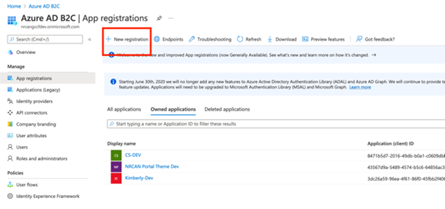
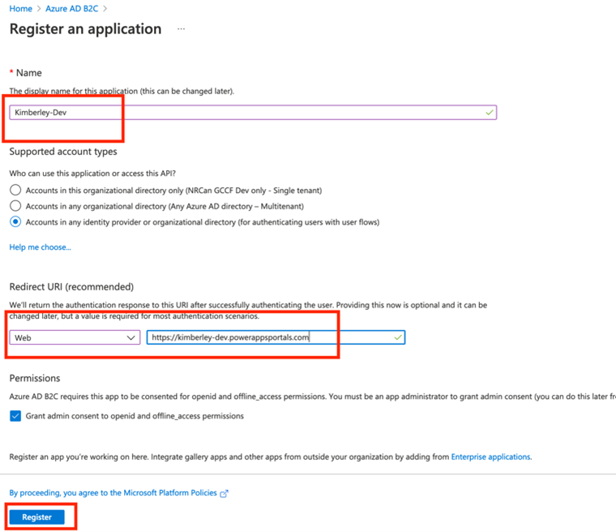
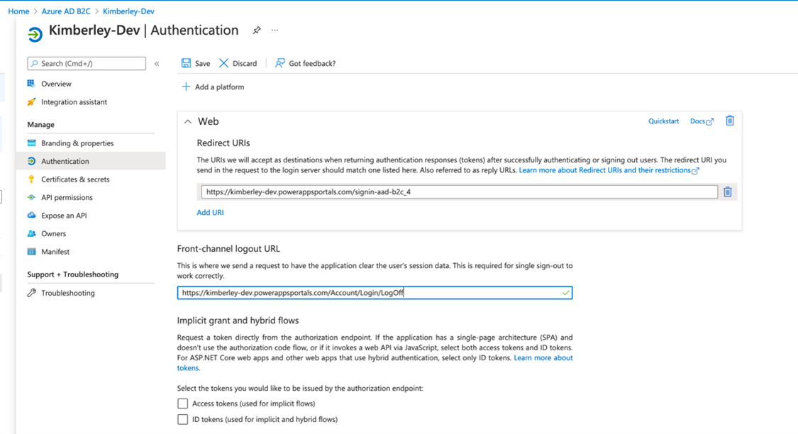
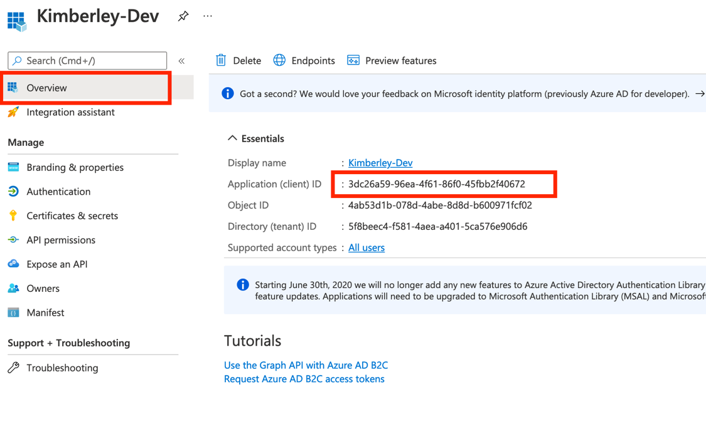

# Azure B2C – Configuring a new Client

As the Azure B2C ({DEPARTMENT}-gccf-dev domain) Administrator, navigate to the Azure B2C tenant and follow the steps below to register an application to leverage the enterprise SSO. Once completed, provide the ClientID to the PowerApps Portals administrator to set the value in the PowerApps Portals site settings. You will need to receive the portal domain from the PowerApps administrator before completing the steps below.

Provide the Application (client) ID to the PowerApps administrator

