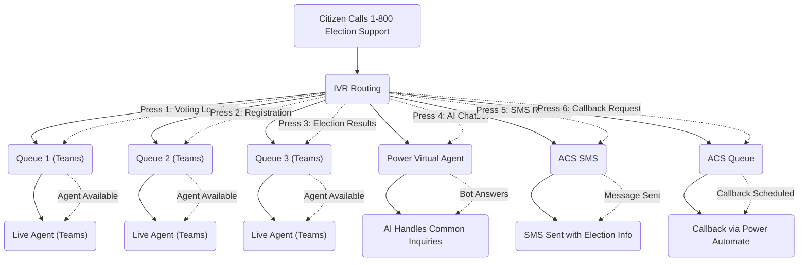
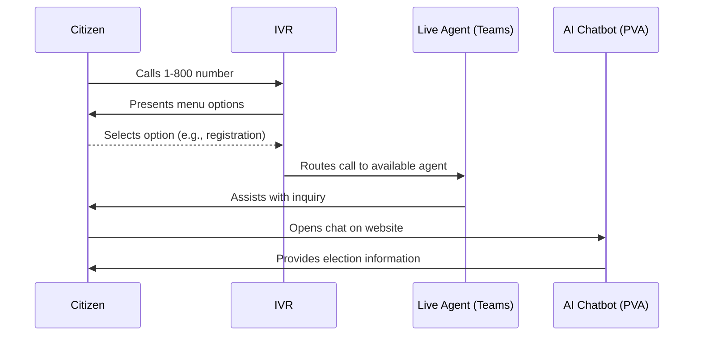
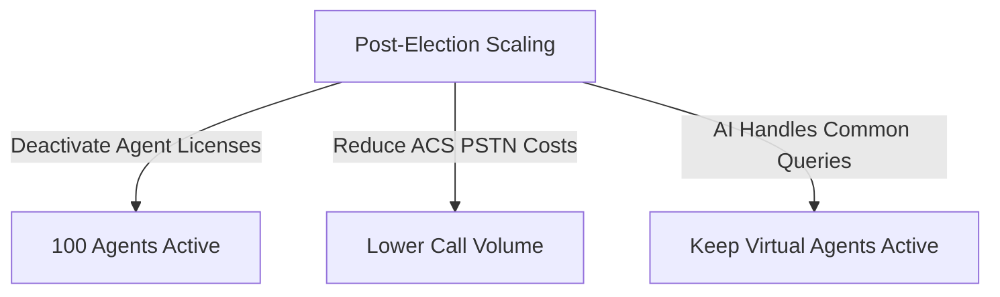

# **Scalable Microsoft-Based Call Center for Elections Canada**

## **1. Overview**

Elections Canada requires a **temporary, scalable call center** to handle **high-volume inquiries during elections** while maintaining a **smaller baseline operation during non-election periods**. This document outlines an **optimized, cost-effective, and flexible** solution using **Microsoft Dynamics 365 (D365), Azure Communication Services (ACS), and Microsoft Teams**.

### **Key Objectives**

✅ **Scalable**: Dynamically **scale up** during elections and **scale down** in off-peak months.
✅ **Inbound-Only**: All interactions (**calls, chat, SMS, social messages**) are inbound.
✅ **Cost-Effective Licensing Model**: Uses **monthly active agent licensing** to avoid paying for unused licenses.
✅ **Omnichannel Support**: Includes **voice (IVR), chat, SMS, email, and social media**.
✅ **AI & Automation**: Uses **IVR, chatbots, and Power Automate** to reduce agent workload.

## **2. High-Level Architecture**

### **Scalable Call Center Model**

## **3. Implementation Plan**

### **📌 Phase 1: Core Setup (Baseline Call Center, 100 Agents)**

- **Set Up Azure Communication Services (ACS)**

  - Configure **PSTN inbound calling** for election support.
  - Lease **toll-free numbers for different regions**.
  - Enable **IVR routing using ACS Call Automation API**.
- **Deploy Microsoft Teams for Agents**

  - Configure **Direct Routing with ACS for Teams-based softphones**.
  - Enable **AI-driven call transcription & analytics**.
- **Deploy D365 Omnichannel (Limited License Count)**

  - Start with **100 active agents** for year-round low-volume support.
  - Enable **live chat, SMS, and social media integration**.

### **📌 Phase 2: Scale Up for Elections (General & By-Elections)**

- **Increase Agent Licensing**

  - Scale from **100 to 600 agents** with **temporary licenses**.
  - Ensure **real-time agent availability** using queue management.
- **Expand Omnichannel Support**

  - Increase **chatbot automation** for **self-service inquiries**.
  - Deploy **AI-driven call routing for efficiency**.
- **Implement Election-Specific IVR & FAQ Automation**

  - Update IVR prompts with **election-specific queries**.
  - Use **Power Virtual Agents (PVA) for automated FAQ responses**.

### **📌 Phase 3: Scale Down Post-Election**

- **Deactivate Unused Licenses**

  - Scale down **D365 Omnichannel agent count from 600 → 100**.
  - Reduce **PSTN usage (phone numbers & minutes)**.
- **Optimize Call Handling**

  - Maintain **AI chatbots for 24/7 basic election inquiries**.
  - Keep **Power BI monitoring active for performance tracking**.

## **4. Cost Breakdown**

### **📌 Baseline Monthly Costs (Non-Election Period, 100 Agents)**

| **Cost Category**                   | **Unit Cost**                | **Users** | **Total Cost** |
| ----------------------------------------- | ---------------------------------- | --------------- | -------------------- |
| D365 Customer Service Enterprise          | $105         | 100       | $10,500 |                 |                      |
| Omnichannel for Customer Service          | $95          | 100       | $9,500  |                 |                      |
| ACS Inbound Calls (500K mins)             | $0.008/min   | 500K mins | $4,000  |                 |                      |
| AI Chatbot & Analytics                    | Fixed                              | -               | $1,500               |
| **Total Non-Election Monthly Cost** |                                    |                 | **$25,500**    |

### **📌 Peak Election Period Costs (600 Agents)**

| **Cost Category**             | **Unit Cost**                | **Users** | **Total Cost** |
| ----------------------------------- | ---------------------------------- | --------------- | -------------------- |
| D365 Customer Service Enterprise    | $105         | 600       | $63,000 |                 |                      |
| Omnichannel for Customer Service    | $95          | 600       | $57,000 |                 |                      |
| ACS Inbound Calls (1.5M mins)       | $0.008/min   | 1.5M mins | $12,000 |                 |                      |
| AI Chatbot & Analytics              | Fixed                              | -               | $2,500               |
| **Total Election Month Cost** |                                    |                 | **$134,500**   |

## **5. ROI & Cost-Saving Strategies**

| **Strategy**                          | **Potential Savings** |
| ------------------------------------------- | --------------------------- |
| Increase Chatbot & IVR Usage (Reduce Calls) | $10K - $25K/month           |
| Reduce Election Agent Count to 400 (Peak)   | $20K - $30K/month           |
| Optimize Call Routing (Fewer Transfers)     | $5K - $10K/month            |

## **6. Summary & Final Recommendation**

### **Final Cost Estimates**

| **Scenario**                            | **Total Monthly Cost** |
| --------------------------------------------- | ---------------------------- |
| **Baseline (100 Agents, Non-Election)** | **$25,500**            |
| **Peak (600 Agents, Election Months)**  | **$134,500**           |
| **With Cost-Saving Strategies**         | **$85K - $110K**       |

### **Final Recommendation:**

✅ Deploy **Microsoft-based call center with on-demand scaling**.
✅ Maintain a **100-agent baseline operation** year-round.
✅ Use **temporary licenses** to scale up for **general & by-elections**.
✅ Reduce costs through **AI-driven automation** (IVR, chatbots).
✅ Monitor and **optimize operations with Power BI analytics**.

### **Next Steps:**

1. **Deploy a 3-month pilot (100 agents).**
2. **Test AI-driven automation & IVR.**
3. **Develop an election readiness strategy for scaling.**
4. **Optimize for cost savings & efficiency.**

🚀 **This dynamic Microsoft solution ensures cost-effectiveness, scalability, and AI-driven automation for election inquiry management.** Would you like assistance with a **pilot deployment roadmap or cost-saving optimization plan**?
