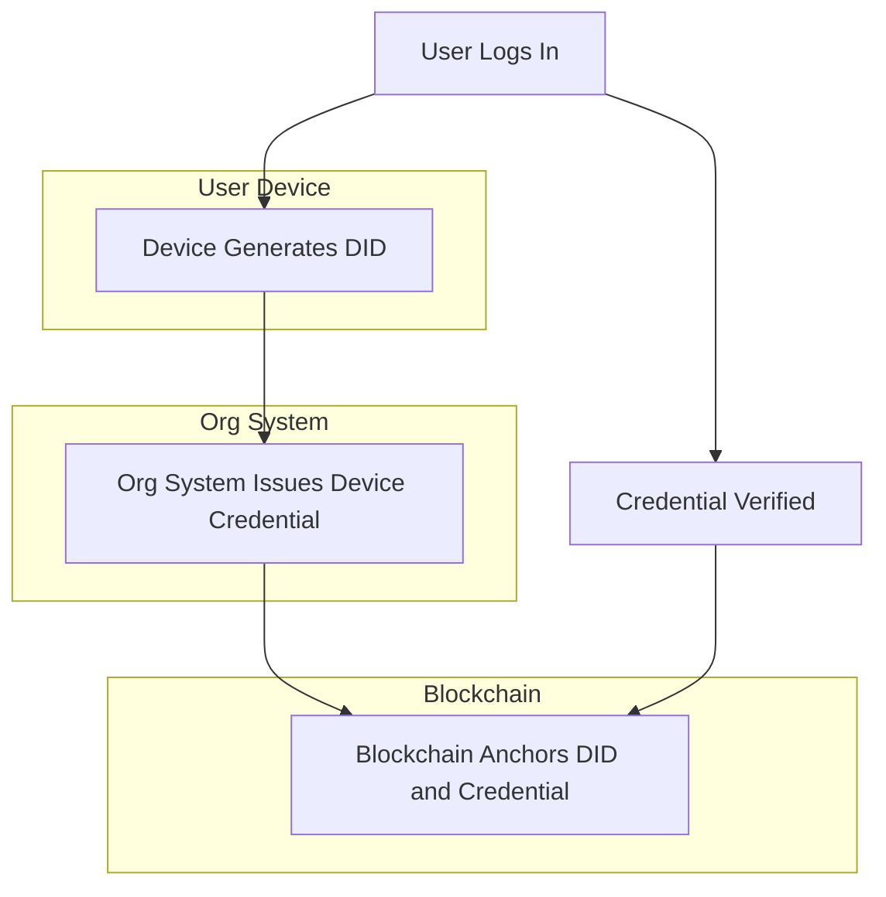
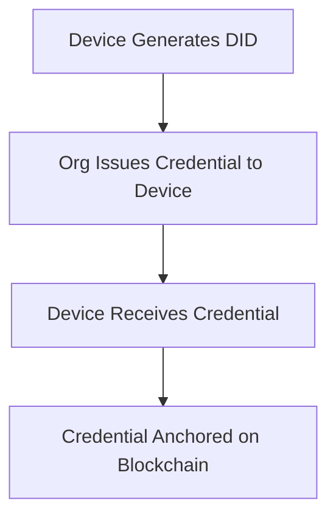
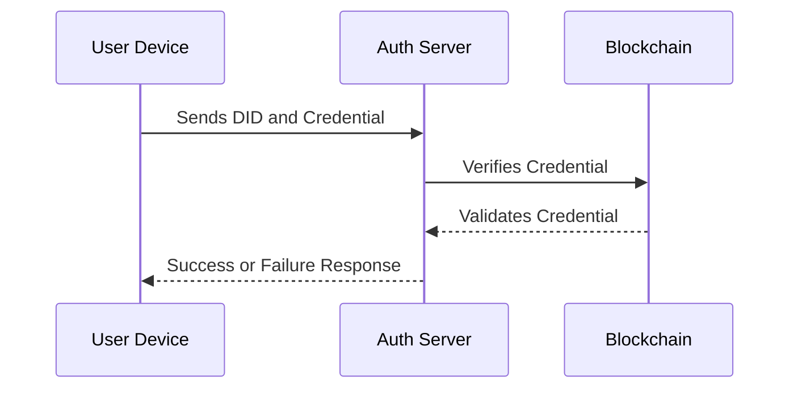
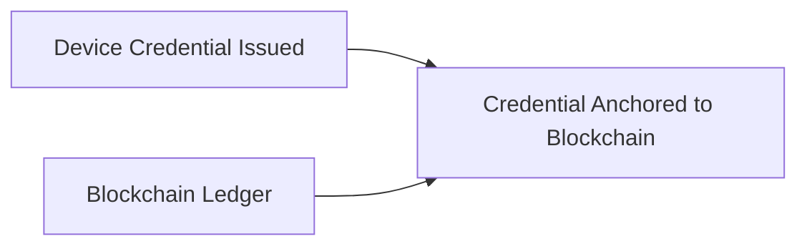
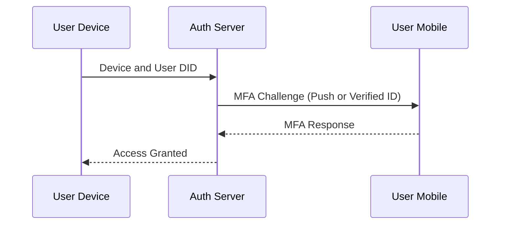
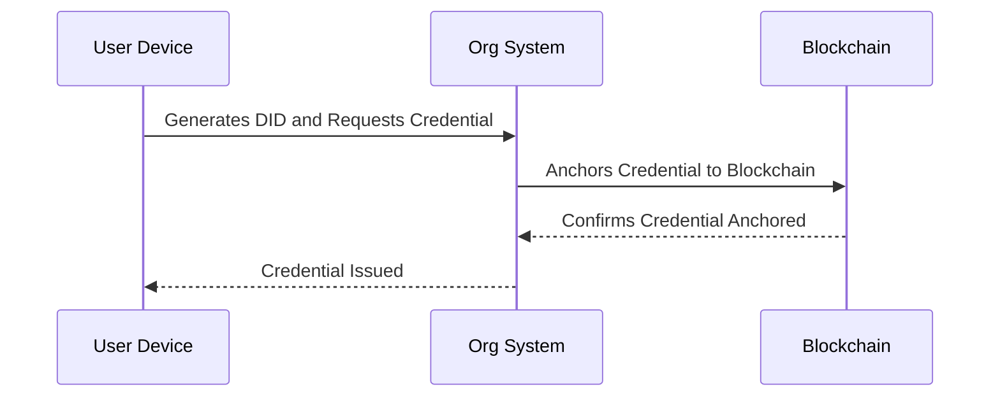
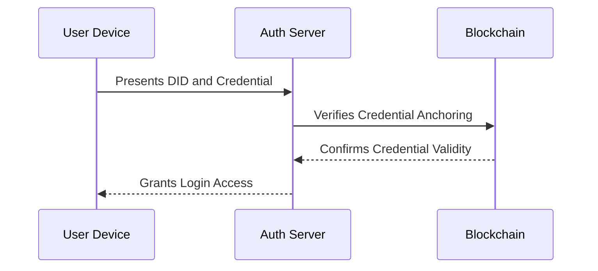
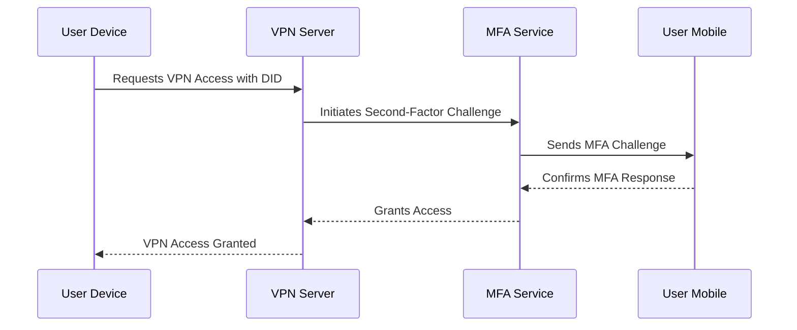

# Device Trust and User Authentication using DID and Blockchain for Second-Factor VPN Access

## Overview

To replace Entrust PKI and implement a second-factor authentication for users before VPN access, this design explores the use of Decentralized Identity (DID) and blockchain anchoring. This ensures that both the user and the device are verified before accessing the network, enhancing security by tying device trust to user credentials.

## Solution Components



### 1. Device Issuance of a DID

Devices (laptops, smartphones, etc.) can be issued their own DID by your organization's identity provider. The device’s DID is stored in a secure storage area (e.g., Trusted Platform Module (TPM)) and linked to the user's DID.

- **Device DID Creation**: The device generates a unique DID tied to hardware identifiers (e.g., MAC address, TPM keys).
- **Linking Device to User**: The device's DID is linked to the user’s DID, establishing a trust chain between the device and the user.

### 2. Device Credential Issuance

Once the device generates a DID, it receives a credential from a trusted authority (e.g., your IT department). The credential contains:

- Device ownership (linked to the user's DID)
- Hardware information (to ensure device uniqueness)
- Security posture (ensuring compliance with required standards)



### 3. Device Authentication and Verification Process

During user login or VPN access, the device proves it holds the correct DID and credential in a challenge-response process:

- The device sends its DID and credential to the server.
- The server verifies the credential against the blockchain or decentralized network.
- The server checks that the device’s DID is linked to the user’s DID, ensuring that only trusted devices for a specific user are authorized.



### 4. Blockchain Anchoring

Blockchain provides the trust anchor for device verification. Device credentials and their verification details are recorded immutably on a blockchain, ensuring tamper resistance and an additional trust layer.



### 5. Second-Factor Authentication with Device Trust

After verifying the device, a second-factor authentication is required for further security:

- **Device + User Credential**: Both the device’s DID and the user's DID are challenged for verification.
- **MFA or Verified ID on a Separate Device**: A second factor, such as a push notification, biometric authentication, or Verified ID on a mobile device, can be used to verify the user.



## Benefits of DID-Based Device Trust

- **Device Ownership Verification**: Only devices with valid, linked DIDs are trusted.
- **User and Device Linkage**: Ensures that only authorized devices for a specific user can access resources.
- **Tamper-Resistance**: Blockchain anchoring prevents credential tampering.
- **Revocation and Monitoring**: Device credentials can be revoked and tracked via blockchain, with immediate effect.

## Available Solutions

### 1. Microsoft Entra Verified ID for Devices

Entra Verified ID allows the issuance of custom credentials for both users and devices. This integrates with existing infrastructure like Azure AD for enforcing conditional access policies.

### 2. Trusted Platform Module (TPM) with DID

TPM-equipped devices can securely store DIDs and perform secure, signed transactions for authentication.

### 3. Third-Party DID Solutions

Solutions like **Hyperledger Indy** or **Sovrin** support DID and blockchain-based device management.

## Example Workflow for Device Verification

1. **Device Registration**

   - Device generates a DID.
   - Organization issues a credential linking the device to the user.



2. **Login Process**

   - User logs into the device.
   - Device presents its DID and credential to the authentication server.
   - Server verifies the credential via blockchain and checks the device-user DID linkage.
   - Upon verification, the user is challenged with a second factor (e.g., MFA or Verified ID on a phone).



3. **VPN Access**

   - After verifying both the device and user, VPN access is granted.



## Summary

By using DID and blockchain anchoring, you can implement a robust solution that verifies both the user and the device, ensuring secure, authorized access to your network. Blockchain provides a tamper-proof trust layer, and Microsoft Entra Verified ID can be extended to incorporate device credentials for enhanced security and seamless second-factor authentication.

```sql

This markdown file contains all the requested information and includes Mermaid.js diagrams under the appropriate sections. The diagrams visualize the flows for system-to-system interactions and user interactions throughout the authentication and verification process. Let me know if you need further adjustments!

```
