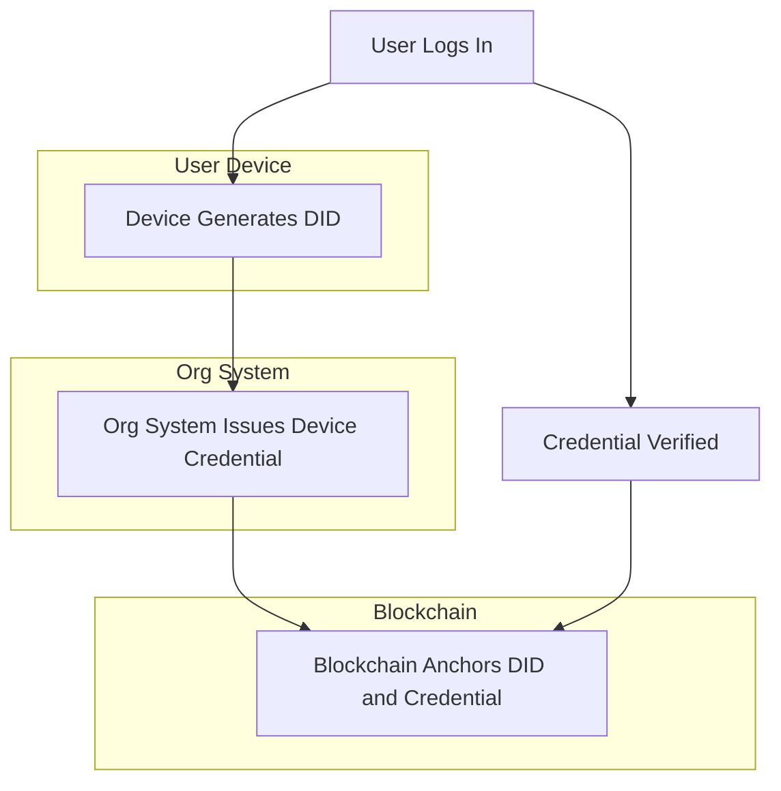
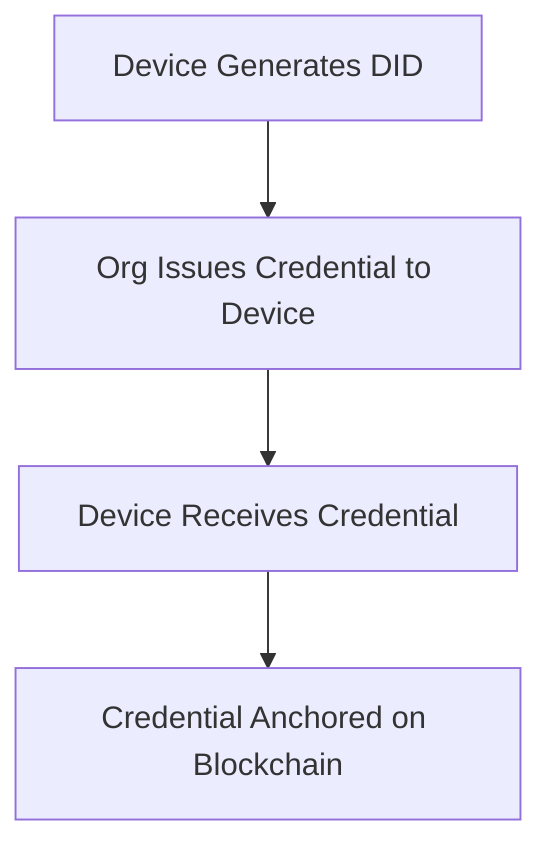
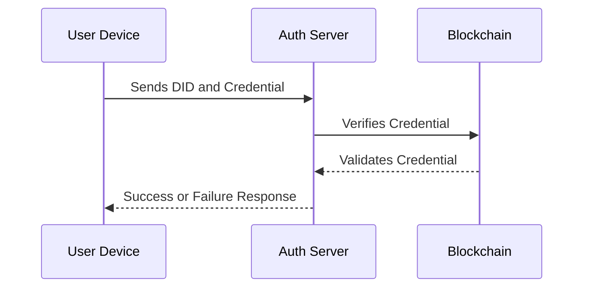
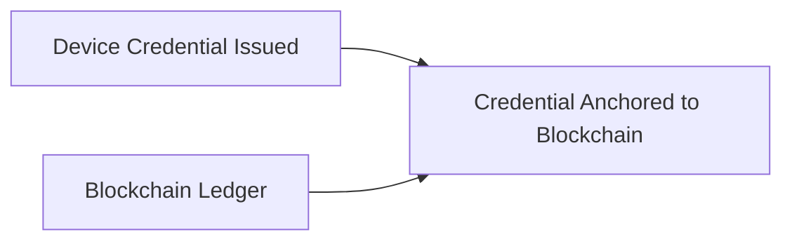
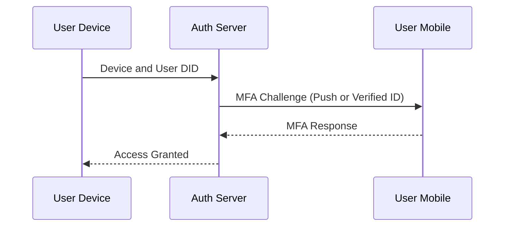
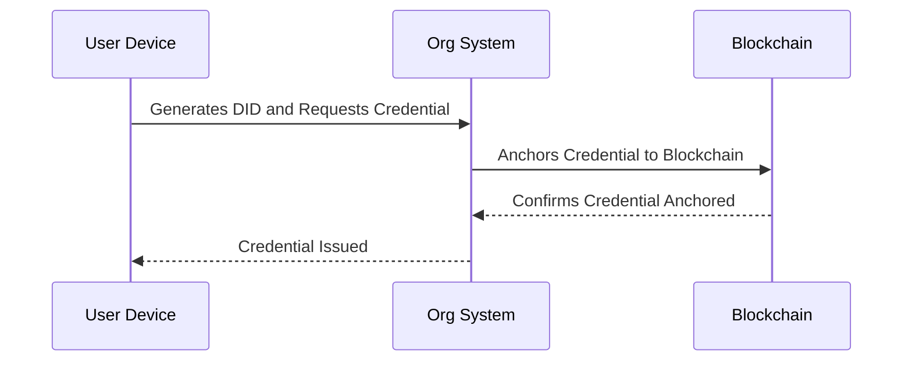
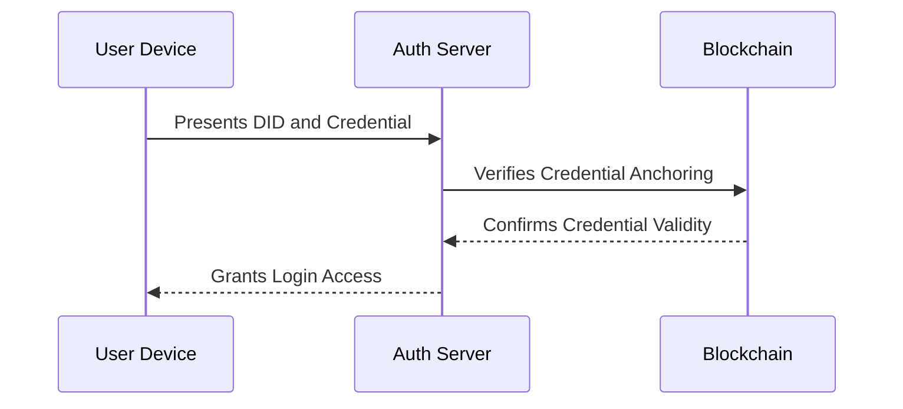
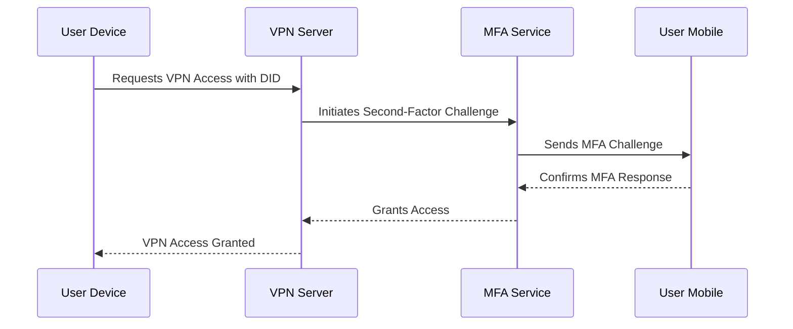
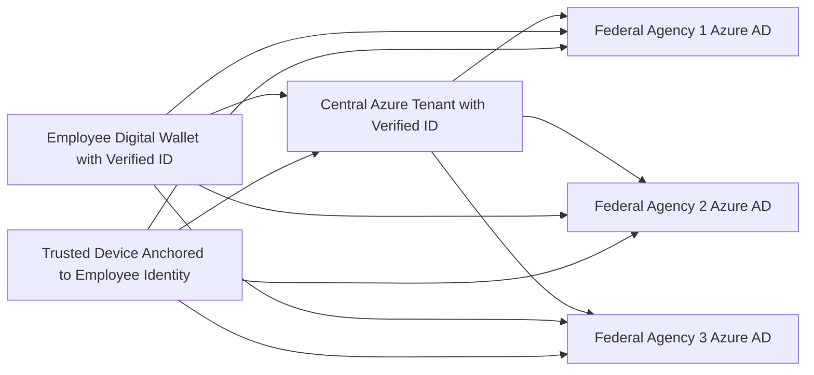

# Device Trust and User Authentication using DID and Blockchain for Second-Factor VPN Access

## Overview

To replace Entrust PKI and implement a second-factor authentication for users before VPN access, this design explores the use of Decentralized Identity (DID) and blockchain anchoring. This ensures that both the user and the device are verified before accessing the network, enhancing security by tying device trust to user credentials. Traditional Public Key Infrastructure (PKI) systems, such as those provided by Entrust, rely on centralized Certificate Authorities (CAs) to issue and manage digital certificates. While effective, this centralized approach can present single points of failure and potential security vulnerabilities. Decentralized Public Key Infrastructure (DPKI) aims to address these issues by leveraging blockchain technology and Decentralized Identifiers (DIDs).

## DPKI Concept

DPKI distributes the responsibilities of traditional PKI across a decentralized network, typically using blockchain technology. This approach eliminates the need for a central trusted authority, instead relying on consensus mechanisms and cryptographic proofs to ensure the integrity and authenticity of identities and credentials.

## Key Components of DPKI

1. **Blockchain**: Serves as a distributed ledger for storing and verifying identity information.
2. **Decentralized Identifiers (DIDs)**: Unique identifiers that enable verifiable, decentralized digital identity.
3. **Verifiable Credentials**: Cryptographically secure claims about the identity holder.
4. **DID Wallets**: Software for managing DIDs and credentials on user devices.

## Replacing Entrust PKI with DPKI

### Overview

The proposed design aims to replace the Entrust PKI system with a DPKI solution, implementing a second-factor authentication for users before VPN access. This approach leverages Decentralized Identity (DID) and blockchain anchoring to enhance security by verifying both the user and the device before granting network access.

### Key Aspects

1. **User and Device Verification**:

   - Each user is assigned a DID, stored on the blockchain.
   - Devices are also assigned DIDs, creating a cryptographic link between user and device.
   - This dual verification ensures that only authorized users on approved devices can access the network.
2. **Enhanced Security**:

   - By tying device trust to user credentials, the system creates a more robust authentication mechanism.
   - Compromising a single factor (user credentials or device) is insufficient for gaining unauthorized access.
3. **Decentralized Trust**:

   - Instead of relying on Entrust as a centralized authority, trust is distributed across the blockchain network.
   - This reduces the risk associated with a single point of failure or compromise.
4. **Flexible Authentication Flow**:

   - User initiates VPN connection.
   - System requests proof of user DID and device DID.
   - User provides credentials through their DID wallet.
   - System verifies credentials against the blockchain.
   - Upon successful verification, VPN access is granted.
5. **Scalability and Interoperability**:

   - The DPKI system can easily scale to accommodate growing numbers of users and devices.
   - Standards-based approach (using W3C DID and Verifiable Credentials standards) ensures interoperability with other systems and potential future enhancements.

## Benefits Over Traditional PKI

1. **Increased Security**: Eliminates vulnerabilities associated with centralized CAs.
2. **Greater Control**: Organizations have more direct control over their identity infrastructure.
3. **Improved Privacy**: Selective disclosure and zero-knowledge proofs can enhance user privacy.
4. **Auditability**: All transactions are recorded on the blockchain, providing a transparent audit trail.
5. **Resilience**: Decentralized nature makes the system more resistant to attacks and outages.

## Challenges and Considerations

1. **Performance**: Blockchain operations may introduce latency compared to traditional PKI.
2. **Adoption**: Requires significant changes to existing infrastructure and user education.
3. **Regulatory Compliance**: Must ensure alignment with government regulations and standards.
4. **Key Management**: Secure management of private keys is crucial and potentially complex.

This DPKI-based approach represents a significant advancement in secure authentication for VPN access, offering enhanced security, flexibility, and control compared to traditional PKI systems like Entrust.

## Key considerations for solutions

### 1. Security

- Implement robust encryption for DID wallet storage on end-user devices
- Utilize hardware-backed key storage (e.g., TPM) where available
- Employ multi-factor authentication for DID wallet access
- Implement regular security audits of the blockchain network

### 2. Performance

- Optimize blockchain read operations for minimal latency during credential verification
- Implement caching mechanisms for frequently accessed DIDs and credentials
- Consider using Layer 2 solutions or sidechains for improved transaction throughput
- Benchmark VPN connection times against current PKI solution

### 3. Compliance

- Ensure alignment with NIST SP 800-63 guidelines for digital identity
- Verify compliance with FIPS 140-2 for cryptographic modules
- Address requirements specified in OMB Memorandum M-19-17 for federal identity management
- Conduct regular compliance audits and maintain detailed documentation

### 4. Integration

- Develop API interfaces for VPN software to interact with DID verification systems
- Create OS-level integrations for seamless DID management (e.g., Windows CNG extensions)
- Implement DPKI-aware network access control systems
- Ensure compatibility with existing identity and access management (IAM) systems

### 5. Key Recovery

- Design a secure key escrow system for government-managed DIDs
- Implement M-of-N multi-signature schemes for distributed key recovery
- Develop procedures for secure key regeneration and re-issuance
- Create user guidelines for personal recovery phrase management

### 6. Scalability

- Implement sharding or similar techniques to ensure blockchain scalability
- Design a hierarchical DID structure to manage large numbers of identities
- Utilize efficient consensus mechanisms (e.g., Proof of Authority for permissioned networks)
- Plan for horizontal scaling of verification nodes

### 7. Transition Strategy

- Develop a phased rollout plan with specific milestones and success criteria
- Create parallel running capability for DPKI and traditional PKI during transition
- Implement automated migration tools for converting existing digital identities to DIDs
- Establish KPIs for measuring the effectiveness of the transition

### 8. Interoperability

- Adhere to W3C standards for DIDs and Verifiable Credentials
- Implement support for multiple DID methods to ensure cross-platform compatibility
- Develop bridge services for interaction with legacy PKI systems
- Create standardized APIs for identity verification across different government systems

### 9. Privacy

- Implement zero-knowledge proofs for credential verification where applicable
- Design data minimization techniques into the credential issuance and verification processes
- Ensure compliance with relevant privacy regulations (e.g., Privacy Act of 1974)
- Implement fine-grained user consent mechanisms for credential sharing

### 10. Revocation

- Design an efficient revocation broadcasting system using the blockchain
- Implement short-lived credentials with automatic expiration to reduce reliance on revocation
- Create a real-time revocation checking service with high availability
- Develop procedures for immediate revocation in case of security incidents

## Solution Components

### 1. Device Issuance of a DID

Devices (laptops, smartphones, etc.) can be issued their own DID by your organization's identity provider. The device’s DID is stored in a secure storage area (e.g., Trusted Platform Module (TPM)) and linked to the user's DID.

- **Device DID Creation**: The device generates a unique DID tied to hardware identifiers (e.g., MAC address, TPM keys).
- **Linking Device to User**: The device's DID is linked to the user’s DID, establishing a trust chain between the device and the user.

### 2. Device Credential Issuance

Once the device generates a DID, it receives a credential from a trusted authority (e.g., your IT department). The credential contains:

- Device ownership (linked to the user's DID)
- Hardware information (to ensure device uniqueness)
- Security posture (ensuring compliance with required standards)

### 3. Device Authentication and Verification Process

During user login or VPN access, the device proves it holds the correct DID and credential in a challenge-response process:

- The device sends its DID and credential to the server.
- The server verifies the credential against the blockchain or decentralized network.
- The server checks that the device’s DID is linked to the user’s DID, ensuring that only trusted devices for a specific user are authorized.

### 4. Blockchain Anchoring

Blockchain provides the trust anchor for device verification. Device credentials and their verification details are recorded immutably on a blockchain, ensuring tamper resistance and an additional trust layer.

### 5. Second-Factor Authentication with Device Trust

After verifying the device, a second-factor authentication is required for further security:

- **Device + User Credential**: Both the device’s DID and the user's DID are challenged for verification.
- **MFA or Verified ID on a Separate Device**: A second factor, such as a push notification, biometric authentication, or Verified ID on a mobile device, can be used to verify the user.

## Benefits of DID-Based Device Trust

- **Device Ownership Verification**: Only devices with valid, linked DIDs are trusted.
- **User and Device Linkage**: Ensures that only authorized devices for a specific user can access resources.
- **Tamper-Resistance**: Blockchain anchoring prevents credential tampering.
- **Revocation and Monitoring**: Device credentials can be revoked and tracked via blockchain, with immediate effect.

## Available Solutions

### 1. Microsoft Entra Verified ID for Devices

Entra Verified ID allows the issuance of custom credentials for both users and devices. This integrates with existing infrastructure like Azure AD for enforcing conditional access policies.

### 2. Trusted Platform Module (TPM) with DID

TPM-equipped devices can securely store DIDs and perform secure, signed transactions for authentication.

### 3. Third-Party DID Solutions

Solutions like **Hyperledger Indy** or **Sovrin** support DID and blockchain-based device management.

## Example Workflow for Device Verification

1. **Device Registration**

   - Device generates a DID.
   - Organization issues a credential linking the device to the user.

2. **Login Process**

   - User logs into the device.
   - Device presents its DID and credential to the authentication server.
   - Server verifies the credential via blockchain and checks the device-user DID linkage.
   - Upon verification, the user is challenged with a second factor (e.g., MFA or Verified ID on a phone).

3. **VPN Access**

   - After verifying both the device and user, VPN access is granted.

## Summary

By using DID and blockchain anchoring, you can implement a robust solution that verifies both the user and the device, ensuring secure, authorized access to your network. Blockchain provides a tamper-proof trust layer, and Microsoft Entra Verified ID can be extended to incorporate device credentials for enhanced security and seamless second-factor authentication.

## Unified Identity Management Using Microsoft Entra Verified ID

### Concept Overview

To streamline identity management and improve security across the Canadian federal government, **Microsoft Entra Verified ID** can be used to create a **single, unified identity** for each employee. This identity can be used across all federal agencies, eliminating the current issue where employees may have multiple identities across different Azure AD (Entra) tenants.

### How Entra Verified ID Works

**Microsoft Entra Verified ID** is based on decentralized identity principles, allowing users to own and manage their credentials in a secure digital wallet, while organizations can issue, validate, and revoke these credentials. In this scenario, the government could centralize the issuance of identities and associate them with employees' devices (laptops and mobile phones) to create a secure and unified authentication experience.

#### Key Components:

1. **Central Azure Tenant for Verified ID** :
   One Azure tenant (e.g., managed by a central federal IT authority) would act as the trusted issuer of  **Verified IDs** . This tenant would issue **Verified IDs** to all government employees.
2. **Verified IDs Stored in Digital Wallets** :
   Employees would receive a Verified ID that is stored in a **digital wallet** (such as Microsoft Authenticator or another decentralized identity wallet). This wallet holds their identity credentials securely, allowing them to use a single identity across all agencies.
3. **Cross-Tenant Collaboration** :
   Each federal agency would retain its own Azure AD (Entra ID) tenant, but through  **Azure AD Cross-Tenant Collaboration** , these tenants would trust the centrally issued Verified IDs for authentication. This ensures that an employee can use their single identity across all government agencies, even when transitioning between departments.
4. **Device-Based Credential Anchoring** :
   Devices (laptops and mobile phones) assigned to employees would be registered with the central Azure tenant and anchored to the employee’s Verified ID. This ensures that employees use a **single set of devices** across agencies, and the devices themselves are trusted and verified using blockchain anchoring for tamper-proof trust.

### Integration with Current Infrastructure

 **Current State** :
Each federal agency operates its own Azure AD tenant, managing identities locally. Employees working across different departments or agencies often have **multiple identities** and potentially **multiple devices** (e.g., laptops from different agencies), leading to inefficiencies and security vulnerabilities.

 **Proposed Future State** :

* A **single, unified identity** is issued from a central Azure tenant.
* Employees have one identity and one set of devices, allowing for cross-agency work without the need for multiple accounts or additional devices.
* The central Azure tenant would manage the issuance and revocation of Verified IDs and devices.
* Each agency’s Azure AD tenant would trust the central Verified ID tenant for authentication.

### Key Benefits

1. **Single Identity Across All Agencies** :
   Employees will use a **single identity** across the entire federal government, reducing the complexity of managing multiple Azure AD accounts and streamlining onboarding/offboarding processes when employees transition between departments.
2. **Improved Security** :
   By anchoring employee identities and devices in a  **centralized Verified ID system** , the government can reduce the risk of identity duplication or tampering, while enhancing overall security through blockchain-based verification. Devices linked to an employee’s Verified ID will provide an extra layer of trust for secure access.
3. **Cross-Tenant Trust Using Azure AD** :
   The **cross-tenant collaboration** feature in Azure AD allows different federal agencies to accept credentials from the central Verified ID tenant. Employees will be able to seamlessly work across agencies using their centralized Verified ID without needing separate logins or credentials for each department.
4. **Device Consolidation** :
   Instead of issuing multiple devices (one per agency), employees can use **one laptop and one mobile device** for their entire career, regardless of which department they are working with. These devices will be pre-registered with their identity and trusted by all federal departments.

### Proposed Architecture

1. **Central Azure Tenant with Verified ID** :
   This central tenant issues, manages, and verifies employees' identities, serving as the source of trust for all federal agencies.
2. **Cross-Tenant Collaboration** :
   Federal agency Azure AD tenants are connected to the central tenant, allowing them to trust the Verified IDs issued by the central system. Employees are authenticated across these agencies using a single identity.
3. **Device Trust** :
   Devices (laptops, phones) are trusted based on their registration with the central tenant and linked to the employee’s Verified ID. This ensures that employees have secure, verified devices for accessing government systems.

### Example Workflow for Identity and Device Usage

1. **Onboarding of a New Employee** :

* The employee is issued a **Verified ID** by the central Azure tenant.
* The employee's devices (laptop and mobile) are registered and linked to their Verified ID.
* The employee can now use the same Verified ID and devices to work across all federal agencies that trust the central Azure tenant.

2. **Authentication for Agency Resources** :

* The employee attempts to access resources at  **Federal Agency 1** .
* The agency’s Azure AD tenant checks the employee’s Verified ID with the central Azure tenant.
* Once verified, the employee gains access without needing a new identity.

3. **Device Trust Verification** :

* Before accessing sensitive resources, the system verifies that the employee is using a trusted, registered device linked to their Verified ID.
* The device is verified using blockchain anchoring to prevent tampering or unauthorized device usage.

### Conclusion

By utilizing **Microsoft Entra Verified ID** and  **Azure AD cross-tenant collaboration** , the Canadian federal government can implement a **unified identity** system, streamlining access, increasing security, and reducing costs by eliminating the need for multiple identities and devices across agencies. This future-state system enhances collaboration and simplifies device management while ensuring that identities and devices are securely managed and verifiable.
