# B2C Integaration

___

# **Setup Azure AD B2C**

You will require an Azure subscription. You can setup a free account and Azure AD B2C

Sign into the Azure Portal on which there is a subscription attached and click _"Create a resource"_. Once on the create a resource page, search for _"azure active directory b2c"_

## Creating a resource

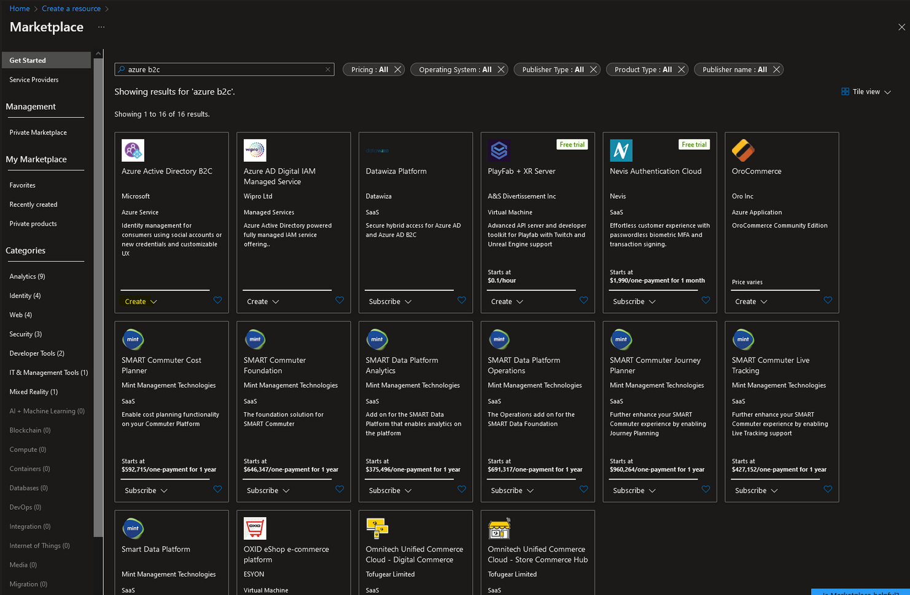

There will be two options, one to create a new Azure AD B2C Tenant and another to link the tenant to your Azure subscription. The first step is to create the tenant.

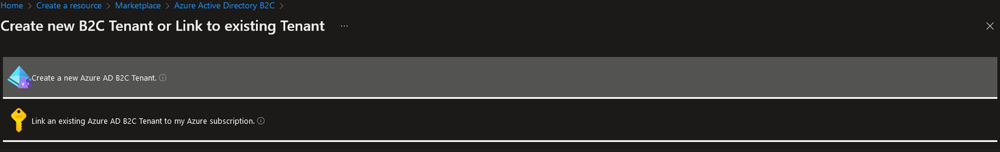

Create an organization name and a domain name andplace the Azure AD B2C resource in the same geography as your PowerApps Portal and CDS environments to reduce any potential latency issues. Select the active subscription in the drop down list, then create a new resource group.

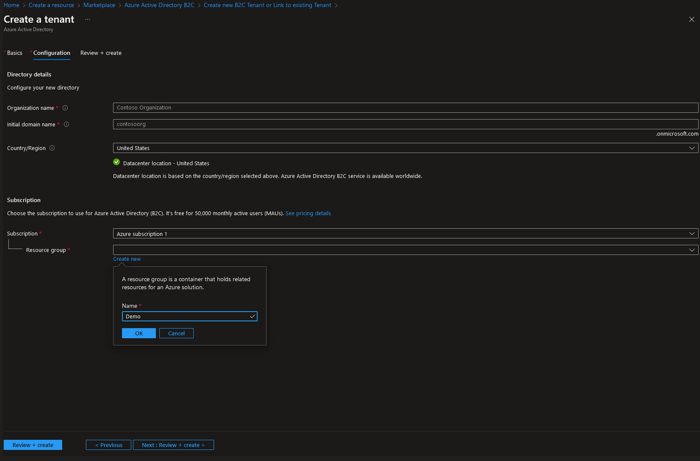

**Now that the new tenant has been created, it should automatically be linked to your azure subscription. In some cases you will have to do this manually by folowing the steps below:

## Link an existing Azure AD B2C Tenant

After these items are setup, the Azure AD B2C tenant needs to be linked to the Azure Subscription. Click on the “Link an existing Azure AD B2C Tenant”

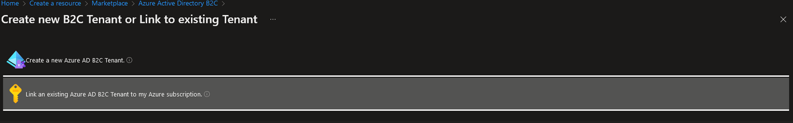

_If you see no available items, that means your new tenant has already been linked to your azure description and you can skip this step._

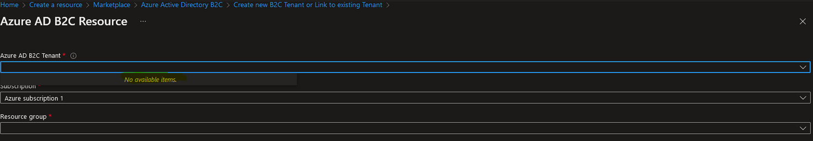
## Setup Azure AD B2C Application

The next step will be to setup the Azure AD B2C Application for our portal. The first thing is to change the directory to ensure that you are logged into the Azure AD B2C tenant that you created earlier. Click on the upper right corner on your account to switch directories.

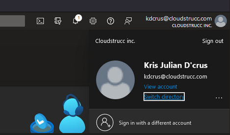
Once in your newly created tenant, navigate to the Azure AD B2C serive, and click on _"Application (Legacy)"_ on the left sidebar.

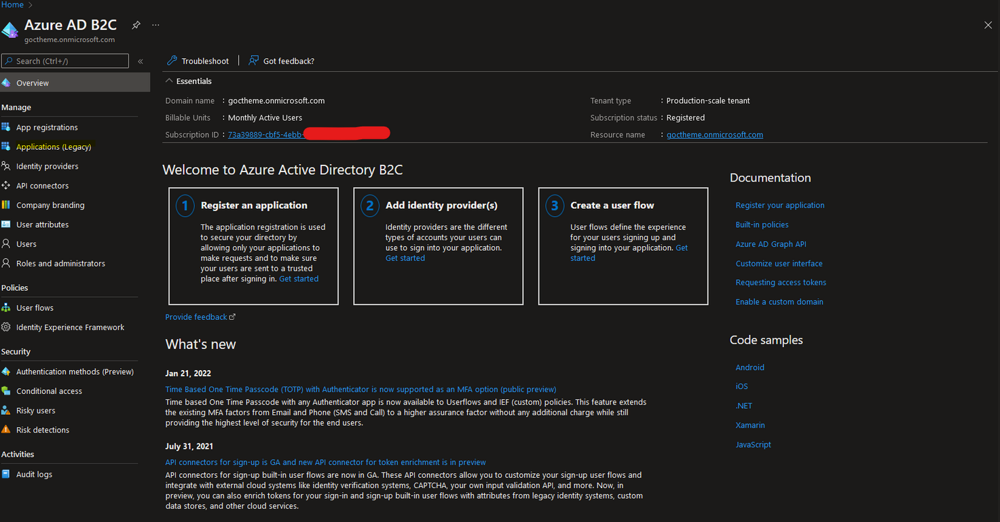

## Add Azure AD B2C Application

When setting up the application, you can pick any name but ideally it should be something descriptive. Make sure that web api and allow implicit flow are turned to “yes”. The reply URL will be your portal URL, appended with a signin-<<unique federation name>>.

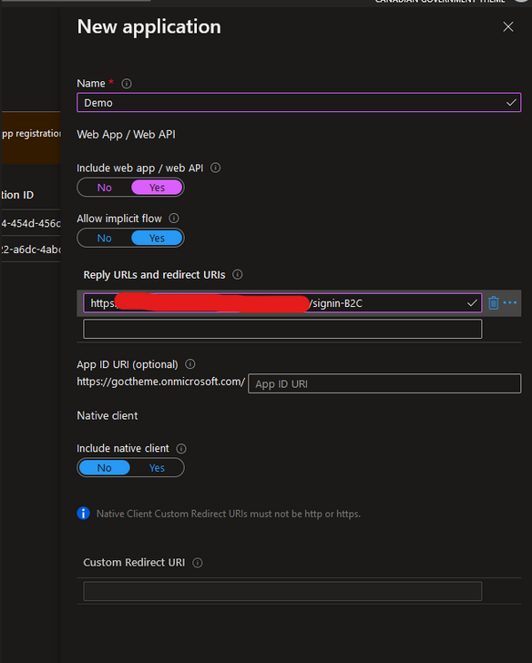

## Setup Policies (User flows)

The next step is to create user flows. These are configurable options that will drive the user sign-up and sign-on experiences while accessing the portal as well as how the password reset will work.

On the left panel, choose “User flows (policies)” from the Policies section and in the main window click on “New user flow”. You will then be prompted to select a user flow type. Select _"Sign up and sign in"_.

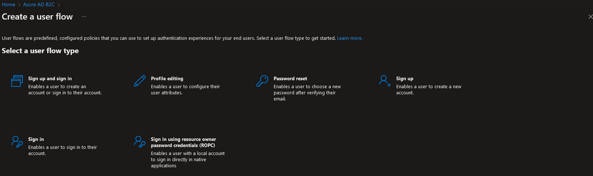

Give the policy a descriptive name. For identity providers, at this point the only option will be email signup.For now we will also not worry about multifactor authentication.

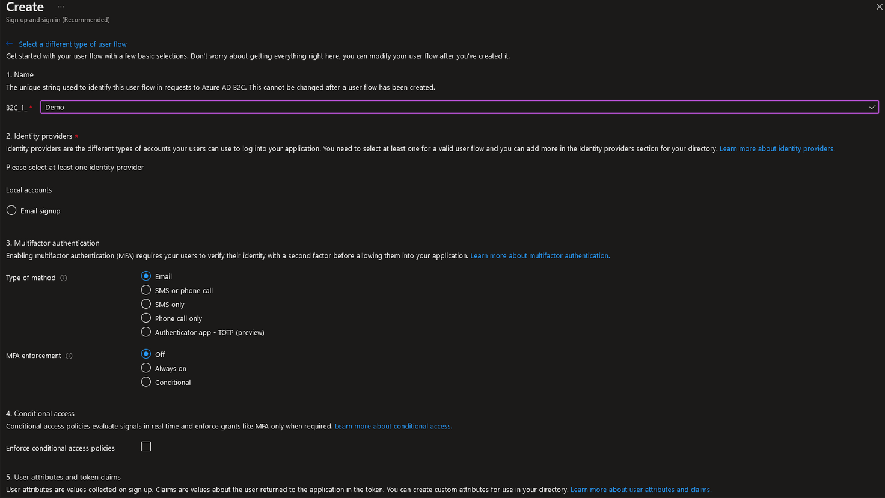

Under user Attributes and Claims section, choose at very least email address, but ideally pick Given name and Surname as well. Typically we will manage most of the user information on our portal itself that will be linked to the contact record in CDS. Click Create.

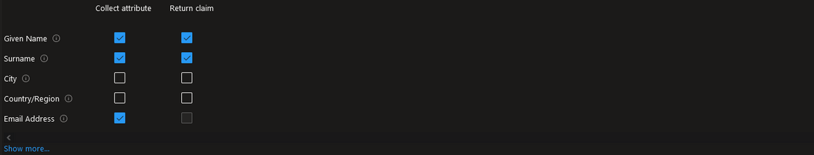

We should now have our signup and signin user flow created.

## Update settings

Click on Properties on the left pane, and in the main window, scroll down to the Token compatibility settings and changes the Issuer (iss) claim to option with “tfp” in the URL

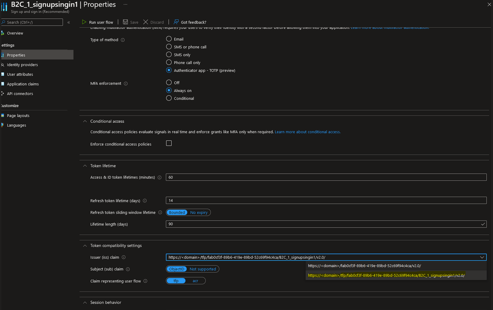

# **Portal Configuration**

Navigate to make.powerapps.com and sign into your environment where your portal lives.

On the app menu, click the ellipses beside the portal and click "settings".

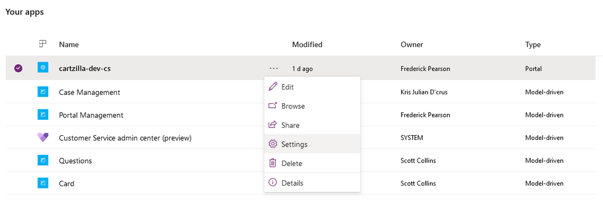

In the Portal settings pane, click on _"Authenication settings"_

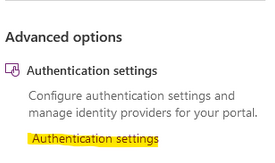
Here you will be able to configure the Azure AD Directory B2C.

Click the configure button.

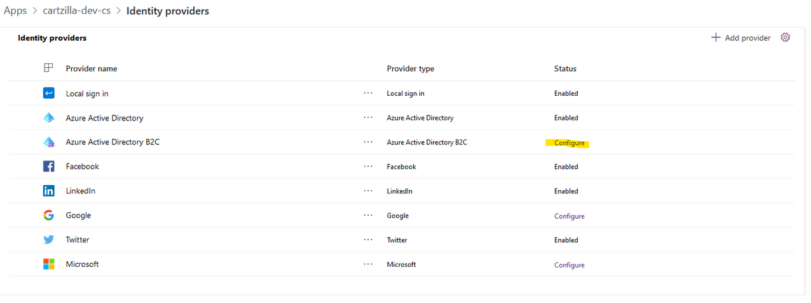

You can give your provider a name or leave it as default. Click next once inputting a provider name.

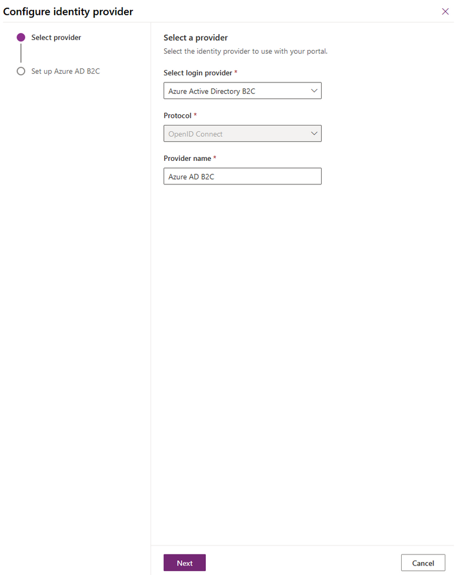

