# Customer Voice D365 Integration
___

## **Overview**

Dynamics 365 Customer Voice is an enterprise feedback management application you can use to easily keep track of the customer metrics that matter the most to your business. With deep integration from the Dynamics 365 line-of-business applications and built on Microsoft Forms, Dynamics 365 Customer Voice adds rich insights by feeding real-time survey data into customer records. Dynamics 365 Customer Voice provides an easy and friction-free experience, from creating surveys to generating actionable insights based on customer feedback with minimal setup time. It helps you to keep a pulse on what customers value and how they view your products and services, so you can rest assured that your data is supported by Microsoft security and compliance policies.

Dynamics 365 Customer Voice introduces project management capabilities. A project contains multiple surveys that share common metrics and settings to simplify survey management. When you sign in to Dynamics 365 Customer Voice, you land on the All projects tab. The All projects tab displays a list of the projects you created, and is where you create new projects and manage existing ones. It also displays the survey-related data for the project

## **Pre-Requisites**

**Dynamics 365 Customer Voice is included with the following Dynamics 365 products:**

    Sales Enterprise
    Customer Service Enterprise
    Field Service
    Marketing
    Customer Insights
    Human Resources
    Project Service Automation

**For customers without select Dynamics 365 applications**

    From $200

    

*2,000 survey responses per tenant/month*

## **Designing a Survey for Distribution**

The customer voice app can be found in a user's Office Dashboard

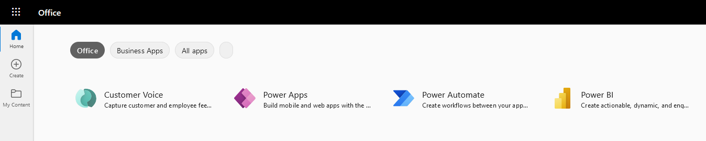

The first step to creating a survey is to create  a project. There are many templates out of the box that are available for use or a custom survey can be created.

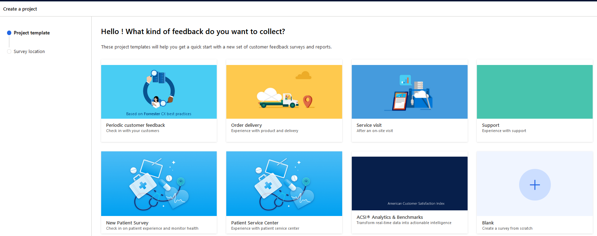

Once a survey has been created you will see it under the 'All projects' section.

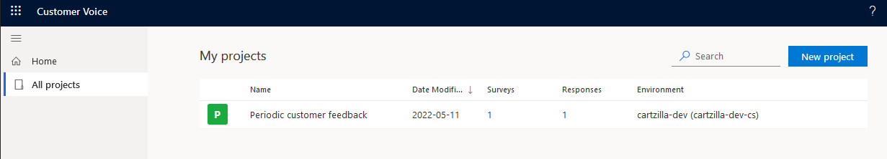

_Please note that you **can** move/copy surveys between environments in your tenant_

## **Enabling Customer Voice in D365**

Visit [AppSource](https://appsource.microsoft.com/en-us/) and download the 'Send Customer Voice survey from Dynamics 365' App.

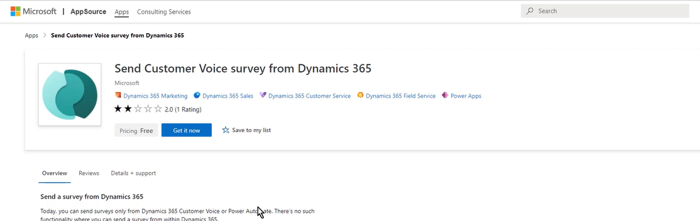

You will be redirected your PowerApps Admin centre to select which environment you want to install it in, and agree to any terms and conditions.

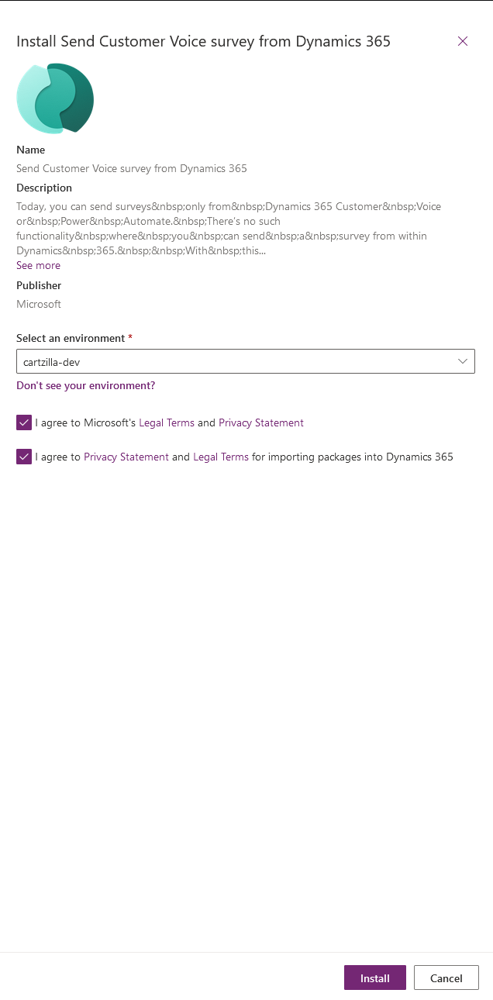

This will install a solution in your environment which contains a Power Automate component that needs configuration in order to complete the installation. 

Navigate to Power Automate, then solutions.

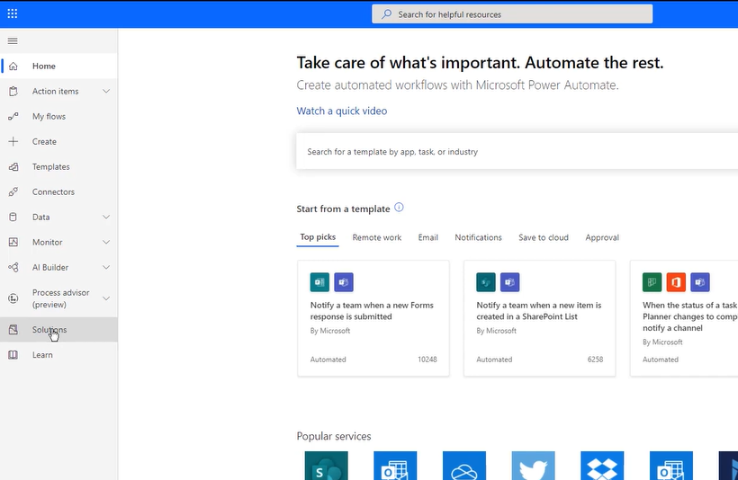

Click on the 'Send Customer Voice survey from Dynamics 365' solution, and then provide connection information.

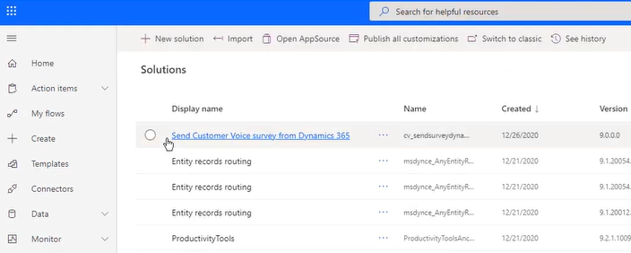

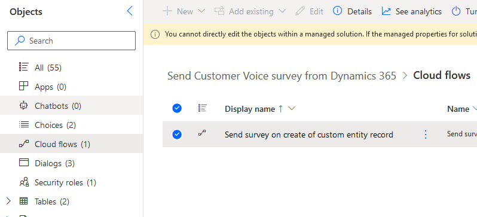

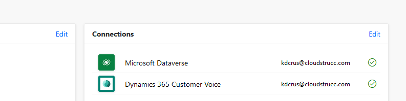

The configuration is now complete and you will see the 'Send survey' button in the ribbon of forms on entities such as: case, contact, account, and opportunity. 

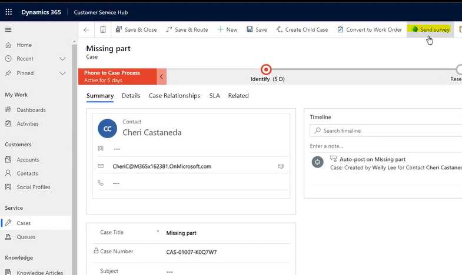

**Please note that only users or teams with the security role 'Survey Sender' will be able to send surveys.**

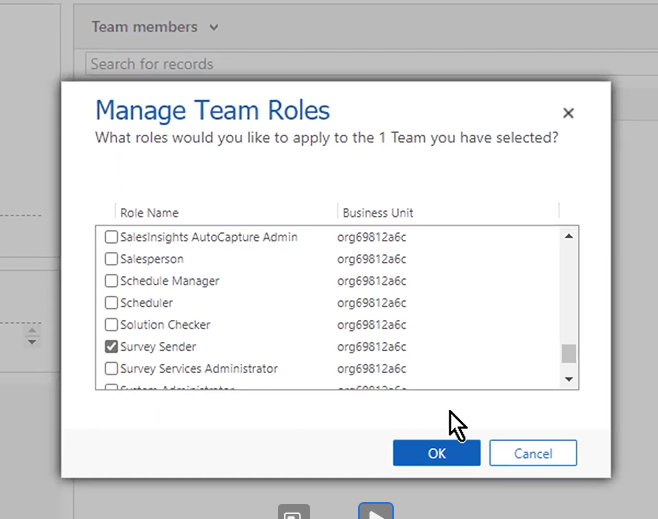

## **Using the Send Survey Button**

_You can share the survey from the project you own and share the survey to other users or teams using standard sharing functionality in dynamics 365._

Sharing Surveys:

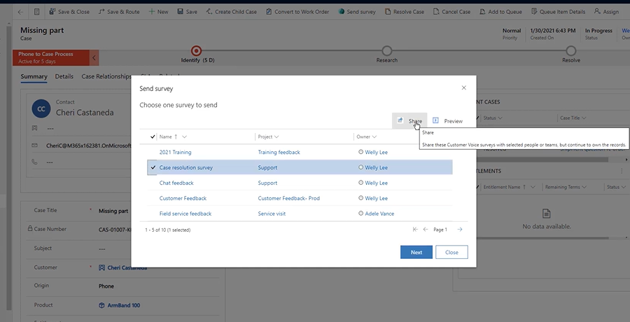

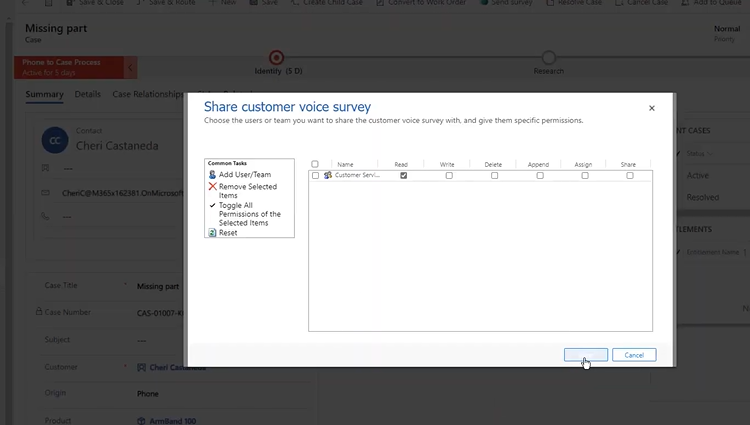

The user or team whom you share with can see the survey when they open the send survey command. Note that the user does not need to be given owner access in customer voice as they can only send the survey and does not need to modify the survey.

Sending Surveys:

Once you have selected which survey to send, click the next button:

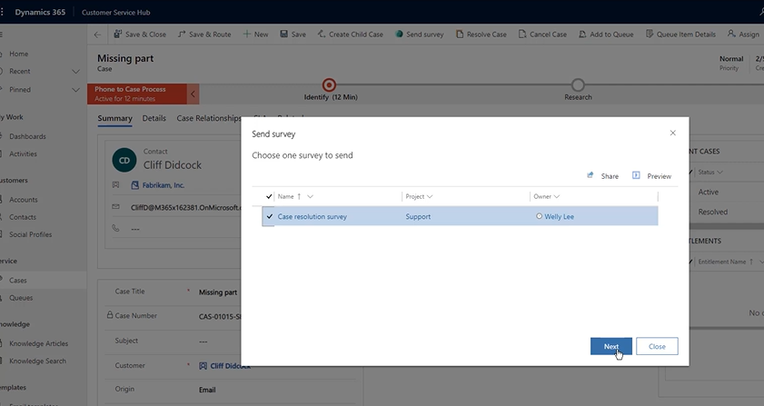

On the next page you can specify an email template (configured in Customer Voice App), language, and survey variable values to use for personalizing and sending the survey.

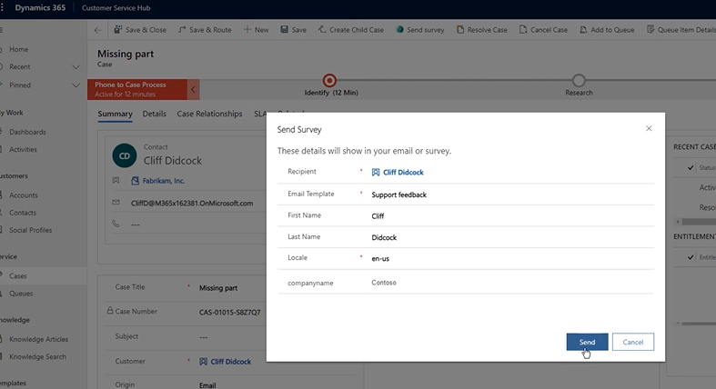

Once the survey is sent, a survey invite will be automatically added to the activity timeline.

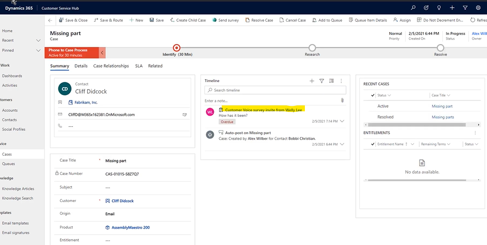

Once the survey is completed by the customer, the survey response will automatically appear on the activity timeline, and anyone who needs to work with customer can see the latest feedback.

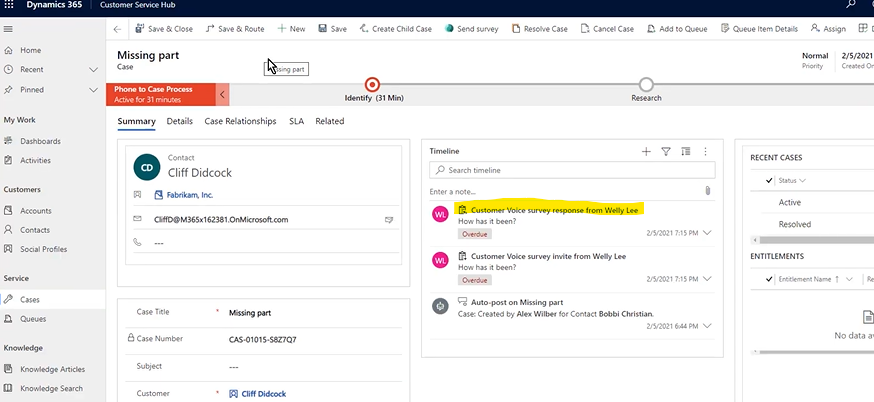

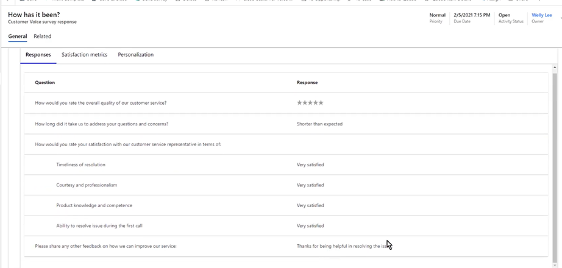

