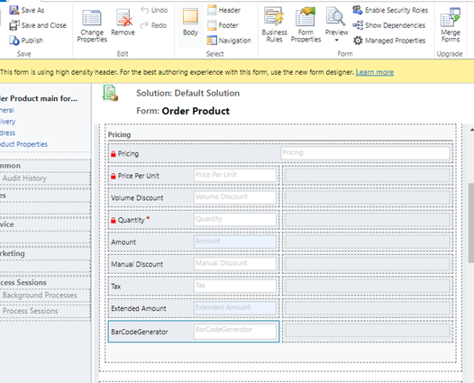
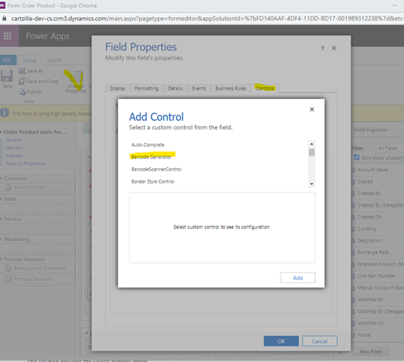
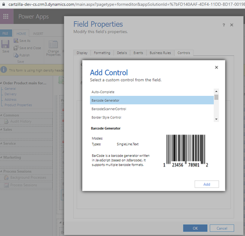
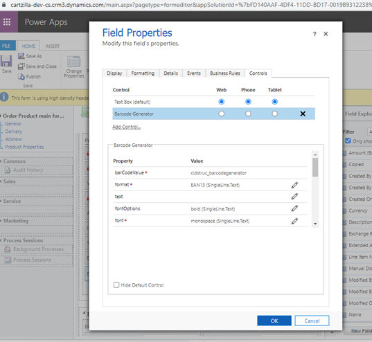
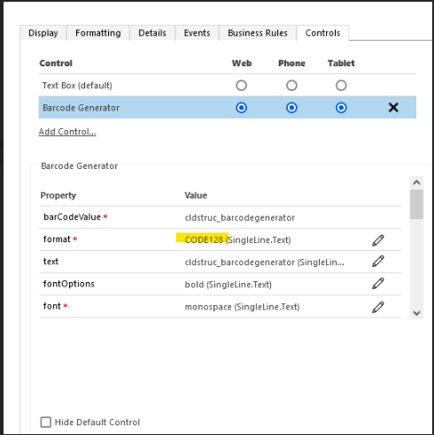
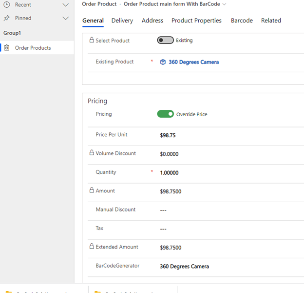
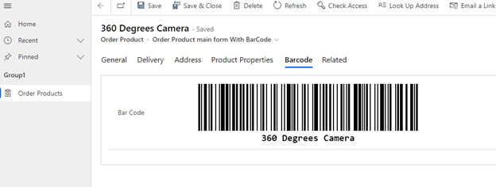

# PCF BarCode Generator Installation

- The PCF BarCode Generator is written in JavaScript
- It can be installed on both Model Driven App and Canvas App applications
# Installation
- Go to https://github.com/allandecastro/BarCode 
- Get the solution from Deployment folder: BarCodeSolution_managed.zip or BarCodeSolution_unmanaged.zip
- Import the solution into the target environment: https://cartzilla-dev-cs.crm3.dynamics.com
- Open a form where you want to add the control 
- Add a text field in the form (example in the form, the field **_BarCodeGenerator_**)

 

  

- Select the field in the form and perform the following steps: 
  - Select **_Change Properties_** in the menu
  - Select _**Controls**_ in the **_Field Properties_** window
  - Select **_Add Control_** …
  - choose **_Barcode Generator_**

 

  

-  There are several parameters (with default values), it allows you to change color and to configure the component properly.

  

- You can choose the following values

  
  

- Here is the result in the Model Driven App

 

 

 

