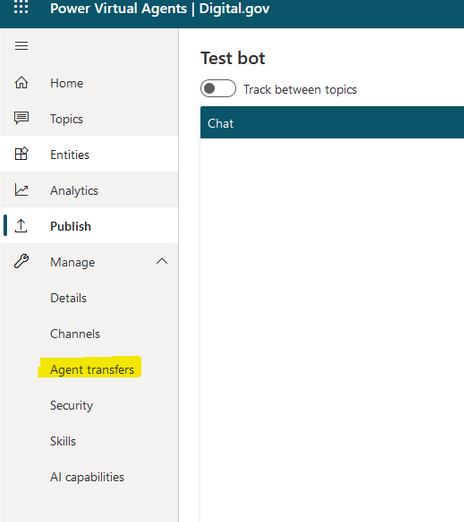

# Power Virtual Agents Configuration

___

## To configure Virtual agent
•	Go to https://web.powerva.microsoft.com and configure bot (virtual agent)
•	Add topic(s) as needed
•	Add flows (if required)
•	Publish bot
•	Add to existing solution

## Configure Agent Transfer

Click the Manage button in the sidebar and click "Agent transfers":

### **Pre-Requisites**

- Sign in with an account that has the omnichannel administrator role.
-  Have a product license for Power Virtual Agents and a product license for the Chat Add-in for Dynamics 365 Customer service.

###  Environments:

- Your bot environment, extension solutions, and omnichannel environment must be in the same geographical region.
- To use voice capabilities, your tenant and environment must be in the United States, Europe, Asia, or Australia geographies.

- Register an application with Azure AD.
- For end-to-end capabilities to work as expected, your bot must be published.

- Install the extensions that are required for Customer Service omnichannel capabilities.

- For text (messaging) hand-off only, install Omnichannel Power Virtual Agent extension. https://appsource.microsoft.com/product/dynamics-365/mscrm.omnichannelpvaextension

## Connect your bot to Omnichannel for Customer Service

1. In Power Virtual Agents, edit your bot. In the left panel, select Manage, Agent transfers, and then select the Omnichannel tile.

2. Select Enable.

-  If you haven't installed the required extensions, you'll see a message that your bot doesn't have access to the variables or actions it needs. You must install at least Omnichannel Power Virtual Agent extension - https://appsource.microsoft.com/product/dynamics-365/mscrm.omnichannelpvaextension for hand-off to work.

3. Under See the environment this bot is connected to, select the environment where you have omnichannel integration turned on. If you haven't set up Omnichannel for Customer Service in that environment, you'll see a message inviting you to begin a trial.

4. Select See how to register a new Application ID and follow the steps to find or create the app registration for Power Virtual Agents.

    The Omnichannel configuration pane, with the Application ID section highlighted.

5. Navigate to azure and create an application registration:

Once registered, copy the application ID, return to the Omnichannel pane in Power Virtual Agents and paste the Application ID in the Application ID box.

###     Important

Omnichannel for Customer Service models bots as "application users." Therefore, the Application ID that you use must be unique to your Microsoft Dataverse organization or environment.

 Select Add your bot.

** Power Virtual Agents uses a Teams channel to communicate with Omnichannel for Customer Service. If one isn't turned on, a Teams channel will be enabled when you select Add your bot.

## Configuring Omnichannel

Navigate to the Omnichannel Administration Application

1. Create Queues

You will need to create a queue associated to the virtual agent and a separate queue associated to users (human agents)

2. Create a workstream

A workstream allows you to create routing rules so the chatbot knows who to assign the queries to (either virtual or human)

Navigate to the Context variables tab and create a new record with the following attributes:

Next, navigate to routing rules and create two seperate records:

In your bot record, you will need to add a condition -> context variable va_Scope to Does Not Contain Data.

In your agent record, you will need to add a condition -> context variable va_Scope to Contain Data.

_These conditions lets the chat bot know at which point the hand off from virtual agent to human agent will occur._

3. Create a Chat Channel widget

Give your record a name and assign the work stream to the one you created in step 2.

Once you save the chat widget you will see a code snippet script that will be automatically generated

This code snippet can be placed on individual pages of your portal, or can be used system wide by placing the code in a content snipped called "Chat Widget Code" (created OOTB)

