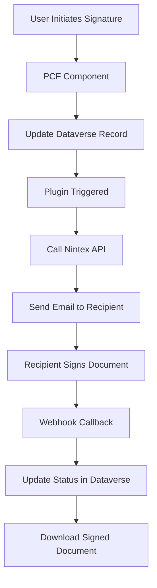

# Nintex Assurance Digital Signature Integration - Complete Build Book

## Table of Contents

1. [Introduction & Architecture Overview](#introduction--architecture-overview)
2. [Approach Comparison & Decision Guide](#approach-comparison--decision-guide)
3. [Chapter 1: Custom Table Implementation](#chapter-1-custom-table-implementation)
4. [Chapter 2: Activity-Based Implementation](#chapter-2-activity-based-implementation)
5. [Migration Guide](#migration-guide)
6. [Production Considerations](#production-considerations)
7. [Appendices](#appendices)

---

## Introduction & Architecture Overview

This build book provides two complete implementations for integrating Nintex Assurance digital signature capabilities with Microsoft Dataverse. Both approaches achieve the same core functionality but serve different architectural and business needs.

### Core Functionality

Both implementations provide:
- **Digital signature request initiation** from Dataverse records
- **Nintex Assurance API integration** for signature processing
- **Real-time status tracking** of signature requests
- **Signed document storage** and retrieval
- **Modern PCF-based user interface**
- **Comprehensive error handling** and logging

### Technical Architecture

```
Dataverse Environment
├── C# Plugin (Server-side logic)
│   ├── API Integration with Nintex
│   ├── Status Management
│   └── Document Processing
├── PCF Component (Client-side UI)
│   ├── React-based Interface
│   ├── Status Visualization
│   └── Document Management
└── Data Storage
    ├── Custom Table OR Activity Table
    ├── Signature Metadata
    └── Document Attachments
```

### Integration Flow



---

## Approach Comparison & Decision Guide

### When to Use Custom Table Approach

**✅ Best for:**
- **Specialized signature workflows** requiring custom business logic
- **Standalone signature management** separate from other activities
- **Complex approval processes** with multiple stages
- **Custom reporting requirements** specific to signatures
- **Integration with external systems** that need dedicated endpoints
- **Organizations with minimal activity usage**

**✅ Benefits:**
- **Complete control** over data structure and relationships
- **Custom business logic** without activity constraints
- **Specialized security models** for signature data
- **Dedicated forms and views** optimized for signatures
- **Independent lifecycle management**

**⚠️ Considerations:**
- **Additional development effort** for timeline integration
- **Manual relationship management** to parent records
- **Custom reporting and views** required
- **Separate security configuration** needed

### When to Use Activity-Based Approach

**✅ Best for:**
- **Universal signature capability** across multiple entity types
- **Timeline-centric organizations** that rely heavily on activity tracking
- **Standard business processes** that align with activity lifecycles
- **Integrated workflows** where signatures are part of larger processes
- **Organizations wanting native Dataverse patterns**

**✅ Benefits:**
- **Automatic timeline integration** with all activity-enabled entities
- **Native Dataverse experience** familiar to users
- **Built-in activity management** capabilities
- **Standard security roles** and permissions
- **Universal applicability** across entity types
- **Centralized activity reporting**

**⚠️ Considerations:**
- **Activity model constraints** may limit some customizations
- **Inherited activity complexity** in some scenarios
- **Less flexibility** in status management
- **Standard activity behavior** may not fit all business needs

### Decision Matrix

| Requirement | Custom Table | Activity-Based |
|-------------|--------------|----------------|
| Multi-entity usage | ⚠️ Manual setup needed | ✅ Automatic |
| Timeline integration | ❌ Custom development | ✅ Native |
| Custom business logic | ✅ Full flexibility | ⚠️ Activity constraints |
| User familiarity | ⚠️ New concepts | ✅ Standard patterns |
| Development complexity | ⚠️ Higher | ✅ Lower |
| Maintenance overhead | ⚠️ Higher | ✅ Lower |
| Specialized workflows | ✅ Optimal | ⚠️ Limited |
| Reporting flexibility | ✅ Full control | ⚠️ Activity-based |

---

## Chapter 1: Custom Table Implementation

### Overview

The custom table approach creates a dedicated `Digital Signature` entity with specialized fields and relationships. This provides maximum flexibility for signature-specific business logic while requiring manual integration points with other entities.

### Architecture Benefits

- **Dedicated data model** optimized for signature workflows
- **Custom relationship management** to any entity type
- **Specialized business logic** without activity constraints
- **Full control over lifecycle** and status management
- **Custom security models** for signature data

### Prerequisites

- Microsoft Dataverse environment with System Administrator privileges
- Visual Studio 2019/2022 with .NET Framework 4.6.2 or higher
- Power Platform CLI installed
- Node.js (version 12.x or higher)
- Nintex Assurance API credentials and access

---

### Step 1: Custom Entity Creation

#### 1.1 Create Digital Signature Table

1. **Navigate to Power Apps** (make.powerapps.com)
2. **Select your environment**
3. **Go to Tables** in the left navigation
4. **Click "+ New table"**
5. **Configure the table:**
   - **Display name:** Digital Signature
   - **Plural display name:** Digital Signatures
   - **Name:** new_digitalsignature
   - **Primary column:** Name (new_name)
   - **Table type:** Standard table

#### 1.2 Add Custom Columns

Create the following columns for the Digital Signature table:

| Display Name | Name | Data Type | Format | Description |
|--------------|------|-----------|---------|-------------|
| Name | new_name | Single line of text | Text | Primary field - signature request name |
| Recipient Email | new_recipientemail | Single line of text | Email | Email address of signature recipient |
| Recipient Name | new_recipientname | Single line of text | Text | Full name of the signature recipient |
| Document Content | new_documentcontent | Multiple lines of text | Text | Base64 encoded document to be signed |
| Document Name | new_documentname | Single line of text | Text | Name/title of the document |
| Signature Status | new_signaturestatus | Choice | - | Current status of the signature request |
| Nintex Request ID | new_nintexrequestid | Single line of text | Text | Unique identifier from Nintex Assurance |
| Signed Document | new_signaturedocument | Multiple lines of text | Text | Base64 encoded signed document |
| Signature Date | new_signaturedate | Date and time | Date and Time | When the document was signed |
| Request Date | new_requestdate | Date and time | Date and Time | When the signature request was sent |
| Expiry Date | new_expirydate | Date and time | Date and Time | When the signature request expires |
| Related Record | new_relatedrecord | Lookup | - | Polymorphic lookup to any entity |
| Request Notes | new_requestnotes | Multiple lines of text | Text | Additional notes about the request |

#### 1.3 Configure Signature Status Choice Values

For the **Signature Status** column, create these choices:

| Label | Value | Color |
|-------|-------|-------|
| Draft | 100000000 | Gray |
| Pending Signature | 100000001 | Blue |
| Signed | 100000002 | Green |
| Declined | 100000003 | Red |
| Expired | 100000004 | Orange |
| Failed | 100000005 | Dark Red |

#### 1.4 Create Custom Views

**All Digital Signatures View:**
- Name: All Digital Signatures
- Columns: Name, Recipient Name, Recipient Email, Signature Status, Request Date, Modified On
- Default sort: Modified On (descending)

**My Pending Signatures View:**
- Name: My Pending Signatures  
- Columns: Name, Recipient Name, Signature Status, Request Date, Expiry Date
- Filter: Signature Status = Pending Signature AND Owner = Current User
- Default sort: Request Date (ascending)

**Completed Signatures View:**
- Name: Completed Signatures
- Columns: Name, Recipient Name, Signature Date, Signed Document
- Filter: Signature Status = Signed
- Default sort: Signature Date (descending)

#### 1.5 Create Model-Driven App

1. **Go to Apps** in Power Apps
2. **Click "+ New app" > Model-driven**
3. **Configure app:**
   - **Name:** Digital Signature Management
   - **Description:** Manage digital signature requests and track their progress
4. **Add Digital Signature table** to the app
5. **Configure navigation:**
   - Add Views: All Digital Signatures, My Pending Signatures, Completed Signatures
   - Add Forms: Main form, Quick create form
6. **Save and publish** the app

---

### Step 2: Custom Table Plugin Development

#### 2.1 Create Visual Studio Project

1. **Open Visual Studio**
2. **Create new project:**
   - Template: Class Library (.NET Framework)
   - Name: NintexDigitalSignaturePlugin
   - Framework: .NET Framework 4.6.2
3. **Install required NuGet packages:**
   ```xml
   <packages>
     <package id="Microsoft.CrmSdk.CoreAssemblies" version="9.0.2.46" />
     <package id="Newtonsoft.Json" version="13.0.1" />
   </packages>
   ```

#### 2.2 Plugin Implementation

**File: NintexDigitalSignaturePlugin.cs**

```csharp
using System;
using System.IO;
using System.Net.Http;
using System.Text;
using System.Threading.Tasks;
using Microsoft.Xrm.Sdk;
using Microsoft.Xrm.Sdk.Query;
using Newtonsoft.Json;
using System.ServiceModel;

namespace NintexDigitalSignaturePlugin
{
    public class NintexSignaturePlugin : IPlugin
    {
        private readonly string _secureConfig;
        private readonly string _unsecureConfig;

        public NintexSignaturePlugin(string unsecureConfig, string secureConfig)
        {
            _unsecureConfig = unsecureConfig;
            _secureConfig = secureConfig;
        }

        public void Execute(IServiceProvider serviceProvider)
        {
            IPluginExecutionContext context = (IPluginExecutionContext)serviceProvider.GetService(typeof(IPluginExecutionContext));
            IOrganizationServiceFactory serviceFactory = (IOrganizationServiceFactory)serviceProvider.GetService(typeof(IOrganizationServiceFactory));
            IOrganizationService service = serviceFactory.CreateOrganizationService(context.UserId);
            ITracingService tracingService = (ITracingService)serviceProvider.GetService(typeof(ITracingService));

            try
            {
                tracingService.Trace("NintexSignaturePlugin: Execution started");

                if (context.InputParameters.Contains("Target") && context.InputParameters["Target"] is Entity)
                {
                    Entity targetEntity = (Entity)context.InputParameters["Target"];
                    
                    if (targetEntity.LogicalName != "new_digitalsignature")
                        return;

                    tracingService.Trace($"Processing {context.MessageName} for digital signature record");

                    Entity digitalSignatureRecord = GetCompleteRecord(service, targetEntity, tracingService);
                    
                    if (context.MessageName.Equals("Create", StringComparison.OrdinalIgnoreCase))
                    {
                        ProcessCreateMessage(digitalSignatureRecord, service, tracingService);
                    }
                    else if (context.MessageName.Equals("Update", StringComparison.OrdinalIgnoreCase))
                    {
                        ProcessUpdateMessage(digitalSignatureRecord, targetEntity, service, tracingService);
                    }
                }
            }
            catch (FaultException<OrganizationServiceFault> ex)
            {
                tracingService.Trace($"OrganizationServiceFault: {ex.Message}");
                throw new InvalidPluginExecutionException($"An error occurred in NintexSignaturePlugin: {ex.Message}", ex);
            }
            catch (Exception ex)
            {
                tracingService.Trace($"General Exception: {ex.Message}");
                throw new InvalidPluginExecutionException($"An error occurred in NintexSignaturePlugin: {ex.Message}", ex);
            }
        }

        private Entity GetCompleteRecord(IOrganizationService service, Entity targetEntity, ITracingService tracingService)
        {
            try
            {
                return service.Retrieve(targetEntity.LogicalName, targetEntity.Id,
                    new ColumnSet("new_name", "new_recipientemail", "new_recipientname", "new_documentcontent", 
                                "new_signaturestatus", "new_nintexrequestid", "new_signaturedocument", 
                                "new_signaturedate", "new_requestdate", "new_expirydate", "new_documentname",
                                "new_relatedrecord", "new_requestnotes", "ownerid", "createdon", "modifiedon"));
            }
            catch (Exception ex)
            {
                tracingService.Trace($"Error retrieving complete record: {ex.Message}");
                return targetEntity;
            }
        }

        private void ProcessCreateMessage(Entity digitalSignatureRecord, IOrganizationService service, ITracingService tracingService)
        {
            tracingService.Trace("Processing Create message");
            
            // Get related record information for context
            var relatedRecordInfo = GetRelatedRecordInfo(digitalSignatureRecord, service, tracingService);
            
            var signatureRequest = new NintexSignatureRequest
            {
                RecipientEmail = digitalSignatureRecord.GetAttributeValue<string>("new_recipientemail"),
                RecipientName = digitalSignatureRecord.GetAttributeValue<string>("new_recipientname"),
                DocumentName = digitalSignatureRecord.GetAttributeValue<string>("new_documentname") ?? 
                             digitalSignatureRecord.GetAttributeValue<string>("new_name"),
                DocumentContent = digitalSignatureRecord.GetAttributeValue<string>("new_documentcontent"),
                CallbackUrl = GetCallbackUrl(),
                ExpiryDays = 7,
                ContextInfo = new SignatureContextInfo
                {
                    SignatureRecordId = digitalSignatureRecord.Id.ToString(),
                    RelatedRecordId = relatedRecordInfo?.Id,
                    RelatedRecordType = relatedRecordInfo?.LogicalName,
                    RelatedRecordName = relatedRecordInfo?.Name,
                    RequestNotes = digitalSignatureRecord.GetAttributeValue<string>("new_requestnotes")
                }
            };

            var response = SendSignatureRequestAsync(signatureRequest, tracingService).Result;
            
            if (response.Success)
            {
                Entity updateEntity = new Entity(digitalSignatureRecord.LogicalName, digitalSignatureRecord.Id);
                updateEntity["new_nintexrequestid"] = response.RequestId;
                updateEntity["new_signaturestatus"] = new OptionSetValue(100000001); // Pending
                updateEntity["new_requestdate"] = DateTime.UtcNow;
                
                service.Update(updateEntity);
                tracingService.Trace($"Signature request sent successfully. Request ID: {response.RequestId}");
            }
            else
            {
                Entity updateEntity = new Entity(digitalSignatureRecord.LogicalName, digitalSignatureRecord.Id);
                updateEntity["new_signaturestatus"] = new OptionSetValue(100000005); // Failed
                service.Update(updateEntity);
                
                tracingService.Trace($"Failed to send signature request: {response.ErrorMessage}");
                throw new InvalidPluginExecutionException($"Failed to send signature request: {response.ErrorMessage}");
            }
        }

        private void ProcessUpdateMessage(Entity digitalSignatureRecord, Entity targetEntity, IOrganizationService service, ITracingService tracingService)
        {
            tracingService.Trace("Processing Update message");
            
            if (targetEntity.Contains("new_nintexrequestid") && 
                targetEntity.Contains("new_signaturestatus"))
            {
                var status = targetEntity.GetAttributeValue<OptionSetValue>("new_signaturestatus");
                if (status != null && status.Value == 100000002) // Signed
                {
                    tracingService.Trace("Processing signed document callback");
                    ProcessSignedDocument(digitalSignatureRecord, service, tracingService);
                }
                else if (status != null && status.Value == 100000003) // Declined
                {
                    tracingService.Trace("Processing declined signature");
                    ProcessDeclinedSignature(digitalSignatureRecord, service, tracingService);
                }
            }
        }

        private void ProcessSignedDocument(Entity digitalSignatureRecord, IOrganizationService service, ITracingService tracingService)
        {
            try
            {
                string requestId = digitalSignatureRecord.GetAttributeValue<string>("new_nintexrequestid");
                if (string.IsNullOrEmpty(requestId))
                {
                    tracingService.Trace("No Nintex request ID found");
                    return;
                }

                var signedDocumentResponse = GetSignedDocumentAsync(requestId, tracingService).Result;
                
                if (signedDocumentResponse.Success)
                {
                    Entity updateEntity = new Entity(digitalSignatureRecord.LogicalName, digitalSignatureRecord.Id);
                    updateEntity["new_signaturedocument"] = Convert.ToBase64String(signedDocumentResponse.DocumentContent);
                    updateEntity["new_signaturedate"] = DateTime.UtcNow;
                    updateEntity["new_signaturestatus"] = new OptionSetValue(100000002); // Signed
                    
                    service.Update(updateEntity);
                    tracingService.Trace("Signed document retrieved and saved successfully");

                    // Create note on related record if it exists
                    CreateRelatedRecordNote(digitalSignatureRecord, service, tracingService);
                }
                else
                {
                    tracingService.Trace($"Failed to retrieve signed document: {signedDocumentResponse.ErrorMessage}");
                }
            }
            catch (Exception ex)
            {
                tracingService.Trace($"Error processing signed document: {ex.Message}");
            }
        }

        private void ProcessDeclinedSignature(Entity digitalSignatureRecord, IOrganizationService service, ITracingService tracingService)
        {
            try
            {
                // Additional logic for handling declined signatures
                tracingService.Trace("Signature declined - additional processing completed");
            }
            catch (Exception ex)
            {
                tracingService.Trace($"Error processing declined signature: {ex.Message}");
            }
        }

        private RelatedRecordInfo GetRelatedRecordInfo(Entity digitalSignatureRecord, IOrganizationService service, ITracingService tracingService)
        {
            try
            {
                var relatedRecordRef = digitalSignatureRecord.GetAttributeValue<EntityReference>("new_relatedrecord");
                if (relatedRecordRef != null)
                {
                    var relatedRecord = service.Retrieve(relatedRecordRef.LogicalName, relatedRecordRef.Id, new ColumnSet(true));
                    
                    return new RelatedRecordInfo
                    {
                        Id = relatedRecordRef.Id.ToString(),
                        LogicalName = relatedRecordRef.LogicalName,
                        Name = relatedRecordRef.Name ?? GetPrimaryNameValue(relatedRecord)
                    };
                }
            }
            catch (Exception ex)
            {
                tracingService.Trace($"Error getting related record info: {ex.Message}");
            }
            
            return null;
        }

        private string GetPrimaryNameValue(Entity entity)
        {
            string[] primaryNameFields = { "name", "fullname", "subject", "title", "accountname", "lastname" };
            
            foreach (string field in primaryNameFields)
            {
                if (entity.Contains(field))
                {
                    return entity.GetAttributeValue<string>(field);
                }
            }
            
            return entity.LogicalName + " Record";
        }

        private void CreateRelatedRecordNote(Entity digitalSignatureRecord, IOrganizationService service, ITracingService tracingService)
        {
            try
            {
                var relatedRecordRef = digitalSignatureRecord.GetAttributeValue<EntityReference>("new_relatedrecord");
                if (relatedRecordRef == null) return;

                Entity note = new Entity("annotation");
                note["objectid"] = relatedRecordRef;
                note["objecttypecode"] = relatedRecordRef.LogicalName;
                note["subject"] = "Digital Signature Completed";
                note["notetext"] = $"Digital signature request '{digitalSignatureRecord.GetAttributeValue<string>("new_name")}' has been completed successfully. " +
                                 $"Signed by: {digitalSignatureRecord.GetAttributeValue<string>("new_recipientname")} " +
                                 $"on {DateTime.UtcNow:yyyy-MM-dd HH:mm:ss} UTC.";
                
                service.Create(note);
                tracingService.Trace("Related record note created");
            }
            catch (Exception ex)
            {
                tracingService.Trace($"Error creating related record note: {ex.Message}");
            }
        }

        // API Communication Methods
        private async Task<NintexApiResponse> SendSignatureRequestAsync(NintexSignatureRequest request, ITracingService tracingService)
        {
            try
            {
                using (var httpClient = new HttpClient())
                {
                    httpClient.DefaultRequestHeaders.Add("Authorization", $"Bearer {GetNintexApiKey()}");
                    httpClient.DefaultRequestHeaders.Add("Accept", "application/json");

                    var requestJson = JsonConvert.SerializeObject(request);
                    var content = new StringContent(requestJson, Encoding.UTF8, "application/json");

                    var response = await httpClient.PostAsync(GetNintexSignatureEndpoint(), content);
                    var responseContent = await response.Content.ReadAsStringAsync();

                    tracingService.Trace($"Nintex API Response: {response.StatusCode} - {responseContent}");

                    if (response.IsSuccessStatusCode)
                    {
                        var apiResponse = JsonConvert.DeserializeObject<NintexSignatureResponse>(responseContent);
                        return new NintexApiResponse
                        {
                            Success = true,
                            RequestId = apiResponse.RequestId
                        };
                    }
                    else
                    {
                        return new NintexApiResponse
                        {
                            Success = false,
                            ErrorMessage = $"API call failed with status {response.StatusCode}: {responseContent}"
                        };
                    }
                }
            }
            catch (Exception ex)
            {
                tracingService.Trace($"Exception in SendSignatureRequestAsync: {ex.Message}");
                return new NintexApiResponse
                {
                    Success = false,
                    ErrorMessage = ex.Message
                };
            }
        }

        private async Task<SignedDocumentResponse> GetSignedDocumentAsync(string requestId, ITracingService tracingService)
        {
            try
            {
                using (var httpClient = new HttpClient())
                {
                    httpClient.DefaultRequestHeaders.Add("Authorization", $"Bearer {GetNintexApiKey()}");
                    
                    var response = await httpClient.GetAsync($"{GetNintexDocumentEndpoint()}/{requestId}");
                    
                    if (response.IsSuccessStatusCode)
                    {
                        var documentContent = await response.Content.ReadAsByteArrayAsync();
                        return new SignedDocumentResponse
                        {
                            Success = true,
                            DocumentContent = documentContent
                        };
                    }
                    else
                    {
                        var errorContent = await response.Content.ReadAsStringAsync();
                        return new SignedDocumentResponse
                        {
                            Success = false,
                            ErrorMessage = $"Failed to retrieve document: {response.StatusCode} - {errorContent}"
                        };
                    }
                }
            }
            catch (Exception ex)
            {
                return new SignedDocumentResponse
                {
                    Success = false,
                    ErrorMessage = ex.Message
                };
            }
        }

        // Configuration Methods
        private string GetNintexApiKey()
        {
            return Environment.GetEnvironmentVariable("NINTEX_API_KEY") ?? _secureConfig;
        }

        private string GetNintexSignatureEndpoint()
        {
            return "https://api.nintex.com/assurance/v1/signature-requests";
        }

        private string GetNintexDocumentEndpoint()
        {
            return "https://api.nintex.com/assurance/v1/signed-documents";
        }

        private string GetCallbackUrl()
        {
            return "https://yourorg.crm.dynamics.com/api/nintex/webhook";
        }
    }

    // Data Transfer Objects
    public class NintexSignatureRequest
    {
        [JsonProperty("recipientEmail")]
        public string RecipientEmail { get; set; }

        [JsonProperty("recipientName")]
        public string RecipientName { get; set; }

        [JsonProperty("documentName")]
        public string DocumentName { get; set; }

        [JsonProperty("documentContent")]
        public string DocumentContent { get; set; }

        [JsonProperty("callbackUrl")]
        public string CallbackUrl { get; set; }

        [JsonProperty("expiryDays")]
        public int ExpiryDays { get; set; }

        [JsonProperty("contextInfo")]
        public SignatureContextInfo ContextInfo { get; set; }
    }

    public class SignatureContextInfo
    {
        [JsonProperty("signatureRecordId")]
        public string SignatureRecordId { get; set; }

        [JsonProperty("relatedRecordId")]
        public string RelatedRecordId { get; set; }

        [JsonProperty("relatedRecordType")]
        public string RelatedRecordType { get; set; }

        [JsonProperty("relatedRecordName")]
        public string RelatedRecordName { get; set; }

        [JsonProperty("requestNotes")]
        public string RequestNotes { get; set; }
    }

    public class RelatedRecordInfo
    {
        public string Id { get; set; }
        public string LogicalName { get; set; }
        public string Name { get; set; }
    }

    public class NintexSignatureResponse
    {
        [JsonProperty("requestId")]
        public string RequestId { get; set; }

        [JsonProperty("status")]
        public string Status { get; set; }

        [JsonProperty("signatureUrl")]
        public string SignatureUrl { get; set; }
    }

    public class NintexApiResponse
    {
        public bool Success { get; set; }
        public string RequestId { get; set; }
        public string ErrorMessage { get; set; }
    }

    public class SignedDocumentResponse
    {
        public bool Success { get; set; }
        public byte[] DocumentContent { get; set; }
        public string ErrorMessage { get; set; }
    }
}
```

#### 2.3 Build and Deploy Plugin

1. **Build the solution** in Release mode
2. **Sign the assembly** (recommended for production):
   - Right-click project > Properties > Signing
   - Check "Sign the assembly"
   - Create new strong name key file

3. **Register the plugin** using Plugin Registration Tool:

   **Download Plugin Registration Tool:**
   ```powershell
   Install-Package Microsoft.CrmSdk.XrmTooling.PluginRegistrationTool
   ```

   **Register Assembly:**
   - Connect to Dataverse environment
   - Register > Register New Assembly
   - Browse to compiled DLL
   - Isolation Mode: Sandbox
   - Location: Database

   **Register Plugin Steps:**

   **Create Step:**
   - Message: Create
   - Primary Entity: new_digitalsignature
   - Event Pipeline Stage: Post-operation
   - Execution Mode: Synchronous

   **Update Step:**
   - Message: Update
   - Primary Entity: new_digitalsignature
   - Event Pipeline Stage: Post-operation
   - Execution Mode: Synchronous
   - Filtering Attributes: new_signaturestatus,new_nintexrequestid

#### 2.4 Configure Secure Configuration

In Plugin Registration Tool, add secure configuration:

```json
{
  "nintexApiKey": "your-nintex-api-key-here",
  "apiBaseUrl": "https://api.nintex.com/assurance/v1",
  "webhookSecret": "your-webhook-secret-key"
}
```

---

### Step 3: Custom Table PCF Component Development

#### 3.1 Initialize PCF Project

```bash
# Create project directory
mkdir NintexDigitalSignatureControl
cd NintexDigitalSignatureControl

# Initialize PCF project
pac pcf init --namespace NintexControls --name NintexDigitalSignatureControl --template field

# Install React dependencies
npm install @types/react@^16.9.0 @types/react-dom@^16.9.0 react@^16.8.0 react-dom@^16.8.0
```

#### 3.2 Component Implementation

**File: index.ts**

```typescript
import { IInputs, IOutputs } from "./generated/ManifestTypes";
import * as React from "react";
import * as ReactDOM from "react-dom";
import { DigitalSignatureControl, IDigitalSignatureProps } from "./DigitalSignatureControl";

export class NintexDigitalSignatureControl implements ComponentFramework.StandardControl<IInputs, IOutputs> {
    private _container: HTMLDivElement;
    private _context: ComponentFramework.Context<IInputs>;
    private _notifyOutputChanged: () => void;
    private _recordId: string;

    public init(
        context: ComponentFramework.Context<IInputs>,
        notifyOutputChanged: () => void,
        state: ComponentFramework.Dictionary,
        container: HTMLDivElement
    ): void {
        this._container = container;
        this._context = context;
        this._notifyOutputChanged = notifyOutputChanged;
        this._recordId = (context as any).page?.entityId || "";
        
        this.renderControl();
    }

    public updateView(context: ComponentFramework.Context<IInputs>): ComponentFramework.ReactControl.UpdatedControls {
        this._context = context;
        this.renderControl();
        return {} as ComponentFramework.ReactControl.UpdatedControls;
    }

    private renderControl(): void {
        const props: IDigitalSignatureProps = {
            context: this._context,
            recordId: this._recordId,
            recipientEmail: this._context.parameters.recipientEmail?.raw || "",
            recipientName: this._context.parameters.recipientName?.raw || "",
            signatureStatus: this._context.parameters.signatureStatus?.raw || 0,
            nintexRequestId: this._context.parameters.nintexRequestId?.raw || "",
            signedDocument: this._context.parameters.signedDocument?.raw || "",
            documentName: this._context.parameters.documentName?.raw || "",
            onSignatureRequest: this.handleSignatureRequest.bind(this),
            onRefreshStatus: this.handleRefreshStatus.bind(this),
            onDownloadDocument: this.handleDownloadDocument.bind(this)
        };

        ReactDOM.render(React.createElement(DigitalSignatureControl, props), this._container);
    }

    private async handleSignatureRequest(recipientEmail: string, recipientName: string, documentName: string): Promise<void> {
        try {
            const updateRecord = {
                new_recipientemail: recipientEmail,
                new_recipientname: recipientName,
                new_documentname: documentName,
                new_signaturestatus: 100000001 // Pending
            };

            await this._context.webAPI.updateRecord("new_digitalsignature", this._recordId, updateRecord);
            
            (this._context as any).page?.data?.refresh();
            
            this._context.navigation.openAlertDialog({
                title: "Success",
                text: "Signature request has been sent successfully!"
            });
        } catch (error) {
            this._context.navigation.openAlertDialog({
                title: "Error",
                text: `Failed to send signature request: ${error}`
            });
        }
    }

    private async handleRefreshStatus(): Promise<void> {
        try {
            (this._context as any).page?.data?.refresh();
        } catch (error) {
            console.error("Error refreshing status:", error);
        }
    }

    private handleDownloadDocument(): void {
        const signedDocument = this._context.parameters.signedDocument?.raw;
        if (signedDocument) {
            const byteCharacters = atob(signedDocument);
            const byteNumbers = new Array(byteCharacters.length);
            for (let i = 0; i < byteCharacters.length; i++) {
                byteNumbers[i] = byteCharacters.charCodeAt(i);
            }
            const byteArray = new Uint8Array(byteNumbers);
            const blob = new Blob([byteArray], { type: 'application/pdf' });
            
            const url = window.URL.createObjectURL(blob);
            const a = document.createElement('a');
            a.href = url;
            a.download = `signed-document-${this._recordId}.pdf`;
            document.body.appendChild(a);
            a.click();
            document.body.removeChild(a);
            window.URL.revokeObjectURL(url);
        }
    }

    public getOutputs(): IOutputs {
        return {};
    }

    public destroy(): void {
        ReactDOM.unmountComponentAtNode(this._container);
    }
}
```

**File: DigitalSignatureControl.tsx**

```typescript
import * as React from "react";

export interface IDigitalSignatureProps {
    context: ComponentFramework.Context<any>;
    recordId: string;
    recipientEmail: string;
    recipientName: string;
    signatureStatus: number;
    nintexRequestId: string;
    signedDocument: string;
    documentName: string;
    onSignatureRequest: (email: string, name: string, documentName: string) => Promise<void>;
    onRefreshStatus: () => Promise<void>;
    onDownloadDocument: () => void;
}

export const DigitalSignatureControl: React.FC<IDigitalSignatureProps> = (props) => {
    const [recipientEmail, setRecipientEmail] = React.useState(props.recipientEmail || "");
    const [recipientName, setRecipientName] = React.useState(props.recipientName || "");
    const [documentName, setDocumentName] = React.useState(props.documentName || "");
    const [isLoading, setIsLoading] = React.useState(false);

    React.useEffect(() => {
        setRecipientEmail(props.recipientEmail || "");
        setRecipientName(props.recipientName || "");
        setDocumentName(props.documentName || "");
    }, [props.recipientEmail, props.recipientName, props.documentName]);

    const getStatusText = (status: number): string => {
        switch (status) {
            case 100000000: return "Draft";
            case 100000001: return "Pending Signature";
            case 100000002: return "Signed";
            case 100000003: return "Declined";
            case 100000004: return "Expired";
            case 100000005: return "Failed";
            default: return "Unknown";
        }
    };

    const getStatusColor = (status: number): string => {
        switch (status) {
            case 100000000: return "#666666";
            case 100000001: return "#0078d4";
            case 100000002: return "#107c10";
            case 100000003: return "#d13438";
            case 100000004: return "#f7630c";
            case 100000005: return "#a80000";
            default: return "#666666";
        }
    };

    const handleSendSignatureRequest = async (): Promise<void> => {
        if (!recipientEmail || !recipientName || !documentName) {
            alert("Please enter recipient email, name, and document name.");
            return;
        }

        setIsLoading(true);
        try {
            await props.onSignatureRequest(recipientEmail, recipientName, documentName);
        } catch (error) {
            console.error("Error sending signature request:", error);
        } finally {
            setIsLoading(false);
        }
    };

    const containerStyle: React.CSSProperties = {
        fontFamily: "'Segoe UI', Tahoma, Geneva, Verdana, sans-serif",
        padding: "20px",
        border: "1px solid #e1e5e9",
        borderRadius: "8px",
        backgroundColor: "#ffffff",
        maxWidth: "600px",
        boxShadow: "0 2px 4px rgba(0,0,0,0.1)"
    };

    const headerStyle: React.CSSProperties = {
        fontSize: "20px",
        fontWeight: "600",
        marginBottom: "20px",
        color: "#323130",
        borderBottom: "2px solid #0078d4",
        paddingBottom: "8px"
    };

    const fieldGroupStyle: React.CSSProperties = {
        marginBottom: "16px"
    };

    const labelStyle: React.CSSProperties = {
        display: "block",
        fontSize: "14px",
        fontWeight: "600",
        marginBottom: "6px",
        color: "#323130"
    };

    const inputStyle: React.CSSProperties = {
        width: "100%",
        padding: "10px 12px",
        fontSize: "14px",
        border: "1px solid #d1d5da",
        borderRadius: "4px",
        boxSizing: "border-box",
        transition: "border-color 0.2s"
    };

    const buttonStyle: React.CSSProperties = {
        padding: "10px 20px",
        fontSize: "14px",
        fontWeight: "600",
        border: "none",
        borderRadius: "4px",
        cursor: "pointer",
        marginRight: "10px",
        marginBottom: "10px",
        transition: "background-color 0.2s"
    };

    const primaryButtonStyle: React.CSSProperties = {
        ...buttonStyle,
        backgroundColor: "#0078d4",
        color: "white"
    };

    const secondaryButtonStyle: React.CSSProperties = {
        ...buttonStyle,
        backgroundColor: "#f3f2f1",
        color: "#323130",
        border: "1px solid #d1d5da"
    };

    const statusStyle: React.CSSProperties = {
        display: "inline-block",
        padding: "6px 16px",
        borderRadius: "20px",
        fontSize: "12px",
        fontWeight: "600",
        color: "white",
        backgroundColor: getStatusColor(props.signatureStatus)
    };

    const infoStyle: React.CSSProperties = {
        padding: "16px",
        backgroundColor: "#f8f9fa",
        border: "1px solid #e1e5e9",
        borderRadius: "6px",
        marginBottom: "20px"
    };

    return (
        <div style={containerStyle}>
            <h3 style={headerStyle}>Digital Signature Request</h3>
            
            <div style={infoStyle}>
                <div style={{ marginBottom: "10px" }}>
                    <strong>Status: </strong>
                    <span style={statusStyle}>{getStatusText(props.signatureStatus)}</span>
                </div>
                {props.nintexRequestId && (
                    <div>
                        <strong>Request ID: </strong>
                        <span style={{ fontFamily: "monospace", fontSize: "12px", backgroundColor: "#f0f0f0", padding: "2px 6px", borderRadius: "3px" }}>
                            {props.nintexRequestId}
                        </span>
                    </div>
                )}
            </div>

            {(props.signatureStatus === 0 || props.signatureStatus === 100000000) ? (
                <div>
                    <div style={fieldGroupStyle}>
                        <label style={labelStyle}>Document Name *</label>
                        <input
                            type="text"
                            value={documentName}
                            onChange={(e) => setDocumentName(e.target.value)}
                            style={inputStyle}
                            placeholder="Enter document name for signature"
                        />
                    </div>

                    <div style={fieldGroupStyle}>
                        <label style={labelStyle}>Recipient Email *</label>
                        <input
                            type="email"
                            value={recipientEmail}
                            onChange={(e) => setRecipientEmail(e.target.value)}
                            style={inputStyle}
                            placeholder="Enter recipient's email address"
                        />
                    </div>

                    <div style={fieldGroupStyle}>
                        <label style={labelStyle}>Recipient Name *</label>
                        <input
                            type="text"
                            value={recipientName}
                            onChange={(e) => setRecipientName(e.target.value)}
                            style={inputStyle}
                            placeholder="Enter recipient's full name"
                        />
                    </div>

                    <button
                        onClick={handleSendSignatureRequest}
                        disabled={isLoading || !recipientEmail || !recipientName || !documentName}
                        style={primaryButtonStyle}
                    >
                        {isLoading ? "Sending..." : "Send Signature Request"}
                    </button>
                </div>
            ) : (
                <div>
                    <div style={fieldGroupStyle}>
                        <label style={labelStyle}>Document Name</label>
                        <div style={{ padding: "8px 0", fontSize: "14px", fontWeight: "500" }}>
                            {props.documentName || "Not specified"}
                        </div>
                    </div>

                    <div style={fieldGroupStyle}>
                        <label style={labelStyle}>Recipient Email</label>
                        <div style={{ padding: "8px 0", fontSize: "14px" }}>{props.recipientEmail}</div>
                    </div>

                    <div style={fieldGroupStyle}>
                        <label style={labelStyle}>Recipient Name</label>
                        <div style={{ padding: "8px 0", fontSize: "14px" }}>{props.recipientName}</div>
                    </div>

                    <div style={{ display: "flex", gap: "10px", flexWrap: "wrap" }}>
                        <button
                            onClick={props.onRefreshStatus}
                            style={secondaryButtonStyle}
                        >
                            Refresh Status
                        </button>

                        {props.stateCode === 1 && props.signedDocument && (
                            <button
                                onClick={props.onDownloadDocument}
                                style={primaryButtonStyle}
                            >
                                Download Signed Document
                            </button>
                        )}

                        {props.stateCode === 2 && props.statusCode === 5 && (
                            <div style={{ 
                                padding: "8px 12px", 
                                backgroundColor: "#fde7e9", 
                                border: "1px solid #d13438", 
                                borderRadius: "4px",
                                fontSize: "14px",
                                color: "#721c24",
                                width: "100%"
                            }}>
                                <strong>Signature Declined:</strong> The recipient declined to sign this document. 
                                You may need to follow up or create a new signature request.
                            </div>
                        )}

                        {props.stateCode === 2 && props.statusCode === 6 && (
                            <div style={{ 
                                padding: "8px 12px", 
                                backgroundColor: "#fff4ce", 
                                border: "1px solid #f7630c", 
                                borderRadius: "4px",
                                fontSize: "14px",
                                color: "#8a4100",
                                width: "100%"
                            }}>
                                <strong>Signature Expired:</strong> This signature request has expired. 
                                Please create a new signature request if still needed.
                            </div>
                        )}
                    </div>
                </div>
            )}
        </div>
    );
};
```

#### 3.3 Activity Component Manifest

**File: ControlManifest.Input.xml (Activity version)**

```xml
<?xml version="1.0" encoding="utf-8"?>
<manifest>
  <control namespace="NintexActivityControls" constructor="NintexDigitalSignatureActivityControl" version="1.0.0" display-name-key="Nintex Digital Signature Activity Control" description-key="Control for managing Nintex Assurance digital signature activities" control-type="standard">
    <type-group name="strings">
      <type>SingleLine.Text</type>
      <type>SingleLine.Email</type>
    </type-group>
    <type-group name="numbers">
      <type>Whole.None</type>
      <type>OptionSet</type>
    </type-group>
    <property name="subject" display-name-key="Subject" description-key="Activity subject" of-type-group="strings" usage="bound" required="false" />
    <property name="recipientEmail" display-name-key="Recipient Email" description-key="Email address of the signature recipient" of-type-group="strings" usage="bound" required="false" />
    <property name="recipientName" display-name-key="Recipient Name" description-key="Full name of the signature recipient" of-type-group="strings" usage="bound" required="false" />
    <property name="statusCode" display-name-key="Status Code" description-key="Activity status code" of-type-group="numbers" usage="bound" required="false" />
    <property name="stateCode" display-name-key="State Code" description-key="Activity state code" of-type-group="numbers" usage="bound" required="false" />
    <property name="nintexRequestId" display-name-key="Nintex Request ID" description-key="Unique identifier from Nintex Assurance" of-type-group="strings" usage="bound" required="false" />
    <property name="signedDocument" display-name-key="Signed Document" description-key="Base64 encoded signed document" of-type-group="strings" usage="bound" required="false" />
    <property name="documentName" display-name-key="Document Name" description-key="Name of the document to be signed" of-type-group="strings" usage="bound" required="false" />
    <property name="regardingObjectId" display-name-key="Regarding Object ID" description-key="ID of the related record" of-type-group="strings" usage="bound" required="false" />
    <property name="regardingObjectType" display-name-key="Regarding Object Type" description-key="Type of the related record" of-type-group="strings" usage="bound" required="false" />
    <resources>
      <code path="index.ts" order="1"/>
      <resx path="strings/NintexDigitalSignatureActivityControl.1033.resx" version="1.0.0" />
    </resources>
    <feature-usage>
      <uses-feature name="WebAPI" required="true" />
    </feature-usage>
  </control>
</manifest>
```

---

### Step 4: Activity Form Configuration

#### 4.1 Configure Activity Quick Create Form

1. **Open Digital Signature Activity table**
2. **Go to Forms tab**
3. **Create new Quick Create form:**
   - **Name:** Digital Signature Activity Quick Create
   - **Add sections:**

   **General Section:**
   - Subject (required) 
   - Regarding (lookup to any entity)
   - Owner

   **Signature Details Section:**
   - Document Name
   - Recipient Email
   - Recipient Name
   - Description

4. **Set as default Quick Create form**

#### 4.2 Configure Main Activity Form

1. **Edit the main activity form**
2. **Configure form layout:**

   **Header Section:**
   - Subject
   - Owner  
   - Status Reason
   - Regarding

   **General Tab:**
   - PCF Component section
   - Activity-specific fields

   **Details Tab:**
   - Standard activity fields (Description, Due Date, etc.)
   - Custom signature fields

#### 4.3 Add PCF Component to Activity Form

1. **Create new section:** "Signature Management"
2. **Add PCF control with activity property bindings:**
   - subject → subject
   - recipientEmail → new_recipientemail
   - recipientName → new_recipientname
   - statusCode → statuscode
   - stateCode → statecode
   - nintexRequestId → new_nintexrequestid
   - signedDocument → new_signaturedocument
   - documentName → new_documentname
   - regardingObjectId → regardingobjectid
   - regardingObjectType → regardingobjecttypecode

---

### Step 5: Timeline Integration and Testing

#### 5.1 Automatic Timeline Integration

**Activities automatically appear in timeline when:**
- Entity has activities enabled
- User has appropriate permissions
- Activity table is published and active

**No additional configuration required for:**
- Timeline appearance
- Activity icons
- Status visualization
- Contextual menus

#### 5.2 Timeline Workflow Testing

**Test complete activity lifecycle:**

1. **Open any activity-enabled record** (Account, Contact, Case)
2. **Go to Timeline**
3. **Click "+ New Activity"**
4. **Select "Digital Signature Activity"**
5. **Fill Quick Create form:**
   - Subject: "Contract Signature Required"
   - Document Name: "Service Agreement"
   - Recipient Email: test@example.com
   - Recipient Name: "John Doe"
6. **Save** - Activity created and plugin triggers
7. **Verify timeline updates** showing "Pending Signature"
8. **Test status progression** through completion

#### 5.3 Multi-Entity Testing

**Test across different entity types:**

**Account Timeline:**
```
Contoso Corporation
├── Timeline
    ├── Phone Call: "Initial Discussion"
    ├── Digital Signature Activity: "Service Agreement" (Pending)
    ├── Email: "Contract Sent"
    └── Digital Signature Activity: "NDA" (Signed)
```

**Contact Timeline:**
```
John Doe
├── Timeline
    ├── Appointment: "Meeting Scheduled"
    ├── Digital Signature Activity: "Employment Contract" (Signed)
    └── Task: "Complete Onboarding"
```

**Case Timeline:**
```
Support Case #12345
├── Timeline
    ├── Phone Call: "Issue Reported"
    ├── Task: "Investigation Complete"
    └── Digital Signature Activity: "Resolution Confirmation" (Pending)
```

---

## Migration Guide

### Migrating from Custom Table to Activity-Based

If you initially implemented the custom table approach and want to migrate to the activity-based approach:

#### 1. Data Migration Strategy

**Export existing signature data:**
```sql
-- Export existing digital signature records
SELECT 
    new_name,
    new_recipientemail,
    new_recipientname,
    new_documentname,
    new_signaturestatus,
    new_nintexrequestid,
    new_relatedrecord,
    createdon,
    modifiedon
FROM new_digitalsignature
```

**Create migration mapping:**
```csharp
// Custom Table → Activity mapping
new_name → subject
new_signaturestatus → statuscode (with value conversion)
new_relatedrecord → regardingobjectid
// Additional fields map directly
```

#### 2. Migration Process

1. **Deploy activity solution** alongside existing custom table
2. **Run parallel operations** for testing period
3. **Migrate historical data** using custom migration tool
4. **Update integrations** to use activity endpoints
5. **Deprecate custom table** after validation period

#### 3. Migration Tool Example

```csharp
public class SignatureMigrationTool
{
    public async Task MigrateCustomTableToActivity(IOrganizationService service)
    {
        // Retrieve all custom table records
        var query = new QueryExpression("new_digitalsignature")
        {
            ColumnSet = new ColumnSet(true)
        };
        
        var results = service.RetrieveMultiple(query);
        
        foreach (var record in results.Entities)
        {
            // Create equivalent activity
            var activity = new Entity("new_digitalsignatureactivity");
            
            // Map fields
            activity["subject"] = record.GetAttributeValue<string>("new_name");
            activity["new_recipientemail"] = record.GetAttributeValue<string>("new_recipientemail");
            activity["new_recipientname"] = record.GetAttributeValue<string>("new_recipientname");
            
            // Convert status values
            var oldStatus = record.GetAttributeValue<OptionSetValue>("new_signaturestatus")?.Value;
            activity["statuscode"] = ConvertStatus(oldStatus);
            
            // Map regarding object
            var relatedRecord = record.GetAttributeValue<EntityReference>("new_relatedrecord");
            if (relatedRecord != null)
            {
                activity["regardingobjectid"] = relatedRecord;
            }
            
            // Preserve dates
            activity["createdon"] = record.GetAttributeValue<DateTime>("createdon");
            
            service.Create(activity);
        }
    }
    
    private OptionSetValue ConvertStatus(int? oldStatus)
    {
        // Map custom table status to activity status codes
        switch (oldStatus)
        {
            case 100000000: return new OptionSetValue(1); // Draft
            case 100000001: return new OptionSetValue(2); // Pending
            case 100000002: return new OptionSetValue(4); // Signed
            case 100000003: return new OptionSetValue(5); // Declined
            case 100000004: return new OptionSetValue(6); // Expired
            default: return new OptionSetValue(1); // Default to Draft
        }
    }
}
```

---

## Production Considerations

### Performance Optimization

#### 1. Plugin Performance

**Optimize API calls:**
```csharp
// Use async patterns for API calls
private async Task<NintexApiResponse> SendSignatureRequestAsync(...)
{
    using (var httpClient = new HttpClient())
    {
        // Configure timeout
        httpClient.Timeout = TimeSpan.FromSeconds(30);
        
        // Implement retry logic
        var retryPolicy = new RetryPolicy();
        return await retryPolicy.ExecuteAsync(async () =>
        {
            // API call implementation
        });
    }
}
```

**Implement caching:**
```csharp
// Cache API configuration
private static readonly Dictionary<string, string> ConfigCache = 
    new Dictionary<string, string>();

private string GetCachedConfig(string key)
{
    if (!ConfigCache.ContainsKey(key))
    {
        ConfigCache[key] = RetrieveConfigFromEnvironment(key);
    }
    return ConfigCache[key];
}
```

#### 2. Timeline Performance

**Optimize activity queries:**
- Use selective column sets in plugins
- Implement proper indexing on custom fields
- Consider pagination for large activity sets

**Timeline loading optimization:**
- Enable timeline caching
- Configure appropriate page sizes
- Use filtered views where possible

### Security Considerations

#### 1. API Security

**Secure API key management:**
```json
{
  "secureConfig": {
    "nintexApiKey": "encrypted-api-key",
    "webhookSecret": "webhook-verification-secret",
    "apiBaseUrl": "https://api.nintex.com/assurance/v1"
  }
}
```

**Implement API key rotation:**
```csharp
public class ApiKeyRotationService
{
    public async Task RotateApiKey()
    {
        // Retrieve new key from secure store
        var newApiKey = await GetNewApiKeyFromVault();
        
        // Update environment variable
        await UpdateEnvironmentVariable("NINTEX_API_KEY", newApiKey);
        
        // Validate new key works
        await ValidateApiKey(newApiKey);
    }
}
```

#### 2. Document Security

**Encrypt document content:**
```csharp
public class DocumentEncryption
{
    public string EncryptDocument(string documentContent)
    {
        using (var aes = Aes.Create())
        {
            // Encrypt document before storing
            var encrypted = EncryptStringToBytes(documentContent, aes.Key, aes.IV);
            return Convert.ToBase64String(encrypted);
        }
    }
    
    public string DecryptDocument(string encryptedContent)
    {
        var encryptedBytes = Convert.FromBase64String(encryptedContent);
        // Decrypt and return original content
        return DecryptBytesToString(encryptedBytes);
    }
}
```

### Monitoring and Logging

#### 1. Plugin Monitoring

**Implement comprehensive logging:**
```csharp
public class PluginLogger
{
    public void LogSignatureRequest(string requestId, string recipientEmail, string status)
    {
        var logEntry = new
        {
            RequestId = requestId,
            RecipientEmail = recipientEmail,
            Status = status,
            Timestamp = DateTime.UtcNow,
            Environment = GetEnvironmentName()
        };
        
        // Log to Application Insights or similar
        TelemetryClient.TrackEvent("SignatureRequest", logEntry);
    }
}
```

**Set up alerts:**
- Failed signature requests exceeding threshold
- API response time degradation
- Unusual signature request volumes

#### 2. Business Intelligence

**Create signature analytics:**
```sql
-- Signature completion rates by entity type
SELECT 
    regardingobjecttypecode as EntityType,
    COUNT(*) as TotalRequests,
    SUM(CASE WHEN statuscode = 4 THEN 1 ELSE 0 END) as Completed,
    (SUM(CASE WHEN statuscode = 4 THEN 1 ELSE 0 END) * 100.0 / COUNT(*)) as CompletionRate
FROM new_digitalsignatureactivity
WHERE createdon >= DATEADD(month, -3, GETDATE())
GROUP BY regardingobjecttypecode
```

### Backup and Recovery

#### 1. Data Backup Strategy

**Regular exports of signature data:**
```powershell
# PowerShell script for regular backup
$connection = Get-CrmConnection -ConnectionString $connectionString
$signatures = Get-CrmRecords -conn $connection -EntityLogicalName "new_digitalsignatureactivity"

# Export to secure storage
$backupData = $signatures | ConvertTo-Json -Depth 10
$backupData | Out-File "signatures_backup_$(Get-Date -Format 'yyyyMMdd_HHmmss').json"
```

#### 2. Disaster Recovery

**Recovery procedures:**
1. **Plugin Recovery:** Redeploy plugin assemblies from source control
2. **Data Recovery:** Restore from regular backups
3. **API Recovery:** Validate API connectivity and credentials
4. **Form Recovery:** Redeploy PCF components and form configurations

---

## Appendices

### Appendix A: Nintex Assurance API Reference

#### Common API Endpoints

**Authentication:**
```http
POST https://api.nintex.com/assurance/v1/auth
Authorization: Bearer {api-key}
Content-Type: application/json
```

**Create Signature Request:**
```http
POST https://api.nintex.com/assurance/v1/signature-requests
Authorization: Bearer {api-key}
Content-Type: application/json

{
  "recipientEmail": "recipient@example.com",
  "recipientName": "John Doe",
  "documentName": "Service Agreement",
  "documentContent": "base64-encoded-pdf",
  "callbackUrl": "https://yourorg.crm.dynamics.com/api/nintex/webhook",
  "expiryDays": 7
}
```

**Retrieve Signed Document:**
```http
GET https://api.nintex.com/assurance/v1/signed-documents/{requestId}
Authorization: Bearer {api-key}
Accept: application/pdf
```

### Appendix B: Error Handling Reference

#### Common Error Scenarios

**Plugin Errors:**
```csharp
// Handle API timeouts
catch (TaskCanceledException ex) when (ex.InnerException is TimeoutException)
{
    tracingService.Trace("API call timed out");
    // Implement retry logic or mark for later processing
}

// Handle API rate limiting
catch (HttpRequestException ex) when (ex.Message.Contains("429"))
{
    tracingService.Trace("API rate limit exceeded");
    // Implement exponential backoff
}

// Handle invalid document format
catch (FormatException ex)
{
    tracingService.Trace($"Invalid document format: {ex.Message}");
    throw new InvalidPluginExecutionException("Document format is invalid");
}
```

**PCF Component Errors:**
```typescript
// Handle API failures gracefully
try {
    await this.handleSignatureRequest(email, name, documentName);
} catch (error) {
    const errorMessage = error instanceof Error ? error.message : 'Unknown error occurred';
    
    this._context.navigation.openAlertDialog({
        title: "Error",
        text: `Failed to send signature request: ${errorMessage}`
    });
    
    // Log error for debugging
    console.error("Signature request failed:", error);
}
```

### Appendix C: Testing Scenarios

#### Unit Testing Examples

**Plugin Unit Tests:**
```csharp
[TestMethod]
public void TestSignatureRequestCreation()
{
    // Arrange
    var context = CreateMockContext();
    var service = CreateMockService();
    var plugin = new NintexSignaturePlugin("", "test-api-key");
    
    // Act
    plugin.Execute(context);
    
    // Assert
    // Verify API call was made
    // Verify record was updated with request ID
    // Verify status was set to pending
}
```

**PCF Component Tests:**
```typescript
// Jest test example
describe('DigitalSignatureControl', () => {
    test('should handle signature request correctly', async () => {
        const mockProps = {
            onSignatureRequest: jest.fn().mockResolvedValue(undefined),
            // ... other props
        };
        
        const component = render(<DigitalSignatureControl {...mockProps} />);
        
        // Simulate user input
        fireEvent.change(component.getByPlaceholderText('Enter recipient email'), {
            target: { value: 'test@example.com' }
        });
        
        // Trigger signature request
        fireEvent.click(component.getByText('Send Signature Request'));
        
        // Verify mock was called
        expect(mockProps.onSignatureRequest).toHaveBeenCalledWith(
            'test@example.com',
            expect.any(String),
            expect.any(String)
        );
    });
});
```

#### Integration Testing Checklist

**Custom Table Approach:**
- [ ] Record creation triggers plugin
- [ ] API integration works correctly
- [ ] Status updates reflect in UI
- [ ] Document download functions properly
- [ ] Related record notes are created
- [ ] Error handling works as expected

**Activity-Based Approach:**
- [ ] Activity creation from timeline
- [ ] Timeline updates reflect status changes
- [ ] Multi-entity support works across all enabled entities
- [ ] Activity lifecycle management
- [ ] Regarding object relationships maintained
- [ ] Activity views and filtering

### Appendix D: Deployment Checklists

#### Pre-Deployment Checklist

**Environment Preparation:**
- [ ] Dataverse environment accessible
- [ ] System Administrator privileges confirmed
- [ ] Development tools installed and configured
- [ ] Nintex Assurance API credentials obtained
- [ ] Network connectivity to Nintex services verified

**Code Quality:**
- [ ] Unit tests pass
- [ ] Integration tests pass
- [ ] Code review completed
- [ ] Security review completed
- [ ] Performance testing completed

#### Deployment Checklist

**Custom Table Deployment:**
- [ ] Digital Signature table created and published
- [ ] Custom columns added and configured
- [ ] Views created and shared
- [ ] Forms configured and published
- [ ] Plugin assembly deployed and registered
- [ ] PCF component solution imported
- [ ] Security roles assigned
- [ ] Test records created and validated

**Activity-Based Deployment:**
- [ ] Digital Signature Activity table created
- [ ] Activity status reasons configured
- [ ] Target entities have activities enabled
- [ ] Activity plugin deployed and registered
- [ ] Activity PCF component imported
- [ ] Activity forms configured
- [ ] Timeline integration verified
- [ ] Multi-entity testing completed

#### Post-Deployment Checklist

**Validation:**
- [ ] End-to-end workflow testing completed
- [ ] User acceptance testing passed
- [ ] Performance benchmarks met
- [ ] Error handling verified
- [ ] Documentation updated
- [ ] Training materials prepared

**Monitoring Setup:**
- [ ] Plugin execution monitoring enabled
- [ ] API usage tracking configured
- [ ] Error alerts configured
- [ ] Performance dashboards created
- [ ] Backup procedures implemented

### Appendix E: Troubleshooting Guide

#### Common Issues and Solutions

**Plugin Not Executing:**
```
Issue: Plugin doesn't trigger on record creation
Solution: 
1. Verify plugin registration steps
2. Check filtering attributes
3. Confirm entity logical name
4. Review user permissions
```

**API Authentication Failures:**
```
Issue: Nintex API returns 401 Unauthorized
Solution:
1. Verify API key is correct
2. Check API key expiration
3. Confirm API endpoint URLs
4. Test API key with Postman
```

**Timeline Not Showing Activities:**
```
Issue: Digital signature activities don't appear in timeline
Solution:
1. Verify activities are enabled on target entity
2. Check activity table type (must be Activity table)
3. Confirm user has read permissions on activity
4. Refresh timeline or reload page
```

**PCF Component Not Loading:**
```
Issue: PCF component shows error or doesn't load
Solution:
1. Check solution import was successful
2. Verify property bindings are correct
3. Review browser console for JavaScript errors
4. Confirm control is added to form correctly
```

---

## Conclusion

This comprehensive build book provides two complete approaches for implementing Nintex Assurance digital signature integration with Microsoft Dataverse. Choose the approach that best fits your organization's architecture and requirements:

- **Custom Table Approach**: Maximum flexibility and control for specialized signature workflows
- **Activity-Based Approach**: Universal applicability with native Dataverse integration patterns

Both implementations provide robust, production-ready solutions with comprehensive error handling, security considerations, and monitoring capabilities. The migration guide ensures you can transition between approaches as your requirements evolve.

**Key Success Factors:**
1. **Choose the right approach** based on your specific needs and constraints
2. **Follow security best practices** for API key management and document handling
3. **Implement comprehensive testing** across all supported scenarios
4. **Monitor performance** and user adoption post-deployment
5. **Maintain documentation** and provide adequate user training

The activity-based approach is generally recommended for most organizations due to its universal applicability and native integration with Dataverse patterns, while the custom table approach serves specialized use cases requiring maximum flexibility.
                        <input
                            type="text"
                            value={documentName}
                            onChange={(e) => setDocumentName(e.target.value)}
                            style={inputStyle}
                            placeholder="Enter the name of the document to be signed"
                        />
                    </div>

                    <div style={fieldGroupStyle}>
                        <label style={labelStyle}>Recipient Email *</label>
                        <input
                            type="email"
                            value={recipientEmail}
                            onChange={(e) => setRecipientEmail(e.target.value)}
                            style={inputStyle}
                            placeholder="Enter recipient's email address"
                        />
                    </div>

                    <div style={fieldGroupStyle}>
                        <label style={labelStyle}>Recipient Name *</label>
                        <input
                            type="text"
                            value={recipientName}
                            onChange={(e) => setRecipientName(e.target.value)}
                            style={inputStyle}
                            placeholder="Enter recipient's full name"
                        />
                    </div>

                    <button
                        onClick={handleSendSignatureRequest}
                        disabled={isLoading || !recipientEmail || !recipientName || !documentName}
                        style={primaryButtonStyle}
                    >
                        {isLoading ? "Sending..." : "Send Signature Request"}
                    </button>
                </div>
            ) : (
                <div>
                    <div style={fieldGroupStyle}>
                        <label style={labelStyle}>Document Name</label>
                        <div style={{ padding: "8px 0", fontSize: "14px", fontWeight: "500" }}>{props.documentName}</div>
                    </div>

                    <div style={fieldGroupStyle}>
                        <label style={labelStyle}>Recipient Email</label>
                        <div style={{ padding: "8px 0", fontSize: "14px" }}>{props.recipientEmail}</div>
                    </div>

                    <div style={fieldGroupStyle}>
                        <label style={labelStyle}>Recipient Name</label>
                        <div style={{ padding: "8px 0", fontSize: "14px" }}>{props.recipientName}</div>
                    </div>

                    <div style={{ display: "flex", gap: "10px", flexWrap: "wrap" }}>
                        <button
                            onClick={props.onRefreshStatus}
                            style={secondaryButtonStyle}
                        >
                            Refresh Status
                        </button>

                        {props.signatureStatus === 100000002 && props.signedDocument && (
                            <button
                                onClick={props.onDownloadDocument}
                                style={primaryButtonStyle}
                            >
                                Download Signed Document
                            </button>
                        )}
                    </div>
                </div>
            )}
        </div>
    );
};
```

#### 3.3 Component Manifest

**File: ControlManifest.Input.xml**

```xml
<?xml version="1.0" encoding="utf-8"?>
<manifest>
  <control namespace="NintexControls" constructor="NintexDigitalSignatureControl" version="1.0.0" display-name-key="Nintex Digital Signature Control" description-key="Control for managing Nintex Assurance digital signature requests" control-type="standard">
    <type-group name="strings">
      <type>SingleLine.Text</type>
      <type>SingleLine.Email</type>
    </type-group>
    <type-group name="numbers">
      <type>Whole.None</type>
      <type>OptionSet</type>
    </type-group>
    <property name="recipientEmail" display-name-key="Recipient Email" description-key="Email address of the signature recipient" of-type-group="strings" usage="bound" required="false" />
    <property name="recipientName" display-name-key="Recipient Name" description-key="Full name of the signature recipient" of-type-group="strings" usage="bound" required="false" />
    <property name="signatureStatus" display-name-key="Signature Status" description-key="Current status of the signature request" of-type-group="numbers" usage="bound" required="false" />
    <property name="nintexRequestId" display-name-key="Nintex Request ID" description-key="Unique identifier from Nintex Assurance" of-type-group="strings" usage="bound" required="false" />
    <property name="signedDocument" display-name-key="Signed Document" description-key="Base64 encoded signed document" of-type-group="strings" usage="bound" required="false" />
    <property name="documentName" display-name-key="Document Name" description-key="Name of the document to be signed" of-type-group="strings" usage="bound" required="false" />
    <resources>
      <code path="index.ts" order="1"/>
      <resx path="strings/NintexDigitalSignatureControl.1033.resx" version="1.0.0" />
    </resources>
    <feature-usage>
      <uses-feature name="WebAPI" required="true" />
    </feature-usage>
  </control>
</manifest>
```

#### 3.4 Build and Deploy PCF Component

```bash
# Build the PCF component
npm run build

# Create solution for deployment
mkdir Solutions
cd Solutions

# Initialize solution
pac solution init --publisher-name "YourCompany" --publisher-prefix "yourprefix"

# Add PCF component reference
pac solution add-reference --path "../"

# Build solution
msbuild /p:configuration=Release

# The deployable solution will be in bin/Release folder
```

---

### Step 4: Custom Table Form Configuration

#### 4.1 Configure Main Form

1. **Open Digital Signature table**
2. **Go to Forms tab**
3. **Edit the main form**
4. **Add form sections:**

   **Header Section:**
   - Name (primary field)
   - Owner
   - Signature Status

   **General Tab:**
   - Related Record (lookup)
   - Document Name
   - PCF Component section with all property bindings

   **Recipient Details Tab:**
   - Recipient Email
   - Recipient Name  
   - Request Notes

   **Signature Details Tab:**
   - Nintex Request ID
   - Request Date
   - Signature Date
   - Expiry Date

#### 4.2 Add PCF Component to Form

1. **Create new section** in General tab
2. **Section name:** "Signature Management"
3. **Add PCF control:**
   - Insert > Control > Add Control
   - Select "Nintex Digital Signature Control"
   - Configure property bindings:
     - recipientEmail → new_recipientemail
     - recipientName → new_recipientname
     - signatureStatus → new_signaturestatus
     - nintexRequestId → new_nintexrequestid
     - signedDocument → new_signaturedocument
     - documentName → new_documentname

#### 4.3 Configure Quick Create Form

1. **Create Quick Create form**
2. **Add essential fields:**
   - Name (required)
   - Related Record (lookup)
   - Document Name
   - Recipient Email
   - Recipient Name
   - Request Notes

---

### Step 5: Custom Table Testing and Usage

#### 5.1 Test Basic Functionality

1. **Create new Digital Signature record**
2. **Fill in required fields:**
   - Name: "Contract Signature Request"
   - Related Record: Link to Account/Contact
   - Document Name: "Service Agreement"
   - Recipient Email: test@example.com
   - Recipient Name: "John Doe"

3. **Save record** - Plugin should trigger automatically
4. **Verify status** changes to "Pending Signature"
5. **Check Nintex Request ID** is populated

#### 5.2 Test PCF Component

1. **Open saved Digital Signature record**
2. **Verify PCF component** displays correctly
3. **Test status refresh** functionality
4. **Simulate signed document** and test download

#### 5.3 Test Integration Points

1. **Related Record Notes:** Verify notes are created on parent records when signatures complete
2. **Status Tracking:** Test all status transitions (Draft → Pending → Signed/Declined)
3. **Error Handling:** Test with invalid data to verify error messages

---

## Chapter 2: Activity-Based Implementation

### Overview

The activity-based approach leverages Dataverse's native activity framework to create a digital signature solution that automatically integrates with timeline controls across all activity-enabled entities. This provides universal applicability and familiar user experience.

### Architecture Benefits

- **Universal application** across any activity-enabled entity
- **Native timeline integration** without custom development
- **Standard activity lifecycle** management
- **Built-in activity security** and permissions
- **Familiar user patterns** and interfaces

### Key Differences from Custom Table

| Aspect | Custom Table | Activity-Based |
|--------|--------------|----------------|
| **Entity Type** | Standard table | Activity table |
| **Primary Key** | Custom (new_name) | Subject (inherited) |
| **Status Management** | Custom choice field | StateCode/StatusCode |
| **Relationships** | Manual lookup fields | Native regarding relationships |
| **Timeline Integration** | Custom development needed | Automatic |
| **Multi-entity Usage** | Manual configuration | Automatic |

---

### Step 1: Activity Entity Creation

#### 1.1 Create Digital Signature Activity

1. **Navigate to Power Apps** (make.powerapps.com)
2. **Select your environment**
3. **Go to Tables** in the left navigation
4. **Click "+ New table"**
5. **Configure the activity:**
   - **Display name:** Digital Signature Activity
   - **Plural display name:** Digital Signature Activities
   - **Name:** new_digitalsignatureactivity
   - **Table type:** Activity table ⚠️ **CRITICAL: Must select Activity table**
   - **Primary column:** Subject (automatically inherited from ActivityPointer)

#### 1.2 Add Activity-Specific Columns

Create the following columns for the activity:

| Display Name | Name | Data Type | Format | Description |
|--------------|------|-----------|---------|-------------|
| Recipient Email | new_recipientemail | Single line of text | Email | Email address of signature recipient |
| Recipient Name | new_recipientname | Single line of text | Text | Full name of the signature recipient |
| Document Content | new_documentcontent | Multiple lines of text | Text | Base64 encoded document to be signed |
| Document Name | new_documentname | Single line of text | Text | Name/title of the document |
| Nintex Request ID | new_nintexrequestid | Single line of text | Text | Unique identifier from Nintex Assurance |
| Signed Document | new_signaturedocument | Multiple lines of text | Text | Base64 encoded signed document |
| Signature Date | new_signaturedate | Date and time | Date and Time | When the document was signed |
| Request Date | new_requestdate | Date and time | Date and Time | When the signature request was sent |
| Expiry Date | new_expirydate | Date and time | Date and Time | When the signature request expires |
| Callback URL | new_callbackurl | Single line of text | URL | Webhook URL for status updates |

#### 1.3 Configure Activity Status Reasons

Activities use built-in StateCode (Open/Completed/Cancelled) and StatusCode (Status Reason). Configure custom Status Reason values:

**State: Open (0)**
| Label | Value | Default |
|-------|-------|---------|
| Draft | 1 | Yes |
| Pending Signature | 2 | No |
| Failed to Send | 3 | No |

**State: Completed (1)**
| Label | Value | Default |
|-------|-------|---------|
| Signed | 4 | Yes |

**State: Cancelled (2)**
| Label | Value | Default |
|-------|-------|---------|
| Declined | 5 | Yes |
| Expired | 6 | No |

#### 1.4 Enable Activities on Target Entities

For each entity where you want digital signature capability:

1. **Navigate to target table** (Account, Contact, Case, etc.)
2. **Go to table properties**
3. **Communication & Collaboration section**
4. **Enable "Activities"** if not already enabled
5. **Save and publish**

**Recommended entities to enable:**
- Account (for business agreements)
- Contact (for personal documents)
- Opportunity (for sales contracts)
- Case (for resolution confirmations)
- Lead (for qualification documents)
- Custom business entities

#### 1.5 Activity Views Configuration

**Create custom activity views:**

**All Digital Signature Activities:**
- Columns: Subject, Regarding, Status Reason, Request Date, Owner
- Sort: Modified On (descending)
- Filter: Activity Type = Digital Signature Activity

**My Pending Signature Requests:**
- Columns: Subject, Recipient Name, Status Reason, Request Date, Expiry Date
- Sort: Request Date (ascending)
- Filter: Owner = Current User AND State = Open AND Status Reason = Pending Signature

**Completed Signatures This Month:**
- Columns: Subject, Regarding, Recipient Name, Signature Date
- Sort: Signature Date (descending)
- Filter: State = Completed AND Signature Date = This Month

---

### Step 2: Activity Plugin Development

#### 2.1 Activity Plugin Key Concepts

**Important differences for activity plugins:**

```csharp
// Activity-specific considerations
- Entity Name: "new_digitalsignatureactivity" (activity table)
- Primary Field: "subject" (not custom name field)
- Status Management: "statecode" and "statuscode" (not custom choice)
- Relationships: "regardingobjectid" (automatic activity relationship)
- Lifecycle: Open (0) → Completed (1) or Cancelled (2)
```

#### 2.2 Enhanced Activity Plugin Implementation

**File: NintexDigitalSignatureActivityPlugin.cs**

```csharp
using System;
using System.IO;
using System.Net.Http;
using System.Text;
using System.Threading.Tasks;
using Microsoft.Xrm.Sdk;
using Microsoft.Xrm.Sdk.Query;
using Newtonsoft.Json;
using System.ServiceModel;

namespace NintexDigitalSignatureActivityPlugin
{
    public class NintexSignatureActivityPlugin : IPlugin
    {
        private readonly string _secureConfig;
        private readonly string _unsecureConfig;

        public NintexSignatureActivityPlugin(string unsecureConfig, string secureConfig)
        {
            _unsecureConfig = unsecureConfig;
            _secureConfig = secureConfig;
        }

        public void Execute(IServiceProvider serviceProvider)
        {
            IPluginExecutionContext context = (IPluginExecutionContext)serviceProvider.GetService(typeof(IPluginExecutionContext));
            IOrganizationServiceFactory serviceFactory = (IOrganizationServiceFactory)serviceProvider.GetService(typeof(IOrganizationServiceFactory));
            IOrganizationService service = serviceFactory.CreateOrganizationService(context.UserId);
            ITracingService tracingService = (ITracingService)serviceProvider.GetService(typeof(ITracingService));

            try
            {
                tracingService.Trace("NintexSignatureActivityPlugin: Execution started");

                if (context.InputParameters.Contains("Target") && context.InputParameters["Target"] is Entity)
                {
                    Entity targetEntity = (Entity)context.InputParameters["Target"];
                    
                    // Check if this is our digital signature activity
                    if (targetEntity.LogicalName != "new_digitalsignatureactivity")
                        return;

                    tracingService.Trace($"Processing {context.MessageName} for digital signature activity");

                    Entity signatureActivity = GetCompleteActivityRecord(service, targetEntity, tracingService);
                    
                    if (context.MessageName.Equals("Create", StringComparison.OrdinalIgnoreCase))
                    {
                        ProcessCreateMessage(signatureActivity, service, tracingService);
                    }
                    else if (context.MessageName.Equals("Update", StringComparison.OrdinalIgnoreCase))
                    {
                        ProcessUpdateMessage(signatureActivity, targetEntity, service, tracingService);
                    }
                }
            }
            catch (FaultException<OrganizationServiceFault> ex)
            {
                tracingService.Trace($"OrganizationServiceFault: {ex.Message}");
                throw new InvalidPluginExecutionException($"An error occurred in NintexSignatureActivityPlugin: {ex.Message}", ex);
            }
            catch (Exception ex)
            {
                tracingService.Trace($"General Exception: {ex.Message}");
                throw new InvalidPluginExecutionException($"An error occurred in NintexSignatureActivityPlugin: {ex.Message}", ex);
            }
        }

        private Entity GetCompleteActivityRecord(IOrganizationService service, Entity targetEntity, ITracingService tracingService)
        {
            try
            {
                return service.Retrieve(targetEntity.LogicalName, targetEntity.Id,
                    new ColumnSet("subject", "description", "regardingobjectid", "regardingobjecttypecode",
                                "new_recipientemail", "new_recipientname", "new_documentcontent", 
                                "new_nintexrequestid", "new_signaturedocument", "new_signaturedate", 
                                "new_requestdate", "new_expirydate", "new_documentname", "new_callbackurl",
                                "statecode", "statuscode", "activitytypecode", "ownerid", "createdon", "modifiedon"));
            }
            catch (Exception ex)
            {
                tracingService.Trace($"Error retrieving complete activity record: {ex.Message}");
                return targetEntity;
            }
        }

        private void ProcessCreateMessage(Entity signatureActivity, IOrganizationService service, ITracingService tracingService)
        {
            tracingService.Trace("Processing Create message for signature activity");
            
            // Get regarding object details for enhanced context
            var regardingInfo = GetRegardingObjectInfo(signatureActivity, service, tracingService);
            
            var signatureRequest = new NintexSignatureRequest
            {
                RecipientEmail = signatureActivity.GetAttributeValue<string>("new_recipientemail"),
                RecipientName = signatureActivity.GetAttributeValue<string>("new_recipientname"),
                DocumentName = signatureActivity.GetAttributeValue<string>("new_documentname") ?? 
                             signatureActivity.GetAttributeValue<string>("subject") ?? "Digital Signature Request",
                DocumentContent = signatureActivity.GetAttributeValue<string>("new_documentcontent"),
                CallbackUrl = GetCallbackUrl(),
                ExpiryDays = 7,
                ContextInfo = new SignatureContextInfo
                {
                    ActivityId = signatureActivity.Id.ToString(),
                    RegardingObjectId = regardingInfo?.Id,
                    RegardingObjectType = regardingInfo?.LogicalName,
                    RegardingObjectName = regardingInfo?.Name,
                    RequestedBy = GetUserInfo(signatureActivity.GetAttributeValue<EntityReference>("ownerid"), service),
                    ActivitySubject = signatureActivity.GetAttributeValue<string>("subject")
                }
            };

            var response = SendSignatureRequestAsync(signatureRequest, tracingService).Result;
            
            if (response.Success)
            {
                // Update activity with Nintex request details
                Entity updateActivity = new Entity(signatureActivity.LogicalName, signatureActivity.Id);
                updateActivity["new_nintexrequestid"] = response.RequestId;
                updateActivity["statuscode"] = new OptionSetValue(2); // Pending Signature
                updateActivity["new_requestdate"] = DateTime.UtcNow;
                updateActivity["description"] = $"Digital signature request sent to {signatureRequest.RecipientEmail}. Request ID: {response.RequestId}";
                
                service.Update(updateActivity);
                tracingService.Trace($"Signature request sent successfully. Request ID: {response.RequestId}");
            }
            else
            {
                // Update activity to failed status
                Entity updateActivity = new Entity(signatureActivity.LogicalName, signatureActivity.Id);
                updateActivity["statuscode"] = new OptionSetValue(3); // Failed to Send
                updateActivity["description"] = $"Failed to send signature request: {response.ErrorMessage}";
                service.Update(updateActivity);
                
                tracingService.Trace($"Failed to send signature request: {response.ErrorMessage}");
                throw new InvalidPluginExecutionException($"Failed to send signature request: {response.ErrorMessage}");
            }
        }

        private void ProcessUpdateMessage(Entity signatureActivity, Entity targetEntity, IOrganizationService service, ITracingService tracingService)
        {
            tracingService.Trace("Processing Update message for signature activity");
            
            // Check for status changes indicating signature completion or decline
            if (targetEntity.Contains("statuscode"))
            {
                var statusCode = targetEntity.GetAttributeValue<OptionSetValue>("statuscode");
                if (statusCode != null)
                {
                    switch (statusCode.Value)
                    {
                        case 4: // Signed (Completed state)
                            tracingService.Trace("Processing signed document callback");
                            ProcessSignedDocument(signatureActivity, service, tracingService);
                            break;
                        case 5: // Declined (Cancelled state)
                            tracingService.Trace("Processing declined signature");
                            ProcessDeclinedSignature(signatureActivity, service, tracingService);
                            break;
                        case 6: // Expired (Cancelled state)
                            tracingService.Trace("Processing expired signature");
                            ProcessExpiredSignature(signatureActivity, service, tracingService);
                            break;
                    }
                }
            }
        }

        private void ProcessSignedDocument(Entity signatureActivity, IOrganizationService service, ITracingService tracingService)
        {
            try
            {
                string requestId = signatureActivity.GetAttributeValue<string>("new_nintexrequestid");
                if (string.IsNullOrEmpty(requestId))
                {
                    tracingService.Trace("No Nintex request ID found");
                    return;
                }

                // Retrieve signed document from Nintex
                var signedDocumentResponse = GetSignedDocumentAsync(requestId, tracingService).Result;
                
                if (signedDocumentResponse.Success)
                {
                    Entity updateActivity = new Entity(signatureActivity.LogicalName, signatureActivity.Id);
                    updateActivity["new_signaturedocument"] = Convert.ToBase64String(signedDocumentResponse.DocumentContent);
                    updateActivity["new_signaturedate"] = DateTime.UtcNow;
                    updateActivity["statuscode"] = new OptionSetValue(4); // Signed
                    updateActivity["statecode"] = new OptionSetValue(1); // Completed
                    updateActivity["description"] = "Document has been successfully signed and is available for download.";
                    
                    service.Update(updateActivity);
                    tracingService.Trace("Signed document retrieved and saved successfully");

                    // Create completion note on regarding object
                    CreateSignatureCompletionNote(signatureActivity, service, tracingService);
                }
                else
                {
                    tracingService.Trace($"Failed to retrieve signed document: {signedDocumentResponse.ErrorMessage}");
                }
            }
            catch (Exception ex)
            {
                tracingService.Trace($"Error processing signed document: {ex.Message}");
            }
        }

        private void ProcessDeclinedSignature(Entity signatureActivity, IOrganizationService service, ITracingService tracingService)
        {
            try
            {
                Entity updateActivity = new Entity(signatureActivity.LogicalName, signatureActivity.Id);
                updateActivity["statuscode"] = new OptionSetValue(5); // Declined
                updateActivity["statecode"] = new OptionSetValue(2); // Cancelled
                updateActivity["description"] = "Digital signature request was declined by the recipient.";
                
                service.Update(updateActivity);
                tracingService.Trace("Signature decline processed successfully");

                // Create decline note on regarding object
                CreateSignatureDeclineNote(signatureActivity, service, tracingService);
            }
            catch (Exception ex)
            {
                tracingService.Trace($"Error processing declined signature: {ex.Message}");
            }
        }

        private void ProcessExpiredSignature(Entity signatureActivity, IOrganizationService service, ITracingService tracingService)
        {
            try
            {
                Entity updateActivity = new Entity(signatureActivity.LogicalName, signatureActivity.Id);
                updateActivity["statuscode"] = new OptionSetValue(6); // Expired
                updateActivity["statecode"] = new OptionSetValue(2); // Cancelled
                updateActivity["description"] = "Digital signature request has expired and was not completed in time.";
                
                service.Update(updateActivity);
                tracingService.Trace("Signature expiration processed successfully");
            }
            catch (Exception ex)
            {
                tracingService.Trace($"Error processing expired signature: {ex.Message}");
            }
        }

        private void CreateSignatureCompletionNote(Entity signatureActivity, IOrganizationService service, ITracingService tracingService)
        {
            try
            {
                var regardingObject = signatureActivity.GetAttributeValue<EntityReference>("regardingobjectid");
                if (regardingObject == null) return;

                Entity note = new Entity("annotation");
                note["objectid"] = regardingObject;
                note["objecttypecode"] = regardingObject.LogicalName;
                note["subject"] = "Digital Signature Completed";
                note["notetext"] = $"Digital signature activity '{signatureActivity.GetAttributeValue<string>("subject")}' has been completed successfully.\n\n" +
                                 $"Signed by: {signatureActivity.GetAttributeValue<string>("new_recipientname")}\n" +
                                 $"Signed on: {DateTime.UtcNow:yyyy-MM-dd HH:mm:ss} UTC\n" +
                                 $"Document: {signatureActivity.GetAttributeValue<string>("new_documentname")}\n\n" +
                                 $"The signed document is available for download from the activity record.";
                
                service.Create(note);
                tracingService.Trace("Signature completion note created on regarding object");
            }
            catch (Exception ex)
            {
                tracingService.Trace($"Error creating completion note: {ex.Message}");
            }
        }

        private void CreateSignatureDeclineNote(Entity signatureActivity, IOrganizationService service, ITracingService tracingService)
        {
            try
            {
                var regardingObject = signatureActivity.GetAttributeValue<EntityReference>("regardingobjectid");
                if (regardingObject == null) return;

                Entity note = new Entity("annotation");
                note["objectid"] = regardingObject;
                note["objecttypecode"] = regardingObject.LogicalName;
                note["subject"] = "Digital Signature Declined";
                note["notetext"] = $"Digital signature activity '{signatureActivity.GetAttributeValue<string>("subject")}' was declined by the recipient.\n\n" +
                                 $"Recipient: {signatureActivity.GetAttributeValue<string>("new_recipientname")}\n" +
                                 $"Declined on: {DateTime.UtcNow:yyyy-MM-dd HH:mm:ss} UTC\n" +
                                 $"Document: {signatureActivity.GetAttributeValue<string>("new_documentname")}\n\n" +
                                 $"You may need to follow up or create a new signature request.";
                
                service.Create(note);
                tracingService.Trace("Signature decline note created on regarding object");
            }
            catch (Exception ex)
            {
                tracingService.Trace($"Error creating decline note: {ex.Message}");
            }
        }

        private RegardingObjectInfo GetRegardingObjectInfo(Entity signatureActivity, IOrganizationService service, ITracingService tracingService)
        {
            try
            {
                var regardingObjectRef = signatureActivity.GetAttributeValue<EntityReference>("regardingobjectid");
                if (regardingObjectRef != null)
                {
                    var regardingObject = service.Retrieve(regardingObjectRef.LogicalName, regardingObjectRef.Id, new ColumnSet(true));
                    
                    return new RegardingObjectInfo
                    {
                        Id = regardingObjectRef.Id.ToString(),
                        LogicalName = regardingObjectRef.LogicalName,
                        Name = regardingObjectRef.Name ?? GetPrimaryNameValue(regardingObject)
                    };
                }
            }
            catch (Exception ex)
            {
                tracingService.Trace($"Error getting regarding object info: {ex.Message}");
            }
            
            return new RegardingObjectInfo();
        }

        private string GetPrimaryNameValue(Entity entity)
        {
            // Common primary name attributes across different entity types
            string[] primaryNameFields = { "name", "fullname", "subject", "title", "accountname", "lastname", "firstname" };
            
            foreach (string field in primaryNameFields)
            {
                if (entity.Contains(field) && !string.IsNullOrEmpty(entity.GetAttributeValue<string>(field)))
                {
                    return entity.GetAttributeValue<string>(field);
                }
            }
            
            return $"{entity.LogicalName} Record";
        }

        private string GetUserInfo(EntityReference userRef, IOrganizationService service)
        {
            try
            {
                if (userRef != null)
                {
                    var user = service.Retrieve(userRef.LogicalName, userRef.Id, new ColumnSet("fullname", "domainname"));
                    return user.GetAttributeValue<string>("fullname") ?? user.GetAttributeValue<string>("domainname") ?? userRef.Name;
                }
            }
            catch
            {
                // Return default if can't retrieve user info
            }
            
            return "System User";
        }

        // API Communication Methods (same as custom table implementation)
        private async Task<NintexApiResponse> SendSignatureRequestAsync(NintexSignatureRequest request, ITracingService tracingService)
        {
            try
            {
                using (var httpClient = new HttpClient())
                {
                    httpClient.DefaultRequestHeaders.Add("Authorization", $"Bearer {GetNintexApiKey()}");
                    httpClient.DefaultRequestHeaders.Add("Accept", "application/json");

                    var requestJson = JsonConvert.SerializeObject(request);
                    var content = new StringContent(requestJson, Encoding.UTF8, "application/json");

                    var response = await httpClient.PostAsync(GetNintexSignatureEndpoint(), content);
                    var responseContent = await response.Content.ReadAsStringAsync();

                    tracingService.Trace($"Nintex API Response: {response.StatusCode} - {responseContent}");

                    if (response.IsSuccessStatusCode)
                    {
                        var apiResponse = JsonConvert.DeserializeObject<NintexSignatureResponse>(responseContent);
                        return new NintexApiResponse
                        {
                            Success = true,
                            RequestId = apiResponse.RequestId
                        };
                    }
                    else
                    {
                        return new NintexApiResponse
                        {
                            Success = false,
                            ErrorMessage = $"API call failed with status {response.StatusCode}: {responseContent}"
                        };
                    }
                }
            }
            catch (Exception ex)
            {
                tracingService.Trace($"Exception in SendSignatureRequestAsync: {ex.Message}");
                return new NintexApiResponse
                {
                    Success = false,
                    ErrorMessage = ex.Message
                };
            }
        }

        private async Task<SignedDocumentResponse> GetSignedDocumentAsync(string requestId, ITracingService tracingService)
        {
            try
            {
                using (var httpClient = new HttpClient())
                {
                    httpClient.DefaultRequestHeaders.Add("Authorization", $"Bearer {GetNintexApiKey()}");
                    
                    var response = await httpClient.GetAsync($"{GetNintexDocumentEndpoint()}/{requestId}");
                    
                    if (response.IsSuccessStatusCode)
                    {
                        var documentContent = await response.Content.ReadAsByteArrayAsync();
                        return new SignedDocumentResponse
                        {
                            Success = true,
                            DocumentContent = documentContent
                        };
                    }
                    else
                    {
                        var errorContent = await response.Content.ReadAsStringAsync();
                        return new SignedDocumentResponse
                        {
                            Success = false,
                            ErrorMessage = $"Failed to retrieve document: {response.StatusCode} - {errorContent}"
                        };
                    }
                }
            }
            catch (Exception ex)
            {
                return new SignedDocumentResponse
                {
                    Success = false,
                    ErrorMessage = ex.Message
                };
            }
        }

        // Configuration methods
        private string GetNintexApiKey()
        {
            return Environment.GetEnvironmentVariable("NINTEX_API_KEY") ?? _secureConfig;
        }

        private string GetNintexSignatureEndpoint()
        {
            return "https://api.nintex.com/assurance/v1/signature-requests";
        }

        private string GetNintexDocumentEndpoint()
        {
            return "https://api.nintex.com/assurance/v1/signed-documents";
        }

        private string GetCallbackUrl()
        {
            return "https://yourorg.crm.dynamics.com/api/nintex/webhook";
        }
    }

    // Enhanced data transfer objects for activity context
    public class NintexSignatureRequest
    {
        [JsonProperty("recipientEmail")]
        public string RecipientEmail { get; set; }

        [JsonProperty("recipientName")]
        public string RecipientName { get; set; }

        [JsonProperty("documentName")]
        public string DocumentName { get; set; }

        [JsonProperty("documentContent")]
        public string DocumentContent { get; set; }

        [JsonProperty("callbackUrl")]
        public string CallbackUrl { get; set; }

        [JsonProperty("expiryDays")]
        public int ExpiryDays { get; set; }

        [JsonProperty("contextInfo")]
        public SignatureContextInfo ContextInfo { get; set; }
    }

    public class SignatureContextInfo
    {
        [JsonProperty("activityId")]
        public string ActivityId { get; set; }

        [JsonProperty("regardingObjectId")]
        public string RegardingObjectId { get; set; }

        [JsonProperty("regardingObjectType")]
        public string RegardingObjectType { get; set; }

        [JsonProperty("regardingObjectName")]
        public string RegardingObjectName { get; set; }

        [JsonProperty("requestedBy")]
        public string RequestedBy { get; set; }

        [JsonProperty("activitySubject")]
        public string ActivitySubject { get; set; }
    }

    public class RegardingObjectInfo
    {
        public string Id { get; set; }
        public string LogicalName { get; set; }
        public string Name { get; set; }
    }

    // Response objects (same as custom table implementation)
    public class NintexSignatureResponse
    {
        [JsonProperty("requestId")]
        public string RequestId { get; set; }

        [JsonProperty("status")]
        public string Status { get; set; }

        [JsonProperty("signatureUrl")]
        public string SignatureUrl { get; set; }
    }

    public class NintexApiResponse
    {
        public bool Success { get; set; }
        public string RequestId { get; set; }
        public string ErrorMessage { get; set; }
    }

    public class SignedDocumentResponse
    {
        public bool Success { get; set; }
        public byte[] DocumentContent { get; set; }
        public string ErrorMessage { get; set; }
    }
}
```

#### 2.3 Activity Plugin Registration

**Register plugin steps for activity:**

**Create Step:**
- Message: Create
- Primary Entity: `new_digitalsignatureactivity`
- Event Pipeline Stage: Post-operation
- Execution Mode: Synchronous

**Update Step:**
- Message: Update  
- Primary Entity: `new_digitalsignatureactivity`
- Event Pipeline Stage: Post-operation
- Execution Mode: Synchronous
- Filtering Attributes: `statuscode,new_nintexrequestid`

---

### Step 3: Activity PCF Component Development

#### 3.1 Activity-Aware PCF Implementation

**Key differences for activity PCF component:**

```typescript
// Activity-specific property bindings
- subject: Activity subject (primary field)
- statuscode: Activity status code (not custom choice)
- statecode: Activity state code (Open/Completed/Cancelled)
- regardingobjectid: Regarding object reference
- regardingobjecttypecode: Type of regarding object
```

#### 3.2 Enhanced Activity Component

**File: index.ts (Activity version)**

```typescript
import { IInputs, IOutputs } from "./generated/ManifestTypes";
import * as React from "react";
import * as ReactDOM from "react-dom";
import { DigitalSignatureActivityControl, IDigitalSignatureActivityProps } from "./DigitalSignatureActivityControl";

export class NintexDigitalSignatureActivityControl implements ComponentFramework.StandardControl<IInputs, IOutputs> {
    private _container: HTMLDivElement;
    private _context: ComponentFramework.Context<IInputs>;
    private _notifyOutputChanged: () => void;
    private _activityId: string;

    public init(
        context: ComponentFramework.Context<IInputs>,
        notifyOutputChanged: () => void,
        state: ComponentFramework.Dictionary,
        container: HTMLDivElement
    ): void {
        this._container = container;
        this._context = context;
        this._notifyOutputChanged = notifyOutputChanged;
        this._activityId = (context as any).page?.entityId || "";
        
        this.renderControl();
    }

    public updateView(context: ComponentFramework.Context<IInputs>): ComponentFramework.ReactControl.UpdatedControls {
        this._context = context;
        this.renderControl();
        return {} as ComponentFramework.ReactControl.UpdatedControls;
    }

    private renderControl(): void {
        const props: IDigitalSignatureActivityProps = {
            context: this._context,
            activityId: this._activityId,
            subject: this._context.parameters.subject?.raw || "",
            recipientEmail: this._context.parameters.recipientEmail?.raw || "",
            recipientName: this._context.parameters.recipientName?.raw || "",
            statusCode: this._context.parameters.statusCode?.raw || 1,
            stateCode: this._context.parameters.stateCode?.raw || 0,
            nintexRequestId: this._context.parameters.nintexRequestId?.raw || "",
            signedDocument: this._context.parameters.signedDocument?.raw || "",
            documentName: this._context.parameters.documentName?.raw || "",
            regardingObjectId: this._context.parameters.regardingObjectId?.raw || "",
            regardingObjectType: this._context.parameters.regardingObjectType?.raw || "",
            onSignatureRequest: this.handleSignatureRequest.bind(this),
            onRefreshStatus: this.handleRefreshStatus.bind(this),
            onDownloadDocument: this.handleDownloadDocument.bind(this),
            onViewRegardingRecord: this.handleViewRegardingRecord.bind(this)
        };

        ReactDOM.render(React.createElement(DigitalSignatureActivityControl, props), this._container);
    }

    private async handleSignatureRequest(recipientEmail: string, recipientName: string, documentName: string): Promise<void> {
        try {
            const updateActivity = {
                new_recipientemail: recipientEmail,
                new_recipientname: recipientName,
                new_documentname: documentName,
                statuscode: 2, // Pending Signature
                subject: `Digital Signature Request - ${documentName || 'Document'}`
            };

            await this._context.webAPI.updateRecord("new_digitalsignatureactivity", this._activityId, updateActivity);
            
            (this._context as any).page?.data?.refresh();
            
            this._context.navigation.openAlertDialog({
                title: "Success",
                text: "Digital signature request has been sent successfully!"
            });
        } catch (error) {
            this._context.navigation.openAlertDialog({
                title: "Error",
                text: `Failed to send signature request: ${error}`
            });
        }
    }

    private async handleRefreshStatus(): Promise<void> {
        try {
            (this._context as any).page?.data?.refresh();
        } catch (error) {
            console.error("Error refreshing status:", error);
        }
    }

    private async handleViewRegardingRecord(): Promise<void> {
        const regardingObjectId = this._context.parameters.regardingObjectId?.raw;
        const regardingObjectType = this._context.parameters.regardingObjectType?.raw;
        
        if (regardingObjectId && regardingObjectType) {
            try {
                await this._context.navigation.openForm({
                    entityName: regardingObjectType,
                    entityId: regardingObjectId
                });
            } catch (error) {
                console.error("Error opening regarding record:", error);
            }
        }
    }

    private handleDownloadDocument(): void {
        const signedDocument = this._context.parameters.signedDocument?.raw;
        if (signedDocument) {
            const byteCharacters = atob(signedDocument);
            const byteNumbers = new Array(byteCharacters.length);
            for (let i = 0; i < byteCharacters.length; i++) {
                byteNumbers[i] = byteCharacters.charCodeAt(i);
            }
            const byteArray = new Uint8Array(byteNumbers);
            const blob = new Blob([byteArray], { type: 'application/pdf' });
            
            const url = window.URL.createObjectURL(blob);
            const a = document.createElement('a');
            a.href = url;
            a.download = `signed-document-${this._activityId}.pdf`;
            document.body.appendChild(a);
            a.click();
            document.body.removeChild(a);
            window.URL.revokeObjectURL(url);
        }
    }

    public getOutputs(): IOutputs {
        return {};
    }

    public destroy(): void {
        ReactDOM.unmountComponentAtNode(this._container);
    }
}
```

**File: DigitalSignatureActivityControl.tsx**

```typescript
import * as React from "react";

export interface IDigitalSignatureActivityProps {
    context: ComponentFramework.Context<any>;
    activityId: string;
    subject: string;
    recipientEmail: string;
    recipientName: string;
    statusCode: number;
    stateCode: number;
    nintexRequestId: string;
    signedDocument: string;
    documentName: string;
    regardingObjectId: string;
    regardingObjectType: string;
    onSignatureRequest: (email: string, name: string, documentName: string) => Promise<void>;
    onRefreshStatus: () => Promise<void>;
    onDownloadDocument: () => void;
    onViewRegardingRecord: () => Promise<void>;
}

export const DigitalSignatureActivityControl: React.FC<IDigitalSignatureActivityProps> = (props) => {
    const [recipientEmail, setRecipientEmail] = React.useState(props.recipientEmail || "");
    const [recipientName, setRecipientName] = React.useState(props.recipientName || "");
    const [documentName, setDocumentName] = React.useState(props.documentName || "");
    const [isLoading, setIsLoading] = React.useState(false);
    const [regardingInfo, setRegardingInfo] = React.useState<any>(null);

    React.useEffect(() => {
        setRecipientEmail(props.recipientEmail || "");
        setRecipientName(props.recipientName || "");
        setDocumentName(props.documentName || "");
        loadRegardingObjectInfo();
    }, [props.recipientEmail, props.recipientName, props.documentName, props.regardingObjectId]);

    const loadRegardingObjectInfo = async () => {
        if (props.regardingObjectId && props.regardingObjectType) {
            try {
                const regardingRecord = await props.context.webAPI.retrieveRecord(
                    props.regardingObjectType, 
                    props.regardingObjectId, 
                    "?$select=name,accountname,fullname,subject,title,lastname,firstname"
                );
                setRegardingInfo(regardingRecord);
            } catch (error) {
                console.error("Error loading regarding object:", error);
            }
        }
    };

    const getRegardingDisplayName = (): string => {
        if (!regardingInfo) return "Unknown Record";
        
        // Try common name fields for different entity types
        return regardingInfo.name || 
               regardingInfo.accountname || 
               regardingInfo.fullname || 
               regardingInfo.subject || 
               regardingInfo.title ||
               `${regardingInfo.firstname || ''} ${regardingInfo.lastname || ''}`.trim() ||
               "Record";
    };

    const getStatusText = (statusCode: number, stateCode: number): string => {
        if (stateCode === 0) { // Open
            switch (statusCode) {
                case 1: return "Draft";
                case 2: return "Pending Signature";
                case 3: return "Failed to Send";
                default: return "Open";
            }
        } else if (stateCode === 1) { // Completed
            return "Signed";
        } else if (stateCode === 2) { // Cancelled
            switch (statusCode) {
                case 5: return "Declined";
                case 6: return "Expired";
                default: return "Cancelled";
            }
        }
        return "Unknown";
    };

    const getStatusColor = (statusCode: number, stateCode: number): string => {
        if (stateCode === 0) { // Open
            switch (statusCode) {
                case 1: return "#666666"; // Draft - Gray
                case 2: return "#0078d4"; // Pending - Blue
                case 3: return "#d13438"; // Failed - Red
                default: return "#666666";
            }
        } else if (stateCode === 1) { // Completed
            return "#107c10"; // Signed - Green
        } else if (stateCode === 2) { // Cancelled
            return "#d13438"; // Declined/Expired - Red
        }
        return "#666666";
    };

    const canInitiateSignature = (): boolean => {
        return props.stateCode === 0 && props.statusCode === 1; // Open and Draft
    };

    const handleSendSignatureRequest = async (): Promise<void> => {
        if (!recipientEmail || !recipientName || !documentName) {
            alert("Please enter recipient email, name, and document name.");
            return;
        }

        setIsLoading(true);
        try {
            await props.onSignatureRequest(recipientEmail, recipientName, documentName);
        } catch (error) {
            console.error("Error sending signature request:", error);
        } finally {
            setIsLoading(false);
        }
    };

    // Styling (enhanced for activity context)
    const containerStyle: React.CSSProperties = {
        fontFamily: "'Segoe UI', Tahoma, Geneva, Verdana, sans-serif",
        padding: "20px",
        border: "1px solid #e1e5e9",
        borderRadius: "8px",
        backgroundColor: "#ffffff",
        maxWidth: "700px",
        boxShadow: "0 2px 8px rgba(0,0,0,0.1)"
    };

    const headerStyle: React.CSSProperties = {
        fontSize: "20px",
        fontWeight: "600",
        marginBottom: "20px",
        color: "#323130",
        display: "flex",
        alignItems: "center",
        gap: "12px",
        borderBottom: "2px solid #0078d4",
        paddingBottom: "10px"
    };

    const activityIconStyle: React.CSSProperties = {
        width: "24px",
        height: "24px",
        fill: "#0078d4"
    };

    const contextStyle: React.CSSProperties = {
        padding: "16px",
        backgroundColor: "#fff4ce",
        border: "1px solid #fed100",
        borderRadius: "6px",
        marginBottom: "20px",
        display: "flex",
        justifyContent: "space-between",
        alignItems: "center"
    };

    const statusContainerStyle: React.CSSProperties = {
        padding: "16px",
        backgroundColor: "#f8f9fa",
        border: "1px solid #e1e5e9",
        borderRadius: "6px",
        marginBottom: "20px"
    };

    const statusBadgeStyle: React.CSSProperties = {
        display: "inline-block",
        padding: "6px 16px",
        borderRadius: "20px",
        fontSize: "12px",
        fontWeight: "600",
        color: "white",
        backgroundColor: getStatusColor(props.statusCode, props.stateCode),
        marginRight: "12px"
    };

    const fieldGroupStyle: React.CSSProperties = {
        marginBottom: "16px"
    };

    const labelStyle: React.CSSProperties = {
        display: "block",
        fontSize: "14px",
        fontWeight: "600",
        marginBottom: "6px",
        color: "#323130"
    };

    const inputStyle: React.CSSProperties = {
        width: "100%",
        padding: "10px 12px",
        fontSize: "14px",
        border: "1px solid #d1d5da",
        borderRadius: "4px",
        boxSizing: "border-box",
        transition: "border-color 0.2s"
    };

    const buttonStyle: React.CSSProperties = {
        padding: "10px 20px",
        fontSize: "14px",
        fontWeight: "600",
        border: "none",
        borderRadius: "4px",
        cursor: "pointer",
        marginRight: "10px",
        marginBottom: "10px",
        transition: "all 0.2s"
    };

    const primaryButtonStyle: React.CSSProperties = {
        ...buttonStyle,
        backgroundColor: "#0078d4",
        color: "white"
    };

    const secondaryButtonStyle: React.CSSProperties = {
        ...buttonStyle,
        backgroundColor: "#f3f2f1",
        color: "#323130",
        border: "1px solid #d1d5da"
    };

    const linkButtonStyle: React.CSSProperties = {
        ...buttonStyle,
        backgroundColor: "transparent",
        color: "#0078d4",
        border: "1px solid #0078d4",
        textDecoration: "none"
    };

    return (
        <div style={containerStyle}>
            <h3 style={headerStyle}>
                <svg style={activityIconStyle} viewBox="0 0 24 24">
                    <path d="M14,2H6A2,2 0 0,0 4,4V20A2,2 0 0,0 6,22H18A2,2 0 0,0 20,20V8L14,2M18,20H6V4H13V9H18V20Z" />
                </svg>
                Digital Signature Activity
            </h3>
            
            {props.regardingObjectId && (
                <div style={contextStyle}>
                    <div>
                        <strong>Related to: </strong>
                        <span style={{ fontSize: "16px" }}>{getRegardingDisplayName()}</span>
                        <span style={{ color: "#666", fontSize: "12px", marginLeft: "8px" }}>
                            ({props.regardingObjectType})
                        </span>
                    </div>
                    <button
                        onClick={props.onViewRegardingRecord}
                        style={linkButtonStyle}
                    >
                        View Record
                    </button>
                </div>
            )}
            
            <div style={statusContainerStyle}>
                <div style={{ marginBottom: "12px" }}>
                    <span style={statusBadgeStyle}>
                        {getStatusText(props.statusCode, props.stateCode)}
                    </span>
                    {props.nintexRequestId && (
                        <span style={{ fontSize: "12px", color: "#666" }}>
                            Request ID: <code>{props.nintexRequestId}</code>
                        </span>
                    )}
                </div>
                {props.subject && (
                    <div style={{ fontSize: "14px", fontWeight: "500" }}>
                        <strong>Subject:</strong> {props.subject}
                    </div>
                )}
            </div>

            {canInitiateSignature() ? (
                <div>
                    <div style={fieldGroupStyle}>
                        <label style={labelStyle}>Document Name *</label>