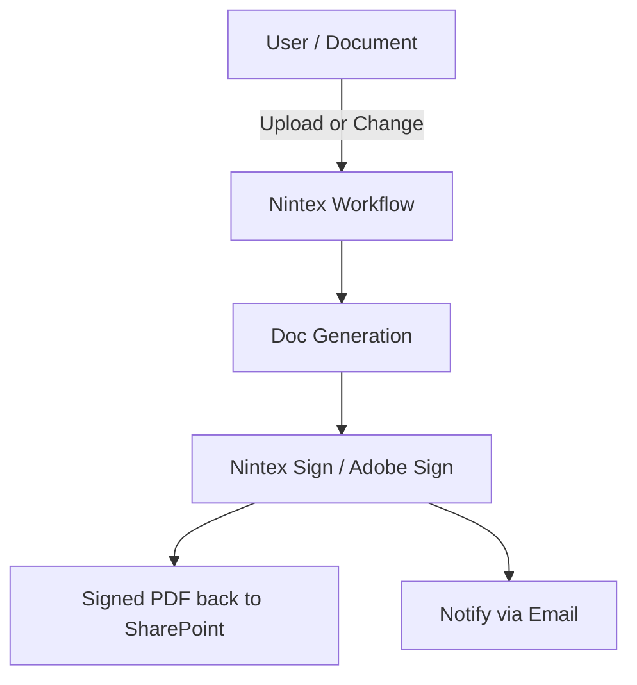
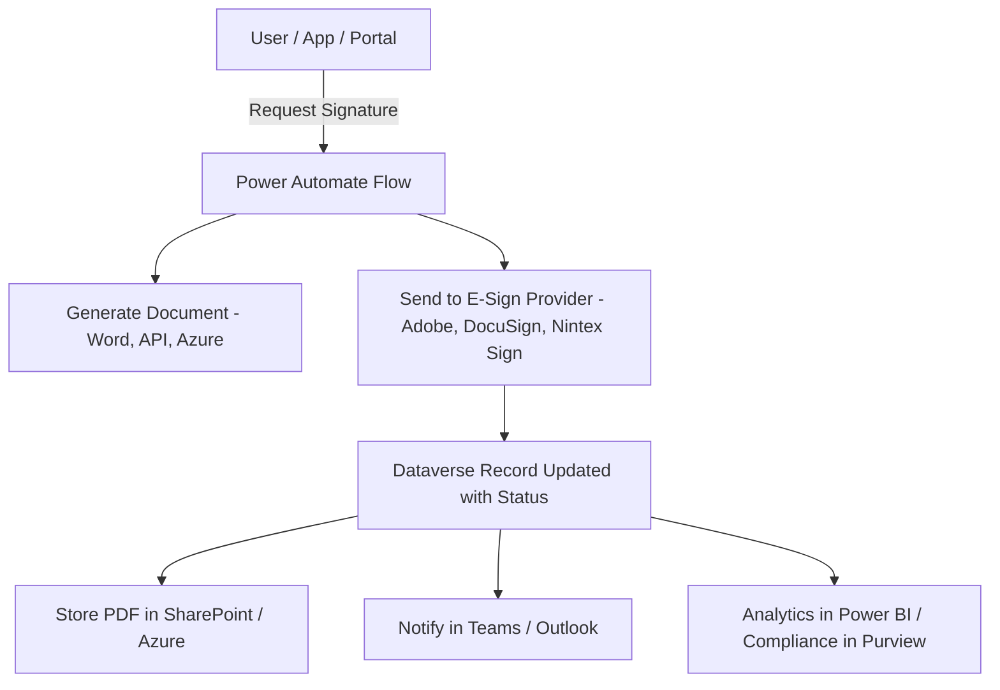

# 🇨🇦 **ÉLECTIONS CANADA | ELECTIONS CANADA**

  
  +
  

## **E-Signatures Project Options Analysis**
### *Nintex Workflow vs. Microsoft Power Platform (Power Automate, Dataverse, etc.)*

---

## Why E-Signatures Matter

Our primary use case is **e-signatures** — routing, approving, and securely storing signed documents for compliance and operational efficiency. The workflow engine we choose isn’t just about moving files; it’s about **managing the lifecycle of a signature request**:

- **Preparation** – Generating the document package, tagging signature fields.  
- **Execution** – Routing to one or more signatories, with escalation or delegation if needed.  
- **Verification** – Ensuring audit trail, timestamp, and compliance with internal policy.  
- **Storage** – Persisting the signed artifact in the right repository (SharePoint, Dataverse, records management).  
- **Integration** – Triggering downstream actions: update CRM, notify stakeholders, archive, or trigger payments.  

Both **Nintex Workflow** and **Power Platform** can do this — but the ecosystem around each matters.

---

## What Nintex Workflow Brings for E-Signatures

Nintex Workflow is **document-centric**, and its e-sign integration (via **Nintex Sign powered by Adobe Sign**) is tightly coupled into its workflow engine.

**Typical e-signature workflow in Nintex:**

- Trigger when a document is added/changed in SharePoint or CRM.  
- Generate a signing package using Nintex Document Generation.  
- Route for approval/signature using Nintex Sign (Adobe-backed).  
- Capture signed PDF and push back to SharePoint or a file system.  
- Notify users of completion via email.  

**Strengths for e-signature use cases:**

- Prebuilt **actions for Nintex Sign** — easy to drag/drop into workflows.  
- Built-in **document generation** — merge data into Word/PDF templates before sending for signing.  
- Strong alignment with **SharePoint-centric workflows** (classic use case).  
- Process mapping/discovery tools help visualize approval/signature routing.  

**Limitations:**

- Less flexibility if we want to swap to another e-sign provider (lock-in to Adobe/Nintex stack).  
- Less emphasis on relational data-driven flows (it’s file/event-first).  
- APIs exist, but are not as standardized or broad as Dataverse’s OData APIs.

---

## Power Platform for E-Signatures (with M365/Azure)

Power Platform flips the approach: it’s **data + app-first** and integrates with e-signature providers (including Nintex Sign, Adobe Sign, DocuSign, etc.) as **pluggable services**.

**Typical e-signature workflow in Power Platform:**

- A user triggers a process via **Power Apps** or **Power Pages** (internal or external portal).  
- Workflow is orchestrated in **Power Automate**:  
  - Generate documents (via Word templates, 3rd-party doc-gen, or custom connector).  
  - Call Adobe Sign, DocuSign, or Nintex Sign via connectors.  
  - Monitor signing status, update **Dataverse** with sign-off metadata.  
  - Store signed PDF in SharePoint Online, OneDrive, or Azure Blob.  
  - Notify users in **Teams**, Outlook, or custom apps.  
- Analytics in **Power BI** to track signature KPIs, SLA compliance.  

**Strengths for e-signature use cases:**

- **No lock-in** — choose any e-sign provider via connectors or APIs.  
- **Data-first** — we can store the signature lifecycle state in Dataverse, making it queryable across apps.  
- **Deeper ecosystem integration**:  
  - **Teams** for approvals/notifications.  
  - **Outlook** for request tracking.  
  - **Azure Logic Apps/Functions** for custom extensions.  
  - **Microsoft Purview** for retention, audit, compliance.  
- **APIs and integration edge**:  
  - Dataverse Web API (OData v4) for custom stacks.  
  - Power Automate APIs for triggering flows externally.  
  - Event Grid, Service Bus, Functions for modern event-driven workflows.

---

## Nintex Workflow vs. Power Platform — For E-Signatures

| Capability / Concern | Nintex Workflow | Power Platform (with M365/Azure) |
|----------------------|-----------------|----------------------------------|
| **E-Sign Provider** | Nintex Sign (Adobe) native | Adobe, DocuSign, Nintex Sign, or any API/connector |
| **Workflow Trigger** | File/document events (SharePoint, CRM, etc.) | Data changes (Dataverse), app events, files, APIs, Teams/Outlook actions |
| **Document Generation** | Built-in doc-gen tools | Word templates, 3rd-party connectors, or Azure Functions |
| **Audit & Compliance** | Nintex audit trails | Microsoft Purview, DLP policies, M365 unified audit log |
| **Notification Layer** | Email, Nintex task forms | Teams, Outlook, Adaptive Cards, mobile apps |
| **APIs** | Nintex workflow APIs + Nintex Sign APIs | **Dataverse Web API (OData)**, Power Automate APIs, Azure event APIs |
| **Integration Breadth** | Strong in legacy doc systems (SharePoint, SAP, CRM) | Broadest in SaaS + deep M365/Azure integration |
| **Lock-In** | Tight coupling to Nintex + Adobe stack | Flexible — swap providers without redesigning entire process |

---

## Integration & API Contrast

### Nintex APIs

- REST APIs to start workflows, check status, submit tasks.  
- Nintex Sign APIs (Adobe-based) for sending/receiving signing packages.  
- Best used in a **SharePoint or CRM context**.  

### Power Platform + M365/Azure APIs

- **Dataverse Web API (OData v4)** — unified CRUD/query for any entity.  
- **Power Automate Cloud Flows API** — trigger or manage flows programmatically.  
- **Custom Connectors** — expose any REST API to Power Automate.  
- **Azure integration** — Functions, Logic Apps, Service Bus, Event Grid for external stacks.  
- First-class **Entra ID (Azure AD)** integration for secure, governed access.  

**Takeaway:**  
Nintex APIs are functional but limited to the Nintex ecosystem. Power Platform + M365/Azure give us **a full enterprise integration plane** with standard APIs for any other stack our agency may build (.NET, Java, Python, Node, etc.).

---

## Architecture Options

### Option A – Nintex Workflow + Nintex Sign (Document-Centric)

### Option B – Power Platform + Flexible E-Sign (Data-Centric)

---

## Recommended Approach

- Use **Power Platform (Power Automate + Dataverse)** as the **workflow and lifecycle engine** for e-signature processes.
- Integrate **Nintex Sign** (if selected) or other providers (DocuSign, Adobe) as **modular steps** in the workflow.
- Leverage the **broader M365/Azure ecosystem** for compliance (Purview), communication (Teams), analytics (Power BI), and event-driven integration (Azure Functions/Logic Apps).

---

## Conclusion — Executive Summary

For e-signatures, we should lead with **Power Platform as the orchestration backbone** and plug in Nintex Sign (or any e-signature provider) as needed. Nintex Workflow is strong for SharePoint-style document routing, but it locks us into one ecosystem. With Power Platform and M365/Azure, we gain **flexibility, compliance, analytics, and integration power** — positioning us to scale signature workflows across the agency without vendor lock-in.
