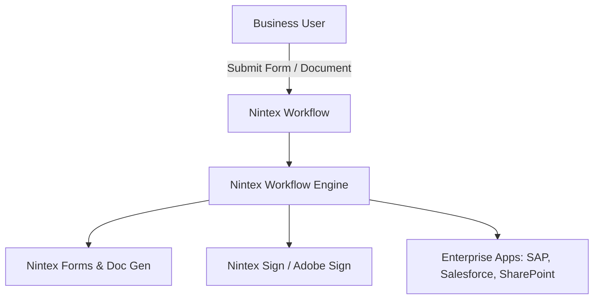
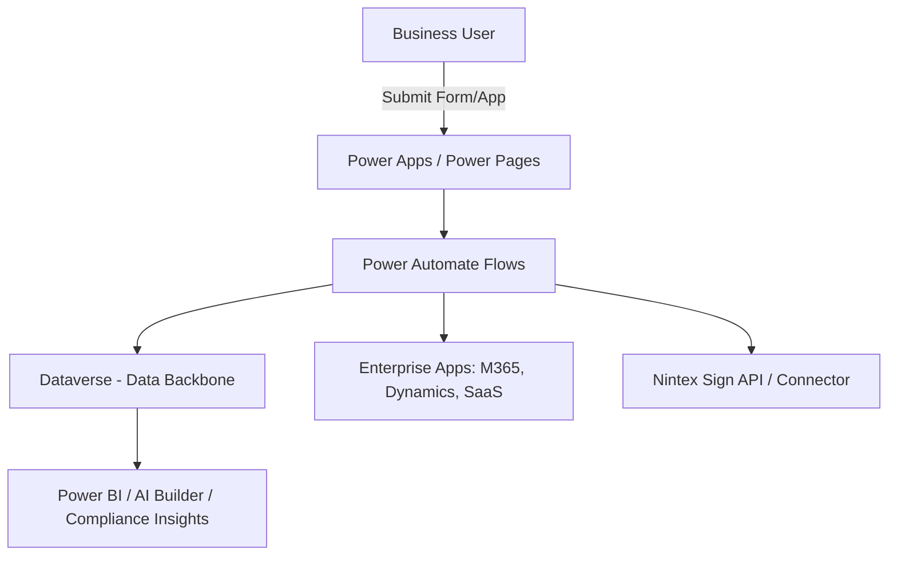

# Nintex Workflow vs. Microsoft Power Platform (Power Automate, Dataverse, etc.)

---

## What is Nintex Workflow?

Nintex Workflow is a **low-code process automation platform**. It started out strong with SharePoint and has since expanded into a standalone workflow suite. Its main value lies in:

* **Process Orchestration** – Automating multi-step workflows like approvals, onboarding, procurement, or compliance tracking.  
* **Integration with Enterprise Apps** – Connects to systems such as SAP, Salesforce, SharePoint, Office 365, Box, DocuSign, and Nintex Sign.  
* **Forms & Document Generation** – Building forms and generating documents as part of workflows.  
* **Process Intelligence & Analytics** – Insights and process mapping to optimize business processes.  
* **E-Signature Integration** – Native tie-in with *Nintex Sign* (powered by Adobe Sign) for approval cycles.  

In short, Nintex Workflow competes directly with Power Automate. Its sweet spot has always been **document-centric processes**.

---

## Power Platform Alternative (Power Automate, Dataverse, Dynamics 365)

Microsoft Power Platform gives us a comparable, often broader, set of capabilities:

* **Power Automate (Flows)**  
  Automates processes across M365 (Teams, Outlook, SharePoint), Dataverse, Dynamics 365, and 1,000+ connectors.  

* **Dataverse**  
  Serves as our **data backbone** (CRM-style relational database) for workflow state, metadata, and customer records.  

* **Power Apps & Power Pages**  
  Lets us build forms, portals, and apps that directly embed workflows.  

* **AI Builder**  
  Automates extraction, classification, and AI-driven actions.  

* **Integration with Microsoft Security & Compliance**  
  Leverages Azure AD, Purview, and the broader M365 security/compliance stack — which is critical for us in a federal/government context.  

Where Nintex is **document-first**, Power Platform is **data + app-first**.

---

## Nintex Workflow vs. Power Automate — Comparison

| Feature                 | Nintex Workflow                                             | Power Platform (Power Automate + Dataverse)      |
| ----------------------- | ----------------------------------------------------------- | ------------------------------------------------ |
| **Ease of Use**         | Drag-and-drop designer, geared to SharePoint/document users | Low-code designer, geared to app & data flows    |
| **E-Signature**         | Native with Nintex Sign                                     | Works with Nintex Sign, DocuSign, Adobe Sign, etc. (no lock-in) |
| **Document Generation** | Strong built-in                                             | Requires 3rd-party (Word templates, DocGen apps) |
| **Data Backbone**       | Relies on external systems (SharePoint, Salesforce, etc.)   | Native Dataverse with rich CRM-style model       |
| **Integration**         | Strong with legacy SharePoint & enterprise content mgmt     | Deep with M365 and modern SaaS apps              |
| **Analytics**           | Process analytics built-in                                  | Power BI, AI Builder, Dataverse analytics        |
| **Governance/Security** | Nintex-managed                                              | Fully integrated with M365 security & compliance |
| **Adoption Trend**      | Strong in doc-centric orgs but plateauing                   | Rapid growth, heavily backed by Microsoft        |

---

## Do We Need Nintex Workflow?

Looking at our context:

* Since we already use **Power Platform** (Dataverse, D365, Power Automate), relying on Power Automate for workflows is more future-proof.  
* Nintex **e-sign** can still be integrated — we’d just call the Nintex Sign API from Power Automate, the same way we would for DocuSign or Adobe Sign.  
* By decoupling workflow automation (Power Automate) from e-signature (Nintex Sign), we get:
  * One central workflow and governance layer (Power Platform).  
  * Flexibility to switch e-sign providers without vendor lock-in.  
  * Alignment with Microsoft’s roadmap and licensing, which matters for us.  

---

## Architecture Options

### Option A – Nintex Workflow + Nintex Sign (Standalone Stack)

### Option B – Power Platform + Nintex Sign (Integrated Approach)

---

## Recommended Approach

* Use **Power Platform (Power Automate + Dataverse)** as our core workflow and lifecycle management platform.
* Integrate **Nintex Sign** as our e-signature provider.

---

## Conclusion — Executive Summary

For us, the right path forward is clear: **Power Platform should be our workflow and lifecycle management engine**, while **Nintex Sign (or any other e-sign provider) integrates as needed**. This approach avoids vendor lock-in, aligns with Microsoft’s roadmap, and keeps us future-proof without taking on unnecessary Nintex Workflow overhead.