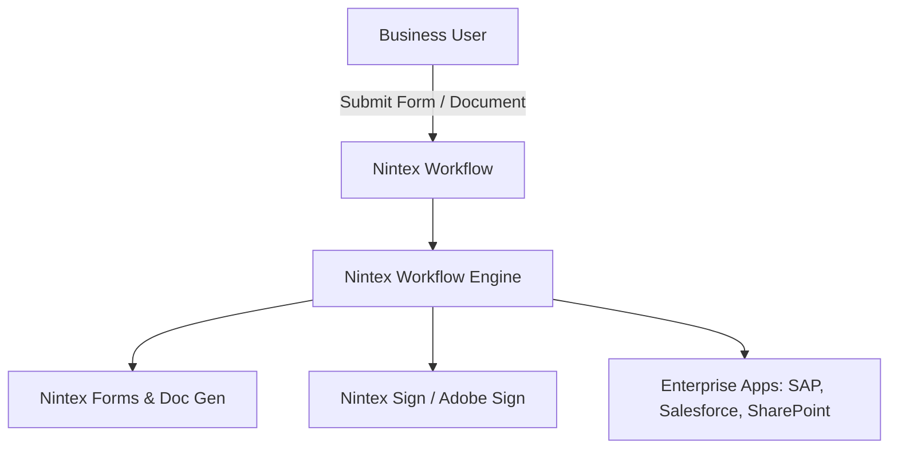
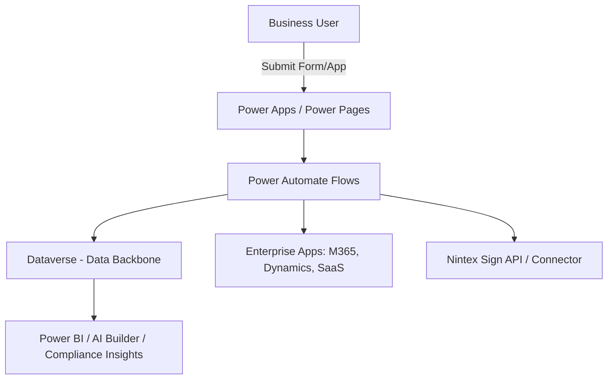

# 🇨🇦 **ÉLECTIONS CANADA | ELECTIONS CANADA**

  
  +
  

## **E-Signatures Project Options Analysis**
### *Nintex Workflow vs. Microsoft Power Platform (Power Automate, Dataverse, etc.)*

---

## What is Nintex Workflow?

Nintex Workflow is a **low-code process automation platform**. It started out strong with SharePoint and has since expanded into a standalone workflow suite. Its main value lies in:

* **Process Orchestration** – Automating multi-step workflows like approvals, onboarding, procurement, or compliance tracking.  
* **Integration with Enterprise Apps** – Connects to systems such as SAP, Salesforce, SharePoint, Office 365, Box, DocuSign, and Nintex Sign.  
* **Forms & Document Generation** – Building forms and generating documents as part of workflows.  
* **Process Intelligence & Analytics** – Insights and process mapping to optimize business processes.  
* **E-Signature Integration** – Native tie-in with *Nintex Sign* (powered by Adobe Sign) for approval cycles.  

In short, Nintex Workflow competes directly with Power Automate. Its sweet spot has always been **document-centric processes**.

---

## Power Platform Alternative (Power Automate, Dataverse, Dynamics 365)

Microsoft Power Platform gives us a comparable, often broader, set of capabilities:

* **Power Automate (Flows)**  
  Automates processes across M365 (Teams, Outlook, SharePoint), Dataverse, Dynamics 365, and 1,000+ connectors.  

* **Dataverse**  
  Serves as our **data backbone** (CRM-style relational database) for workflow state, metadata, and customer records.  

* **Power Apps & Power Pages**  
  Lets us build forms, portals, and apps that directly embed workflows.  

* **AI Builder**  
  Automates extraction, classification, and AI-driven actions.  

* **Integration with Microsoft Security & Compliance**  
  Leverages Azure AD, Purview, and the broader M365 security/compliance stack — which is critical for us in a federal/government context.  

Where Nintex is **document-first**, Power Platform is **data + app-first**.

---

## Nintex Workflow vs. Power Automate — Comparison

| Feature                 | Nintex Workflow                                             | Power Platform (Power Automate + Dataverse)      |
| ----------------------- | ----------------------------------------------------------- | ------------------------------------------------ |
| **Ease of Use**         | Drag-and-drop designer, geared to SharePoint/document users | Low-code designer, geared to app & data flows    |
| **E-Signature**         | Native with Nintex Sign                                     | Works with Nintex Sign, DocuSign, Adobe Sign, etc. (no lock-in) |
| **Document Generation** | Strong built-in                                             | Requires 3rd-party (Word templates, DocGen apps) |
| **Data Backbone**       | Relies on external systems (SharePoint, Salesforce, etc.)   | Native Dataverse with rich CRM-style model       |
| **Integration**         | Strong with legacy SharePoint & enterprise content mgmt     | Deep with M365 and modern SaaS apps              |
| **Analytics**           | Process analytics built-in                                  | Power BI, AI Builder, Dataverse analytics        |
| **Governance/Security** | Nintex-managed                                              | Fully integrated with M365 security & compliance |
| **Adoption Trend**      | Strong in doc-centric orgs but plateauing                   | Rapid growth, heavily backed by Microsoft        |

---

## What does Nintex Workflow actually do? (deeper detail)

When we say “document-centric,” here’s what that looks like in practice:

* **SharePoint-first automation**  
  * Start a workflow when a file is added/changed; route for review/approval; update metadata; move/copy across libraries; publish to records centers.
* **Human-in-the-loop approvals**  
  * Parallel/serial approvals, delegation, escalations, SLAs, reminders, reassign on OOF; stamp outcomes back onto documents.
* **Forms & task experiences**  
  * Nintex Forms for list/library items; conditional sections; rules/validation; mobile-friendly forms; task forms tied to workflow steps.
* **Document assembly**  
  * Merge list data into Word/PDF templates; create filing packages; apply watermarks; send bundles to e-sign and file the signed artifact automatically.
* **Line-of-business (LOB) connectors**  
  * Prebuilt actions to read/write SAP, Salesforce, Box, Exchange, SQL, etc., often triggered by document events.
* **Process discovery & mapping**  
  * Map current-state processes, simulate bottlenecks, and push a deployable workflow from the map.
* **On-prem/legacy friendliness**  
  * Strong footprint where SharePoint Server and file-centric processes still dominate.

**What it does not focus on as much by default:** relational data models, unified business rules across apps, granular environment governance, and fusion teamwork across citizen + pro dev with a single data platform.

---

## What does Power Platform do in contrast? (deeper detail)

* **Data-first orchestration**  
  * Model entities/tables in **Dataverse**; relate them; apply business rules; drive flows off data changes rather than just file events.
* **End-to-end app surfaces**  
  * **Power Apps** for responsive apps; **Power Pages** for citizen/external portals; **Power Automate** for cloud/desktop flows; **Power BI** for analytics.
* **Modern integration patterns**  
  * 1,000+ connectors; **custom connectors** via OpenAPI; **Azure Functions/Logic Apps**, Service Bus, Event Grid; webhook/subscription triggers.
* **ALM & governance baked in**  
  * Solutions, environments, pipelines, DLP policies, security roles, auditing, retention — designed to scale enterprise-wide.
* **AI-native options**  
  * AI Builder for classification/extraction; Copilot experiences; low-code AI embedded into apps and flows.
* **E-sign as a pluggable step**  
  * Use Adobe Sign, DocuSign, Nintex Sign, etc., via connectors/webhooks without changing the workflow engine.

---

## Integration & API surface (for other stacks in the agency)

| Area / Need | Nintex Workflow | Power Platform / Dataverse |
|---|---|---|
| **Primary APIs** | REST endpoints (varies by product family), web service actions, workflow start via HTTP/webhook, Nintex Forms submit endpoints, Nintex Sign (Adobe-backed) APIs | **Dataverse Web API (OData v4)** for CRUD/query; **Power Automate** triggers/actions; **Connector** framework (OpenAPI-based); **Power Pages** as web surface; **Plugin/Webhook** model for events |
| **Eventing** | Start workflows on SharePoint/Box/Salesforce events or via HTTP | Triggers on Dataverse row create/update/delete; message-based events to Azure; webhook/Service Bus; scheduled/instant flows |
| **Auth** | Nintex auth per connector; typically app-level credentials; tenant-specific | **Entra ID (Azure AD)**; first-class OAuth; service principals; conditional access; M365 identity stack |
| **Custom Integration** | Call HTTP endpoints from actions; custom connectors available but typically within Nintex runtime | Build **custom connectors** (OpenAPI); call **Azure Functions**; expose **Dataverse Web API** to any stack; surface portals with **Power Pages** |
| **Data Access Pattern** | Often document/list-centric; data lives in external systems that workflows touch | **Centralized data plane in Dataverse** with role-based security, field-level security, auditing, and rich relationships |
| **Developer Ergonomics** | Strong for doc workflows; limited unified data modeling | Full ALM (Solutions), environments, test/dev/prod separation; CLI/DevOps integration; pro-dev extensibility |

**Practical takeaway for our other stacks (Java, .NET, Node, Python, etc.):**  

* With **Nintex**, our apps usually call into a workflow **endpoint** or drop a file/record in a connected system to kick things off; the “system of record” often lives elsewhere (SharePoint, Salesforce).  
* With **Power Platform**, our apps can **talk directly to Dataverse’s Web API** for consistent CRUD/query, raise events that Power Automate listens to, and subscribe to outbound webhooks — giving us a clean, well-governed data plane plus workflow.

---

## Do We Need Nintex Workflow?

Looking at our context:

* Since we already use **Power Platform** (Dataverse, D365, Power Automate), relying on Power Automate for workflows is more future-proof.  
* Nintex **e-sign** can still be integrated — we’d just call the Nintex Sign API from Power Automate, the same way we would for DocuSign or Adobe Sign.  
* By decoupling workflow automation (Power Automate) from e-signature (Nintex Sign), we get:
  * One central workflow and governance layer (Power Platform).  
  * Flexibility to switch e-sign providers without vendor lock-in.  
  * Alignment with Microsoft’s roadmap and licensing, which matters for us.  

---

## Architecture Options

### Option A – Nintex Workflow + Nintex Sign (Standalone Stack)

### Option B – Power Platform + Nintex Sign (Integrated Approach)

---

## Recommended Approach

* Use **Power Platform (Power Automate + Dataverse)** as our core workflow and lifecycle management platform.
* Integrate **Nintex Sign** as our e-signature provider.

---

## Conclusion — Executive Summary

For us, the right path forward is clear: **Power Platform should be our workflow and lifecycle management engine**, while **Nintex Sign (or any other e-sign provider) integrates as needed**. This approach avoids vendor lock-in, aligns with Microsoft’s roadmap, and keeps us future-proof without taking on unnecessary Nintex Workflow overhead.