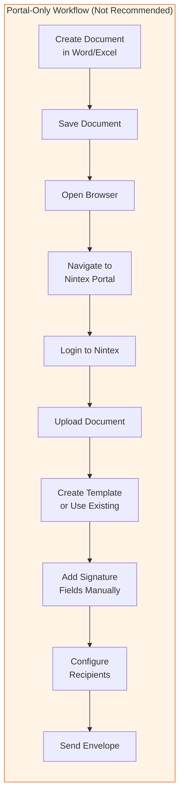
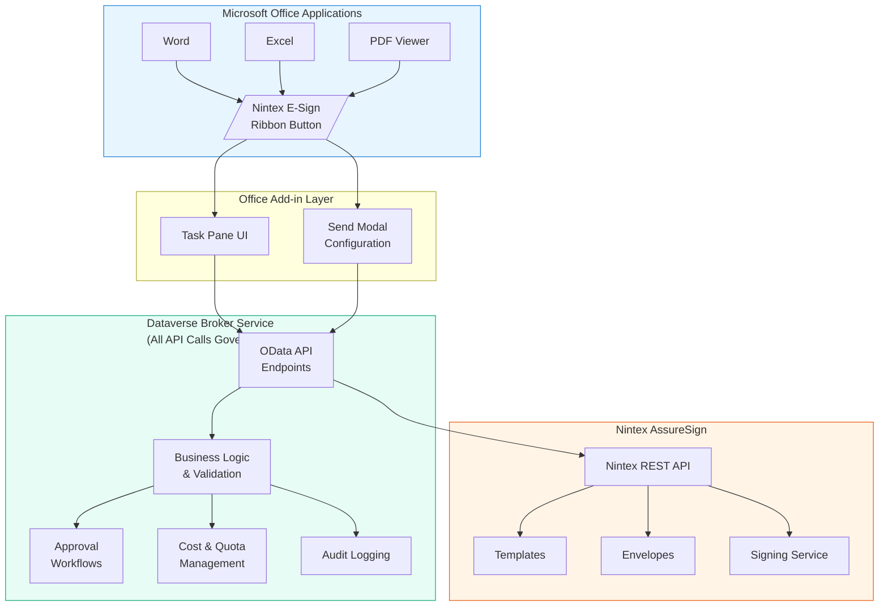
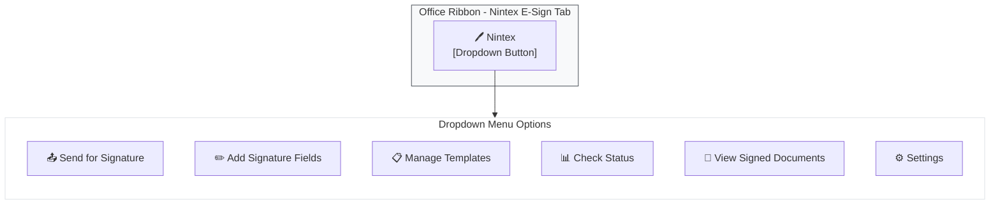
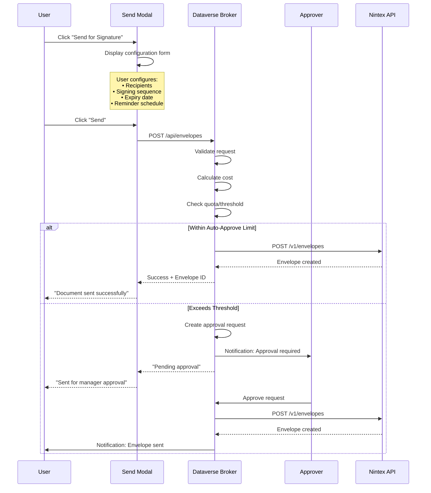
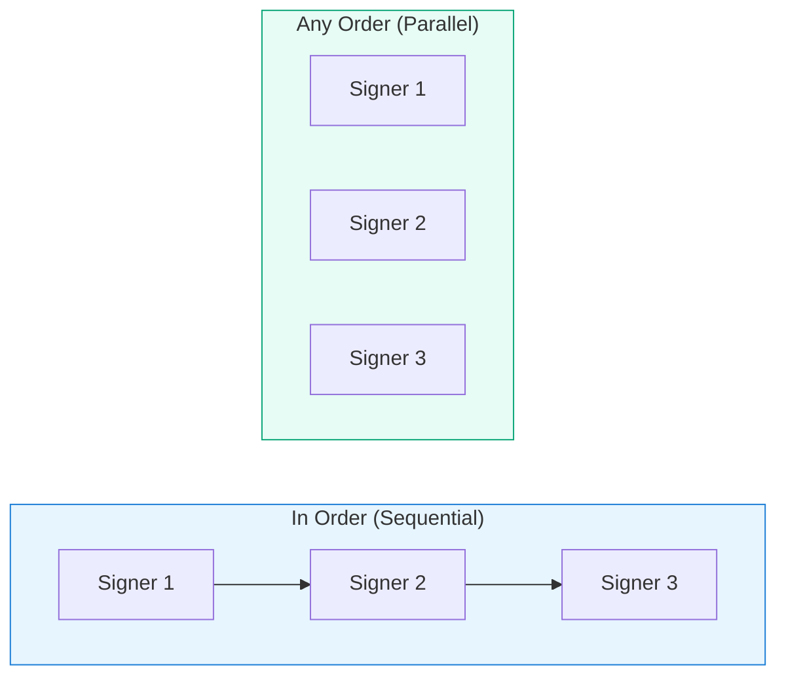
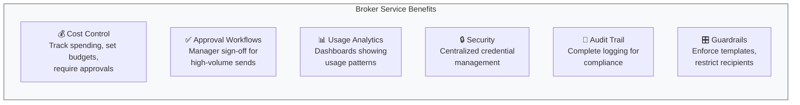
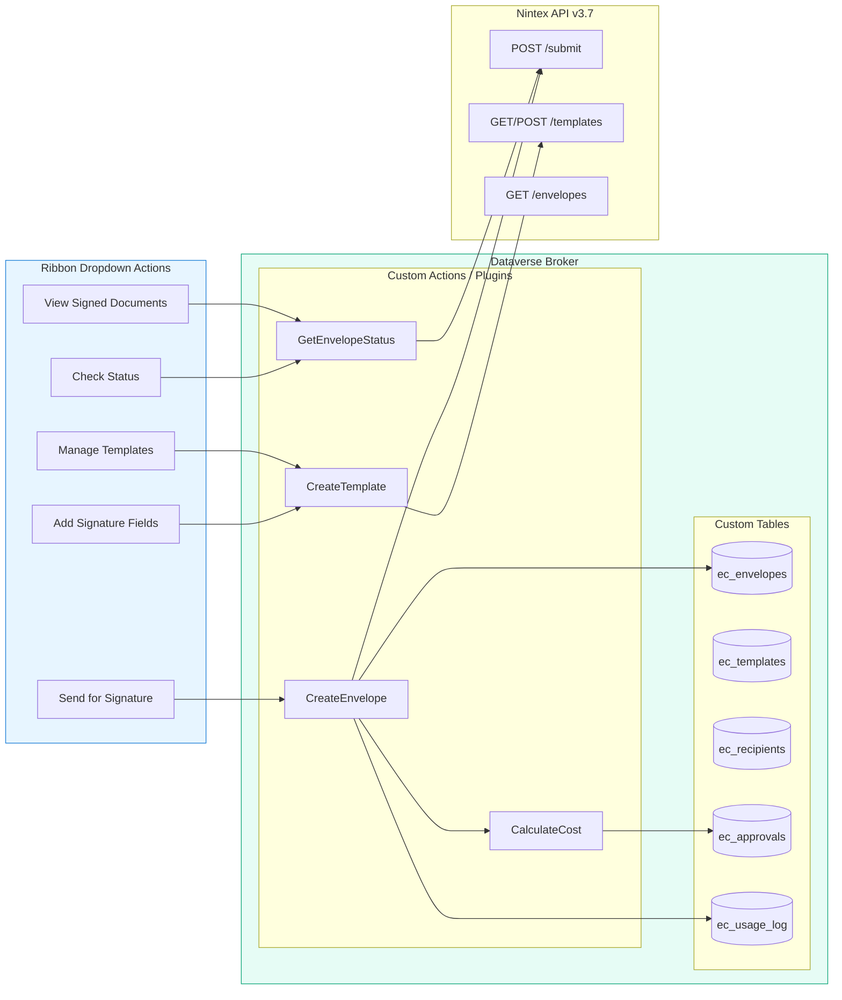
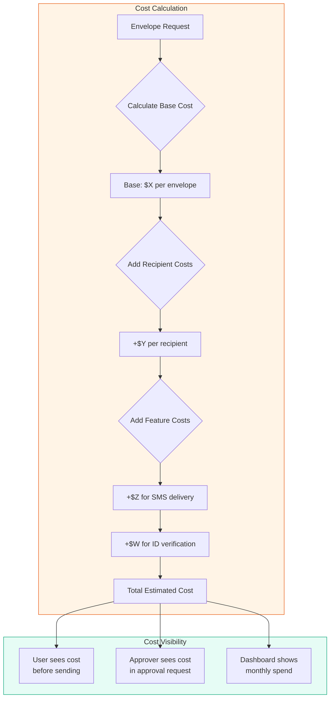
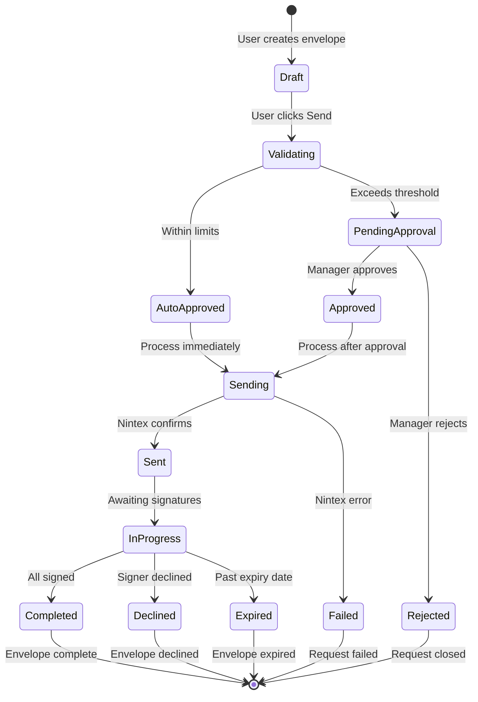

<div style="position: relative; margin-bottom: 40px;">
  <div style="position: absolute; top: 0; right: 0; display: flex; align-items: center; gap: 20px;">
    
    <span style="font-size: 32px; color: #666; font-weight: 300;">+</span>
    
  </div>
  <div style="height: 100px;"></div> <!-- Spacer to prevent overlap with title -->
</div>

# Elections Canada Digital Signature Integration

## Office Add-in with Dataverse Broker Service

| Field          | Value                             |
| -------------- | --------------------------------- |
| Document Type  | Business Case & Solution Overview |
| Version        | 1.0                               |
| Date           | December 2025                     |
| Author         | Platform Engineering Team         |
| Classification | Unclassified                      |
| Status         | Draft for Review                  |

---

## Executive Summary

This document outlines the proposed approach for introducing digital signature capabilities at Elections Canada using Nintex AssureSign. Rather than deploying the Nintex web portal as a standalone tool, this solution embeds signature functionality directly into Microsoft Office applications (Word, Excel, and PDF viewers)—allowing staff to send documents for signature without leaving their familiar work environment.

Central to this solution is a **Dataverse Broker Service** that acts as the sole gateway between Elections Canada staff and the Nintex API. **All API calls are routed through this broker layer**, enabling cost controls, approval workflows, usage analytics, and operational guardrails—ensuring fiscal responsibility and governance while maintaining the flexibility staff need to execute their duties efficiently.

---

## 1. The Case for an Integrated Approach

Elections Canada is introducing Nintex AssureSign to enable digital signatures across the organization. While Nintex provides a powerful web-based portal for managing signature workflows, deploying the portal alone—without an integrated solution—would introduce unnecessary friction and governance gaps.

### 1.1 Portal-Only Workflow

If staff were required to use the Nintex portal directly, every signature request would follow this cumbersome process:



### 1.2 Why Portal-Only Deployment Is Insufficient

| Concern                        | Risk to Elections Canada                                                                                                     |
| ------------------------------ | ---------------------------------------------------------------------------------------------------------------------------- |
| **Context switching**    | Staff would need to leave their document to access a separate portal, breaking workflow continuity and reducing productivity |
| **Duplicate effort**     | Documents created in Office would need to be re-uploaded and configured in Nintex—redundant steps that slow operations      |
| **Training overhead**    | Staff would need to learn both Office applications and the Nintex portal interface, increasing onboarding time               |
| **No cost visibility**   | Managers would have limited visibility into envelope usage and associated costs until invoicing arrives                      |
| **No approval workflow** | Any authorized user could send envelopes without oversight, risking budget overruns and inappropriate use                    |
| **Template sprawl**      | Templates would be created ad-hoc in Nintex with no centralized governance or standardization                                |
| **No audit integration** | Signature activity would be siloed in Nintex, disconnected from Elections Canada's compliance and reporting systems          |

**The proposed solution addresses all of these concerns** by embedding Nintex functionality directly into Office applications and routing all API calls through a governed Dataverse broker layer.

---

## 2. Proposed Solution Overview

To deliver Nintex AssureSign capabilities while avoiding the pitfalls of a portal-only deployment, the Platform Engineering Team proposes an integrated solution with two key components.

### 2.1 Solution Architecture

All interactions between the Office Add-in and Nintex AssureSign are routed through the Dataverse Broker Service. No direct API calls to Nintex are permitted—this ensures complete governance, cost control, and audit coverage for every action taken by Elections Canada staff.



**Key Principle:** The Office Add-in never communicates directly with Nintex. Every ribbon button action—whether sending for signature, adding fields, checking status, or managing templates—routes through the Dataverse Broker Service first.

### 2.2 Component Summary

| Component                    | Purpose                                                                                                                                                                               |
| ---------------------------- | ------------------------------------------------------------------------------------------------------------------------------------------------------------------------------------- |
| **Office Add-in**      | Ribbon button with dropdown menu providing direct access to Nintex functionality within Word, Excel, and PDF documents. All actions call the Dataverse Broker—never Nintex directly. |
| **Dataverse Broker**   | The single gateway for all Nintex API interactions. Enforces business rules, approvals, cost controls, and audit logging before forwarding requests to Nintex.                        |
| **Approval Workflows** | Power Automate flows triggered when envelope requests exceed thresholds or require management authorization                                                                           |
| **Cost Management**    | Real-time tracking of envelope usage with budget alerts and approver visibility                                                                                                       |

---

## 3. Office Add-in: Ribbon Button Experience

### 3.1 User Interface Design

The add-in presents a familiar, intuitive interface directly within the Office ribbon, eliminating the need to leave the document context.



### 3.2 Dropdown Menu Functions

| Menu Item                       | Description                                                                                                 | Action Type  |
| ------------------------------- | ----------------------------------------------------------------------------------------------------------- | ------------ |
| **Send for Signature**    | Opens configuration modal to set recipients, signing order, and options before sending the current document | Modal Dialog |
| **Add Signature Fields**  | Opens task pane with field palette to insert signature, initials, date, and text fields at cursor position  | Task Pane    |
| **Manage Templates**      | View, edit, or create reusable templates stored in Dataverse                                                | Task Pane    |
| **Check Status**          | View real-time status of envelopes sent from this document or by the current user                           | Task Pane    |
| **View Signed Documents** | Browse and download completed, signed documents                                                             | Task Pane    |
| **Settings**              | Configure default options, notification preferences, and view usage statistics                              | Task Pane    |

### 3.3 Send for Signature Modal

When a user clicks "Send for Signature," a modal dialog appears with configuration options that mirror Nintex capabilities while adding Elections Canada-specific controls.



### 3.4 Modal Configuration Options

The send modal captures all necessary information in a single, user-friendly interface.

**Recipient Configuration:**

| Field            | Description                    | Options                                                           |
| ---------------- | ------------------------------ | ----------------------------------------------------------------- |
| Recipients       | Email addresses of signers     | Manual entry, Outlook contacts, or saved groups                   |
| Signing Sequence | Order in which recipients sign | **In Order** (sequential) or **Any Order** (parallel) |
| Role Assignment  | What each recipient does       | Signer, Approver, CC Only, In-Person Signer                       |

**Document Options:**

| Field                 | Description                 | Default                       |
| --------------------- | --------------------------- | ----------------------------- |
| Envelope Name         | Display name for tracking   | Document filename             |
| Message to Recipients | Email body text             | Organization default template |
| Expiry                | Days until envelope expires | 30 days                       |
| Reminders             | Automatic reminder schedule | 3, 7, 14 days                 |

**Signing Sequence Visualization:**



---

## 4. Dataverse Broker Service

### 4.1 Purpose and Value

The Dataverse Broker Service is the cornerstone of this solution's governance model. **All API calls from the Office Add-in are routed exclusively through the Dataverse Broker**—direct access to the Nintex API is not permitted. This architecture enables Elections Canada to implement comprehensive organizational controls without sacrificing functionality.



**Why This Matters:** By funneling all requests through a single broker layer, Elections Canada gains complete visibility and control over digital signature operations. Every "Send for Signature," "Check Status," "Add Fields," or "Manage Templates" action is logged, validated, and governed before reaching Nintex.

### 4.2 API Abstraction Layer

The broker exposes OData endpoints through Dataverse that mirror Nintex API functionality. The Office Add-in calls Dataverse exclusively—Nintex API credentials are never exposed to client applications.

**Every ribbon button action flows through the broker:**



### 4.3 Nintex AssureSign API Endpoints Reference

The following table documents the Nintex AssureSign REST API v3.7 endpoints that the Dataverse Broker will wrap. All endpoints use the base URL: `https://{environment}.assuresign.net/api/documentnow/v3.7/`

> **Note:** For complete and current API documentation, refer to the interactive Swagger documentation at: https://account.assuresign.net/api/v3.7/documentation

#### Authentication Endpoints

| Endpoint                    | Method | Description                                             | Request Payload                                                                                                                 |
| --------------------------- | ------ | ------------------------------------------------------- | ------------------------------------------------------------------------------------------------------------------------------- |
| `/authentication/apiUser` | POST   | Obtain authentication token for API access              | `{ "request": { "apiUsername": "string", "key": "string", "contextUsername": "string", "sessionLengthInMinutes": integer } }` |
| `/authentication/sso`     | POST   | Generate SSO token for web UI access (valid 30 seconds) | Requires Bearer token and X-AS-UserContext header                                                                               |

#### Submit / Envelope Creation Endpoints

| Endpoint                         | Method | Description                                         | Request Payload              |
| -------------------------------- | ------ | --------------------------------------------------- | ---------------------------- |
| `/submit`                      | POST   | Submit envelope using template or ad-hoc content    | See detailed payload below   |
| `/submit/prepare`              | POST   | Prepare envelope without sending (for preview/edit) | Same as /submit              |
| `/submit/{preparedEnvelopeID}` | POST   | Send a previously prepared envelope                 | Empty body or minimal config |

#### Envelope Management Endpoints

| Endpoint                                           | Method | Description                          | Request Payload                                      |
| -------------------------------------------------- | ------ | ------------------------------------ | ---------------------------------------------------- |
| `/envelopes/{envelopeID}`                        | GET    | Retrieve envelope details and status | N/A (Query params: includeFinalDocumentDownloadLink) |
| `/envelopes/{envelopeID}/signingLinks`           | GET    | Get signing URLs for all signatories | Query params: redirectUrl                            |
| `/envelopes/{envelopeID}/cancel`                 | POST   | Cancel an in-progress envelope       | `{ "reason": "string" }`                           |
| `/envelopes/{envelopeID}/remind`                 | POST   | Send reminder to pending signers     | `{ "signerEmail": "string" }`                      |
| `/envelopes/{envelopeID}/documents`              | GET    | List all documents in an envelope    | N/A                                                  |
| `/envelopes/{envelopeID}/documents/{documentID}` | GET    | Download specific document           | Query params: type (original, interim, completed)    |
| `/envelopes/{envelopeID}/history`                | GET    | Get envelope activity/audit history  | N/A                                                  |

#### Template Endpoints

| Endpoint                    | Method | Description              | Request Payload                        |
| --------------------------- | ------ | ------------------------ | -------------------------------------- |
| `/templates`              | GET    | List all templates       | Query params: includeContent (boolean) |
| `/templates/{templateID}` | GET    | Get template details     | N/A                                    |
| `/templates`              | POST   | Create new template      | Template content JSON                  |
| `/templates/{templateID}` | PUT    | Update existing template | Template content JSON                  |
| `/templates/{templateID}` | DELETE | Delete template          | N/A                                    |

#### Email Design Endpoints

| Endpoint                                                 | Method | Description                        | Request Payload              |
| -------------------------------------------------------- | ------ | ---------------------------------- | ---------------------------- |
| `/emailDesignSets`                                     | GET    | List all email design sets         | N/A                          |
| `/emailDesignSets/defaultEmailNotifications/{culture}` | GET    | Get default notification templates | Culture: en-US, fr-CA, es-US |

#### Placeholder File Endpoints

| Endpoint                       | Method | Description             | Request Payload          |
| ------------------------------ | ------ | ----------------------- | ------------------------ |
| `/placeholderFiles`          | GET    | List placeholder files  | N/A                      |
| `/placeholderFiles`          | POST   | Upload placeholder file | Multipart form with file |
| `/placeholderFiles/{fileID}` | DELETE | Delete placeholder file | N/A                      |

#### Account/User Endpoints

| Endpoint      | Method | Description              | Request Payload |
| ------------- | ------ | ------------------------ | --------------- |
| `/accounts` | GET    | List accessible accounts | N/A             |
| `/users`    | GET    | List users in account    | N/A             |

---

### 4.4 Detailed Payload Examples

#### Submit Envelope with Template

```json
POST /submit
Authorization: Bearer {token}
X-AS-UserContext: {username}:{contextIdentifier}
Content-Type: application/json

{
  "request": {
    "templates": [{
      "templateID": "b8f17bae-a89b-4519-ae6f-465031349642",
      "values": [
        { "name": "Envelope Name", "value": "Contract Agreement" },
        { "name": "Envelope Order number", "value": "EC-2025-001234" },
        { "name": "Expiration Date", "value": "01/15/2026" },
        { "name": "Language", "value": "en-US" },
        { "name": "Signer 1 Name", "value": "John Smith" },
        { "name": "Signer 1 Email", "value": "john.smith@example.gc.ca" },
        { "name": "Signer 1 Mobile Phone", "value": "613-555-1234" }
      ]
    }]
  }
}
```

#### Submit Ad-Hoc Envelope (No Template)

```json
POST /submit/prepare
Authorization: Bearer {token}
X-AS-UserContext: {username}:{contextIdentifier}
Content-Type: application/json

{
  "request": {
    "content": {
      "envelope": {
        "name": "Returning Officer Agreement",
        "orderID": "EC-2025-001234",
        "workflowType": "custom"
      },
      "documents": [{
        "name": "Agreement Document",
        "file": {
          "fileToUpload": {
            "data": "JVBERi0xLjQKJ...[Base64 encoded file]",
            "fileName": "Agreement.pdf"
          },
          "extension": "pdf"
        },
        "fields": [{
          "fieldType": "signature",
          "inputType": "signatory",
          "name": "Primary Signature",
          "signer": "Signer 1",
          "required": true,
          "position": { "x": 0.27, "y": 0.85 },
          "size": { "height": 0.05, "width": 0.25 },
          "instructions": "Please sign to confirm agreement"
        },
        {
          "fieldType": "date",
          "inputType": "signatory",
          "name": "Date Signed",
          "signer": "Signer 1",
          "position": { "x": 0.60, "y": 0.85 },
          "size": { "height": 0.03, "width": 0.15 }
        }]
      }],
      "signers": [{
        "label": "Signer 1",
        "name": "John Smith",
        "email": "john.smith@example.gc.ca",
        "mobilePhone": "+16135551234",
        "signingOrder": 1,
        "authentication": {
          "type": "password",
          "prompt": "Enter your employee ID",
          "value": "12345"
        }
      }],
      "steps": [{
        "name": "Step 1",
        "signers": ["Signer 1"]
      }],
      "emailNotifications": [{
        "name": "Signing Request",
        "stage": "Envelope_Start",
        "subject": "Elections Canada - Document Requires Your Signature",
        "customMessage": "Please review and sign the attached document at your earliest convenience.",
        "recipients": ["john.smith@example.gc.ca"]
      }]
    }
  }
}
```

#### Response: Submit Success

```json
{
  "result": {
    "envelopeID": "a1b2c3d4-e5f6-7890-abcd-ef1234567890",
    "authToken": "f4aaf447-8cfa-4701-9951-b4a063653c04",
    "documents": [{
      "documentID": "19c1a800-42e8-df11-9b14-0022195a8cb4",
      "authToken": "cd33f44a-4cff-3301-aa5c-cdf0636ddc0b",
      "name": "Agreement Document"
    }],
    "signingLinks": [{
      "signatoryEmail": "john.smith@example.gc.ca",
      "signingUrl": "https://www.assuresign.net/sign/..."
    }]
  }
}
```

#### Get Envelope Status

```json
GET /envelopes/{envelopeID}?includeFinalDocumentDownloadLink=true
Authorization: Bearer {token}

Response:
{
  "result": {
    "envelopeID": "a1b2c3d4-e5f6-7890-abcd-ef1234567890",
    "name": "Returning Officer Agreement",
    "status": "InProgress",
    "statusDetails": "Awaiting signature from john.smith@example.gc.ca",
    "createdDate": "2025-12-11T14:30:00Z",
    "expirationDate": "2026-01-15T23:59:59Z",
    "documents": [{
      "documentID": "19c1a800-42e8-df11-9b14-0022195a8cb4",
      "name": "Agreement Document",
      "status": "AwaitingSignature"
    }],
    "signers": [{
      "email": "john.smith@example.gc.ca",
      "name": "John Smith",
      "status": "Pending",
      "signedDate": null
    }],
    "finalDocumentDownloadLink": null
  }
}
```

---

### 4.5 API Response Status Values

| Status         | Description                        |
| -------------- | ---------------------------------- |
| `Draft`      | Envelope created but not sent      |
| `InProgress` | Envelope sent, awaiting signatures |
| `Completed`  | All signatures obtained            |
| `Declined`   | Signer declined to sign            |
| `Expired`    | Envelope passed expiration date    |
| `Cancelled`  | Envelope cancelled by sender       |
| `Voided`     | Envelope voided after completion   |

---

### 4.6 Required HTTP Headers

All authenticated API calls require:

| Header               | Value                   | Description                                     |
| -------------------- | ----------------------- | ----------------------------------------------- |
| `Authorization`    | `Bearer {token}`      | Token from /authentication/apiUser              |
| `X-AS-UserContext` | `{email}:{contextID}` | Account context (if user has multiple accounts) |
| `Content-Type`     | `application/json`    | Required for all POST/PUT requests              |
| `Accept`           | `application/json`    | Recommended for all requests                    |

---

### 4.7 Dataverse Tables Schema

**ec_envelopes (Envelope Requests)**

| Column              | Type          | Description                                                 |
| ------------------- | ------------- | ----------------------------------------------------------- |
| ec_envelopeid       | GUID          | Primary key                                                 |
| ec_name             | String        | Envelope display name                                       |
| ec_status           | OptionSet     | Draft, Pending Approval, Sent, Completed, Declined, Expired |
| ec_nintexenvelopeid | String        | ID returned from Nintex after creation                      |
| ec_requestedby      | Lookup (User) | User who initiated the request                              |
| ec_approvedby       | Lookup (User) | Manager who approved (if applicable)                        |
| ec_documentcontent  | File          | Original document (for audit)                               |
| ec_recipientcount   | Integer       | Number of recipients                                        |
| ec_estimatedcost    | Currency      | Calculated cost based on pricing model                      |
| ec_createdon        | DateTime      | Request timestamp                                           |
| ec_senton           | DateTime      | When envelope was sent to Nintex                            |

**ec_approvals (Approval Queue)**

| Column            | Type          | Description                                  |
| ----------------- | ------------- | -------------------------------------------- |
| ec_approvalid     | GUID          | Primary key                                  |
| ec_envelopeid     | Lookup        | Related envelope                             |
| ec_approver       | Lookup (User) | Assigned approver                            |
| ec_status         | OptionSet     | Pending, Approved, Rejected                  |
| ec_totalcost      | Currency      | Cost displayed to approver                   |
| ec_justification  | Text          | Reason for send (required if over threshold) |
| ec_decision_notes | Text          | Approver comments                            |

### 4.8 Office Add-in to Broker to Nintex Mapping

| Office Add-in Action | Dataverse OData Call                                   | Broker Logic                                                            | Nintex API v3.7 Call                                       |
| -------------------- | ------------------------------------------------------ | ----------------------------------------------------------------------- | ---------------------------------------------------------- |
| Send for Signature   | `POST /api/data/v9.2/ec_envelopes`                   | Validate, calculate cost, check threshold, route for approval if needed | `POST /documentnow/v3.7/submit`                          |
| Check Status         | `GET /api/data/v9.2/ec_envelopes({id})`              | Return cached status, refresh from Nintex if stale                      | `GET /documentnow/v3.7/envelopes/{id}`                   |
| Create Template      | `POST /api/data/v9.2/ec_templates`                   | Validate template, store metadata                                       | `POST /documentnow/v3.7/templates`                       |
| List Templates       | `GET /api/data/v9.2/ec_templates`                    | Return templates user has access to                                     | `GET /documentnow/v3.7/templates`                        |
| Download Signed Doc  | `GET /api/data/v9.2/ec_envelopes({id})/document`     | Verify authorization, log access                                        | `GET /documentnow/v3.7/envelopes/{id}/documents/{docId}` |
| Get Signing Links    | `GET /api/data/v9.2/ec_envelopes({id})/signinglinks` | Cache and return signing URLs                                           | `GET /documentnow/v3.7/envelopes/{id}/signingLinks`      |
| Cancel Envelope      | `POST /api/data/v9.2/ec_envelopes({id})/cancel`      | Log cancellation, notify stakeholders                                   | `POST /documentnow/v3.7/envelopes/{id}/cancel`           |
| Send Reminder        | `POST /api/data/v9.2/ec_envelopes({id})/remind`      | Check reminder limits, log action                                       | `POST /documentnow/v3.7/envelopes/{id}/remind`           |

---

## 5. Cost Management and Approval Workflow

### 5.1 Pricing Model Integration

The broker service calculates envelope costs based on Elections Canada's Nintex contract pricing and displays this information to both requesters and approvers.



### 5.2 Approval Thresholds

Elections Canada can configure approval rules based on organizational policies.

| Threshold Type            | Example Configuration | Action                    |
| ------------------------- | --------------------- | ------------------------- |
| Cost per envelope         | > $50                 | Require manager approval  |
| Daily envelope count      | > 20 per user         | Require manager approval  |
| Monthly department budget | > 80% consumed        | Notify department head    |
| Recipient count           | > 50 recipients       | Require director approval |
| External recipients       | Any non-gc.ca domain  | Log for audit review      |

### 5.3 Approval Workflow Process



### 5.4 Approver Experience

When an envelope requires approval, the designated approver receives a notification (email and Teams) with a direct link to review.

**Approval Request Card (Teams/Email):**

```
┌─────────────────────────────────────────────────────────┐
│  📝 Digital Signature Approval Request                  │
├─────────────────────────────────────────────────────────┤
│                                                         │
│  Requester:     Jane Smith (Electoral Services)        │
│  Document:      Returning Officer Agreement 2025.docx  │
│  Recipients:    12 external parties                    │
│  Signing Order: Sequential                             │
│                                                         │
│  ┌─────────────────────────────────────────────────┐   │
│  │  💰 Estimated Cost: $156.00                     │   │
│  │  📊 Monthly Budget Used: 67% ($2,010 / $3,000) │   │
│  └─────────────────────────────────────────────────┘   │
│                                                         │
│  Justification:                                         │
│  "Onboarding documents for new returning officers      │
│   in Ontario region - required before Dec 15."         │
│                                                         │
│  ┌───────────┐    ┌───────────┐    ┌───────────┐      │
│  │  Approve  │    │  Reject   │    │  Details  │      │
│  └───────────┘    └───────────┘    └───────────┘      │
│                                                         │
└─────────────────────────────────────────────────────────┘
```

## 6. Appendices

### 6.1 Glossary

| Term                         | Definition                                                                                                     |
| ---------------------------- | -------------------------------------------------------------------------------------------------------------- |
| **Envelope**           | A container for one or more documents sent for signature, including recipient information and signing workflow |
| **Broker Service**     | The Dataverse-based intermediary that processes all signature requests before forwarding to Nintex             |
| **Task Pane**          | A panel that opens within Office applications to display add-in functionality                                  |
| **OData**              | Open Data Protocol - the REST API standard used by Dataverse                                                   |
| **Sequential Signing** | Recipients sign in a specified order, each waiting for the previous to complete                                |
| **Parallel Signing**   | All recipients can sign simultaneously in any order                                                            |

### 6.2 Related Documents

- Nintex AssureSign API Documentation
- Elections Canada Information Security Policy
- Microsoft 365 Add-in Deployment Guide
- Power Platform Center of Excellence Guidelines

---

## Document History

| Version | Date          | Author                    | Changes              |
| ------- | ------------- | ------------------------- | -------------------- |
| 0.1     | December 2025 | Platform Engineering Team | Initial draft        |
| 1.0     | December 2025 | Platform Engineering Team | Completed for review |
