[Download PDF](./Power-Platfrom-Tenant-Design-Baseline-Build.pdf)

# Architecture and Build Book for Power Platform Implementation

This documents outlines and describes the configurations, guardrails and process governance for the Power Platform and applications hosted within it.  It also serves as a baseline configuration for the platform and the document is evergreen as the platform features mature and additional releases from Microsoft are issued that may warrant amendments to this document and thus will be hosted in a GIT repository as a source of truth and to faciliate version control as part of the SDLC for the platform.

## Overview of the Project

This Power Platform implementation project is designed to enhance the operational efficiency. The implementation leverages the comprehensive capabilities of Power Platform components such as Power Pages, Dataverse, Power Automate, and Power Apps to enable for development of robust, secure, and scalable solutions tailored to the agency's needs.

## Objectives and Goals

The primary objectives include improving data management, automating workflows, and providing secure, user-friendly CRM applications with client facing portals. Key goals are to increase productivity, ensure data security, and enhance user experience by integrating various Power Platform features seamlessly.

## Scope of the Implementation

The implementation covers the deployment and configuration of Dynamics 365 Customer Service Application installed in a Dataverse environment, Power Automate for workflow automation, and Model Driven Apps for custom applications. Additionally, it includes integrations with Azure services and compliance with the agency (and Federal Government) security standards.

**Release 1: MVP**

This release will be scoped to implementation of the Dynamics Customer Service Application with the agency's Power Platform tenant. Integrations will include email synchronization with a shared mailbox and a API to retrieve organization information (GET requests only).

## 2. System Architecture

This section provides an overview of the system architecture, highlighting the integration of Power Platform components with Azure services. It includes detailed descriptions of each component and their interactions to ensure a cohesive and efficient implementation.

### 2.1 High-Level Architecture Diagram

The architecture diagram illustrates the integration of Power Platform components with Azure services. It shows how Power Pages, Dataverse, Power Automate, and Power Apps interact with Azure B2C for authentication, Azure Blob Storage for data storage, SharePoint online for attachments, and a REST API for retrieving organization data (reporting entities).

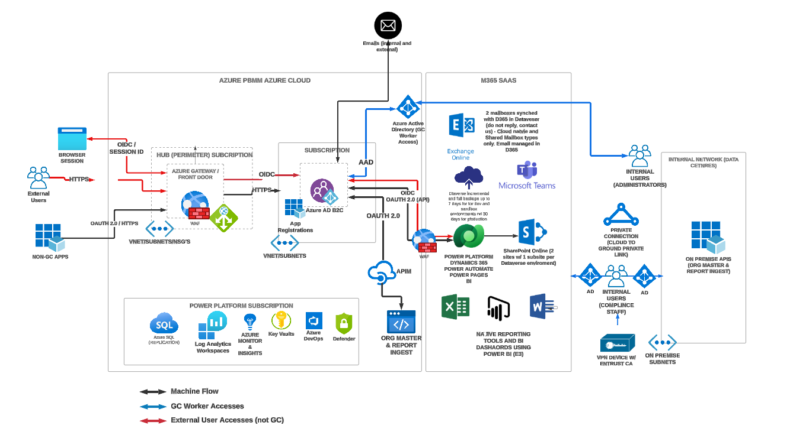

### 2.2 Detailed Architecture Components

This section dives into the specific components of the Power Platform and Azure services, explaining their roles and how they integrate to form a comprehensive solution.

#### Power Platform

The Power Platform security model lets users do the work they need to do with the least amount of friction, while still protecting the data and services. It operates with multiple layers of defense, as shown in the following diagram. This section will describe how each layer is configured in the agency's tenant.

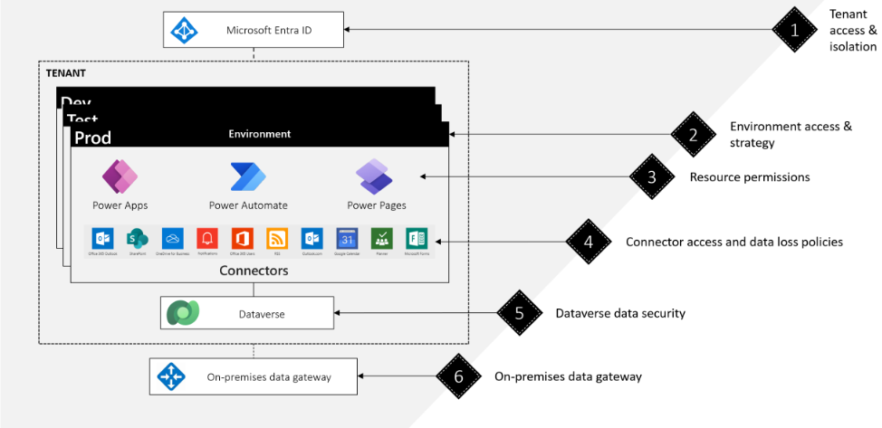

##### **Tenant settings in the Power Platform**

Tenant settings provide administrators with the ability to manage and control various aspects of the Power Platform environment within their organization. These settings are critical for ensuring security, compliance, and efficient management of resources and user access. Here is an overview of what tenant settings typically encompass:

1. **Access and Permissions Management** :

* Control who can create and manage different types of environments (developer, production, trial).
* Assign specific roles and permissions to users and groups, ensuring that only authorized personnel have access to sensitive features and data.

2. **Capacity and Resource Management** :

* Manage and allocate add-on capacities such as storage and processing power to different environments.
* View and control tenant capacity summaries, providing insights into resource usage and availability.

3. **Data and Analytics** :

* Enable or disable tenant-level analytics to monitor usage patterns and performance.
* Configure data sharing settings for AI features, allowing Microsoft to use the data to improve machine learning models and services while ensuring compliance with privacy policies.

4. **Environment and App Insights** :

* Allow collection of insights for canvas apps, helping developers understand how their apps are being used and where improvements can be made.
* Implement environment routing to automatically direct users to appropriate environments based on their roles and needs.

5. **Security and Compliance** :

* Enable features like Customer Lockbox to ensure that any data access by Microsoft support requires explicit approval from the customer, enhancing data security.
* Configure settings for sharing feedback and data with Microsoft, controlling how much information is shared and for what purpose.

5. **User and Support Management** :

* Manage visibility of support requests within the organization, allowing designated users to view and manage support tickets.
* Enable weekly digest emails for Managed Environments, keeping administrators informed about important updates and changes.

###### Configured tenant settings (as of Q2 2024)

| Name                                               | Description                                                                                                                    | Setting detail                                          |
| -------------------------------------------------- | ------------------------------------------------------------------------------------------------------------------------------ | ------------------------------------------------------- |
| Copilot in Power Apps (preview)                    | Enable Copilot preview features for people who make apps.                                                                      | On                                                      |
| Copilot feedback                                   | When using Copilot in Power Apps, allow users to submit feedback to Microsoft.                                                 | Off                                                     |
| Copilot data collection                            | When using Copilot in Power Apps, allow users to share their prompts, questions, and requests with Microsoft.                  | Off                                                     |
| Environment routing (Preview)                      | Guide makers to specific environments based on defined rules.                                                                  | On - All Makers - Environment Group: DEVELOPER-PERSONAL |
| Weekly digest                                      | Manage additional recipients for the weekly digest email for Managed Environments.                                             | Default (sent to all Power Platfrom Administrators))    |
| Canvas app insights                                | Allow people to collect insights for individual canvas apps.                                                                   | On                                                      |
| Developer environment assignments                  | Control who can create and manage developer environments.                                                                      | Only specific admins (Power Platform Administrators)))  |
| Tenant capacity summary view                       | Control who can view the tenant capacity summary.                                                                              | Only tenant admins                                      |
| Tenant licensing summary view                      | Control who can view the tenant licensing summary.                                                                             | Tenant and environment admins                           |
| Auto-claim policies for Power Apps                 | Control where license auto-claim policies for Power Apps should be applied.                                                    | Default (All environments))                             |
| Production environment assignments                 | Control who can create and manage production and sandbox environments.                                                         | Only specific admins                                    |
| Trial environment assignments                      | Control who can create and manage trial environments.                                                                          | Only specific admins                                    |
| Add-on capacity assignments                        | Control who can allocate add-on capacity to an environment.                                                                    | Only specific admins                                    |
| Analytics                                          | Enable tenant level analytics.                                                                                                 | Enabled                                                 |
| Customer Lockbox                                   | Control Microsoft operator access to customer content.                                                                         | Enabled                                                 |
| Publish Copilots with AI features                  | Allow Copilots to publish bots with AI features enabled.                                                                       | Enabled                                                 |
| Desktop flow actions in DLP                        | Show or hide desktop flow action groups in data loss prevention (DLP) policies.                                                | Enabled                                                 |
| AI Builder credits                                 | Control use of unassigned AI Builder credits.                                                                                  | On                                                      |
| Copilot help assistance in Power Automate via Bing | Allow the Copilot-enhanced help feature within Power Automate to enhance answers on product documentation through Bing Search. | Off                                                     |
| Support requests visibility                        | Show support requests to all users in the tenant.                                                                              | Off                                                     |
| Product Feedback                                   | Configure settings for product feedback.                                                                                       | Disabled (all))                                         |

###### Power Platform Application Types & Automation

- **Power Pages**: Power Pages are used to create secure, accessible web portals that integrate with Azure B2C for authentication, ensuring user data protection and compliance with federal accessibility standards.
- **Dataverse**: Dataverse serves as a centralized data storage solution that supports relational data management, advanced security, and integration with other Power Platform components. Additionally, it includes the Dynamics 365 Customer Service app to enhance customer service management.
  - **Dynamics 365 Customer Service App**: This application provides comprehensive customer service capabilities, including case management, client management, and activity tracking. It integrates seamlessly with Dataverse to offer a robust CRM system.
    - **Case Management**: Allows tracking and managing of customer service cases from creation to resolution. It supports automation of case routing and escalation to ensure timely resolution.
    - **Client Management**: Manages information about organizations and contacts, providing a 360-degree view of the client. This feature helps in maintaining detailed records of all interactions and client-related information.
    - **Activities**: Includes emails, tasks, and other activities that are tracked and managed within the system. This ensures all communications and actions related to a client or case are logged and accessible.
    - **Service Hub and Workspace**: Provides a centralized interface for customer service representatives to access all necessary tools and information. The Service Hub offers features like knowledge base integration, service level agreements (SLAs), and performance metrics to enhance service delivery.
- **Power Automate**: Power Automate enables the automation of repetitive tasks and workflows, improving operational efficiency by integrating various services and applications.
- **Power Apps**: Power Apps provide a low-code platform for developing custom applications tailored to the agency's specific requirements, enhancing user experience and productivity.

#### Azure Services

- **Azure B2C**: Azure B2C manages user identities and provides secure, scalable authentication for Power Pages, ensuring that user access is controlled and compliant with security policies.
- **Azure Blob Storage**: Azure Blob Storage is used to store large files and media, integrated with Power Platform to ensure efficient data handling and accessibility.
- **REST API**: The REST API extends Power Platform functionalities, allowing for custom integrations and interaction with external systems within the same Azure tenant.

### 2.3 Integration Points

Integration points between Power Platform components and Azure services ensure seamless data flow and interoperability. For example, data from Dataverse is accessible in Power Pages, workflows in Power Automate can trigger actions in Power Apps, and Azure B2C handles user authentication for all components. By default, the Power Platform integrates (or has settings to integrate with) other applications with the M365 ecosystem and third party API's. Furthermore, by default cross tenant isolation is turned off.  This means that entra ID guest users and or connections from other Azure tenants (entra ID) is possible (user flow) provided a user is added as a guest frist in entra ID, provided the necessary group(s) to access a dataverse environment or the Power Platfrorm tooling. This setting is turned "on" for the agency. For projects that are on boarded that require connectivity (inbound and or outbound) from other Azure tenants must provide evidence that the security group has approved this flow and once granted a whitelist rule item is created for that project environment(s).

**Diagram visualizing the tenant isolation feature (setting on without allowlist rules)**

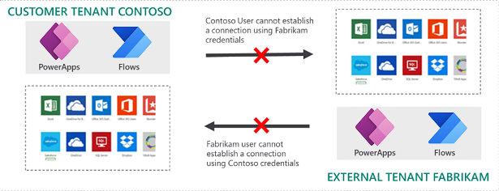

**Diagram visualizing the tenant isolation feature (setting on with outbound allowlist rule) - example**

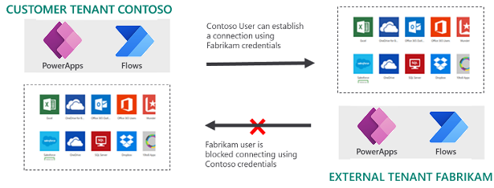

**Power Platform admin centre setting**

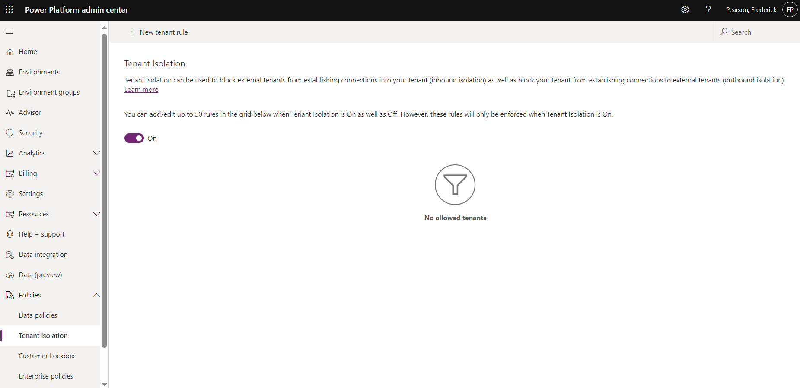

## 3. Security

This section covers the security measures and configurations implemented to protect the Power Platform environment. It includes identity and access management, data security, and compliance with governance standards.

### 3.1 Identity and Access Management

#### Entra ID Integration

Entra ID integrates with the Power Platform to manage user identities, roles, and groups, providing secure access control across all components. This integration ensures that only authorized users can access specific resources and perform actions based on their roles.

### 3.2 Data Security

#### Data Security in D365 CRM

D365 CRM employs role-based access control, field-level security, and encryption to protect data. Security roles define user access to different entities, while field-level security restricts access to sensitive data fields, ensuring comprehensive data protection.

#### Data Security in Power Pages

Power Pages use table and column permissions to secure data, ensuring that users only access data they are authorized to see. Web API security is enforced through authentication and authorization mechanisms, providing an additional layer of protection.

### 3.3 Compliance and Governance

Power Platform meets federal compliance requirements by implementing robust security and governance measures. These include data encryption, regular audits, and adherence to regulatory standards, ensuring that all data and processes are secure and compliant.

### 3.4 Enterprise Security with Power Platform

This section elaborates on the enterprise security features of Power Platform.

#### Cybersecurity Landscape

Power Platform's built-in security capabilities address the sophisticated cybersecurity challenges faced by organizations today.

#### Microsoft Security Foundation

Power Platform builds on Microsoft's comprehensive security foundation, leveraging products like Microsoft Defender, Microsoft Sentinel, Microsoft Entra, Microsoft Purview, Microsoft Priva, and Microsoft Intune to protect data and infrastructure.

#### Zero Trust Strategy

Power Platform supports a Zero Trust strategy, which includes verifying identities explicitly, using least privilege access, and assuming breach to minimize the impact of security incidents.

#### Security Development Lifecycle (SDL)

SDL in Power Platform involves phases such as requirements, design, implementation, verification, and release, supported by training and response activities to ensure secure application development.

#### At-rest data protection / encryption

Dataverse is using the latest TLS 1.2 cipher suites as approved by Microsoft Crypto Board

Power Platfrom uses heterogenous storage (Dataverse) to store the data. The data is distributed across different storage types:

* Azure SQL Database for relational data
* Azure Blob storage for binary data, such as images and documents
* Azure Search for search indexing
* Microsoft 365 Activity Log and Azure Cosmos DB for audit data
* Azure Data Lake for analytics

Dataverse databases are using SQL TDE (Transparent Data Encryption, compliant with FIPS 140-2) to provide real-time I/O encryption and decryption of the data and log files for data encryption at-rest. Azure Storage Encryption is used for data at rest stored in the Azure Blob Storage. These are encrypted and decrypted transparently using 256-bit AES encryption compliant with FIPS 140-2.

By default, Microsoft stores and manages the database encryption key for your environments using a Microsoft-managed key. ~~However, Power Platform provides a customer-managed encryption key (CMK) for added data protection control, where you can self-manage the database encryption key. The encryption key resides in your own Azure key vault, which allows you to rotate or swap the encryption key on demand. It also allows you to prevent Microsoft's access to your customer data when you revoke the key access to our services at any time.~~

~~Administrators can provide their own encryption key using their own key generator hardware (HSM) or use Azure Key Vault to generate an encryption key. The key management feature takes the complexity out of encryption key management by using Azure Key Vault to securely store encryption keys. Azure Key Vault helps safeguard cryptographic keys and secrets used by cloud applications and services. Encryption keys must meet the following Azure Key Vault requirements:~~

* ~~2048-bit RSA~~
* [~~HSM BYOK~~](https://learn.microsoft.com/en-us/azure/key-vault/keys/hsm-protected-keys)

~~Administrators also can revert the encryption key back to a Microsoft managed key at any time. (N/A until next release)~~

The diagram below illustrates the technologies used to manage keys in the Platform (and related services in Azure).  The first column illustrates the scenario where Microsoft manages the encryption and the second column demonstrates the scenario where the agency would manage their keys, in that scenario the agency would fully manage their keys (key management), which is shown in orange, and the blue boxes represent the MS policy (e.g. must use Azure Key  Vault with or without HSM, and the enforcement of the encryption method).

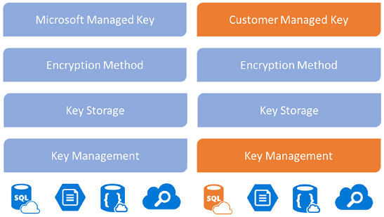

#### In-transit data protection

Azure uses industry standard transport protocols such as TLS between user devices and Microsoft data centers, and within data centers themselves. To protect your data even more, internal communication between Microsoft services is using Microsoft backbone network and therefore is not exposed to the public internet.

Microsoft uses multiple encryption methods, protocols, and algorithms across its products and services to help provide a secure path for data to travel through the infrastructure, and to help protect the confidentiality of data that is stored within the infrastructure. Microsoft uses some of the strongest, most secure encryption protocols in the industry to provide a barrier against unauthorized access to your data. Proper key management is an essential element in encryption best practices, and Microsoft helps ensure that encryption keys are properly secured.

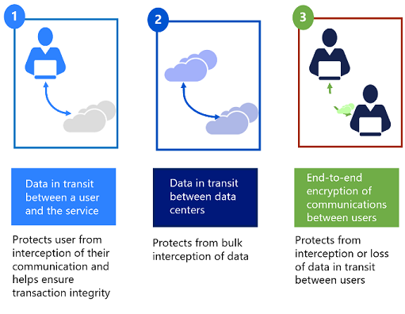

Protocols and technologies examples include:

* Transport Layer Security/Secure Sockets Layer (TLS/SSL), which uses symmetric cryptography based on a shared secret to encrypt communications as they travel over the network.
* Internet Protocol Security (IPsec), an industry-standard set of protocols used to provide authentication, integrity, and confidentiality of data at the IP packet level as it’s transferred across the network.
* Advanced Encryption Standard (AES)-256, the National Institute of Standards and Technology (NIST) specification for a symmetric key data encryption that was adopted by the US government to replace Data Encryption Standard (DES) and RSA 2048 public key encryption technology.

## 4. Integrations

This section describes the various integrations between Power Platform components and external services. It explains how these integrations enhance functionality and ensure seamless data flow.

### 4.1 Power Pages and Azure B2C

Power Pages integrate with Azure B2C to provide secure user authentication. Azure B2C handles user registration, login, and password management, ensuring that user identities are managed securely and efficiently.

The agency has two Azure B2C tenants for non production and production SSO services. Every Power Pages site that requires authentication will be required to integrate with B2C. Project owners will be required to submit a request to the service desk to obtain the following B2C parameters to integrate their site with the SSO service:

REQUEST:

* B2C {environment}*
* Redirect URL: Power Pages URL/signin_oidc
* Logout endpoint: {Power Pages URL}/Account/Login/LogOff

RESPONSE (from service desk - encrypted)

* Metadata address
* Client ID
* Tenant ID
* Client secret
* External logout endpoint
* Claim names
* Issuer

Once the Power Pages configurator configures these values in the Power Pages identity providers of type "OIDC" they need to disable every other OOB IDP that are enabled and set the new OIDC proivider as "Default".

### 4.2 Dataverse and Power Pages

Dataverse integrates with Power Pages to provide a seamless data management experience. Data stored in Dataverse is accessible through Power Pages, enabling dynamic content display and data-driven applications.

This is an OOB feature of the Power Platform, thus by deploying a Power Pages site (app), the site has automatic integration to the Dataverse environment that houses the site therefore no custom code required to integrate with an enviornment reducing human error and potential security issues (that need to be monitored for) assoicated with custom integrations as the Power Pages site uses a zero trust service principle (system to system) in Azure Entra ID (behind the scenes).

### 4.3 SharePoint Online Integration

SharePoint Online integrates with Power Platform to manage documents and synchronize data. This integration allows users to store, share, and collaborate on documents within Power Apps and Power Pages, enhancing productivity and collaboration.

This is an OOB feature of the Power Platform, thus by setting the SharePoint Online Server Side Sync, the Dataverse enviornment has automatic integration to the SharePoint Site/Subsite configured to store its atachments therefore no custom code required to integrate with an enviornment reducing human error and potential security issues (that need to be monitored for) associated with custom integrations as the integration uses a zero trust service principle (system to system) in Azure Entra ID (behind the scenes). Similarly, to extend the integration to a Dataverse's Power Pages site, the SharePoint integration can be toggled in the Power Pages site management console by a Global or Tenant administration (which updates the Power Pages site service principle to include delegation to SharePoint).

Implementations must provide the SharePoint URL, table of tables integrated with SharePoint, and wether the feature is extended to a site in their environment specificactions. Best practice dictates that the integrated SharePoint Site for non production (or Sandbox) environments include 1 or more subsites to integrate to all the enviornments in a project's ALM. A seperate SharePoint site must be created for Production implementations with a single subsite.

### 4.4 Azure Blob Storage Integration

Azure Blob Storage integration enables Power Platform to handle large files and media efficiently. Data stored in Blob Storage is accessible through Power Apps, Power Automate, and Power Pages, ensuring seamless data handling and retrieval.

Azure Blob Storage is used for web files (optional) if a project decides to not to leverage the OOB file attachment feature that ships with Power Pages web files. By leveraging Blob storage for web files (e.g. css/js/images etc.) for a Power Pages site, the agency benefits from reusable / centralized assets for theming, therefore streamlining enterprise theme upgrades across multiple sites by virtual of updating the integrated storage account.

Projects that require storage integration for a Power Pages site must send a request to the service to receive a connection string (encrypted) and read only accesss to the storage account to obtain the web file asset URL's to configure within the web file record blob record URL field.

### 4.5 Email Sync and Integration

Email integration with Power Platform allows for synchronized communication and data exchange. Power Automate workflows can trigger email notifications, while Power Apps can read and send emails, ensuring seamless integration with email systems.

This feature must be activated by a Global Admin or an Exchange admin in each Dataverse environment that requires email integration. Once the setting to allow the project team to configure mailboxes, project configurations that only require a Shared Mailbox for inbound and outbund mail must send a request to the Service Desk to create  a non production mailbox to non production environments. Production mailboxes should never be integrated with non production Dataverse enviornments for testing. Delegated permissions to Dynamics 365 must be configured in the mailbox record for Shared Mailboxes.

### 4.6 REST API Integration

REST APIs extend the capabilities of the Power Platform by enabling custom integrations with external systems. APIs allow for data exchange, triggering workflows, and extending functionality beyond the built-in features of Power Platform.

Projects that require integration to the agency's API's must create an API project in the "experience layer" hosted in Azure which in turn integrates with a backend API in Azure (such as the Organization API). To deploy an API to the integration layer project configurators must communicate with the API team to obtain an API stub project and integrate the GIT project within its DevOps repository. When ready to deploy, collaboration is required to validate connectivity to production.

## 5. SSL Configuration and Custom Domain for Power Pages

This section explains how to configure SSL and custom domains for Power Pages, ensuring secure communication and personalized access.

### 5.1 SSL Configuration

SSL configuration for Power Pages ensures secure communication between users and the web portal. By enabling SSL, all data transmitted between the user and the server is encrypted, protecting it from unauthorized access. TLS certificates must be generated by Entrust CA so a request must be sent to the service desk with a CSR. Once the bundle is recieved, it must be stored in Azure KeyVaults for secure storage. A CSR must be sent for renewals from the same operating system (or web server) where the CSR was generated and bundle certificates installed. Projects must provide the web server and KeyVault URL for the TLS certificate artifacts (CSR/Bundle).

### 5.2 Custom Domain Configuration

Custom domain configuration allows Power Pages to be accessed through a personalized URL, enhancing the branding and accessibility of the web portal. This involves DNS settings and domain verification processes.

Projects must send a request to the service desk to register a CNAME DNS entry, for example:

CNAME request:

{portalurl}.powerappsportals.com -> {subdomain}.canada.ca (or {subdomain}.the agency-canafe.gc.ca)

## 6. Licensing

This section provides an overview of the licensing options for Power Pages and Dataverse, ensuring that the implementation is cost-effective and scalable.

### 6.1 Power Pages Licensing

Power Pages licensing includes options for different subscription levels, providing flexibility based on the agency's needs. Licensing covers user access, storage, and additional features, ensuring that the implementation is cost-effective and scalable.

### 6.2 Dataverse Licensing

Dataverse licensing, particularly in the context of D365 Customer Service, includes various tiers based on data volume and user access. This ensures that the agency can choose a licensing model that meets its data management and budgetary requirements.

## 7. Backup Process and Strategy

This section outlines the backup and disaster recovery strategies to ensure data protection and business continuity.

### 7.1 Data Backup

The data backup strategy for Power Platform involves regular backups, retention policies, and the use of Azure Backup services. This ensures that data is protected against loss and can be restored in case of failure.

### 7.2 Disaster Recovery

The disaster recovery plan includes Recovery Point Objectives (RPO) and Recovery Time Objectives (RTO) to minimize downtime and data loss. Regular testing of the disaster recovery plan ensures readiness in case of an actual disaster.

The Power Platform will provide backup for up to 30 days for production and 7 days for non production dataverse environments (full). These backup snapshots are automatically created every 30 minutes and therefore in the event of disaster or data recovery, the maximum lenght of potential data loss is 30 minutes. This is the default for environments, however projects can request longer durations by sending a request to the service desk and since all enviornments are managed the setting can be set higher for Sandbox environments (up to 30 days). For projects that require a longer period for production (e.g. more than 30 days), a snapshot can be restored in a retention dataverse enviornment every 30 days, thereby extending the period to 60 days (the process can be repeated for longer periods).  Backup enviornments must also live within the same environment group as the source enviornments for a project (for both sandbox and production) if applicable.

## ~~8. Data at Rest using Customer Managed Keys (CMK) for Dataverse (n/a as of May 2024)~~

~~This section explains the use of Customer Managed Keys (CMK) for encrypting data at~~

 ~~rest in Dataverse, enhancing data security and control.~~

### ~~8.1 Overview of CMK~~

~~Customer Managed Keys (CMK) provide enhanced data security by allowing the agency to manage its own encryption keys. This ensures that data at rest in Dataverse is protected and that the agency retains control over key management.~~

### ~~8.2 CMK Configuration~~

~~Configuring CMK involves setting up key vaults in Azure, assigning encryption keys to Dataverse, and managing key rotation policies. This ensures that data encryption is robust and compliant with security standards.~~

## 9. User Security & Access

This section details the security measures and access controls for both internal and external users, ensuring secure access to the Power Platform components.

### 9.1 Internal Users

#### Entra ID Integration

Entra ID integrates with the Power Platform to manage internal user identities, roles, and groups. This integration ensures that only authorized users can access specific resources and perform actions based on their roles.

#### Tenant administrators

To administer the Power Platform, a group has been created called PIM - Digital Office which is comprised of the Power Platfrom Administrator, Application Administrator, and Dynamics 365 Administrator azure roles. Users who belong to this "elgible group (PIM)" must manually elevate their priviledges by using Azure entra Priviledged Identity Management (PIM) and provide a description of what they plan on working on within the timeframe (from 0.5 to 8 hours max) for which the assignment is Active. These users are considered "Tenant Administrators" and they have the ability to update tenant level settings, provision and maintain Dataverse environments, deploy Power Pages sites, update DLP policies, send support requests and provide the vendor (Microsoft) with the permission to provide support, install Microsoft app updates, create and restore backups, administer security groups by environment, convert environments to managed environments and configre the managed environment features / guardrails such as preventing CRM solution imports that do not meet the baseline guardrails applied to all managed environments.  Tenant administrators should be using a cloud administrator user account rather than their primary the agency entra ID to perform administration in the platform. Finally, tenant administors have the ability to view more detailed logs and analytics generated by the Power Platform tenant, configure IP restrictions and Entra ID entry point to any Power Pages environment.  The table below describes the 3 security roles that are assigned as eligible assignments to tenant administrators.

|                                                                                        | Microsoft 365 | Power Platform | Dynamics 365 |
| -------------------------------------------------------------------------------------- | ------------- | -------------- | ------------ |
| **POWER PLATFORM**                                                               |               |                |              |
| Environments                                                                           |               |                |              |
| Full access^1                                                                          | Yes           | Yes            | Yes^2        |
| Create                                                                                 | Yes           | Yes            | Yes^2        |
| Delete                                                                                 | Yes           | Yes            | Yes^2        |
| Backup and restore                                                                     | Yes           | Yes            | Yes^2        |
| Copy                                                                                   | Yes           | Yes            | Yes^2        |
| Ability to exclude access from selected environments (using security groups)           | No            | No             | Yes          |
| **Analytics**                                                                    |               |                |              |
| Capacity                                                                               | Yes           | Yes            | Yes^2        |
| Capacity allocation (Power Apps per app plans, Power Automate, AI Builder, and Portal) | Yes           | Yes            | Yes^2        |
| Microsoft Dataverse                                                                    | Yes           | Yes            | Yes^2        |
| Power Automate                                                                         | Yes           | Yes            | Yes^2        |
| Power Apps                                                                             | Yes           | Yes            | Yes^2        |
| **Help + support**                                                               |               |                |              |
| Create and access support requests                                                     | Yes           | Yes            | Yes^2        |
| **Data integration**                                                             |               |                |              |
| Create new project and connection set                                                  | Yes           | Yes            | Yes^2        |
| **Data gateways**                                                                |               |                |              |
| View gateways                                                                          | Yes           | Yes            | Yes^2        |
| **Data policies**                                                                |               |                |              |
| View and manage tenant policies                                                        | Yes           | Yes            | Yes          |
| View and manage environment policies                                                   | Yes           | Yes            | Yes          |
|                                                                                        |               |                |              |
| **POWER BI**                                                                     |               |                |              |
| Manage the Power BI tenant                                                             | Yes           | Yes            | No           |
| Acquire and assign Power BI licenses                                                   | Yes           | No             | No           |
|                                                                                        |               |                |              |
| **MICROSOFT 365**                                                                |               |                |              |
| Create users                                                                           | Yes           | No             | No           |
| Add security roles                                                                     | Yes           | No             | No           |
| Add licenses                                                                           | Yes           | No             | No           |

^1 Equivalent permission level to a System Administrator after [self-elevation](https://learn.microsoft.com/en-us/power-platform/admin/manage-high-privileged-admin-roles#self-elevate-to-the-system-administrator-role). Has full permission to customize or administer the environment, including creating, modifying, and assigning security roles. Can view all data in the environment - if the user has a suitable license.

^2 If no security group is assigned to the environment, or if a security group is assigned and the user with this role is added to it.

The tenant administrators belong to the following group: **PIM - Digital Office**

The settings are acessible in the tenant settings:

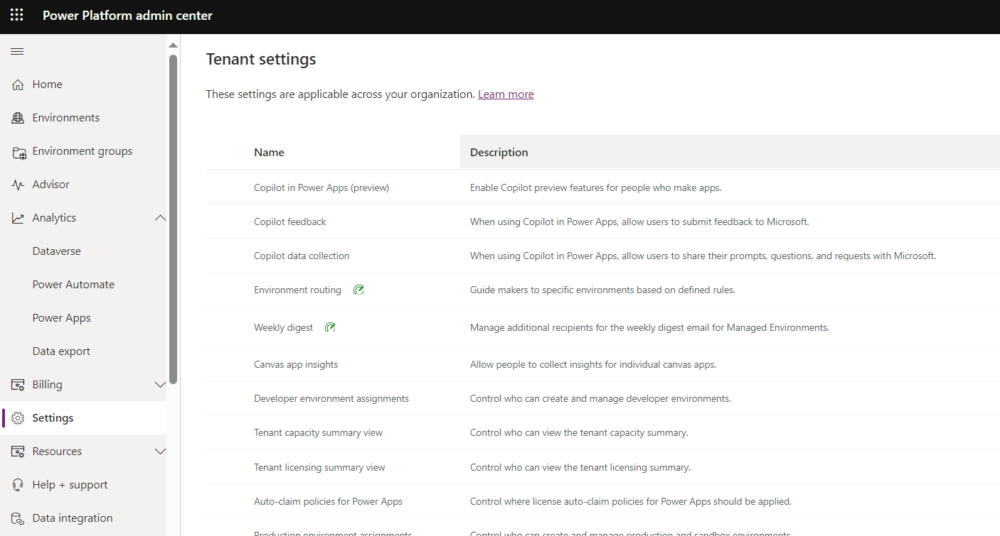

#### Global Admin & Exchange Admin (email sync)

Dataverse environments include an out of the box setting to integrate email mailboxes within it for inbound and or outboud email integration (synchornization). This allows users and the system to automatically generate email records in the CRM (dataverse environment) to allow for automation such as the auto creation of case records and tracking contact / organization communication in the system to provide a single window of interactions with clients. In order to activate this, a Global Adminstrator or Exchange Administrator must approve the mailbox being integrated in the implementation. This is applicable to production environments at the minimum, however non production environments can allow application layer system administrators to synchronize a mailbox for which they have delegation to in Exchange. By default this is off for all Power Pages site, and a project owner must submit a ticket to activate this feature in their Dataverse environments.

#### Global Admin (Power Pages SharePoint integration)

Dataverse envrionments include an "out of the box" feature to integrate a SharePoint site so that the CRM interface provides users with the ability to attach documents which in turn automatically get stored in the integrated SharePoint site. If this feature is extended to allowing a Power Pages site that is installed in the same Dataverse environment, a Global Administrator must activate the feature in the Power Pages admin console. By activating the feature, the Power Pages managed identity in Azure is amended to allow for delegation priviledges (CRUD) to SharePoint document records in the integration SharePoint site. By default this is off for all Power Pages site, and a project owner must submit a ticket to activate this feature in their Dataverse environments.

#### CRM Security Features

- **Security Roles**: Define user access to various entities and functionalities in D365 CRM. Roles are configured to ensure that users can only access data and perform actions necessary for their job functions.
- **Column Permissions**: Restrict access to specific data fields within entities. This ensures that sensitive information is only accessible to authorized users.
- **Teams and Entra ID Group Integration**: Integration with Entra ID groups and the use of teams in CRM allows for efficient management of user permissions and collaboration.

Projects must provide the list of security roles they are leveraging for their implementation (and settings) and demonstrate the use of Entra ID group integration.

#### System Users (App Users)

In every Dataverse enviornment that is provisioned a series of "App Users" have machine to machine access to the Dataverse environment. These OOB app users are administered and only accessed by Microsoft services to keep the environment features up to date and issue bug fixes. These app users are leveraged the managed identity feature in Entra ID thus applying zero trust principles. These service principles are of type "System-assigned" and only have access to the resource (in this case a dataverse enviornment), and by design only that environment can use this identity to request tokens from Microsoft Entra ID and is configured to have access to the MS SAAS updates. If a Dataverse environment is purged, Azure automatically deletes the service principle.

In addition to system-assigned managed identities to govern updates, each Dataverse environment is assigned a user-assigned managed identity (app registration). This identity has delegated permissions to impersonate a service account in a Dataverse environment thus allowing the abiliy to integrate to the CRM API (ODATA endpoint) for ALM, CLI access and AJAX requests.

The table below describes the primary differences between system-assigned identities (used by MS) and user assigned identities (for implementations)

| Property                       | System-assigned managed identity                                                                                                                                                  | User-assigned managed identity                                                                                                                                                                                                                                                                                                                                                     |
| ------------------------------ | --------------------------------------------------------------------------------------------------------------------------------------------------------------------------------- | ---------------------------------------------------------------------------------------------------------------------------------------------------------------------------------------------------------------------------------------------------------------------------------------------------------------------------------------------------------------------------------- |
| Creation                       | Created as part of an Azure resource (for example, Azure Virtual Machines or Azure App Service).                                                                                  | Created as a stand-alone Azure resource.                                                                                                                                                                                                                                                                                                                                           |
| Life cycle                     | Shared life cycle with the Azure resource that the managed identity is created with.` ` When the parent resource is deleted, the managed identity is deleted as well.        | Independent life cycle.` ` Must be explicitly deleted.                                                                                                                                                                                                                                                                                                                        |
| Sharing across Azure resources | Can’t be shared.` ` It can only be associated with a single Azure resource.                                                                                                 | Can be shared.` ` The same user-assigned managed identity can be associated with more than one Azure resource.                                                                                                                                                                                                                                                                |
| Common use cases               | Workloads contained within a single Azure resource.` ` Workloads needing independent identities. ` ` For example, an application that runs on a single virtual machine. | Workloads that run on multiple resources and can share a single identity.` ` Workloads needing pre-authorization to a secure resource, as part of a provisioning flow. ` ` Workloads where resources are recycled frequently, but permissions should stay consistent. ` ` For example, a workload where multiple virtual machines need to access the same resource. |

Projects are provided a user assigned identity via App Registrations provided by the tenant administrator via a service request. At the minimum a project must use 2 app registrations, one for non production environments and one for production. When the app registration is created the project configurator(s) can be set as owner to enable the ability to rollover secrets when they lapse.  Secrets can be active for up to 24 months before renewal. Secret renewals are governed by the Tenant Administrators and Owners of the app registrations.

### Dataverse Application Layer Adminstrators and User Groups

Each project must be provided with a System Administrator (configurators and developers), UAT and business user group in Entra ID. These groups need to be integrated with Teams in the Dataverse environment to protect against mistakes in access control governance. When a new project is created an a series of environments created, the tenant adminstrator must request for a minimum of these three groups for the project.  The tenant administrator will then set the enviornment group for each environment. Additonal groups for additonal teams can be requested by the project by sending a service request. Each project must provide the list of groups as part of its environment specifications chapter in their build book.

### 9.2 External Users (Power Pages sites)

#### Power Pages User Security Features

- **Table Permissions**: Control access to entire tables of data in Power Pages, ensuring that users only see the data relevant to their role.
  - Every implementation must explicitly expose a Power Pages ability to access CRUD operations to a backend table using the authenticated user role (at the minimum). Anonymous table permissions to integrated tables between Power Pages and Dataverse tables must only be applied to custom tables that are not related to system tables (OOB) and operational tables for the backend user to administer records. The later types, if and when exposed to allow for portal CRUD operations must be restricted to authenticated users. Moreover, implementations must demonstrate the hierachy of table permissions to roll up to the portal user (contact record) and or the users' parent account (organization). This protects the user data from being accessed by other authenticated users who do not belong to the organization / contact association.
- **Column Permissions**: Provide fine-grained access control to individual data fields in Power Pages. This ensures that sensitive information is protected. This feature is required for guarding against field level access to a particlar table in the dataverse (from Power Pages). In most scenarios, implementions should stick to a data architecture that warrants the use of "table permissions". This means that if there are columns in a table being exposed to the portal that should only be accessible to a particular web role(s), a new table should be created instead.
- **Web API Security**: Enforces authentication and authorization mechanisms to control access to data and operations through the API. All implementations must explicitely set not only which tables can be accessed via the client side web api (AJAX) but also which columns. This protects against unwanted updates to table columns that should not be updated via JavaScript. Furthermore, the web api should never be exposed to anonymous pages with the exception of READ (GET) and limited to tables that do not hold Protected Data (A and B).

The above is governed by the managed environment's setting to restrict portal deployments that dont respect the above rules. In a rare circumstance that any of these rules require an exemption for an implementation, a ticket must be sent providing the reason for the exemption and approval by the project sponsor or director.

Projects must provide a table of each of these artifacts as part of their documentation.  Table permissions are mandatory in every Power Pages site the other two types are only mandatory to provide if the web api feature is on.

## 10. Power Pages Perimeter Security

This section describes the security measures implemented in Power Pages to protect data and ensure secure operations.

### 10.1 IP Restrictions

IP restrictions in Power Pages allow limiting access to the application based on IP addresses. This feature helps ensure that only users from specified IP ranges (e.g., internal network) can access the development and staging environments, while the production site remains publicly accessible. The IP restrictions applied to all non production environments is the IPV6 address for the **gcsra-ott.the agency.gc.ca** network.

### 10.2 Entra ID (site privatization, and public sites)

By default all Power Pages sites are set to "private".  This means that to access the site the user must be an administrator or added to the list of users who are allowed to access the site within the context of the agency's entra ID domain. This is applicable to all "non production" sites as for production sites, these will be set as "public" thus will be available on the internet for external users to interact with it. The privatizaton feature is a guardrail on top of the IP restrictions to further restrict who within the agency can access a site (e.g a dev team, qa, etc.).

### 10.3 TLS and CNAME (N/A May 2024)

### 10.4 HTTPS Headers

The cross-origin resource sharing (CORS) protocol consists of a set of headers that indicates whether a response can be shared with another domain. By default CORS is not allowed in a Power Pages site and if ever requried a ticket must be created and the Project sponsor or Director must approve the request at which point the configurator can set the HTTP header (CORS) site setting but only once the exception from the portal and solution checker is applied to the environment via its managed settings.

### 10.5 Security workspace & scan

Power Pages security scan is meant to enhance site resilience by identifying and addressing vulnerabilities, safeguarding it against potential threats and ensuring a secure online environment for user.  The scan is automated as part of deployments iva the security workspace and must include both anonymous and authenticated pages. When a review is completed, the administrator receives an email with a summary report and description of each alert. This report is also stored as an artifact in Azure DevOps as part of deployments for the build team to have visibility on potentation configuration changes required when applicable. As of this writting, the report is only available in English.

The Security workspace further protects the site content and data from security threats, and is accessible directly from Power Pages design studio. This advanced series of settings must be configured for the creation of HTTP headers of all sites which include Content Security Policy (CSP), Cross Origin Resource Sharing (CORS), cookies, permissions, and other custom cookies. The table below provide the settings available and configured for each site deployed. These settings are scanned for each release for security governance.

#### 10.5.1 Configure Content Security Policy (CSP)

Content Security Policy, or CSP, is used by web servers to enforce a set of security rules for a web page. It helps protect sites from various types of security attacks like cross-site scripting (XSS), data injection, and other code injection attack.

**Directives**

| Directive      | Description                                                                                        |
| -------------- | -------------------------------------------------------------------------------------------------- |
| Default source | Specifies the default source for content not explicitly defined by other directives.               |
| Image source   | Specifies valid sources for images. Controls the domains from which images can be loaded.          |
| Font source    | Specifies valid sources for fonts. Used to control the domains from which web fonts can be loaded. |
| ...            | ...                                                                                                |

For each directive, you can either choose specific URL, all domains, or none.

The following directives are set: script-src * 'unsafe-inline' 'unsafe-eval'; worker-src 'self' blob:; style-src * 'unsafe-inline'; font-src * data:; frame-ancestors 'self' https://*.powerapps.com;

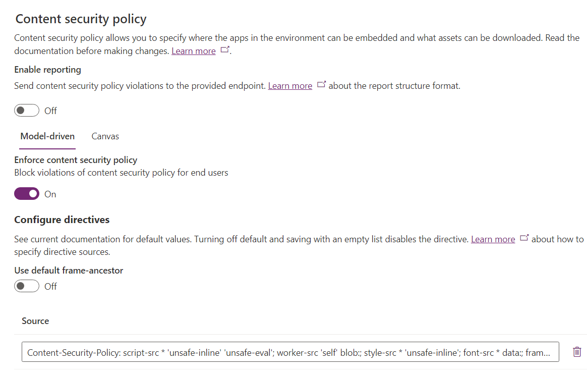

#### 10.5.2 Configure Cross-Origin Resource Sharing (CORS)

Cross-Origin Resource Sharing, or CORS, is used by web browsers to allow or restrict web applications that run in one domain to request and access resources from another domain.

**Directives**

| Directive                                 | Description                                                                                                                                                         | Value(s)                                                                                           |
| ----------------------------------------- | ------------------------------------------------------------------------------------------------------------------------------------------------------------------- | -------------------------------------------------------------------------------------------------- |
| Allow accessing resources from the server | Also known as Access-Control-Allow-Origin, helps the server decide which origins are allowed to access its resources. Origins can be domains, protocols, and ports. | Choose domain URLs                                                                                 |
| Send headers during server requests       | Also known as Access-Control-Allow-Headers, helps define the headers that can be sent in requests from a different origin to access resources on the server.        | Choose specific headers with following permissions: Origin, Accept, Authorization, Content – type |
| ...                                       | ...                                                                                                                                                                 | ...                                                                                                |

#### 10.5.3 Configure Cookies (CSP)

The Cookie header in an HTTP request contains information about cookies previously stored by a website in your browser. When you visit a website, your browser sends a Cookie header containing all relevant cookies associated with that site back to the server.

**Directives**

| Directive                           | Description                                                                                                                                                                              | Header                                                           |
| ----------------------------------- | ---------------------------------------------------------------------------------------------------------------------------------------------------------------------------------------- | ---------------------------------------------------------------- |
| Transfer rules for all cookies      | Control how cookies are sent with cross-origin requests. It's a security feature aimed at mitigating certain types of cross-site request forgery (CSRF) and information leakage attacks. | This setting corresponds to the header SameSite/Default.         |
| Transfer rules for specific cookies | Control how cookies are sent with cross-origin requests. It's a security feature aimed at mitigating certain types of cross-site request forgery (CSRF) and information leakage attacks. | This setting corresponds to the header SameSite/Specific cookie. |

#### 10.5.4 Configure Permissions-Policy (CSP)

Permissions-Policy header allows web developers to control which web platform features are allowed or denied on a web page.

**Directives**

- Accelerometer
- Ambient-Light-Sensor
- ...

#### 10.5.5 Configure more HTTP Headers

**Allow secure connection over HTTPS**

The setting corresponding to the HTTP Strict-Transport-Security header informs the browser that it should only connect to the website over HTTPS, even if the user enters "http://" in the address bar. It helps prevent man-in-the-middle attacks by ensuring that all communication with the server is encrypted and protect against certain types of attacks, such as protocol downgrade attacks and cookie hijacking.
**Note**
For security reasons, this setting can't be modified.

**Include referrer information in HTTP headers**

The Referrer-Policy HTTP header is used to control how much information about the origin of the request (referrer information) is disclosed in the HTTP headers when a user navigates from one page to another. This header helps control privacy and security aspects related to referrer information.

| Value                      | Description                                                                                                                                                      |
| -------------------------- | ---------------------------------------------------------------------------------------------------------------------------------------------------------------- |
| No referrer                | No-referrer means that no referrer information is sent in the headers. This setting is the most privacy-conscious option.                                        |
| No Referrer When Downgrade | It sends the full referrer information when navigating from an HTTPS to an HTTP site but only the origin (no path or query) when navigating between HTTPS sites. |
| ...                        | ...                                                                                                                                                              |

## 11. Power Platform Environment Management

This section details the management of Power Platform environments, including descriptions of each environment and their configurations. Managed environments ensure that all critical issues are addressed, and Data Loss Prevention (DLP) policies are enforced.

### 11.1 Environment Overview

Environments are containers where you can store and control Power Platform resources, such as apps, automations, and connections. They help protect resources and data from unauthorized access and are tied to a geographic location, which can help comply with data location requirements. Each environment can have only one Dataverse database. Environments help apply detailed security controls, such as complex business application security models.

### 11.2 Environment Types

Different types of environments can be created to manage Power Platform resources according to security, compliance, governance, and user needs:

- **default**: All new users can create resources in this environment. This environment is not being used.
- **Developer**: Personal environments only for the owner’s use. Used by developers.
- **sandbox**:  Sandbox environments are used in this implementation for non production environments.
- **production**: Linked t implementation for production.

### 11.3 Environment Management

Steps to manage environments include:

- Assigning admins to Power Platform and Dynamics 365 roles.
- Restricting creation of new environments.
- Establishing a process for users to request new environments.
- Using security groups to protect environments.
- Establishing DLP policies at both the tenant and environment level.
- Minimizing the use of the default environment by using environment routing.
- Using environment groups and rules to apply settings to many environments at once.

### 11.4 Environment Groups

When you activate Power Platform in your organization, you can create different environments for different purposes. You might want to group some environments together and apply the same rules to them. Environment groups allow you to place environments into logical groups and apply a common set of rules. This feature helps maintain consistency and security for environments.

Environment Group Table

| Group            | Type       | Environments               |
| ---------------- | ---------- | -------------------------- |
| FTPC-Supervision | Production | ftpc,...                   |
| FTNC-Supervision | Sandbox    | ftnc-{dev/qa/pp etc.}, ... |

Published rules (applies to both non production and production groups)

| Rule                                          | Published setting                                                                         |
| --------------------------------------------- | ----------------------------------------------------------------------------------------- |
| Sharing controls for Canvas apps              | Limit to 20 (outside security group)                                                      |
| Usage insights                                | On                                                                                        |
| Maker welcome content                         | Off (tbd)                                                                                 |
| Solution checker enforcement*                 | On (block all critical & send emails to tenant administrators when a solution is blocked) |
| Backup retention (preview)                    | 28 days                                                                                   |
| Enable AI-generated descriptions & features** | On                                                                                        |

****Solution checker enforced rules:***

Duplicate plugins, async pattern for web resources, avoid CRM SOAP 2011 API-ODATA-SOAP & Browser based API (explorer), Retrive multiple plugins for annotations, invalid references for actions, inclusion of all outlook attachment information, avoid eval, high severity formulas, openapi and connectionparams invalid JSON, avoid unpublished API's, Check using modals, avoid windows.top.

These rules are set upon the activation of a managed enviornment (e.g.)

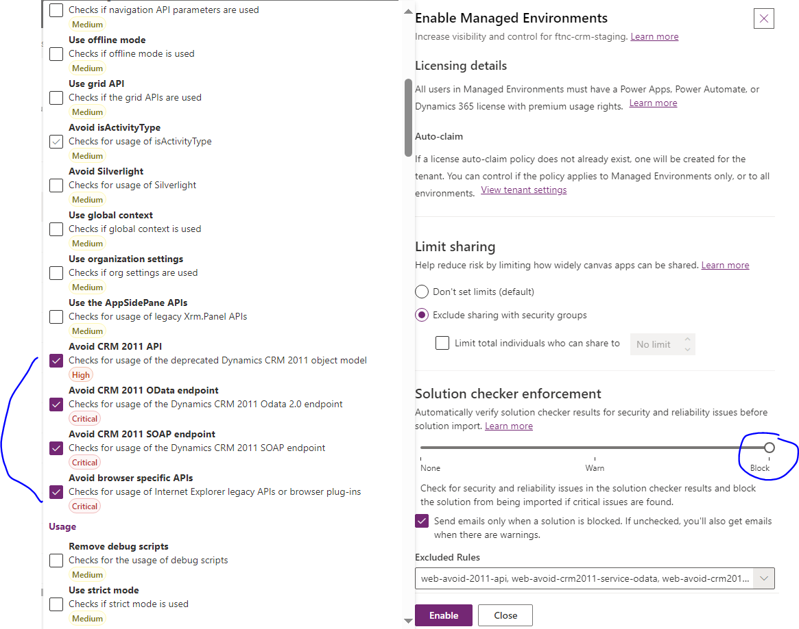

*****Generatative AI features***

Move data across regions: **OFF**

Bing search: **OFF**

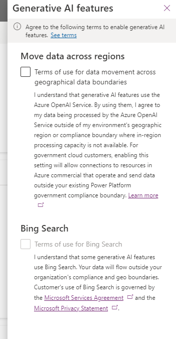

### 11.5 Environment Table

A table listing all environments with details such as name, purpose, B2C app registration ID, SharePoint subsite, Blob Storage URL, Power Pages site URL, Dataverse URL, Entra ID group, and GIT branch in DevOps.

| Environment | Purpose                 | B2C App Registration ID | SharePoint Subsite | Blob Storage URL   | Power Pages Site URL | Dataverse URL                          | Entra ID Group                                      | GIT Branch |
| ----------- | ----------------------- | ----------------------- | ------------------ | ------------------ | -------------------- | -------------------------------------- | --------------------------------------------------- | ---------- |
| Dev         | Development             | [B2C App ID]            | [SharePoint URL]   | [Blob Storage URL] | [Power Pages URL]    | https://ftnc-dev.crm3.dynamics.com     | AP - FTNC App - Customer Service WorkSpace          | dev        |
| Staging     | Staging                 | [B2C App ID]            | [SharePoint URL]   | [Blob Storage URL] | [Power Pages URL]    | https://ftnc-staging.crm3.dynamics.com | AP - FTNC App - Customer Service WorkSpace          | staging    |
| UAT         | User Acceptance Testing | [B2C App ID]            | [SharePoint URL]   | [Blob Storage URL] | [Power Pages URL]    | https://ftnc-uat.crm3.dynamics.com     | AP - FTNC App - Customer Service WorkSpace          | uat        |
| Release     | Release                 | [B2C App ID]            | [SharePoint URL]   | [Blob Storage URL] | [Power Pages URL]    | https://ftnc-release.crm3.dynamics.com | AP - FTPC App - Customer Service WorkSpace          | release    |
| Prod        | Production              | [B2C App ID]            | [SharePoint URL]   | [Blob Storage URL] | [Power Pages URL]    | https://ftpc.crm3.dynamics.com         | AP -**FTPC** App - Customer Service WorkSpace | main       |

### 11.6 Managed Environments

Managed Environments is a set of premium features that you can turn on in an environment to make it easier to manage at scale. The agency's Power Platform tenant has a policy to activate managed environments for all sandbox and production Dataverse environments including the environments listed in the environment table. The managed environment governance and security features applied to all environments are listed below.

#### Limit sharing

By default limit sharing is set to 20 users who live outside the security group of the Dataverse environment.

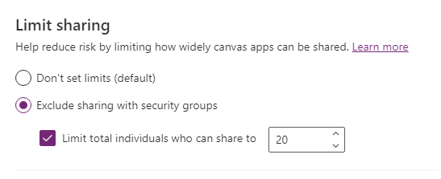

#### **Data policies**

The following connectors have been assigned to the "business" category. This is a subset of over 1000 connectors that are blocked by default. The business connectors are allowed since these provide the necessary functionality required to automate business processes. All business connectors are built and maintained by Microsoft (thus are first party connectors). Projects who seek exemption for a particular connector must request an exemption rule applied to their enviornments to the service desk and for production must justify the use of the connector and how it is secured against data leakage.

| Name                                         |
| -------------------------------------------- |
| Power Automate Management                    |
| Office 365 Outlook                           |
| Office 365 Users                             |
| Power Apps for Makers                        |
| Power Automate for Admins                    |
| Power Apps for Admins                        |
| Microsoft Teams                              |
| Microsoft Dataverse                          |
| Power Platform for Admins                    |
| HTTP with Microsoft Entra ID (preauthorized) |

#### **IP firewall**

The IP firewall helps to protect the agency's organizational data by limiting user access to Microsoft Dataverse from only allowed IP locations. The IP firewall analyzes the IP address of each request in real time. This is applied to sandbox, trial and developer environments.   When a request is made to Dataverse, the request IP address is evaluated in real time against the IP ranges configured for the Power Platform environment. The IP range is set to the range for the  **gcsra-ott.the agency.gc.ca** network. If the IP address is in the allowed ranges, the request is allowed. If the IP address is outside the IP ranges configured for the environment, the IP firewall denies the request with an error message: *The request you are trying to make is rejected as access to your IP is blocked. Contact your administrator for more information*

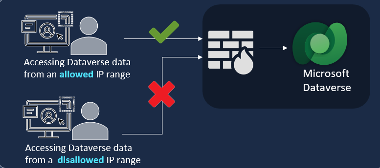

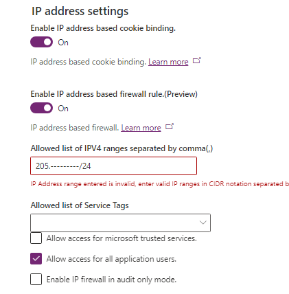

#### **IP cookie binding**

Prevent session hijacking exploits in Dataverse with IP address-based cookie binding. Let's say that a malicious user copies a valid session cookie from an authorized computer that has cookie IP binding enabled. The user then tries to use the cookie on a different computer to gain unauthorized access to Dataverse. In real time, Dataverse compares the IP address of the cookie's origin against the IP address of the computer making the request. If the two are different, the attempt is blocked, and an error message is shown.

#### Customer-managed keys (N/A May 2024)

#### **Lockbox**

Customer lockbox is enabled tenant wide therefore Microsoft must send a request to the tenant which must be approved by a tenant administrator to allow the MS operator to have controlled access for support services.

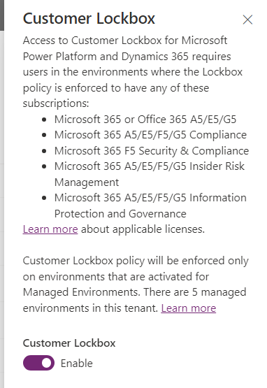

#### Session behavior

The following settings are set for all enviornments

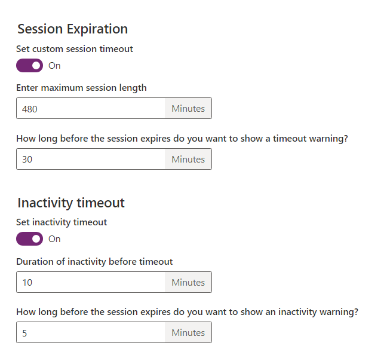

### Data Loss Prevention (DLP) Configuration

The following connectors have been assigned to the "business" category. This is a subset of over 1000 connectors that are blocked by default. The business connectors are allowed since these provide the necessary functionality required to automate business processes. All business connectors are built and maintained by Microsoft (thus are first party connectors).

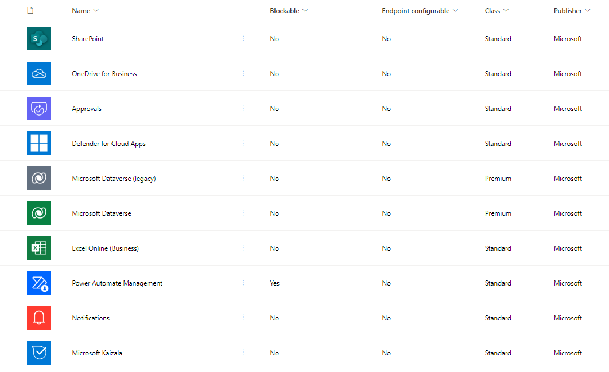

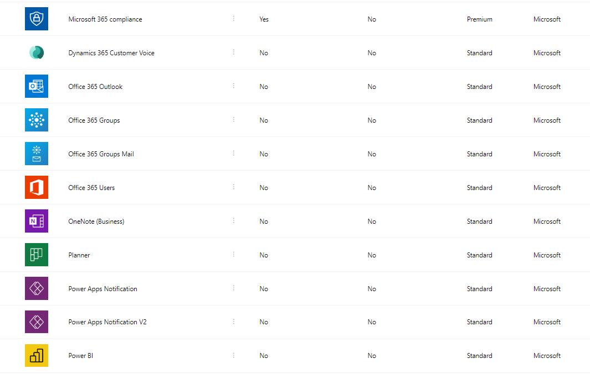

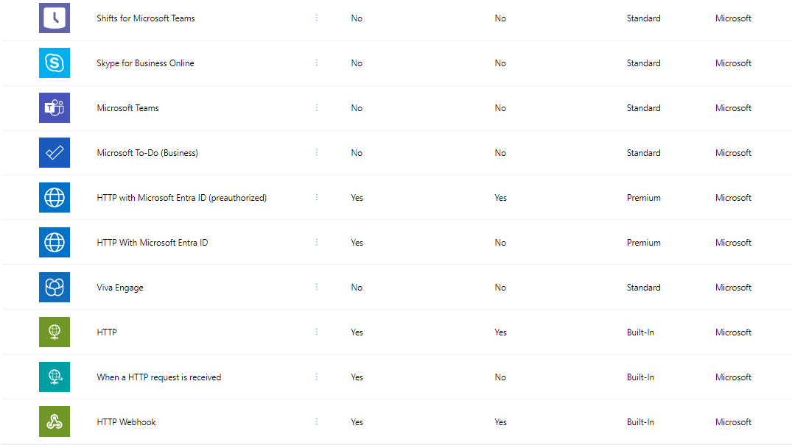

## 12. SDLC / ALM Using Azure DevOps

This section outlines the software development lifecycle (SDLC) and application lifecycle management (ALM) practices using Azure DevOps.

### 12.1 Azure DevOps Overview

Azure DevOps provides tools for managing the Software Development Lifecycle (SDLC) and Application Lifecycle Management (ALM). It integrates with Power Platform to facilitate version control, build automation, and continuous integration and deployment (CI/CD).

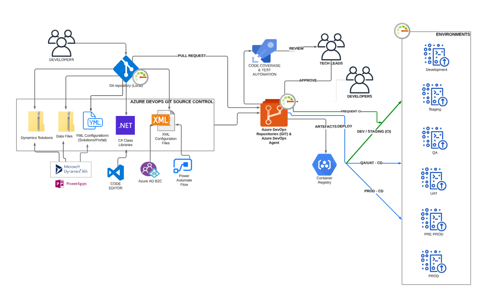

### 12.2 GIT Repositories

GIT repositories in Azure DevOps enable version control and collaboration on code and configurations. This ensures that changes are tracked, and multiple developers can work on the project simultaneously. The [git repository](https://dev.azure.com/139fc/_git/Compliance%20Case%20Management%20-%20PowerPlatform) for a typical project will be structured this way:

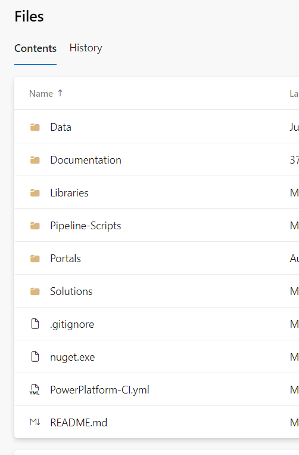

### 12.3 Pipelines

CI/CD pipelines in Azure DevOps automate the build, test, and deployment processes. This ensures that updates to Power Platform components are consistently and reliably deployed across development, staging, and production environments.

A typical pipeline project for the Power Platfrom would be concerned with deploying solutions, data and portals and would therefore have multiple steps, each step deploying artifacts such as:

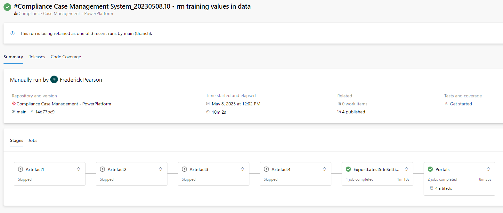

### 12.4 Solutions Management

Solutions management involves using unmanaged solutions for development and managed solutions for non-development environments. This approach ensures that

 development changes are tested and validated before being deployed to production, reducing the risk of issues.

### 12.5 App Users and App Registrations

App users and app registrations in Entra ID ensure that service accounts are used for Power Automate flows and deployments. This enhances security by controlling access and ensuring that automated processes are executed with appropriate permissions.

The "Power Platfrom System - FTNC" and "Power Platform System - FTPC" app users (dev and prod respectively) have been configured in the Azure tenant for use with FTNC and FTPC environments. Both are configured with delegated user impersionation priviledges to "Dynamics 365" as a managed identity.

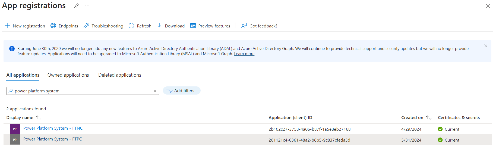

## 13. Monitoring and Maintenance

This section details the monitoring and maintenance procedures to ensure optimal performance and reliability of the Power Platform.

### 13.1 Performance Monitoring

Performance monitoring involves using tools and metrics to track system performance, ensuring optimal operation and quick issue resolution. Regular monitoring helps identify and address performance bottlenecks.

### 13.2 Maintenance Procedures

Maintenance procedures include regular updates, patch management, and system health checks. These procedures ensure that the platform remains secure, up-to-date, and reliable.

## 14. Documentation and Training

This section outlines the documentation and training resources available to end-users and administrators, ensuring effective use and management of the Power Platform.

### 14.1 User Guides

User guides provide detailed instructions for end-users on how to effectively use Power Platform features and functionalities. These guides help users navigate the system and maximize its benefits.

### 14.2 Administrator Guides

Administrator guides offer comprehensive configuration and administration instructions for system administrators. These guides include best practices for managing and maintaining the platform.

### 14.3 Training Programs

Training programs include schedules, materials, and ongoing support resources to ensure that users and administrators are well-versed in using and managing the Power Platform. These programs help build proficiency and ensure successful adoption.

## 15. Appendices

This section includes additional resources, definitions, and change logs to support the implementation and ongoing management of the Power Platform.

### 15.1 Glossary

The glossary includes definitions of key terms and acronyms used throughout the document, providing clarity and reference for readers.

### 15.2 References

References list documents and resources that provide additional context and information related to the implementation. This section includes links and citations to supporting materials.

### 15.3 Change Log

The change log maintains a record of changes and updates to the document, ensuring transparency and traceability of modifications. This helps track the evolution of the document over time.
