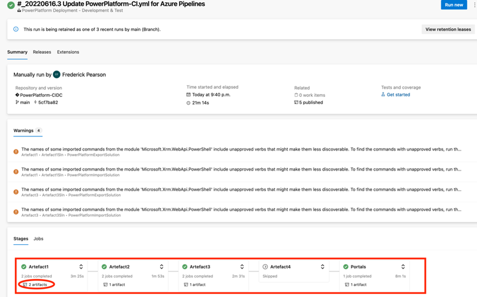

# Developer Initiated multi-stage pipeline

The process below illustrates the typical process for which a developer will execute the build integration pipeline. In this example, the developer is transferring Organizations and Contacts from developed to a staging environment before transferring the CanExport solution as this solution has workflow dependencies relying on Organization and Contact lookup values being populated. At the same time, the user wants to deploy his/her latest portal changes to the staging. *NOTE* to enable CI, you can opt to have this pipeline trigger when a PR issued to a specific branch. However, the process below is recommended as it provides the build team with the ability to check-in their work and automatically deploy and commit their changes and generate the artefacts and test logs. If you decide to employ full automation, simply update the trigger of this pipeline to a specific branch and ensure that the runtime variables configured are pre-defined (see variables section) – the variable group is already pre-defined so not additional configuration required there.

If successful, each stage (1 per artefact specified in the variables), will store its artefact in the Agent’s Artefact Staging Directory for a release to a UAT and eventually PROD environment. The pipeline execution’s success means that the source developer environment artefacts provided in the variables will be deployed on the target staging environment (or test environment, depending on your deployment strategy for build integration). The solutions are deployed as managed, and the portal is deployed using the CLI and only delta portal changes are also deployed to the target staging environment (or build environment). 
To view the artefacts, click on the artefact anchor in one of the stages. You can then view the download the artefacts and the solution and portal checker log files for review. Note that this is the happy path. If any of the stages fail, the pipeline will exit to ensure that no subsequent solutions, data files or portal is deployed. In this case, you can click on the failed stage(s) to view the detailed log of the failure.
Below demonstrates the artefact storage structure. Notice that the folder names will include an integer as a suffix which informs the eventual release of the sequence for which to deploy these artefacts to downstream environments. 
**_Note that as you add additional tests to this CI/CD extension, you should consider adding your test report(s) to the artefacts instead of just in the GIT repository so that in the future, you have the ability to leverage other pipeline tasks to send these report artifacts to a SIEM to archiving system_**

In the event the pipeline execution fails, you can view the logs by clicking on any failed stage to view the details. In the example below, the TargetSPN was misspelled in the variable group resulting in a connection issue to the target environment for the data import.

