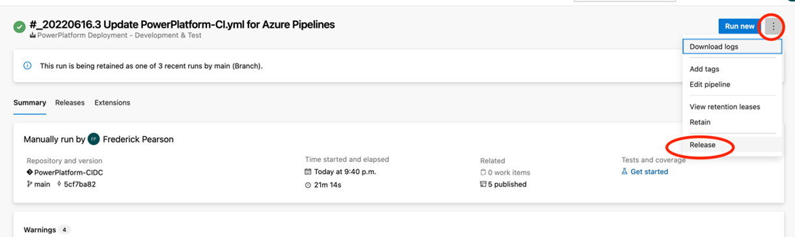
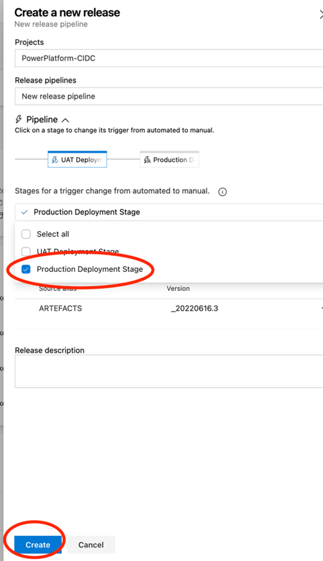
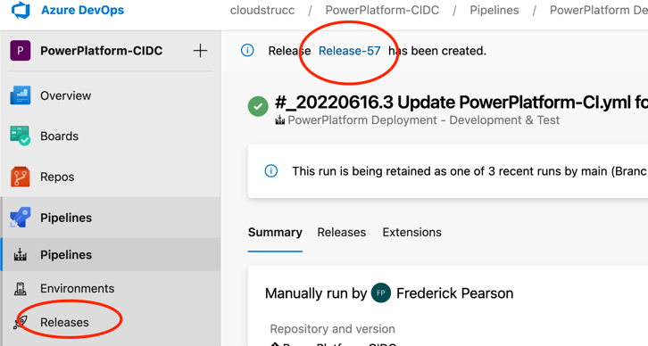
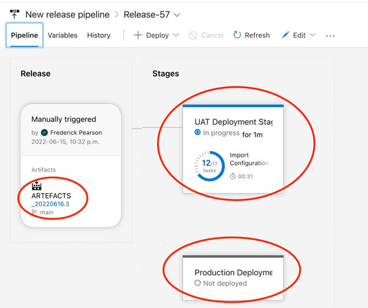
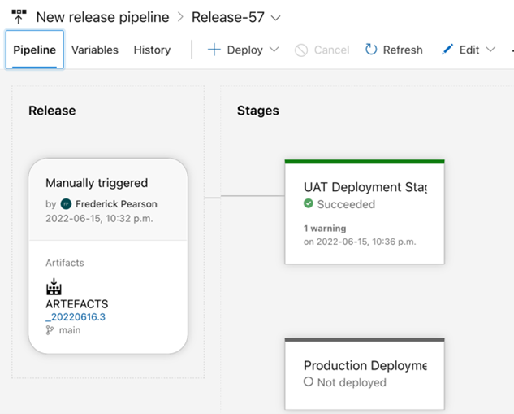
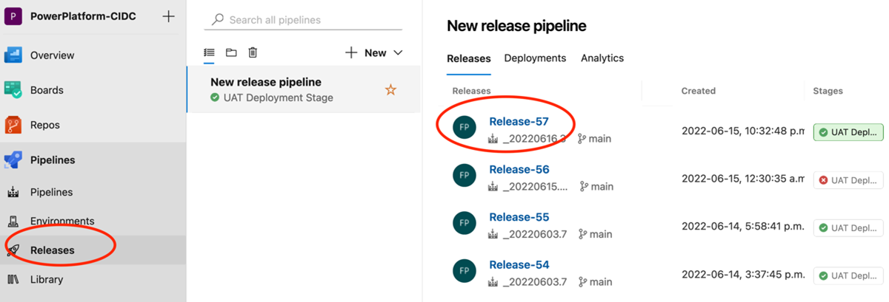
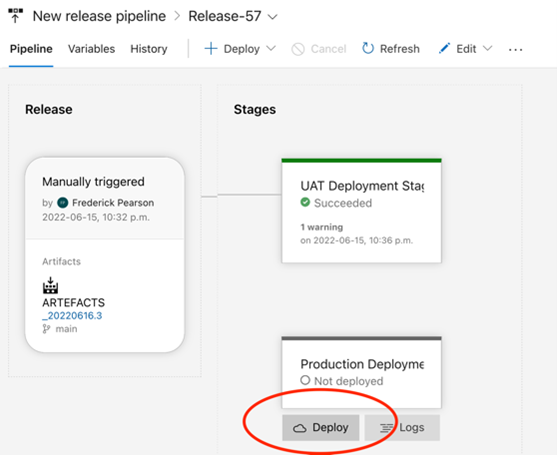
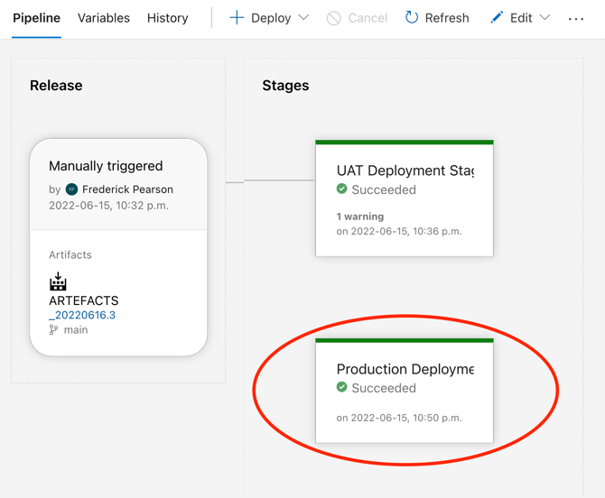

# Release Manager Multi-stage Release

The process below illustrates the typical process for which a release manager will execute a full release to UAT and invoke the PROD release manually only once UAT is completed. This is useful because, once the artefacts are deployed to UAT, the client can test against the acceptance criteria and if everything is ok, the release manager can return to this release and execute the production stage knowing that the same artefacts deployed to UAT successfully will be used to deploy to production. 
Using the example build from the previous section, the release manager can navigate to the successful build, select the ellipsis and press “Release”

When creating the new release, ensure to select the “Production Deployment Stage” as a stage to run “Manually”. This ensures that the artefacts will only be deployed to your UAT environment to allow for client UAT. You will execute the production deployment stage once UAT is completed in a subsequent step.

Once created, the release anchor will be displayed just below the breadcrumb, but you can also view the progress of the release under the releases menu.

In the release details, you will notice that the UAT deployment is being exectuted whereas Production is not being deployed. In addition, the artefacts from the release are those that were generated by the successful build. 

Once succeeded you should see the following. 

_Note that if you would like to re-deploy the same artefacts but to a different environment, the UAT stage below relies on the same variable group used in the build integration pipeline. To do so you could update the TargetURL-UAT, TargetSPN-UAT, ClientID and Secret (if the App User is different in the new target) OR simply clone the Connection-Parameters variable group, re-run the same build (in this case 20220616.3) and edit the Variable-Group variable to your new group name and re-run the build integration pipeline and issue a new release. The latter would be recommended to avoid any disruption from updating connection parameters of your main development stream. IN summary, if you would like to employ the same release pipeline deployment strategy to another set of downstream environment(s), simply clone the Connection-Parameters variable group, everything else an remain the same as this CI/CD extension allows you to specify a variable group at runtime to give you control over which environments you would like to apply CI/CD to_

Once UAT has been successfully completed, and you are ready to deploy to production. Navigate to the release that deployed the UAT artefacts that resulting in the successful UAT testing cycle and execute the production deployment

