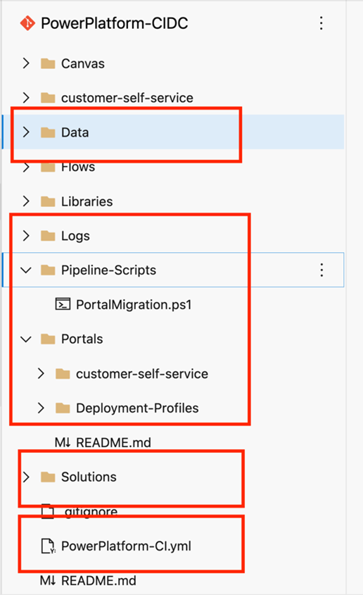

# Pre-Requisites

- Commit the following Pipeline Automation YAML File to your repository’s root directory
- Commit the following PowerShell script to a folder named “Pipeline-Scripts” in your repository’s root directory
- Download the release-pipeline JSON file
- Create a Solutions folder in your repository’s root directory
- Create a Data folder in your repository’s root directory
- Create a ExportedData folder in your repository’s Data folder (created in the previous step)
- Create a Portals folder in your repository’s root directory
- Create a Logs folder in your repository’s root directory
- Create a Deployment-Profiles folder in your repository’s Profile directory
- Create a folder that matches the name of your PowerApps Portals website record in your repository’s Portals folder. In that folder, create a deployment-profiles folder and include your dev, test, uat, and prod YAML profile files (e.g. test.deployment.yml <- where test is the CLI parameter flag that will inform the CLI which deployment profile to use for your portal deployments.

The example below demonstrates the above folder structure implemented in a DevOps repository to leverages this extension

