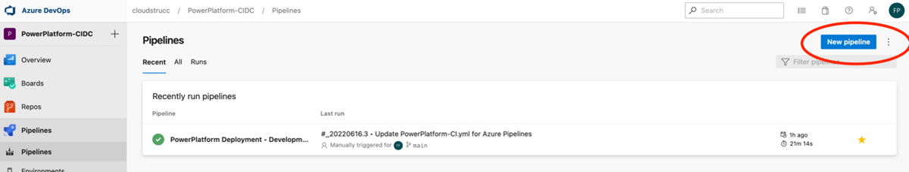
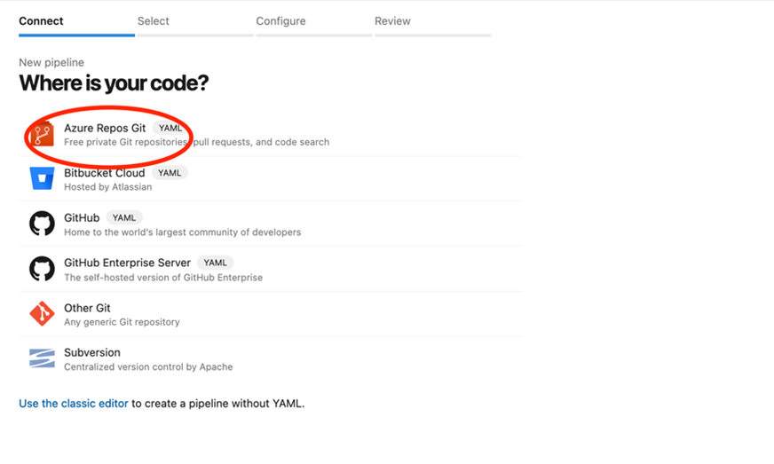
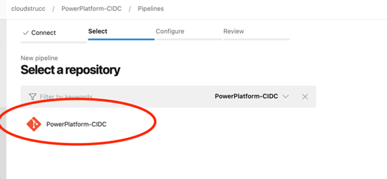
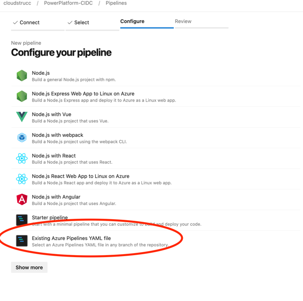
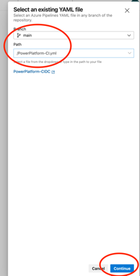
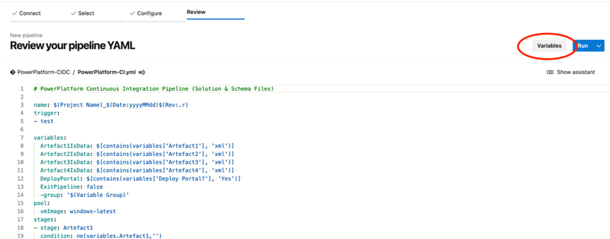
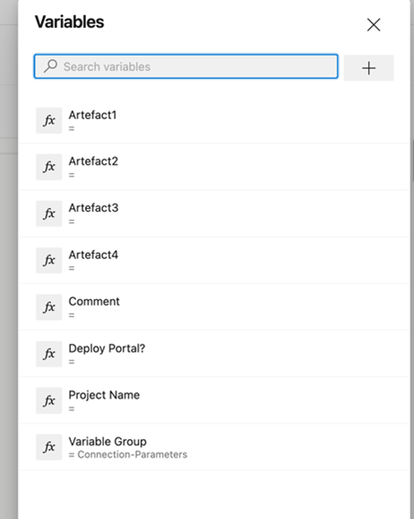
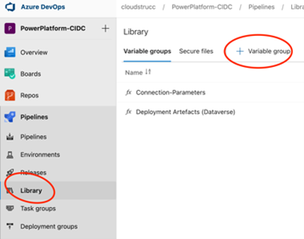
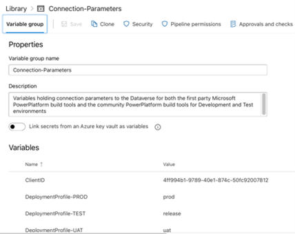

# Create Pipeline

This section demonstrates the steps to create the build integration pipeline.

Create the Pipeline

Select the CI/CD YML File provided for this extension, which needs to hosted in your repository’s root directory. You can also choose the branch for which the YML file exists. 

Next create all the following variables and make sure to set the variable group name to “Connection-Parameters” or whichever name you will use for your variable group you will create in the next section. Once completed, press the drop down next to the blue run button and press Save (**<u>Do not attempt to run the pipeline at this point</u>**)

Create Variable Group & Link to Pipeline

When creating the group ensure that the variable names match those listed in the Variable Group section of this document

**The pipeline is not fully configured and can be executed at anytime**