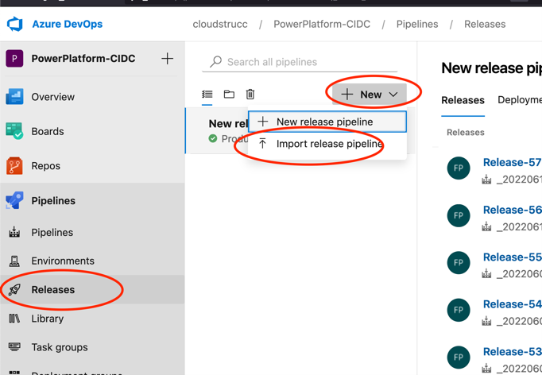

# Create the Release Pipeline

Even though the pipelines can be used to also release to UAT and PROD environments, the recommended method to release to these environments is to use the releases feature of DevOps. The steps below demonstrate how to configure the release pipeline so that release managers can issue releases based on builds that were ran by the build integration pipeline (CI).

Select the PowerPlatform-Deployment JSON file provided with this extension and press “OK”

Once imported you will be asked to specify your agent pool. You can select “Azure Pipelines” or your own custom pool and “windows-latest” as the agent specifications (for both UAT and PROD)

Once specified, return to the release pipeline and the errors should be gone. You’re release pipeline is now ready for use.

